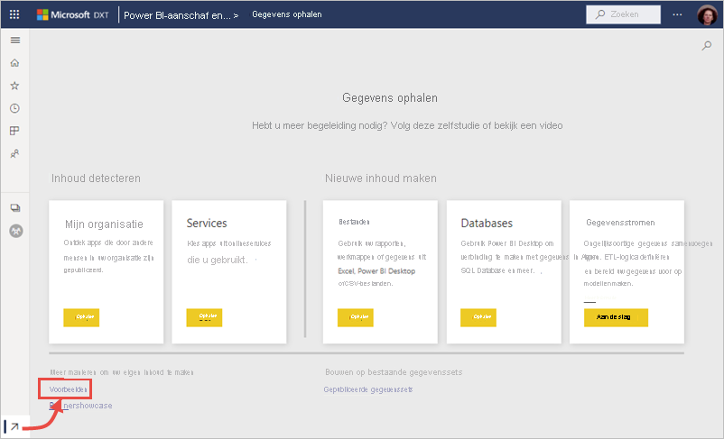
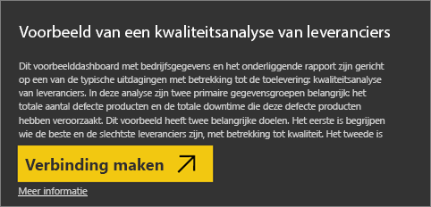
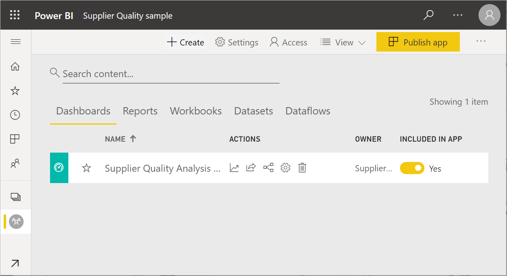
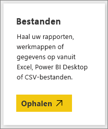
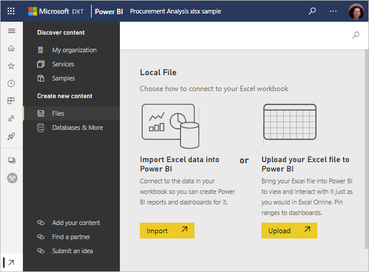

# Voorbeelden voor Power BI downloaden
Stel dat u geen ervaring hebt met Power BI en u Power BI wilt uitproberen, maar nog geen gegevens hebt.  Of misschien wilt u rapporten zien die een deel van de mogelijkheden van Power BI illustreren. Wij zorgen ervoor.

Power BI biedt diverse voorbeelden voor verschillende doeleinden: 
- Een **[Power BI-rapport](#sales--returns-sample-pbix-file) (PBIX-bestand)** dat u kunt weergeven in de galerie met gegevensoverzichten, openen en bekijken in Power BI Desktop, of uploaden naar de Power BI-service.
- Een **[voorbeeld-app](#sample-app-from-appsource)** die u kunt downloaden van AppSource, ook rechtstreeks in de Power BI-service. Apps kunnen onder meer dashboards, rapporten en gegevenssets bevatten. U kunt deze wijzigen en vervolgens distribueren naar uw collega's.
- **[Acht oorspronkelijke ingebouwde voorbeelden](#eight-original-samples)** in de Power BI-service in de vorm van *inhoudspakketten*, met dashboards, rapporten en gegevenssets. U installeert deze rechtstreeks in de Power BI-service. De ingebouwde voorbeelden zijn ook beschikbaar als Power BI-rapporten (.pbix) en Excel-werkmappen (.xlsx).
- **[Excel-werkmap](#download-sample-excel-files)** versies van de ingebouwde voorbeelden, met het gegevensmodel en de Power View-bladen. U kunt het gegevensmodel bekijken of bewerken in Excel, en de Excel-werkmap gebruiken als gegevensbron voor een Power BI-rapport. U kunt de werkmap ook uploaden als een Excel-bestand en de visuele elementen en draaitabellen van Excel weergeven in Power BI-rapporten. 
- Ook een **[voorbeeld van een werkmap met financiële gegevens](sample-financial-download.md)** , een eenvoudige Excel-tabel zonder opmaak, kan worden gedownload. Deze tabel bevat geanonimiseerde gegevens van fictieve producten, met verkoopcijfers per segment en per land/regio. Hiervan kunt u eenvoudig een gegevensbron voor een Power BI-rapport maken.

Deze voorbeelden worden ook gebruikt in de zelfstudies en voorbeelden in onze online documentatie, zodat u de stappen kunt volgen.

## PBIX-voorbeeldbestand Sales & Returns

:::image type="content" source="media/sample-datasets/sales-returns-sample-pbix.png" alt-text="PBIX-voorbeeldbestand Sales & Returns":::

*Het voorbeeldrapport Sales & Returns*

Power BI-rapportontwerpers Miguel Myers en Chris Hamill hebben het PBIX-bestand Sales & Returns gemaakt om de vele nieuwe functies, waaronder knoppen, drillthrough, voorwaardelijk opmaak, what-if en aangepaste knopinfo, in Power BI te demonstreren. 

Het scenario voor dit rapport is een bedrijf dat skateboards met Microsoft-thema's verkoopt. Ze willen hun actuele verkoop- en retourcijfers bekijken en analyseren hoe ze hun bedrijfsactiviteiten moeten aanpassen. 

U kunt dit op de volgende manieren onderzoeken:

- Weergeven en ermee werken in de Power BI-community [Data Stories Gallery](https://community.powerbi.com/t5/Data-Stories-Gallery/Sales-amp-Returns-Sample-Report/m-p/876607).
- Het PBIX-bestand downloaden en in detail verkennen. Een kijkje achter de schermen nemen om te zien hoe Miguel dit rapport heeft gemaakt. Als u deze koppeling selecteert, wordt het bestand automatisch gedownload: [Voorbeeldrapport Sales & Returns](https://go.microsoft.com/fwlink/?linkid=2113239).
- Meer informatie over het rapport vindt u in het Power BI-blogbericht [Take a tour of the new Sales & Returns sample report](https://powerbi.microsoft.com/blog/take_a_tour_of_the_new_sales_returns_sample_report/) (Engelstalig).

## Voorbeeld-app van AppSource

De *app* Sales & Marketing is beschikbaar via Microsoft AppSource. Een app is een Power BI-inhoudstype waarmee gerelateerde dashboards en rapporten worden gecombineerd. Een app kan één of meer dashboards en één of meer rapporten hebben, die allemaal zijn gebundeld. U kunt de app Sales & Marketing downloaden van **Apps** in de Power BI-service of door naar AppSource in uw browser te gaan.

- In het artikel [Apps installeren en gebruiken](../consumer/end-user-app-view.md) wordt uitgelegd hoe u een app kunt downloaden vanuit de Power BI-service.
- Met deze koppeling gaat u naar de [app Sales & Marketing](https://appsource.microsoft.com/product/power-bi/microsoft-retail-analysis-sample.salesandmarketingsample?tab=Overview) in AppSource.

Nadat u de app hebt geïnstalleerd, ziet u deze in uw verzameling apps.

:::image type="content" source="media/sample-datasets/power-bi-sales-marketing-app.png" alt-text="De app-tegel van Sales & Marketing":::

Wanneer u de app opent, selecteert u **Verkennen met voorbeeldgegevens**. 

:::image type="content" source="media/sample-datasets/power-bi-explore-app.png" alt-text="De app verkennen":::

U ziet de app-weergave met het dashboard en de afzonderlijke rapportpagina's in het navigatiedeelvenster. 

:::image type="content" source="media/sample-datasets/power-bi-sales-marketing-app-navigation.png" alt-text="App-navigatiedeelvenster":::

Omdat u de app hebt geïnstalleerd, kunt u ook de *werkruimte* openen en de elementen van de app bewerken. Selecteer het potloodpictogram **Bewerken** om de werkruimte te openen.

:::image type="content" source="media/sample-datasets/power-bi-app-edit-pencil.png" alt-text="De app bewerken":::

Nu ziet u het dashboard, het rapport en de gegevensset van de app in de lijstweergave van de werkruimte. Hier in de werkruimte kunt u elk element bewerken.

:::image type="content" source="media/sample-datasets/power-bi-sales-marketing-workspace.png" alt-text="Werkruimte van Sales & Marketing":::

Desgewenst kunt u deze app distribueren naar iemand in uw organisatie. Selecteer **App bijwerken**.

:::image type="content" source="media/sample-datasets/power-bi-update-app.png" alt-text="Knop App bijwerken":::

Voltooi het tabblad **Configuratie**, inclusief het kiezen van een **app-themakleur**. 

:::image type="content" source="media/sample-datasets/power-bi-app-setup.png" alt-text="App-configuratie selecteren":::

Voltooi de tabbladen **Navigatie** en **Machtiging** en selecteer **App bijwerken**.

:::image type="content" source="media/sample-datasets/power-bi-select-update-app.png" alt-text="App bijwerken selecteren om deze te publiceren":::

Lees meer over [het publiceren van apps in Power BI](../collaborate-share/service-create-distribute-apps.md).

## Acht originele voorbeelden
Er zijn acht originele voorbeelden beschikbaar die u kunt gebruiken. Elk voorbeeld vertegenwoordigt een andere branche. U kunt elk voorbeeld op verschillende manieren gebruiken:

- Installeer de [ingebouwde inhoudspakketten](#install-built-in-content-packs) in de Power BI-service.
- Download de [Power BI-rapportbestanden](#download-original-sample-power-bi-files) (.pbix).
- Download de [Excel-werkmapbestanden](#download-sample-excel-files) (.xslx) en upload deze vervolgens naar de Power BI-service.
- Verken de [Excel-bestanden in Excel](#explore-excel-samples-inside-excel) zelf.

Het bedrijf obviEnce ([www.obvience.com](http://www.obvience.com/)) en Microsoft ontwikkelen samen voorbeelden die u met Power BI kunt gebruiken.  De gegevens zijn geanonimiseerd en representeren verschillende branches: financiën, HR, sales en meer. 

Al deze voorbeelden zijn beschikbaar in verschillende indelingen: als inhoudspakket, als Excel-werkmap en als Power BI-bestand (.pbix). U hoeft zich geen zorgen te maken als u niet weet wat dit zijn of hoe u ze verkrijgt. In dit artikel wordt alles uitgelegd. Voor elk voorbeeld hebben we een *rondleiding* gemaakt. Rondleidingen zijn artikelen die het verhaal achter het voorbeeld vertellen en waarin verschillende scenario's worden uitgelegd. Een voorbeeld van een scenario is het beantwoorden van vragen voor uw manager, in een ander scenario zoekt mogelijk naar concurrentiegerichte inzichten, maakt u rapporten en dashboards die u deelt of probeert u een zakelijk verschuiving te verklaren.

Voordat u aan de slag gaat, verzoeken we u de juridische richtlijnen voor het gebruik van deze voorbeelden te lezen. Vervolgens zullen we de voorbeelden introduceren en laten zien hoe u ze kunt gebruiken.

### Gebruiksrichtlijnen voor de voorbeeld-Excel-werkmappen

&copy;2015 Microsoft Corporation. All rights reserved. De documenten en de werkmappen worden verstrekt in de huidige staat. De informatie en inzichten die in de werkmappen worden geformuleerd, inclusief URL's en andere websiteverwijzingen, kunnen zonder kennisgeving worden gewijzigd. Het gebruik van de voorbeelden is op eigen risico. Bepaalde voorbeelden zijn uitsluitend ter illustratie en zijn fictief. Er wordt geen verband met de realiteit bedoeld, noch moet dit hieruit worden afgeleid. Microsoft biedt geen enkele expliciete of impliciete garanties met betrekking tot de informatie die hier wordt verstrekt.

De werkmappen bieden u geen enkel wettelijk recht op enige intellectuele eigendom in een Microsoft-product. U mag deze werkmap kopiëren en gebruiken voor interne referentiedoeleinden.

De werkmappen en de bijbehorende gegevens worden verstrekt door obviEnce. [www.obvience.com](http://www.obvience.com)

ObviEnce is een ISV en Intellectual Property (IP) Incubator die zich voornamelijk concentreert op Microsoft Business Intelligence. ObviEnce werkt nauw samen met Microsoft om aanbevolen procedures en innovatieve methoden te ontwikkelen voor de ondersteuning bij en implementatie van oplossingen voor Microsoft Business Intelligence.

De werkmappen en gegevens zijn eigendom van obviEnce LLC en worden uitsluitend gedeeld, inclusief de voorbeeldgegevens uit het bedrijfsleven, om de functionaliteit van Power BI te demonstreren.

Wanneer de werkmappen en/of de gegevens worden gebruikt, moet altijd de bovenstaande naamsvermelding worden opgenomen (deze wordt ook vermeld op het informatieblad dat is opgenomen in elke werkmap). De werkmap en visualisaties moeten worden voorzien van de volgende copyrightinformatie: obviEnce &copy;.

Als u op een van de volgende koppelingen klikt om de Excel-werkmapbestanden of PBIX-bestanden te downloaden, gaat akkoord met de bovenstaande voorwaarden.

### Voorbeeld van klantwinstgevendheid  
[Bekijk het voorbeeld van klantwinstgevendheid](sample-customer-profitability.md)

In dit voorbeeld met bedrijfsgegevens analyseert een CFO de metrische sleutelgegevens voor de leidinggevenden, producten en klanten van het bedrijf. U kunt onderzoeken welke factoren van invloed zijn op de rentabiliteit van het bedrijf.

### Voorbeeld van human resources 
[Bekijk het voorbeeld van human resources](sample-human-resources.md)

In dit voorbeeld met bedrijfsgegevens concentreert u zich op de strategie van het bedrijf voor het aannemen van personeel door nieuwe werknemers, actieve werknemers en vertrokken werknemers te analyseren.  Door de gegevens te verkennen, neemt u mogelijk trends waar met betrekking tot het vrijwillig ontslag nemen en ontdekt u vooroordelen in de strategie voor het aannemen van personeel.

### Voorbeeld van een IT-uitgavenanalyse 
[Bekijk het voorbeeld van een IT-uitgavenanalyse](sample-it-spend.md)

In dit voorbeeld met bedrijfsgegevens worden de geplande kosten voor de IT-afdeling van een bedrijf vergeleken met de daadwerkelijke kosten. Deze vergelijking biedt inzicht in hoe goed het bedrijf het jaar heeft gepland en de mogelijkheid om gebieden te onderzoeken die sterk afwijken van de planning. Het bedrijf in dit voorbeeld hanteert een jaarlijkse planningscyclus en produceert vervolgens elk kwartaal een nieuw overzicht met de laatste prognoses om de wijzigingen in de IT-uitgaven in het fiscale jaar te kunnen analyseren.

### Voorbeeld van verkoopkansanalyse 
[Bekijk het voorbeeld van een verkoopkansanalyse](sample-opportunity-analysis.md)

In dit voorbeeld met bedrijfsgegevens wordt het verkoopkanaal van een softwarebedrijf verkend. Verkoopmanagers bewaken hun directe verkoopkanalen en verkoopkanalen van partners door per regio de mogelijkheden, de opbrengst, de dealgrootte en het kanaal bij te houden.

### Voorbeeld van een inkoopanalyse  
[Bekijk het voorbeeld van een inkoopanalyse](sample-procurement.md)

In dit voorbeeld met bedrijfsgegevens analyseert een CFO de metrische sleutelgegevens voor de leidinggevenden, producten en klanten van het bedrijf. U kunt onderzoeken welke factoren van invloed zijn op de rentabiliteit van het bedrijf.

### Voorbeeld van een retailanalyse  
[Bekijk het voorbeeld van een retailanalyse](sample-retail-analysis.md)

In dit voorbeeld met bedrijfsgegevens worden de verkoopgegevens uit de detailhandel geanalyseerd van artikelen die in verschillende winkels en gebieden zijn verkocht. Met de metrische gegevens vergelijkt u de prestaties van dit jaar met die van vorig jaar voor de volgende gebieden: verkoop, eenheden, brutomarge, afwijkingen en analyses van nieuwe winkels.

### Voorbeeld van verkoop en marketing  
[Bekijk het voorbeeld van verkoop en marketing](sample-sales-and-marketing.md)

In dit voorbeeld met bedrijfsgegevens wordt het productiebedrijf VanArsdel Ltd geanalyseerd. Op basis van deze analyse kan de Chief Marketing Officer de branche en het marktaandeel van VanArsdel in de gaten houden.  Door het voorbeeld te verkennen, vindt u informatie over het marktaandeel, productvolume, de verkopen en het gevoel over het bedrijf.

### Voorbeeld van kwaliteitsanalyse van leveranciers  
[Bekijk het voorbeeld van een kwaliteitsanalyse van leveranciers](sample-supplier-quality.md)

Dit voorbeeld met bedrijfsgegevens is gericht op een van de typische uitdagingen voor de toelevering: kwaliteitsanalyse van leveranciers. In deze analyse zijn twee primaire gegevensgroepen belangrijk: het totale aantal defecte producten en de totale downtime die deze defecte producten hebben veroorzaakt. Dit voorbeeld heeft twee hoofddoelen. Het eerste doel is begrijpen wie de beste en de slechtste leveranciers zijn, met betrekking tot kwaliteit. Het tweede doel is identificeren welke fabrieken beter zijn in het vinden en verwijderen van defecte producten om de downtime te minimaliseren.

### Ingebouwde inhoudspakketten installeren

Laten we beginnen met de *inhoudspakketten*. De ingebouwde voorbeelden zijn beschikbaar in de Power BI-service. U hoeft Power BI niet te verlaten om ze te vinden. Een inhoudspakket is een bundel van een of meer dashboards, gegevenssets en rapporten die iemand heeft gemaakt en die kan worden gebruikt in de Power BI-service. Elk voorbeeldinhoudspakket van Power BI bevat een gegevensset, rapport en dashboard.  Inhoudspakketten zijn nog beschikbaar, maar worden afschaft. Deze zijn niet beschikbaar voor Power BI Desktop.

1. Open de Power BI-service (app.powerbi.com) en meld u aan.
2. Navigeer naar uw werkruimte of een andere werkruimte waarin u het voorbeeld wilt installeren. 
2. Selecteer in de linkerbendehoek **Gegevens ophalen**.

    
3. Selecteer **Voorbeelden** op de pagina Gegevens ophalen die wordt weergegeven.

   
4. Selecteer een van de voorbeelden om een beschrijving van het desbetreffende voorbeeld weer te geven, en kies **Verbinding maken**.  

   
5. Het inhoudspakket wordt geïmporteerd in Power BI en er wordt een nieuw dashboard, nieuw rapport en een nieuwe gegevensset toegevoegd aan de huidige werkruimte. Gebruik de voorbeelden om met Power BI te experimenteren.  

   

Nu over gegevens beschikt, kunt u aan slag.  Probeer enkele zelfstudies waarin de voorbeeldinhoudspakketten worden gebruikt of open de Power BI-service om op verkenning uit te gaan.

### Originele Power BI-voorbeeldbestanden downloaden
De voorbeeldinhoudspakketten zijn ook beschikbaar als PBIX-bestanden. De PBIX-bestanden zijn ontworpen voor gebruik met Power BI Desktop.  

1. Gebruik de onderstaande koppelingen om de bestanden afzonderlijk te downloaden. Als u deze koppelingen selecteert, wordt het bestand automatisch opgeslagen in de map Downloads. 

   - [PBIX-voorbeeld van klantwinstgevendheid](https://download.microsoft.com/download/6/A/9/6A93FD6E-CBA5-40BD-B42E-4DCAE8CDD059/Customer%20Profitability%20Sample%20PBIX.pbix)
   - [PBIX-voorbeeld van Human resources](https://download.microsoft.com/download/6/9/5/69503155-05A5-483E-829A-F7B5F3DD5D27/Human%20Resources%20Sample%20PBIX.pbix)
   - [PBIX-voorbeeld van een inkoopanalyse](https://download.microsoft.com/download/D/5/3/D5390069-F723-413B-8D27-5888500516EB/Procurement%20Analysis%20Sample%20PBIX.pbix)
   - [PBIX-voorbeeld van een retailanalyse](https://download.microsoft.com/download/9/6/D/96DDC2FF-2568-491D-AAFA-AFDD6F763AE3/Retail%20Analysis%20Sample%20PBIX.pbix)
   - [PBIX-voorbeeld van verkoop en marketing](https://download.microsoft.com/download/9/7/6/9767913A-29DB-40CF-8944-9AC2BC940C53/Sales%20and%20Marketing%20Sample%20PBIX.pbix)
   - [PBIX-voorbeeld van een kwaliteitsanalyse van leveranciers](https://download.microsoft.com/download/8/C/6/8C661638-C102-4C04-992E-9EA56A5D319B/Supplier-Quality-Analysis-Sample-PBIX.pbix)

1. Selecteer in Power BI Desktop **Bestand > Openen** en navigeer naar de locatie waar u het PBIX-voorbeeldbestand hebt opgeslagen.

4. Selecteer het PBIX-bestand om het in Power BI Desktop te openen.

### Excel-voorbeeldbestanden downloaden
De voorbeeldinhoudspakketten zijn ook beschikbaar als Excel-werkmappen. De Excel-werkmappen zijn ontworpen om te worden gebruikt met de Power BI-service.  

1. Gebruik de onderstaande koppelingen om de bestanden afzonderlijk te downloaden of [download een zip-bestand met alle voorbeeldbestanden](https://go.microsoft.com/fwlink/?LinkId=535020). Als u een ervaren gebruiker bent, kunt u de Excel-werkmappen downloaden om de gegevensmodellen te verkennen of te bewerken.

   - [Voorbeeld van klantwinstgevendheid](https://go.microsoft.com/fwlink/?LinkId=529781)
   - [Voorbeeld van human resources](https://go.microsoft.com/fwlink/?LinkId=529780)
   - [Voorbeeld van verkoopkansen bijhouden](https://go.microsoft.com/fwlink/?LinkId=529782)
   - [Voorbeeld van een inkoopanalyse](https://go.microsoft.com/fwlink/?LinkId=529784)
   - [Voorbeeld van een retailanalyse](https://go.microsoft.com/fwlink/?LinkId=529778)
   - [Voorbeeld van verkoop en marketing](https://go.microsoft.com/fwlink/?LinkId=529785)
   - [Voorbeeld van een kwaliteitsanalyse van leveranciers](https://go.microsoft.com/fwlink/?LinkId=529779)

2. Sla het gedownloade bestand op. Het maakt wel uit waar u het bestand opslaat.

      **Lokaal**: Als u het bestand opslaat op een lokaal station op uw computer of op een andere locatie binnen uw organisatie, kunt het bestand importeren in Power BI. Het bestand blijft op het lokale station staan en wordt dus eigenlijk niet geïmporteerd in Power BI. Er wordt een nieuwe gegevensset gemaakt in uw Power BI-site en de gegevens, en in sommige gevallen het gegevensmodel, worden geladen in de gegevensset. Als het bestand rapporten bevat, worden deze op de Power BI-site weergegeven onder Rapporten.
    
     **OneDrive - Bedrijven**: als u OneDrive voor Bedrijven gebruikt en u aanmeldt met hetzelfde account als voor Power BI, is OneDrive voor Bedrijven verreweg de beste plek om uw werk in Excel, Power BI of een CSV-bestand gesynchroniseerd te houden met uw gegevensset, rapporten en dashboards in Power BI. Omdat zowel Power BI als OneDrive zich in de cloud bevinden, maakt Power BI ongeveer om het uur verbinding met uw bestand in OneDrive. Als er wijzigingen worden gevonden, worden uw gegevensset, rapporten en dashboards in Power BI automatisch bijgewerkt.
    
     **SharePoint - Teamsites**: u kunt uw Power BI-bestanden op vergelijkbare manier op SharePoint - Teamsites opslaan als op OneDrive voor Bedrijven. Het grootste verschil is de manier waarop u vanuit Power BI verbinding maakt met het bestand. U kunt een URL opgeven of verbinding maken met de hoofdmap.
1. Open de Power BI-service (app.powerbi.com) en meld u aan.

1. Navigeer naar uw werkruimte of naar een andere werkruimte, of maak alleen een werkruimte voor het voorbeeld.

4. Selecteer **Gegevens ophalen**, linksonder in het navigatiedeelvenster.

    
5. Selecteer op de pagina **Gegevens ophalen** die wordt weergegeven, achtereenvolgens de optie **Bestanden > Ophalen**.

    
6. Selecteer de locatie waar u het voorbeeld hebt gedownload en opgeslagen.

    
7. Selecteer het bestand. Afhankelijk van waar u het bestand hebt opgeslagen, selecteert u **Verbinding maken** of **Openen**.

8. Kies of u de gegevens wilt importeren of dat u de werkmap wilt overzetten naar Power BI om deze op exact dezelfde manier weer te geven als in Excel Online.

    
9. Als u **Importeren** selecteert, wordt de voorbeeldwerkmap geïmporteerd en toegevoegd als een nieuw dashboard, nieuw rapport of nieuwe gegevensset met de naam **Procurement Analysis Sample**.

    - Omdat de werkmap Power View-werkbladen bevat, maakt Power BI een rapport met een pagina voor elk Power BI-werkblad. 
    - Power BI maakt een nieuw dashboard met een nieuwe lege tegel.  Als u deze tegel selecteert, gaat u naar het rapport dat u zojuist hebt toegevoegd.

10. Open het rapport. Selecteer verschillende elementen van het rapport om de werking te leren kennen. 

    

### Excel-voorbeelden verkennen in Excel

(Optioneel) Wilt u begrijpen hoe de gegevens in een Excel-werkmap worden geconverteerd naar Power BI-gegevenssets en -rapporten? Wanneer u de Excel-voorbeelden opent *in Excel* en de werkbladen daar verkent, verschaft dit enige inzicht.

- Wanneer u een voorbeeldwerkmap voor het eerst in Excel opent, is het mogelijk dat er twee waarschuwingen worden weergegeven. De eerste waarschuwing geeft aan dat de werkmap is geopend in de beveiligde weergave. Selecteer **Bewerken inschakelen**. De tweede waarschuwing geeft aan dat de werkmap externe verbindingen bevat. Selecteer **Inhoud inschakelen**.
- Elke werkmap bevat meerdere Power View-werkbladen. Als u de Power View-werkbladen wilt weergeven in Excel, moet u de [invoegtoepassing Power View inschakelen](https://support.office.com/article/flash-silverlight-and-shockwave-controls-blocked-in-microsoft-office-55738f12-a01d-420e-a533-7cef1ff6aeb1) door een pakket met registersleutels te downloaden.
- Waar bevinden de daadwerkelijke gegevens zich? Deze bevinden zich in het Power Pivot-gegevensmodel. U hebt geen Power View-werkbladen nodig om de gegevens te kunnen bekijken. Selecteer op het tabblad **PowerPivot** de optie **Beheren**.

    Wordt het tabblad **PowerPivot** niet weergegeven? [Schakel de invoegtoepassing Power Pivot in](https://support.office.com/article/Start-Power-Pivot-in-Microsoft-Excel-2013-add-in-A891A66D-36E3-43FC-81E8-FC4798F39EA8).

    In Power Pivot kunt u de gegevens in alle onderliggende tabellen en in alle DAX-formules bekijken. 

- Het tabblad Gegevens bevat informatie over obviEnce, het bedrijf dat het voorbeeld heeft gemaakt.

## Volgende stappen
[Basisconcepten voor ontwerpers in de Power BI-service](../fundamentals/service-basic-concepts.md)

[Zelfstudie: verbinding maken met de Power BI-voorbeelden](sample-tutorial-connect-to-the-samples.md)

[Gegevensbronnen voor Power BI](../connect-data/service-get-data.md)

Hebt u nog vragen? [Misschien dat de Power BI-community het antwoord weet](https://community.powerbi.com/)
