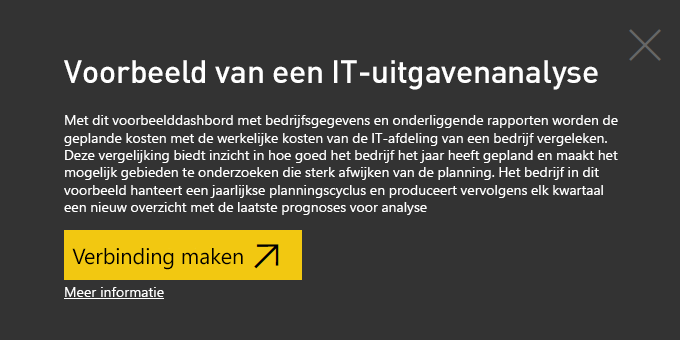
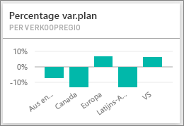
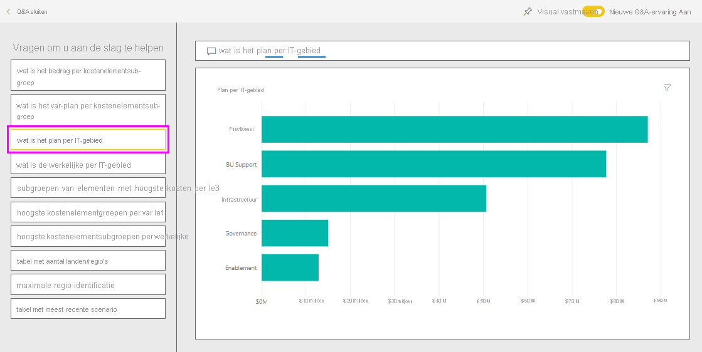

# Voorbeeld van een IT-uitgavenanalyse voor Power BI: rondleiding

Het inhoudspakket Voorbeeld van een IT-uitgavenanalyse bevat een dashboard, rapport en gegevensset waarmee u de geplande kosten van een IT-afdeling kunt afzetten tegen de werkelijke kosten. Deze vergelijking biedt inzicht in hoe goed het bedrijf het jaar heeft gepland en de mogelijkheid om gebieden te onderzoeken die sterk afwijken van de planning. Het bedrijf in dit voorbeeld hanteert een jaarlijkse planningscyclus en produceert vervolgens elk kwartaal een nieuw overzicht met de laatste prognose (LE) om de wijzigingen in de IT-uitgaven in het fiscale jaar te kunnen analyseren.

Dit voorbeeld maakt deel uit van een serie die laat zien hoe u Power BI kunt gebruiken met bedrijfsgegevens, rapporten en dashboards. Het voorbeeld is door [obviEnce](http://www.obvience.com/) met echte, geanonimiseerde gegevens gemaakt. De gegevens zijn beschikbaar in verschillende indelingen: inhoudspakket, een PBIX-bestand van Power BI Desktop of een Excel-werkmap. Zie [Voorbeelden voor Power BI](sample-datasets.md). 

In deze zelfstudie gebruiken we het inhoudspakket Voorbeeld van een IT-uitgavenanalyse in de Power BI-service. Omdat de rapportervaringen in Power BI Desktop en in de service zo vergelijkbaar zijn, kunt u de zelfstudie ook volgen met het PBIX-voorbeeldbestand in Power BI Desktop. 

U hebt geen licentie voor Power BI nodig om de voorbeelden te bekijken in Power BI Desktop. Als u geen Power BI Pro-licentie hebt, kunt u het voorbeeld opslaan in uw Mijn werkruimte in de Power BI-service. 

## Het voorbeeld ophalen

 Voordat u het voorbeeld kunt gebruiken, moet u het eerst downloaden als een [inhoudspakket](#get-the-content-pack-for-this-sample), een [PBIX-bestand](#get-the-pbix-file-for-this-sample) of een [Excel-werkmap](#get-the-excel-workbook-for-this-sample).

### Het inhoudspakket voor dit voorbeeld ophalen

1. Open de Power BI-service (app.powerbi.com), meld u aan en open de werkruimte waar u het voorbeeld wilt opslaan.

   Als u geen Power BI Pro-licentie hebt, kunt u het voorbeeld opslaan in uw Mijn werkruimte.

2. Selecteer in de linkerbenedenhoek **Gegevens ophalen**.
   
   
3. Selecteer op de pagina **Gegevens ophalen** die wordt weergegeven, de optie **Voorbeelden**.
   
4. Selecteer **Voorbeeld van een IT-uitgavenanalyse** en kies **Verbinden**.  
  
   
   
5. Het inhoudspakket wordt geïmporteerd in Power BI en er wordt een nieuw dashboard, een nieuw rapport en een nieuwe gegevensset toegevoegd aan de huidige werkruimte.
   
   
  
### Het pbix-bestand voor dit voorbeeld ophalen

U kunt het voorbeeld ook downloaden als een [.pbix-bestand](https://download.microsoft.com/download/E/9/8/E98CEB6D-CEBB-41CF-BA2B-1A1D61B27D87/IT%20Spend%20Analysis%20Sample%20PBIX.pbix), dat bedoeld is voor gebruik met Power BI Desktop.

### De Excel-werkmap ophalen voor dit voorbeeld

Als u de gegevensbron voor dit voorbeeld wilt bekijken, is dit ook beschikbaar als [Excel-werkmap](https://go.microsoft.com/fwlink/?LinkId=529783). De werkmap bevat Power View-werkbladen die u kunt bekijken en wijzigen. Als u de onbewerkte gegevens wilt zien, schakelt u de invoegtoepassingen van Gegevensanalyse in en selecteert u vervolgens **Power Pivot > Beheren**. Zie [De Excel-voorbeelden in Excel bekijken](sample-datasets.md#explore-excel-samples-inside-excel) als u de Power View- en Power Pivot-invoegtoepassingen wilt inschakelen.

## Dashboard voor het voorbeeld van een IT-uitgavenanalyse
De twee tegels met getallen op het dashboard,de **Var Plan %**  en **Variance Latest Estimate % Quarter 3**, geven een overzicht van hoe we presteren ten opzichte van het plan en ten opzichte van de laatste kwartaalprognose (LE3 = laatste prognose kwartaal 3). In totaal wijken we ongeveer 6% van het plan af. Laten we de oorzaak van deze afwijking eens onderzoeken: wanneer, waar en in welke categorie?

## De pagina YTD IT Spend Trend Analysis
Wanneer u de dashboardtegel **Var Plan % by Sales Region** selecteert, wordt de pagina **YTD IT Spend Trend Analysis** van het rapport IT Spend Analysis Sample weergegeven. We zien in één oogopslag een positieve afwijking in de Verenigde Staten en Europa en een negatieve afwijking in Canada, Latijns-Amerika en Australië. De Verenigde Staten vertoont een variantie van ongeveer 6% +LE en Australië ongeveer 7% -LE.

Maar het kan misleidend zijn om alleen naar dit diagram te kijken en op basis hiervan conclusies te trekken. We moeten naar de werkelijke bedragen kijken om dingen in perspectief te plaatsen.

1. Selecteer **Aus and NZ** in het diagram **Var Plan % by Sales Region** en kijk vervolgens naar het diagram **Var Plan by IT Area**.

   
2. Selecteer nu **VS**. U ziet dat Australië en Nieuw-Zeeland een zeer klein deel van onze totale uitgaven vertegenwoordigen ten opzichte van de Verenigde Staten.

    Laten we nu eens kijken welke categorie in de VS de oorzaak is van de afwijking.

## Vragen stellen over de gegevens
1. Selecteer in het bovenste navigatievenster **Voorbeeld van een IT-uitgavenanalyse** om terug te gaan naar het voorbeelddashboard.
2. Selecteer **Een vraag stellen over uw gegevens**.
3. Selecteer in de lijst **Vragen om mee te beginnen** aan de linkerkant de vraag **what is the plan by IT area**.

   

4. Wis het vorige item in het vak Q&A en voer *show IT areas, var plan % and var le3 % bar chart* in.

   

   In het eerste IT-gebied, **Infrastructure**, ziet u dat het percentage drastisch is gewijzigd tussen het eerste variantieplan en de laatste prognose voor het variantieplan.

## De pagina YTD Spend by Cost Elements

1. Ga terug naar het dashboard en bekijk de dashboardtegel **Variance Plan %, Variance Latest Estimate % - Quarter 3**.

   

   U ziet dat het gebied Infrastructure opvalt met een grote positieve afwijking ten opzichte van het plan.

1. Selecteer deze tegel om het rapport te openen en bekijk de pagina **YTD Spend by Cost Elements**.
2. Selecteer de staaf **Infrastructure** in het diagram **Var Plan % and Var LE3 % by IT Area** in de rechterbenedenhoek en bekijk de afwijkingen ten opzichte van het plan in het diagram **Var Plan % by Sales Region** aan de linkerkant.

    
3. Selecteer achtereenvolgens de namen in de slicer **Cost Element Group** om het kostenelement met de grootste afwijking te vinden.
4. Selecteer **Other**, selecteer **Infrastructure** in de slicer **IT Area** en selecteer subgebieden in de slicer **IT Sub Area** om het subgebied met de grootste afwijking te vinden.  

   Let op de grote afwijking voor **Networking**. Blijkbaar heeft het bedrijf besloten om de werknemers als secundaire arbeidsvoorwaarde te voorzien van telefoonservices, maar was deze actie niet gepland.

## De pagina Plan Variance Analysis

1. Selecteer het tabblad **Plan Variance Analysis** onderaan de pagina.

2. Selecteer in het diagram **Var Plan and Var Plan % by Business Area** aan de linkerkant de kolom **Infrastructure** om de infrastructuurwaarden voor het bedrijfsgebied te markeren op de rest van de pagina.

    

   U ziet in het diagram **Var plan % by Month and Business Area** dat het bedrijfsgebied Infrastructure een positieve afwijking is gaan vertonen in februari. U kunt ook zien dat de variantie ten opzichte van de planwaarde voor dat bedrijfsgebied per land varieert, in vergelijking met alle andere bedrijfsgebieden. 

3. Gebruik de slicers **IT Area** en **IT Sub Area** aan de rechterkant om de waarden op de rest van de pagina te filteren en deze te verkennen. 

## Het rapport bewerken
Selecteer **Rapport bewerken** in de linkerbovenhoek om naar de bewerkingsweergave te gaan.

* Kijk hoe de pagina's zijn opgebouwd, de velden in elk diagram en de filters op de pagina's.
* Voeg pagina's en diagrammen toe die zijn gebaseerd op dezelfde gegevens.
* Wijzig het type visualisatie voor elk diagram.
* Maak interessante diagrammen vast aan uw dashboard.

## Volgende stappen: koppelen aan uw gegevens
Dit is een veilige omgeving om in te experimenten, omdat er geen optie is om uw wijzigingen op te slaan. Als u deze wel opslaat, kunt u altijd **Gegevens ophalen** selecteren voor een nieuw exemplaar van dit voorbeeld.

We hopen dat deze rondleiding heeft laten zien hoe Power BI-dashboards, Q&A en rapporten inzicht kunnen geven in voorbeeldgegevens. Nu is het uw beurt om verbinding met uw eigen gegevens te maken. Met Power BI kunt u verbinding maken met een groot aantal gegevensbronnen. Zie [Aan de slag met de Power BI-service](../fundamentals/service-get-started.md) voor meer informatie.
