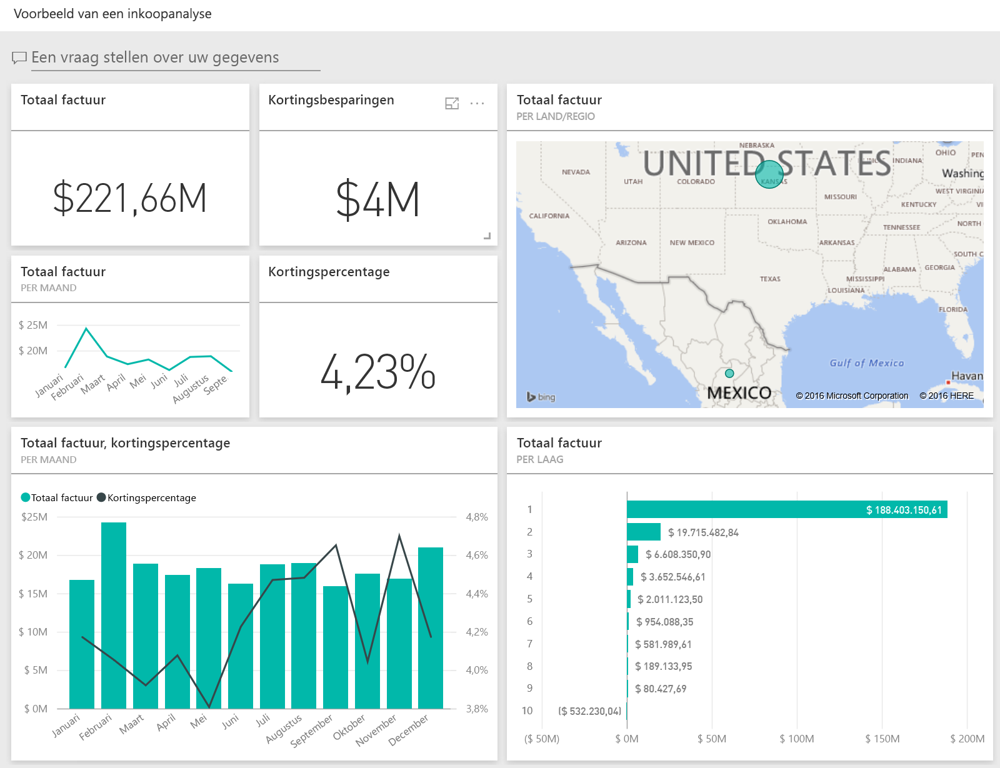
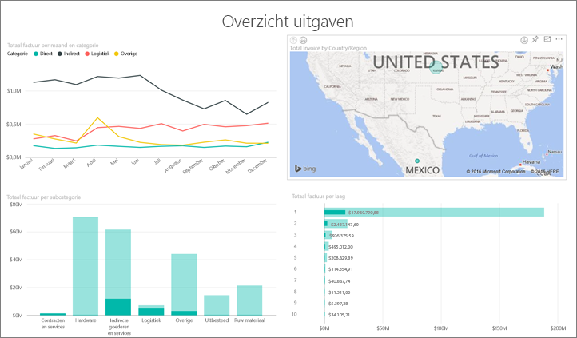
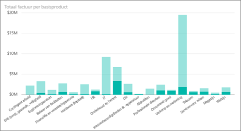

# Voorbeeld van een inkoopanalyse voor Power BI: een rondleiding

Het inhoudspakket Voorbeeld van een inkoopanalyse bevat een dashboard, rapport en gegevensset waarmee de uitgaven van een productiebedrijf aan leveranciers worden geanalyseerd op categorie en locatie. In het voorbeeld verkennen we deze gebieden:

* Wie de belangrijkste leveranciers zijn
* Aan welke categorieën we het meeste besteden
* Welke leveranciers de meeste korting geven en wanneer

Dit voorbeeld maakt deel uit van een serie die laat zien hoe u Power BI kunt gebruiken met bedrijfsgegevens, rapporten en dashboards. Het voorbeeld is door [obviEnce](http://www.obvience.com/) met echte, geanonimiseerde gegevens gemaakt. De gegevens zijn beschikbaar in verschillende indelingen: inhoudspakket, een PBIX-bestand van Power BI Desktop of een Excel-werkmap. Zie [Voorbeelden voor Power BI](sample-datasets.md). 

In deze zelfstudie gebruiken we het inhoudspakket Voorbeeld van een inkoopanalyse in de Power BI-service. Omdat de rapportervaringen in Power BI Desktop en in de service zo vergelijkbaar zijn, kunt u de zelfstudie ook volgen met het PBIX-voorbeeldbestand in Power BI Desktop. 

U hebt geen licentie voor Power BI nodig om de voorbeelden te bekijken in Power BI Desktop. Als u geen Power BI Pro-licentie hebt, kunt u het voorbeeld opslaan in uw Mijn werkruimte in de Power BI-service. 

## Het voorbeeld ophalen

Voordat u het voorbeeld kunt gebruiken, moet u het eerst downloaden als een [inhoudspakket](#get-the-content-pack-for-this-sample), een [PBIX-bestand](#get-the-pbix-file-for-this-sample) of een [Excel-werkmap](#get-the-excel-workbook-for-this-sample).

### Het inhoudspakket voor dit voorbeeld ophalen

1. Open de Power BI-service (app.powerbi.com), meld u aan en open de werkruimte waar u het voorbeeld wilt opslaan. 

    Als u geen Power BI Pro-licentie hebt, kunt u het voorbeeld opslaan in uw Mijn werkruimte.

2. Selecteer in de linkerbenedenhoek **Gegevens ophalen**.

    
3. Selecteer op de pagina **Gegevens ophalen** die wordt weergegeven, de optie **Voorbeelden**.

4. Selecteer **Voorbeeld van een inkoopanalyse** en kies **Verbinden**.  
  
   
   
5. Het inhoudspakket wordt geïmporteerd in Power BI en er wordt een nieuw dashboard, een nieuw rapport en een nieuwe gegevensset toegevoegd aan de huidige werkruimte.
   
   
  
### Het pbix-bestand voor dit voorbeeld ophalen

U kunt het voorbeeld ook downloaden als een [.pbix-bestand](https://download.microsoft.com/download/D/5/3/D5390069-F723-413B-8D27-5888500516EB/Procurement%20Analysis%20Sample%20PBIX.pbix), dat bedoeld is voor gebruik met Power BI Desktop. 

### De Excel-werkmap ophalen voor dit voorbeeld

Als u de gegevensbron voor dit voorbeeld wilt bekijken, is dit ook beschikbaar als [Excel-werkmap](https://go.microsoft.com/fwlink/?LinkId=529784). De werkmap bevat Power View-werkbladen die u kunt bekijken en wijzigen. Als u de onbewerkte gegevens wilt zien, schakelt u de invoegtoepassingen van Gegevensanalyse in en selecteert u vervolgens **Power Pivot > Beheren**. Zie [De Excel-voorbeelden in Excel bekijken](sample-datasets.md#explore-excel-samples-inside-excel) als u de Power View- en Power Pivot-invoegtoepassingen wilt inschakelen.

## Bestedingstrends
Laten we eerst eens kijken of we bestedingstrends op categorie en locatie kunnen vinden.  

1. Ga naar de werkruimte waarin u het voorbeeld hebt opgeslagen. Open het tabblad **Dashboards**, zoek het dashboard **Procurement Analysis Sample** en selecteer het. 
2. Selecteer de dashboardtegel **Total Invoice by Country/Region** om de pagina **Spend Overview** van het rapport **Procurement Analysis Sample** te openen.

    

Let op de volgende details:

* In het lijndiagram **Total Invoice per Month en Category** vertoont de categorie **Direct** consistente uitgaven, terwijl **Logistics** een piek heeft in december en  **Other** een piek in februari.
* Op de kaart **Total Invoice per Country/Region** ziet u dat de Verenigde Staten het grootste deel van de uitgaven voor zijn rekening neemt.
* In het kolomdiagram **Total Invoice per Sub Category** zijn **Hardware** en **Indirect Goods & Services** de grootste bestedingscategorieën.
* In het staafdiagram **Total Invoice per Tier** kunt u zien dat we het meeste zaken doen met onze leveranciers van laag 1 (top 10). Hierdoor kunnen we de leveranciersrelaties beter beheren.

## Uitgaven in Mexico
Laten we de bestedingsgebieden in Mexico bekijken.

1. Selecteer de bel **Mexico** op de kaart **Total Invoice per Country/Region**. U ziet dat in het kolomdiagram **Total Invoice per Sub Category** het meeste is uitgegeven aan de subcategorie **Indirect Goods & Services**.

   
2. Inzoomen op de kolom **Indirecte goederen en services**:

   * Selecteer in de grafiek **Total Invoice per Sub Category** de pijl voor inzoomen  in de rechterbovenhoek van de grafiek.
   * Selecteer de kolom **Indirecte goederen & Services**.

      Zoals u zien kunt, zijn de uitgaven voor de subcategorie **Sales & Marketing** veruit het hoogst.
   * Selecteer nogmaals **Mexico** op de kaart.

      Voor Mexico worden de grootste uitgaven gevormd door de subcategorie **Maintenance & Repair**.

      
3. Selecteer de pijl omhoog in de linkerbovenhoek van de grafiek om weer uit te zoomen.
4. Selecteer de pijl voor inzoomen opnieuw om inzoomen uit te schakelen.  
5. Selecteer **Voorbeeld van een inkoopanalyse** in de bovenste navigatiebalk om terug te keren naar het dashboard.

## Verschillende steden evalueren
U kunt markeren gebruiken om verschillende steden te evalueren.

1. Selecteer de dashboardtegel **Total Invoice, Discount % By Month** om de pagina **Discount Analysis** van het rapport **Procurement Analysis Sample** te openen.
2. Selecteer in de treemap **Total Invoice per City** de verschillende steden om te zien hoe deze zich verhouden. U ziet dat bijna alle facturen van Miami afkomstig zijn van leveranciers van categorie 1.

   

## Leverancierskortingen
Laten we ook eens kijken naar de beschikbare kortingen van leveranciers en de perioden waarin de meeste korting wordt gegeven:
* Zijn de kortingen iedere maand verschillend of blijven ze hetzelfde?
* Krijg sommige steden meer kortingen dan andere?

### Korting per maand
Als we kijken naar de combinatiegrafiek **Total Invoice en Discount % per Month**, zien we dat februari de drukste maand is en september de minst drukke maand. 

Kijk naar het kortingspercentage in deze maanden: in de drukke maanden is de korting lager dan in de minder drukke maanden. Hoe meer we de korting nodig hebben, des te slechter de deal zal zijn.

### Korting per stad
Een ander aspect om te verkennen, is de korting per stad. Selecteer de plaatsen in de treemap en kijk hoe de andere grafieken veranderen:

* St. Louis had een grote piek in het totaal aan facturen in februari en een grote dip in de kortingsbesparingen in april.
* Mexico City heeft het hoogste kortingspercentage (11,05%) en Atlanta het laagste (0,08%).

### Het rapport bewerken
Selecteer **Rapport bewerken** in de linkerbovenhoek om de bewerkingsweergave te openen:

* Kijk hoe de pagina's zijn samengesteld.
* Voeg pagina's en grafieken toe die zijn gebaseerd op dezelfde gegevens.
* Wijzig het type visualisatie voor een grafiek, wijzig de treemap bijvoorbeeld in een ringdiagram.
* Maak grafieken vast aan uw dashboard.

## Volgende stappen: koppelen aan uw gegevens
Dit is een veilige omgeving om in te experimenten, omdat er geen optie is om uw wijzigingen op te slaan. Als u deze wel opslaat, kunt u altijd **Gegevens ophalen** selecteren voor een nieuw exemplaar van dit voorbeeld.

We hopen dat deze rondleiding heeft laten zien hoe Power BI-dashboards, Q&A en rapporten inzicht kunnen geven in voorbeeldgegevens. Nu is het uw beurt om verbinding met uw eigen gegevens te maken. Met Power BI kunt u verbinding maken met een groot aantal gegevensbronnen. Zie [Aan de slag met de Power BI-service](../fundamentals/service-get-started.md) voor meer informatie.
