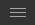
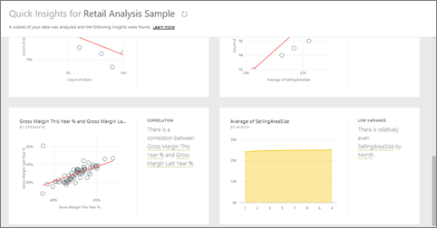
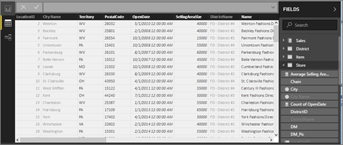

# Het retailanalyse-voorbeeld verkennen

Deze zelfstudie laat het volgende zien: 
- Het retailanalyse-voorbeeldpakket importeren, het toevoegen aan de Power BI-service en de inhoud ervan openen. Een *inhoudspakket* is een type voorbeeld waarbij de gegevensset wordt geleverd met een dashboard en een rapport. 
- Open het PBIX-voorbeeldbestand Retail Analysis in Power BI Desktop.

Zie [Voorbeeldgegevenssets voor Power BI](sample-datasets.md) voor meer achtergrondinformatie. In dat artikel leest u alles over de voorbeelden: hoe u ze downloadt, waar u ze kunt opslaan, hoe u ze gebruikt en enkele verhalen die elk voorbeeld kan vertellen. 

## Vereisten
De voorbeelden zijn beschikbaar voor de Power BI-service en Power BI Desktop. Gebruik het voorbeeld van de retailanalyse als u mee wilt doen.

Het voorbeeldinhoudspakket *Retail Analysis* dat in deze zelfstudie wordt gebruikt, bestaat uit een dashboard, een rapport en een gegevensset.
Om vertrouwd te raken met dit type inhoudspakket en het bijbehorende scenario, kunt u [een rondleiding door het voorbeeld van een retailanalyse voor Power BI](sample-retail-analysis.md) bekijken voordat u begint.

## Het voorbeeld importeren in de Power BI-service

1. Open de Power BI-service (app.powerbi.com), meld u aan en open de werkruimte waar u het voorbeeld wilt opslaan. 

    Als u geen Power BI Pro-licentie hebt, kunt u het voorbeeld opslaan in uw Mijn werkruimte.

2. Selecteer **Gegevens ophalen** onderaan het navigatievenster. 

   

   Als u **Gegevens ophalen** niet ziet, vouwt u het navigatievenster uit door het volgende pictogram bovenaan het venster uit te vouwen: .

5. Selecteer **Voorbeelden** op de pagina **Gegevens ophalen** die wordt weergegeven.
   
6. Selecteer **Voorbeeld van een retailanalyse** en kies **Verbinden**.   
   
   

## Wat is er geïmporteerd?
Wanneer u bij de voorbeeldinhoudspakketten **Verbinding maken** selecteert, haalt Power BI een kopie van dat inhoudspakket op en slaat dit voor u op in de cloud. Omdat de persoon die het inhoudspakket heeft gemaakt, een gegevensset, een rapport en een dashboard heeft opgenomen, krijgt u die wanneer u **Verbinding maken** selecteert. 

1. Wanneer u **Verbinding maken** selecteert, maakt Power BI het nieuwe dashboard en wordt het dashboard weergegeven op het tabblad **Dashboards**. 
   
   
2. Open het tabblad **Rapporten**. Hier ziet u een nieuw rapport met de naam *Voorbeeld van een retailanalyse*.
   
   
   
   Bekijk het tabblad **Gegevenssets**. Hier wordt ook een nieuwe gegevensset weergegeven.
   
   

## De nieuwe inhoud verkennen
Verken nu zelf het dashboard, de gegevensset en het rapport. Er zijn veel verschillende manieren om te navigeren naar uw dashboards, rapporten en gegevenssets. Een van deze manieren wordt beschreven in de volgende procedure.  

1. Ga terug naar het tabblad **Dashboards** en selecteer vervolgens het dashboard **Voorbeeld van een retailanalyse** om dit te openen.       

   Het dashboard dat wordt geopend, bevat diverse visualisatietegels.   
 
1. Selecteer een van de tegels in het dashboard om het onderliggende rapport te openen. In dit voorbeeld selecteren we het vlakdiagram **Verkoop van dit jaar, verkoop van vorig jaar per boekmaand**.  

   

   Het rapport wordt geopend met de pagina die het vlakdiagram bevat dat u hebt geselecteerd, in dit geval de pagina **Maandelijkse verkoop district** van het rapport.
   
   
   
   > [!NOTE]
   > Als de tegel is gemaakt met behulp van [Power BI Q&A](power-bi-tutorial-q-and-a.md), wordt in plaats daarvan de Q&A-pagina geopend. Als de tegel [vanuit Excel is vastgemaakt](service-dashboard-pin-tile-from-excel.md), wordt Excel Online in Power BI geopend.
   > 
   > 
1. Als iemand een inhoudspakket deelt met collega's, wil hij of zij doorgaans alleen de inzichten delen en de collega's niet direct toegang geven tot de gegevens. U hebt op het tabblad **Gegevenssets** verschillende mogelijkheden om de gegevensset te verkennen. U kunt echter niet de rijen en kolommen van uw gegevens bekijken zoals in Power BI Desktop of Excel. 
   
   
   
1. Eén manier om de gegevensset te verkennen, is door zelf uw eigen visualisaties en rapporten te maken. Selecteer het diagrampictogram  om de gegevensset te openen in de rapportbewerkingsmodus.
     
   

1. Een andere manier om de gegevensset te verkennen, is door [snelle inzichten](../consumer/end-user-insights.md) uit te voeren. Selecteer **Meer opties** (...) en kies vervolgens **Snelle inzichten verkrijgen**. Wanneer de inzichten gereed zijn, selecteert u **Inzichten weergeven**.
     
    

## Het voorbeeld downloaden in Power BI Desktop 
Wanneer u het PBIX-voorbeeldbestand voor het eerst opent in Power BI Desktop, wordt het in de rapportgave weergegeven en kunt u elk gewenst aantal rapportpagina's met visualisaties verkennen, maken en bewerken. De rapportweergave kent vrijwel hetzelfde ontwerp als de bewerkingsweergave van een rapport in de Power BI-service. U kunt er visualisaties verplaatsen, kopiëren en plakken, samenvoegen enzovoort. 

Anders dan bij het bewerken van een rapport in de Power BI-service, kunt u in Power BI Desktop ook met uw query's werken en gegevens modelleren om ervoor te zorgen dat uw rapporten de beste inzichten geven in uw gegevens. U kunt uw Power BI Desktop-bestand vervolgens opslaan waar u wilt, bijvoorbeeld op de lokale harde schijf of in de cloud.

1. Download het [PBIX-voorbeeldbestand Voorbeeld van een retailanalyse](https://download.microsoft.com/download/9/6/D/96DDC2FF-2568-491D-AAFA-AFDD6F763AE3/Retail%20Analysis%20Sample%20PBIX.pbix) en open het in Power BI Desktop. 

    

1. Het bestand wordt geopend in de rapportweergave. U ziet onderin de rapporteditor vier tabbladen. Deze tabbladen vertegenwoordigen de vier pagina's in dit rapport. Voor dit voorbeeld is momenteel de pagina **Nieuwe winkels** geselecteerd. 

    .

1. Volg voor een diepgaande uitleg van de rapporteditor [de rondleiding voor de rapporteditor](service-the-report-editor-take-a-tour.md).

## Wat bevat uw rapport?
Wanneer u een PBIX-voorbeeldbestand downloadt, hebt u niet alleen een rapport gedownload, maar ook de *onderliggende gegevensset*. Wanneer u het bestand opent, laadt Power BI Desktop de gegevens met de bijbehorende query's en relaties. U kunt wel de onderliggende gegevens en relaties maar niet de onderliggende query's in de query-editor bekijken.

1. Schakel over naar de [gegevensweergave](../connect-data/desktop-data-view.md) door het tabelpictogram  te selecteren.
 
    

    In de gegevensweergave kunt u gegevens in uw Power BI Desktop-model controleren, onderzoeken en begrijpen. Het verschilt van de manier waarop u tabellen, kolommen en gegevens in de query-editor bekijkt. De gegevens in de gegevensweergave zijn al in het model geladen.

    Wanneer u een gegevensmodel maakt, wilt u soms zien wat de rijen en kolommen van een tabel nu echt bevatten zonder een visual op het rapportcanvas te maken. Dit is vooral van toepassing wanneer u metingen en berekende kolommen maakt of als u een gegevenstype of gegevenscategorie moet identificeren.

1. Schakel over naar de [relatieweergave](../transform-model/desktop-relationship-view.md) door het volgende pictogram te selecteren: .
 
    

    In de relatieweergave worden alle tabellen, kolommen en relaties in uw model weergegeven. Hier kunt u relaties bekijken, wijzigen en maken.

## Volgende stappen
Dit is een veilige omgeving om in te experimenten, omdat er geen optie is om uw wijzigingen op te slaan. Als u dat toch doet, kunt u altijd **Gegevens ophalen** selecteren voor een nieuw exemplaar van dit voorbeeld.

We hopen dat deze rondleiding heeft laten zien hoe Power BI-dashboards, -gegevenssets, -relaties en -rapporten inzicht kunnen geven in voorbeeldgegevens. Nu is het uw beurt om verbinding met uw eigen gegevens te maken. Met Power BI kunt u verbinding maken met een groot aantal gegevensbronnen. Zie [Aan de slag met de Power BI-service](../fundamentals/service-get-started.md) en [Aan de slag met Power BI Desktop](../fundamentals/desktop-getting-started.md) voor meer informatie.  

Zie deze onderwerpen voor meer informatie:  
- [Basisconcepten voor ontwerpers in de Power BI-service](../fundamentals/service-basic-concepts.md)
- [Voorbeelden voor de Power BI-service](sample-datasets.md)
- [Gegevensbronnen voor Power BI](../connect-data/service-get-data.md)

Hebt u nog vragen? [Misschien dat de Power BI-community het antwoord weet](https://community.powerbi.com/)
