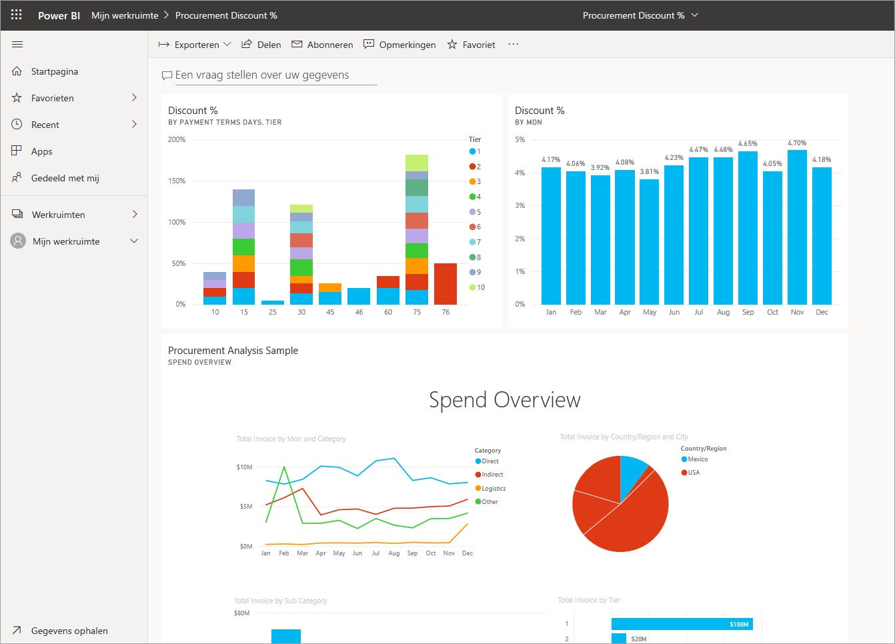

# Een Power BI-dashboard maken op basis van een rapport
U hebt [Inleiding tot dashboards in Power BI](service-dashboards.md) gelezen en u wilt nu uw eigen dashboard maken. Er zijn veel verschillende manieren om een dashboard te maken. U kunt bijvoorbeeld een dashboard maken op basis van een rapport, helemaal vanaf het begin, op basis van een gegevensset of door een bestaand dashboard te dupliceren.  

We maken eerst een klein en eenvoudig dashboard waaraan visualisaties worden vastgemaakt uit een rapport dat al is gemaakt. 

Nadat u dit artikel hebt voltooid, hebt u kennis van:
- De relatie tussen dashboards en rapporten
- De bewerkingsweergave in de rapporteditor openen
- Tegels vastmaken 
- Navigeren tussen een dashboard en een rapport 
 

> [!NOTE] 
> Dashboards zijn een functie van de Power BI-service, niet van Power BI Desktop. Hoewel u geen dashboards maakt in de mobiele Power BI-apps, kunt u ze in deze apps wel [weergeven en delen](../consumer/mobile/mobile-apps-view-dashboard.md).
>
> 

## Video: Een dashboard maken door visualisaties en afbeeldingen van een rapport vast te maken
Kijk hoe Amanda een nieuw dashboard maakt door visualisaties van een rapport vast te maken. Volg vervolgens de stappen in de volgende sectie, [Een gegevensset met een rapport importeren](#import-a-dataset-with-a-report), om dit zelf te proberen met behulp van het voorbeeld van een inkoopanalyse.
    

<iframe width="560" height="315" src="https://www.youtube.com/embed/lJKgWnvl6bQ" frameborder="0" allowfullscreen></iframe>

## Een gegevensset met een rapport importeren
We gaan een van de Power BI-voorbeeldgegevenssets importeren en gebruiken om het nieuwe dashboard te maken. Het voorbeeld dat we gebruiken is een Excel-werkmap met twee PowerView-bladen. Als de werkmap wordt geïmporteerd in Power BI, wordt er een gegevensset en een rapport toegevoegd aan uw werkruimte. Het rapport wordt automatisch gemaakt op basis van de PowerView-werkbladen.

1. Download het Excel-bestand met het [voorbeeld van een inkoopanalyse](https://go.microsoft.com/fwlink/?LinkId=529784). We raden u aan het op te slaan in uw OneDrive voor bedrijven.
2. Open de Power BI-service (app.powerbi.com) in uw browser.
3. Selecteer in het navigatievenster achtereenvolgens **Mijn werkruimte**  en **Gegevens ophalen**.

    
5. Selecteer onder **Bestanden** de optie **Ophalen**.

   
6. Navigeer naar de locatie waar u het Excel-bestand met het voorbeeld van een inkoopanalyse hebt opgeslagen. Selecteer het en kies **Verbinding maken**.

   
7. Selecteer voor deze oefening **Importeren**.

    
8. Wanneer het bericht wordt weergegeven dat het importeren is voltooid, selecteert u de **x** om het bericht te sluiten.

   

> [!TIP]
> Wist u dat? U kunt het navigatievenster versmallen door het pictogram met de drie regels te selecteren boven aan het . Hierdoor krijgt u meer ruimte voor het rapport zelf.

### Het rapport openen en tegels vastmaken aan uw dashboard
1. Selecteer in dezelfde werkruimte het tabblad **Rapporten** en selecteer vervolgens **Voorbeeld van een inkoopanalyse** om het rapport te openen.

     Het rapport wordt geopend in de leesweergave. U ziet links twee tabbladen: **Kortingsanalyse** en **Overzicht uitgaven**. Elk tabblad vertegenwoordigt een pagina van het rapport.

2. Selecteer **Meer opties (...)**  > **Rapport bewerken** om het rapport in de bewerkingsweergave te openen.

    
3. Wijs een visualisatie aan om de beschikbare opties zichtbaar te maken. Als u een visualisatie aan een dashboard wilt toevoegen, selecteert u het speldpictogram .

    
4. Omdat we een nieuw dashboard maken, selecteert u de optie **Nieuw dashboard** en geeft u het een naam.

    
5. Wanneer u **Vastmaken** selecteert, wordt het nieuwe dashboard in de huidige werkruimte gemaakt. Wanneer het bericht **Aan dashboard vastgemaakt** wordt weergegeven, selecteert u **Naar dashboard gaan**. Als u wordt gevraagd of u het rapport wilt opslaan, kiest u **Opslaan**.

    

    Het nieuwe dashboard wordt in Power BI geopend. Het dashboard bevat één tegel: de visualisatie die u zojuist hebt vastgemaakt.

   
7. Selecteer de tegel om naar het rapport terug te gaan. Maak nog een paar tegels vast aan het nieuwe dashboard. Wanneer het venster **Aan dashboard vastmaken** verschijnt, selecteert u **Bestaand dashboard**.  

   

## Een volledige rapportpagina aan het dashboard vastmaken
U kunt [een hele rapportpagina vastmaken als *live-tegel*](service-dashboard-pin-live-tile-from-report.md) in plaats van één visueel element per keer vast te maken. Aan de slag.

1. Selecteer het tabblad **Overzicht uitgaven** in de rapporteditor om de tweede pagina van het rapport te openen.

   

2. We willen dat alle visuals in het rapport in uw dashboard worden weergegeven. Selecteer **Live-pagina vastmaken** in de rechterbovenhoek van de menubalk. Op een dashboard worden tegels van live-pagina’s telkens bijgewerkt wanneer de pagina wordt vernieuwd.

   

3. Wanneer het venster **Aan dashboard vastmaken** verschijnt, selecteert u **Bestaand dashboard**.

   

4. Wanneer het bericht verschijnt dat de bewerking is voltooid, selecteert u **Naar dashboard gaan**. Hier ziet u de tegels uit het rapport die u hebt vastgemaakt. In het onderstaande voorbeeld hebben we twee tegels van pagina één van het rapport vastgemaakt en één livetegel, wat pagina twee van het rapport is.

   

## Volgende stappen
Gefeliciteerd, u hebt uw eerste dashboard gemaakt! Nu u een dashboard hebt, kunt u er nog veel meer mee doen. Volg een van de voorgestelde artikelen hieronder of ga zelf aan de slag met verkennen: 

* [Het formaat van tegels bewerken en ze verplaatsen](service-dashboard-edit-tile.md)
* [Alles over dashboardtegels](service-dashboard-tiles.md)
* [Uw dashboard delen door een app te maken](../collaborate-share/service-create-workspaces.md)
* [Power BI - basisconcepten](../fundamentals/service-basic-concepts.md)
* [Tips voor het ontwerpen van een geweldig dashboard](service-dashboards-design-tips.md)

Hebt u nog vragen? [Misschien dat de Power BI-community het antwoord weet](https://community.powerbi.com/).
