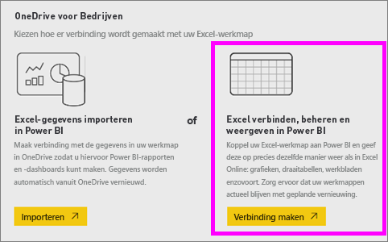
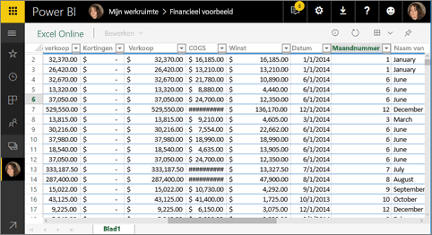
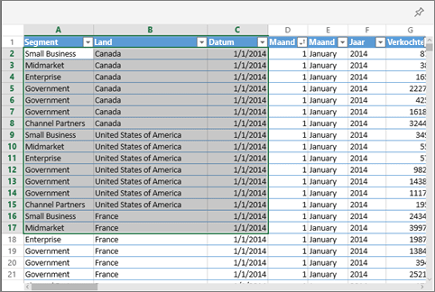
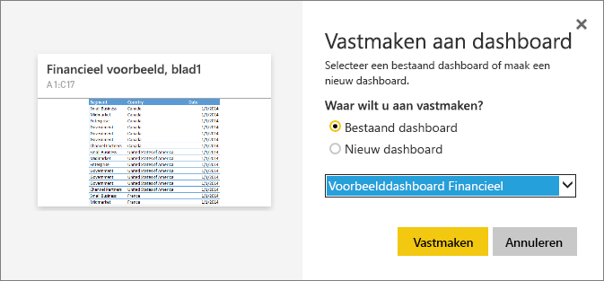
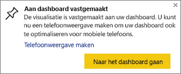

# Vanuit Excel een tegel vastmaken aan een Power BI-dashboard
Voordat u een tegel uit uw Excel-werkmap vastmaakt, koppelt u de werkmap aan de Power BI-service (app.powerbi.com). Met het koppelen van een werkmap wordt een gekoppelde alleen-lezen versie van die werkmap naar Power BI-service overgebracht. Zo kunt u bereiken aan dashboards koppelen. U kunt zelfs een volledig werkblad aan een dashboard vastmaken.  
Als een werkmap met u is gedeeld, kunt u de tegels die zijn vastgemaakt door de eigenaar bekijken, maar zelf geen dashboardtegels maken. 

Zie [Gegevens ophalen uit Excel-werkmappen](https://go.microsoft.com/fwlink/?LinkID=521962) voor gedetailleerde informatie over de manier waarop Excel en Power BI samenwerken.

Kijk hoe Will verschillende manieren demonstreert om gegevens te importeren uit en verbinding te maken met Excel-werkmappen.

<iframe width="560" height="315" src="https://www.youtube.com/embed/l8JoB7w0zJA" frameborder="0" allowfullscreen></iframe>

## Uw Excel-werkmap in OneDrive voor Bedrijven koppelen aan Power BI
Wanneer u de optie **Verbinden** kiest, wordt uw werkmap weergegeven in Power BI, precies zoals in Excel Online. Maar anders dan in Excel Online hebt u een aantal handige functies waarmee u elementen uit uw werkbladen direct aan uw dashboards kunt vastmaken.

U kunt uw werkmap niet in Power BI bewerken. Maar als u wijzigingen wilt aanbrengen, kunt u het potloodpictogram op het tabblad **Werkmappen** in uw werkruimte selecteren en uw werkmap vervolgens bewerken in Excel Online of openen in Excel op uw computer. Eventuele wijzigingen worden opgeslagen in de werkmap op OneDrive.

1. Upload uw werkmap naar uw OneDrive voor Bedrijven.

2. Maak vanuit Power BI [verbinding met die werkmap](../connect-data/service-excel-workbook-files.md) door **Gegevens ophalen > Bestanden > OneDrive - Bedrijven** te selecteren en navigeer naar de locatie waar u het Excel-bestand hebt opgeslagen. Selecteer het bestand en kies **Verbinden > Verbinden**.

    

3. De werkmap wordt in Power BI toegevoegd aan het tabblad **Werkmappen** van uw werkruimte.  Het  geeft aan dat dit een Excel-werkmap is en een geel sterretje geeft aan dat de werkmap nieuw is.
    
    
4. Open de werkmap in Power BI door de werkmapnaam te selecteren.

    Wijzigingen in de werkmap in Power BI worden niet opgeslagen en hebben geen invloed op de oorspronkelijke werkmap in OneDrive voor Bedrijven. Als u waarden in Power BI sorteert, filtert of wijzigt, kunnen deze wijzigingen niet worden opgeslagen of vastgemaakt. Als u wijzigingen moet aanbrengen die worden opgeslagen, selecteert u **Bewerken** rechtsboven in de hoek om het ter bewerking te openen in Excel Online of Excel. Het kan een paar minuten duren voordat wijzigingen die op deze manier zijn aangebracht, bijgewerkt zijn in de tegels op het dashboard.
   
    

## Een bereik van cellen aan een dashboard vastmaken
U kunt een nieuwe [dashboardtegel](../consumer/end-user-tiles.md) onder meer toevoegen vanuit een Excel-werkmap in Power BI. Bereiken kunnen worden vastgemaakt vanuit Excel-werkmappen die zijn opgeslagen in uw OneDrive voor bedrijven of een andere in groepen gedeelde documentbibliotheek. De bereiken kunnen gegevens, grafieken, tabellen, draaitabellen, draaigrafieken en andere onderdelen van Excel bevatten.

1. Markeer de cellen die u wilt vastmaken aan een dashboard.
   
    
2. Selecteer het speldpictogram  . 
3. Maak de tegel vast aan een bestaand dashboard of aan een nieuw dashboard. 
   
   * Bestaand dashboard: selecteer de naam van het dashboard in de vervolgkeuzelijst.
   * Nieuw dashboard: typ de naam van het nieuwe dashboard.
   
     
4. Selecteer **Vastmaken**. Een bericht (rechts bovenin) laat u weten dat het bereik als tegel aan uw dashboard is toegevoegd. 
   
    
5. Selecteer **Naar het dashboard gaan**. Hier kunt u de vastgemaakte visualisatie [hernoemen, vergroten of verkleinen, koppelen en verplaatsen](service-dashboard-edit-tile.md). Standaard wordt de werkmap in Power BI geopend als de vastgemaakte tegel wordt geselecteerd.

## Een hele tabel of draaigrafiek aan een dashboard vastmaken
Volg de bovenstaande stappen maar selecteer in plaats van een celbereik een hele tabel of draaitabel.

Als u een tabel wilt vastmaken, selecteert u het volledige bereik van de tabel inclusief koppen.  Als u een draaitabel wilt vastmaken, moet u elk zichtbare gedeelte van de draaitabel opnemen, inclusief eventuele filters.

 

Als een tegel is gemaakt op basis van een tabel of draaitabel, wordt de hele tabel weergeven.  Als u rijen of kolommen in de originele werkmap toevoegt/verwijdert/filtert, worden deze ook in de tegel toegevoegd/verwijderd/gefilterd.

## De werkmap die aan de tegel is gekoppeld bekijken
Als een tegelwerkmap wordt geselecteerd, wordt de gekoppelde werkmap in Power BI geopend. Omdat het werkmapbestand is opgeslagen op OneDrive voor Bedrijven, moet u voor de weergave van de werkmap leesmachtigingen voor de werkmap hebben. Als u geen machtiging hebt, krijgt u een foutbericht.  

 

## Aandachtspunten en probleemoplossing
Niet-ondersteunde functies: Power BI maakt gebruik van Excel Services om de werkmaptegels op te halen. Omdat sommige functies van Excel niet worden ondersteund in de Excel Services REST API, zijn ze niet zichtbaar in de tegels in Power BI. Bijvoorbeeld: Sparklines, voorwaardelijke opmaak van pictogrammenset en tijdslicers. Zie [Niet-ondersteunde functies in Excel Services REST API](/sharepoint/dev/general-development/unsupported-features-in-excel-services-rest-api) voor een volledige lijst met niet-ondersteunde functies.

## Volgende stappen
[Een dashboard met koppelingen naar een Excel-werkmap delen](../collaborate-share/service-share-dashboard-that-links-to-excel-onedrive.md)

[Gegevens ophalen uit Excel-werkmappen](../connect-data/service-excel-workbook-files.md)

Nog vragen? [Misschien dat de Power BI-community het antwoord weet](https://community.powerbi.com/)
