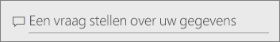
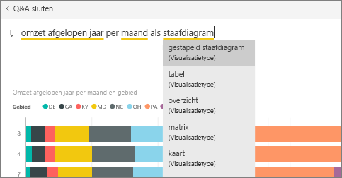
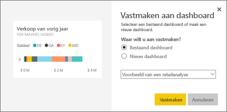
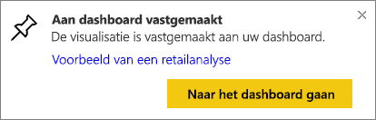
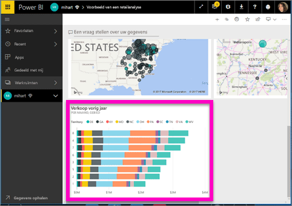
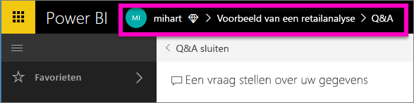

# Een tegel vastmaken aan een dashboard vanuit Q&A

Q&A is een Power BI-hulpprogramma voor het verkennen van uw gegevens met behulp van natuurlijke taal. Hebt u een bepaald inzicht nodig? Stel een vraag over uw gegevens en krijg antwoord in de vorm van een visualisatie.

In deze instructies gaan we een [dashboard](../consumer/end-user-dashboards.md) in de Power BI-service (app.powerbi.com) openen, een vraag stellen in natuurlijke taal om een visualisatie te maken en deze visualisatie aan het dashboard vastmaken. Dashboards zijn niet beschikbaar in Power BI Desktop. Zie [Overzicht van de Q&A-functie in Power BI](../consumer/end-user-q-and-a.md) voor meer informatie over het gebruik van Q&A met andere Power BI-hulpprogramma's en -inhoud. 

Als u wilt volgen, opent u het [dashboard Voorbeeld van een retailanalyse](sample-retail-analysis.md).

## Een tegel vastmaken vanuit Q&A

1. Open een dashboard waarop ten minste één tegel is vastgemaakt vanuit een rapport. Wanneer u een vraag stelt, zoekt Power BI het antwoord op in elke gegevensset waaraan een tegel is vastgemaakt in dat dashboard.
2. Typ in het vak Vraag aan de bovenkant van het dashboard wat u wilt weten over uw gegevens.  
   
3. Als u bijvoorbeeld typt 'Omzet afgelopen jaar per maand en gebied'...  
   

   geeft het vak Vraag u suggesties.
4. Selecteer de speld om het diagram als tegel aan uw dashboard toe te voegen  aan de rechterbovenkant van het canvas. Als het dashboard met u is gedeeld, kunt u geen visualisaties vastmaken.

5. Maak de tegel vast aan een bestaand dashboard of aan een nieuw dashboard.

   

   * Bestaand dashboard: selecteer de naam van het dashboard in de vervolgkeuzelijst. Uw keuzes zijn beperkt tot alleen de dashboards in de huidige werkruimte.
   * Nieuw dashboard: typ de naam van het nieuwe dashboard en het wordt toegevoegd aan uw huidige werkruimte.

6. Selecteer **Vastmaken**.

   Een bericht (rechts bovenin) laat u weten dat de visualisatie als tegel aan uw dashboard is toegevoegd.  

   
7. Selecteer **Naar dashboard gaan** om de nieuwe tegel te zien. Daar kunt u de tegel [een andere naam geven, vergroten of verkleinen, er een hyperlink aan toevoegen, de tegel verplaatsen en meer](service-dashboard-edit-tile.md) op uw dashboard.

   

## Aandachtspunten en probleemoplossing
* Wanneer u begint met het typen van een vraag, zoekt Q&A direct naar het beste antwoord in alle gegevenssets die zijn gekoppeld aan het huidige dashboard.  Het 'huidige dashboard' is het dashboard dat in het bovenste navigatievenster staat vermeld. Deze vraag wordt bijvoorbeeld gesteld in het dashboard **Voorbeeld van een retailanalyse** dat deel uitmaakt van de werkruimte **mihart**.

  
* **Hoe weet Q&A welke gegevenssets moeten worden gebruikt**?  Q&A heeft toegang tot alle gegevenssets waarvoor ten minste een visualisatie is vastgemaakt aan dat dashboard.

* **Is het vragenvak niet zichtbaar**? Neem contact op met uw Power BI-beheerder. De beheerder heeft de mogelijkheid om Q&A uit te schakelen.

## Volgende stappen
[De naam wijzigen, vergroten of verkleinen, een hyperlink toevoegen, de positie van de tegel wijzigen en meer](service-dashboard-edit-tile.md)    
[Een dashboardtegel weergeven in de focusmodus](../consumer/end-user-focus.md)     
[Overzicht van Q&A in Power BI](../consumer/end-user-q-and-a.md)  
Hebt u nog vragen? [Misschien dat de Power BI-community het antwoord weet](https://community.powerbi.com/)
