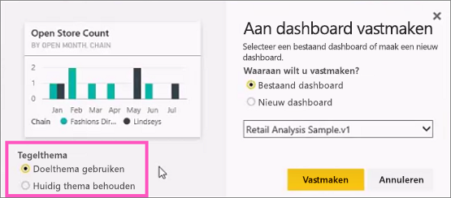
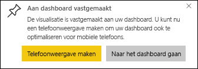

# Vanuit een rapport een tegel vastmaken aan een Power BI-dashboard

U kunt een [dashboardtegel](../consumer/end-user-tiles.md) onder meer toevoegen vanuit een [Power BI-rapport](../consumer/end-user-reports.md). Als u een van deze tegels selecteert, wordt deze in het rapport geopend.

U kunt een volledige rapportpagina aan een dashboard vastmaken. Dit wordt het vastmaken van een *live*tegel genoemd. Met de aanduiding livetegel wordt bedoeld dat u interactie met de tegel op het dashboard kunt hebben. In tegenstelling tot afzonderlijke visualisatietegels worden wijzigingen die in het rapport zijn aangebracht, automatisch gesynchroniseerd met het dashboard. Zie [Een volledige rapportpagina vastmaken](#pin-an-entire-report-page) voor meer informatie.

U kunt geen tegels vastmaken van rapporten die met u zijn gedeeld of van Power BI Desktop. 

> [!TIP]
> Omdat sommige visualisaties achtergrondafbeeldingen gebruiken, werkt het vastmaken mogelijk niet als de achtergrondafbeelding te groot is. Verklein de afbeelding of gebruik beeldcompressie.  
> 
> 

## Een tegel uit een rapport vastmaken
Kijk hoe Amanda een dashboard maakt door visualisaties en afbeeldingen vanuit een rapport vast te maken.
    

<iframe width="560" height="315" src="https://www.youtube.com/embed/lJKgWnvl6bQ" frameborder="0" allowfullscreen></iframe>

Maak nu uw eigen dashboard met een van de Power BI-voorbeeldrapporten.

1. Beweeg de muisaanwijzer in het rapport over de visualisatie die u wilt vastmaken, en selecteer het speldpictogram. . Power BI opent het scherm **Aan dashboard vastmaken**.
   
     
2. Selecteer of u wilt vastmaken aan een bestaand dashboard of een nieuw dashboard.
   
   * **Bestaand dashboard**: selecteer de naam van het dashboard in de vervolgkeuzelijst. Dashboards die met u zijn gedeeld, worden niet weergegeven in de vervolgkeuzelijst.
   * **Nieuw dashboard**: voer de naam van het nieuwe dashboard in.
3. In sommige gevallen kan het item dat u vastmaakt al een *thema* hebben. Bijvoorbeeld visuele elementen die vanuit een Excel-werkmap zijn vastgemaakt. Zo ja, selecteer welk thema u wilt toepassen op de tegel.
4. Selecteer **Vastmaken**.
   
   U ontvangt het bericht (in de rechterbovenhoek) dat de visualisatie als tegel aan uw dashboard is toegevoegd.
   
   
5. Selecteer het dashboard met de nieuwe tegel vanuit het navigatievenster. [Bewerk de weergave en werking van de tegel](service-dashboard-edit-tile.md) of selecteer de tegel om naar het rapport terug te gaan.

## Een volledige rapportpagina vastmaken
Een andere mogelijkheid is om een volledige rapportpagina aan een dashboard vast te maken. Dit is een eenvoudige manier om meerdere visualisaties tegelijk vast te maken. Als u een volledige pagina vastmaakt, zijn de tegels *live*. Dat wil zeggen dat u daar op het dashboard interactie met de tegels kunt hebben. Wijzigingen die u aan visualisaties aanbrengt in de rapporteditor, zoals een filter toevoegen of de velden wijzigen die worden gebruikt in de grafiek, worden ook in de dashboardtegel doorgevoerd.  

Zie [Een volledige rapportpagina vastmaken](service-dashboard-pin-live-tile-from-report.md) voor meer informatie.

> [!NOTE]
> Sommige opmaakopties worden niet toegepast op visuele elementen wanneer ze zijn vastgemaakt aan een dashboard. De rand-, schaduw- en achtergrondinstellingen worden genegeerd in de vastgemaakte tegel. Voor kaartvisuals wordt de tekst die wordt gebruikt voor de waarde, altijd weergegeven in dashboards met behulp van de lettertypefamilie 'DIN'. 
> 
>

## Volgende stappen
- [Dashboards voor gebruikers van de Power BI-service](../consumer/end-user-dashboards.md)
- [Dashboardtegels in Power BI](../consumer/end-user-tiles.md)
- [Rapporten in Power BI](../consumer/end-user-reports.md)
- [Gegevens vernieuwen in Power BI](../connect-data/refresh-data.md)
- [Basisconcepten voor ontwerpers in de Power BI-service](../fundamentals/service-basic-concepts.md)

Hebt u nog vragen? [Misschien dat de Power BI-community het antwoord weet](https://community.powerbi.com/)
