# <a name="use-dashboard-themes-in-the-power-bi-service"></a>Dashboardthema’s gebruiken in Power BI-service
Met **dashboardthema's** kunt u een kleurenthema op uw gehele dashboard toepassen, zoals zakelijke kleuren, seizoensgebonden kleuren of andere kleurthema's die u op een rapport zou willen toepassen. Wanneer u een dashboardthema toepast, worden voor alle visuals in het dashboard de kleuren van het geselecteerde thema gebruikt. Er zijn enkele uitzonderingen van toepassing, zoals beschreven in de sectie [Overwegingen en beperkingen](#considerations-and-limitations) van dit artikel.

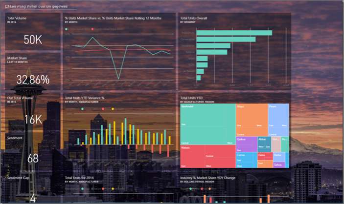

Wijzigingen in de kleuren van de rapportvisuals op het dashboard hebben geen invloed op de visuals in het betreffende rapport. Ook als u tegels vastmaakt vanuit een rapport waarop al een [rapportthema is toegepast](desktop-report-themes.md), kunt u ervoor kiezen het huidige thema te behouden of het dashboardthema te gebruiken.


## <a name="prerequisites"></a>Vereisten
* Als u wilt volgen, opent u het [dashboard Voorbeeld van verkoop en marketing](sample-datasets.md).


## <a name="how-dashboard-themes-work"></a>Hoe dashboardthema's werken
Als u aan de slag wilt gaan, opent u een dashboard dat u hebt gemaakt of kunt bewerken. Selecteer **Bewerken** > **Dashboardthema**. 

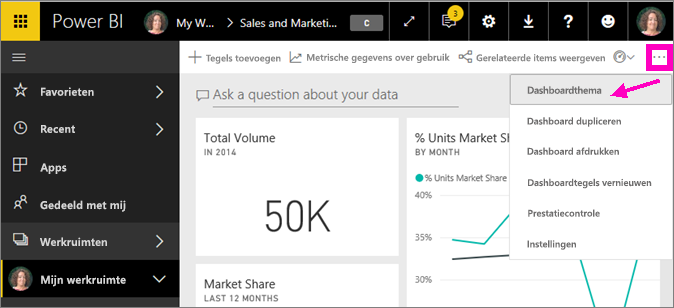

In het dashboardvenster dat wordt weergegeven, selecteert u één van de vooraf gebouwde thema's.  In het onderstaande voorbeeld hebben we **Donker** geselecteerd.

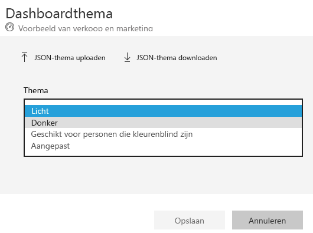

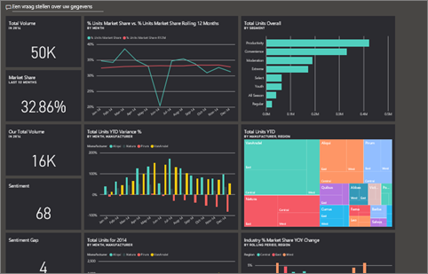

## <a name="create-a-custom-theme"></a>Een aangepast thema maken

Het standaardthema voor Power BI-dashboards is **Licht**. Als u de kleuren wilt aanpassen of uw eigen thema wilt maken, selecteert u **Aangepast** in het vervolgkeuzemenu. 

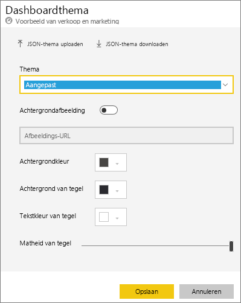

Gebruik de aangepaste opties om uw eigen dashboardthema te maken. Als u een achtergrondafbeelding wilt toevoegen, raden we aan een afbeelding met een minimale resolutie van 1920x1080 te gebruiken. Als u een afbeelding als achtergrond wilt gebruiken, kunt u de afbeelding uploaden naar een openbare website, de URL kopiëren en deze in het veld **Afbeeldings-URL** plakken. 

## <a name="use-a-json-theme"></a>Een JSON-thema gebruiken
Een andere manier om een aangepast thema te maken is het uploaden van een JSON-bestand met instellingen voor alle kleuren die u maar wilt gebruiken voor uw dashboard. In Power BI Desktop gebruiken makers van rapporten JSON-bestanden om [thema's voor rapporten te maken](desktop-report-themes.md). U kunt dezelfde JSON-bestanden uploaden voor dashboards of JSON-bestanden zoeken en uploaden via de [pagina met de themagalerie](https://community.powerbi.com/t5/Themes-Gallery/bd-p/ThemesGallery) in de Power BI-community. 

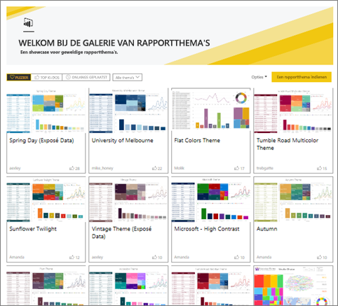

U kunt uw aangepaste thema ook opslaan als een JSON-bestand en dit vervolgens delen met andere dashboardmakers. 

### <a name="use-a-theme-from-the-theme-gallery"></a>Een thema uit de themagalerie gebruiken

Net zoals met de ingebouwde en aangepaste opties worden de kleuren automatisch toegepast op alle tegels op het dashboard zodra u het thema uploadt. 

1. Beweeg de muisaanwijzer over een thema en kies **Rapport weergeven**.

    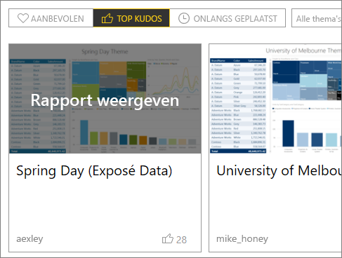

2. Schuif omlaag en zoek de koppeling naar het JSON-bestand.  Selecteer het downloadpictogram en sla het bestand op.

    

3. Ga terug naar Power BI-service. In het venster Aangepast dashboardthema selecteert u **JSON-thema uploaden**.

    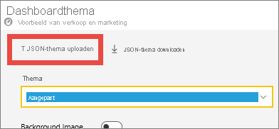

4. Navigeer naar de locatie waar u het JSON-themabestand hebt opgeslagen en selecteer **Openen**.

5. Op de pagina Dashboardthema selecteert u **Opslaan**. Het nieuwe thema wordt op uw dashboard toegepast.

    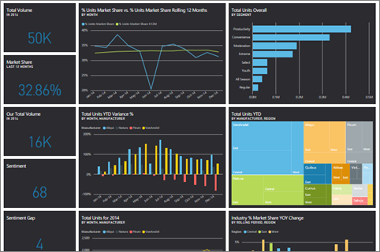

## <a name="reports-and-dashboards-with-different-themes"></a>Rapporten en dashboards met verschillende thema's

Als uw rapport een ander thema gebruikt dan het dashboardthema, kunt u in de meeste gevallen bepalen of u het huidige rapportthema voor de visual wilt behouden of het dashboardthema wilt gebruiken. Kaartvisuals in dashboards maken echter gebruik van de lettertypefamilie DIN, met zwarte tekst. U kunt de tekstkleur voor alle tegels op een dashboard wijzigen met inbegrip van de kaarten, door een aangepast dashboardthema te maken.

- Wanneer u een tegel op een dashboard vastmaakt, selecteert u **Huidige thema behouden** om het rapportthema te behouden. De visual, op het dashboard, behoudt het rapportthema, inclusief instellingen voor transparantie.

    U ziet opties voor **Tegelthema’s** alleen als u het rapport in Power BI Desktop hebt gemaakt, [een rapportthema hebt toegevoegd](desktop-report-themes.md) en het rapport vervolgens naar Power BI-service hebt gepubliceerd.

    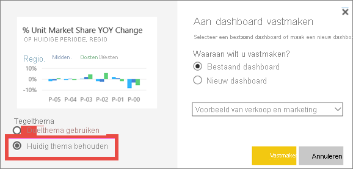

- Probeer de tegel opnieuw vast te maken en selecteer **Dashboardthema gebruiken**.

    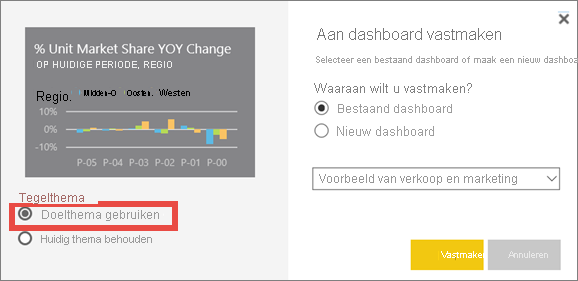

## <a name="dashboard-theme-json-file-format"></a>JSON-bestandsindeling voor dashboardthema

In de basis heeft het JSON-themabestand maar één vereiste regel: **name**.

```json
{
    "name": "Custom Theme"
}
```

Met uitzondering van **naam** zijn alle andere optioneel. U bent vrij om alleen de eigenschappen toe te voegen die u specifiek in het themabestand wilt verwerken en voor de rest de standaardinstellingen van Power BI te blijven gebruiken.

Het JSON-bestand voor dashboardthema's houdt het volgende in:

- naam: De themanaam (het enige vereiste veld).
- voor- en achtergrond: Kleuren voor het dashboard.
- dataColors: Een lijst met hexcodes die moeten worden gebruikt voor gegevens in grafieken. U kunt zoveel kleuren gebruiken als u wilt.
- tegels: Achtergrond- en kleurenconfiguraties voor dashboards.
- visualStyles: Gedetailleerde opmaak voor visuals.

Hier volgt een voorbeeld van een JSON-thema voor het standaardthema Licht:

```json
{

"name":"Light",

"foreground":"#000000",

"background":"#EAEAEA",

"dataColors":["#01B8AA","#374649","#FD625E","#F2C80F","#5F6B6D","#8AD4EB","#FE9666","#A66999"],

"tiles":{"background":"#FFFFFF","color":"#000000"},

"visualStyles":{"*":{"*":{"*":[{"color":{"solid":{"color":"#000000"}}}]}}}

}
```

## <a name="considerations-and-limitations"></a>Overwegingen en beperkingen

* U kunt geen dashboardthema's toepassen op vastgemaakte liverapportpagina’s, iframe-tegels, SSRS-tegels, workbooktegels of afbeeldingen.
* U kunt dashboardthema's bekijken op mobiele apparaten, maar u kunt een dashboardthema alleen in de Power BI-service maken.
* Aangepaste dashboardthema's werken alleen met tegels die vanuit rapporten zijn vastgemaakt.

## <a name="next-steps"></a>Volgende stappen

- [Thema's toepassen op rapporten](desktop-report-themes.md)
