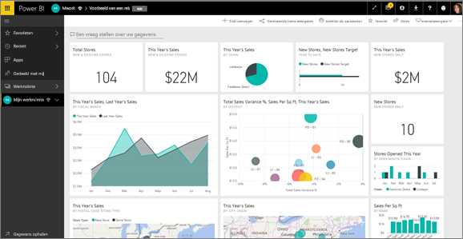
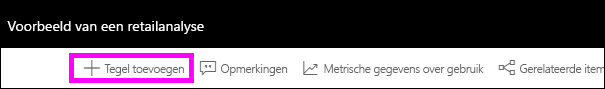
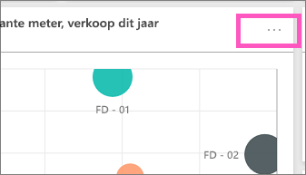
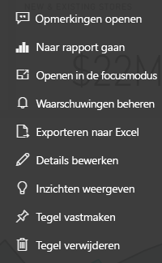

# Inleiding tot dashboardtegels voor Power BI-ontwerpers

Een tegel is een momentopname van uw gegevens, vastgemaakt aan het dashboard. Een tegel kan worden gemaakt vanuit een rapport, een gegevensset, een dashboard, het Q&A-vak, Excel, SQL Server Reporting Services-rapporten (SSRS) en meer.  Deze schermopname laat verschillende tegels zien die zijn vastgemaakt aan een dashboard.

Dashboards en dashboardtegels zijn functies van Power BI-service, niet van Power BI Desktop. U kunt geen dashboards op mobiele apparaten maken, maar u kunt ze daar wel [weergeven en delen](../consumer/mobile/mobile-apps-view-dashboard.md).

U kunt niet alleen tegels vastmaken, maar ook zelfstandige tegels rechtstreeks op het dashboard maken met behulp van het besturingselement [Tegel toevoegen](service-dashboard-add-widget.md). Zelfstandige tegels bevatten: tekstvakken, afbeeldingen, video's, streaminggegevens en webinhoud.

Wilt u weten wat de bouwstenen van Power BI zijn? Zie [Basisconcepten voor ontwerpers in de Power BI-service](../fundamentals/service-basic-concepts.md).

> [!NOTE]
> Als de oorspronkelijke visualisatie waarmee de tegel is gemaakt wijzigt, verandert de tegel niet.  Als u bijvoorbeeld een lijndiagram uit een rapport hebt vastgemaakt en u het lijndiagram vervolgens wijzigt in een staafdiagram, blijft de dashboardtegel een lijndiagram weergeven. De gegevens worden vernieuwd, maar het visualisatietype niet.
> 
> 

## Een tegel vastmaken
Er zijn veel verschillende manieren om een tegel toe te voegen (vastmaken) aan een dashboard. U kunt tegels vastmaken van:

* [Power BI Q&A](service-dashboard-pin-tile-from-q-and-a.md)
* [Een rapport](service-dashboard-pin-tile-from-report.md)
* [Een ander dashboard](service-pin-tile-to-another-dashboard.md)
* [Excel-werkmap in OneDrive voor Bedrijven](service-dashboard-pin-tile-from-excel.md)
* [Quick Insights (Snelle inzichten)](service-insights.md)
* [Een gepagineerd on-premises rapport in Power BI Report Server of in SQL Server Reporting Services](https://docs.microsoft.com/sql/reporting-services/pin-reporting-services-items-to-power-bi-dashboards)

U kunt zelfstandige tegels voor afbeeldingen, tekstvakken, video's, streaminggegevens en webinhoud rechtstreeks op het dashboard maken met behulp van het besturingselement [Tegel toevoegen](service-dashboard-add-widget.md).

  

## Interactie met tegels op een dashboard
Nadat u een tegel aan een dashboard hebt toegevoegd, kunt u deze verplaatsen en het formaat, uiterlijk en gedrag ervan wijzigen.

### Een tegel verplaatsen en het formaat ervan wijzigen
Pak een tegel en [beweeg deze over het dashboard](service-dashboard-edit-tile.md). Beweeg de muisaanwijzer over de  en selecteer deze om het formaat van de tegel te wijzigen.

### Beweeg de muisaanwijzer over een tegel om het uiterlijk en gedrag ervan te wijzigen
1. Beweeg de muisaanwijzer over de tegel om het beletselteken weer te geven.
   
    
2. Selecteer het beletselteken om het actiemenu van de tegel te openen.
   
    
   
    Hier kunt u het volgende doen:
   
     * [Opmerkingen toevoegen aan het dashboard](../consumer/end-user-comment.md).
     * [Het rapport openen waarmee deze tegel is gemaakt](../consumer/end-user-reports.md).  
     * [De focusmodus gebruiken](../consumer/end-user-focus.md).   
     * [De in de tegel gebruikte gegevens exporteren](../visuals/power-bi-visualization-export-data.md).
     * [De titel en subtitel bewerken en een hyperlink toevoegen](service-dashboard-edit-tile.md). 
     * [Inzichten verkrijgen](service-insights.md). 
     * [De tegel aan een ander dashboard vastmaken](service-pin-tile-to-another-dashboard.md).
     * [De tegel verwijderen](service-dashboard-edit-tile.md).

3. Selecteer een leeg gebied op het dashboard om het actiemenu te sluiten.

### Een tegel selecteren
Wat er gebeurt nadat u een tegel selecteert, hangt af van de manier waarop u de tegel hebt gemaakt. Anders gaat u door het selecteren van de tegel naar het rapport, de Excel Online-werkmap, het on-premises SSRS-rapport of naar de Q&A-vraag die is gebruikt om de tegel te maken. Of, als de tegel een [aangepaste koppeling](service-dashboard-edit-tile.md) bevat, wordt de koppeling geopend als u de tegel selecteert.

> [!NOTE]
> Uitzonderingen zijn videotegels die rechtstreeks op het dashboard zijn gemaakt met behulp van **Tegel toevoegen**. Als u een videotegel selecteert (die op deze manier is gemaakt), wordt de video rechtstreeks op het dashboard afgespeeld.   
> 
> 

## Aandachtspunten en probleemoplossing

* Als het rapport waarmee de visualisatie is gemaakt, niet is opgeslagen, leidt het selecteren van de tegel niet tot een actie.
* Als de tegel is gemaakt vanuit een werkmap in Excel Online, hebt u minimaal leesmachtigingen voor die werkmap nodig. Anders wordt de werkmap niet in Excel Online geopend als u de tegel selecteert.
* Stel dat u een tegel rechtstreeks op het dashboard maakt met behulp van **Tegel toevoegen** en u hiervoor een aangepaste hyperlink instelt. Als dit het geval is en u de titel, subtitel of tegel selecteert, wordt hiermee die URL geopend. Het selecteren van een tegel die rechtstreeks op het dashboard is gemaakt voor een afbeelding, webcode of tekstvak, leidt anders standaard niet tot een actie.
* Tegels kunnen worden gemaakt van gepagineerde on-premises rapporten in Power BI Report Server of in SQL Server Reporting Services. Als u geen machtiging hebt om het on-premises rapport te openen, gaat u met het selecteren van de tegel naar een pagina waarop wordt aangegeven dat u geen toegang hebt (rsAccessDenied).
* Stel dat u een tegel selecteert die is gemaakt van een gepagineerd on-premises rapport in Power BI Report Server of SQL Server Reporting Services. Als u geen toegang hebt tot het netwerk waarin de rapportserver zich bevindt en u een tegel selecteert die is gemaakt van dat gepagineerde rapport, gaat u naar een pagina waarop wordt aangegeven dat de server niet kan worden gevonden (HTTP 404). Uw apparaat heeft netwerktoegang tot de rapportserver nodig om het rapport te kunnen weergeven.
* Als de oorspronkelijke visualisatie waarmee de tegel is gemaakt wordt gewijzigd, verandert de tegel niet. Als u bijvoorbeeld een lijndiagram uit een rapport vastmaakt en u het lijndiagram vervolgens wijzigt in een staafdiagram, blijft de dashboardtegel een lijndiagram weergeven. De gegevens worden vernieuwd, maar het visualisatietype niet.

## Volgende stappen
- [Een kaart maken (tegel met een groot getal) voor uw dashboard](../visuals/power-bi-visualization-card.md)
- [Inleiding tot dashboards voor Power BI-ontwerpers](service-dashboards.md)  
- [Gegevens vernieuwen in Power BI](../connect-data/refresh-data.md)
- [Basisconcepten voor ontwerpers in de Power BI-service](../fundamentals/service-basic-concepts.md)
- [Power BI-tegels integreren in Office-documenten](https://powerbi.microsoft.com/blog/integrating-power-bi-tiles-into-office-documents/)
- [Items van Reporting Services vastmaken aan Power BI-dashboards](/sql/reporting-services/pin-reporting-services-items-to-power-bi-dashboards)

Hebt u nog vragen? [Misschien dat de Power BI-community het antwoord weet](https://community.powerbi.com/).
