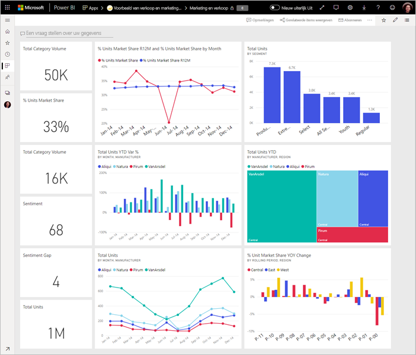
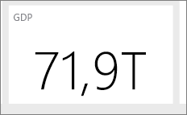

# Tips voor het ontwerpen van een geweldig Power BI-dashboard
Nu u een dashboard hebt gemaakt en een aantal tegels hebt toegevoegd, kunt u nadenken over hoe u ervoor zorgt dat het dashboard niet alleen mooi, maar ook functioneel is. Dit betekent in de praktijk meestal dat de belangrijkste informatie een opvallende plaats krijgt en dat het dashboard netjes en opgeruimd is.

> [!TIP]
> Bevalt dit dashboard u? U kunt het met gerelateerde rapporten downloaden van AppSource. Ga naar **Gegevens ophalen** > **Services**. Zoek naar **Microsoft-voorbeeld - Verkoop en marketing** > **Nu downloaden**.

Hier volgen tips voor dashboards.

## Video Best practices voor dashboardontwerp

Bekijk deze video, [Best practices voor dashboardontwerp in Power BI](https://www.youtube.com/watch?v=-tdkUYrzrio), voor ontwerptips van Marco Russo van SQLBI.com.

## Rekening houden met uw doelgroep
Wat zijn de belangrijkste metrische gegevens op basis waarvan uw doelgroep beslissingen neemt? Hoe wordt het dashboard gebruikt? Welke aangeleerde of culturele aannames hebben mogelijk invloed op dergelijke ontwerpkeuzen? Welke informatie heeft uw doelgroep nodig om succesvol te zijn?

Onthoud dat het dashboard een overzicht is, één plek waarop u de huidige status van de gegevens kunt controleren. Het dashboard is gebaseerd op de onderliggende rapporten en gegevenssets, en deze items kunnen heel veel details bevatten. Uw lezers kunnen vanaf het dashboard deze details in de rapporten bekijken. U hoeft de details dus niet op het dashboard te plaatsen, tenzij uw lezers deze willen controleren.

Wanneer wordt het dashboard weergegeven? U kunt meer inhoud op het dashboard plaatsen als het wordt weergegeven op een grote monitor. Als lezers het echter op een tablet weergeven, is een dashboard met minder tegels beter leesbaar.

## Een verhaal vertellen op één scherm
Omdat dashboards zijn bedoeld om belangrijke informatie in één oogopslag te kunnen zien, is het een goed idee om alle tegels op een enkel scherm weer te geven. Kunt u schuifbalken voorkomen op uw dashboard?

Is het dashboard te vol?  Verwijder alles behalve essentiële gegevens die gemakkelijk te lezen en te interpreteren zijn.

## De modus volledig scherm gebruiken
Bij het presenteren van een dashboard wordt het weergegeven op het [volledige scherm](../consumer/end-user-focus.md), zonder afleidingen.

## De belangrijkste informatie accentueren
Als de tekst en visualisaties op het dashboard allemaal even groot zijn, kunnen uw lezers moeilijker bepalen wat het belangrijkste is. Kaartvisualisaties zijn bijvoorbeeld een goede manier om een belangrijk getal prominent weer te geven:  

Maar zorg ervoor dat u context biedt.  

Lees meer over [een tegel maken met alleen een getal](../visuals/power-bi-visualization-card.md).

## De belangrijkste informatie plaatsen
De meeste mensen lezen van boven naar beneden. Plaats gegevens op het hoogste niveau daarom in de linkerbovenhoek en toon meer details verderop in de leesrichting (van links naar rechts en van boven naar beneden) van de doelgroep.

## De juiste visualisatie voor de gegevens gebruiken
Vermijd een verscheidenheid aan visualisaties omwille van de verscheidenheid alleen.  Visualisaties moeten een beeld schetsen, en gemakkelijk te begrijpen en te interpreteren zijn.  Voor sommige gegevens en visualisaties is een eenvoudig grafische visualisatie voldoende. Maar andere gegevens vragen mogelijk om een complexere visualisatie. Zorg ervoor dat u titels en labels, en andere aanpassingen gebruikt om de lezer te helpen.  

* Wees voorzichtig met het gebruik van visuals die er mooi uitzien maar lastig te lezen zijn, zoals 3D-diagrammen. 
* Het kan teleurstellend zijn, maar cirkeldiagrammen, ringdiagrammen, meters en andere cirkelvormige diagramtypen zijn geen best practice voor gegevensvisualisatie. Cirkeldiagrammen werken het beste als er minder dan acht categorieën worden weergegeven. Omdat in een cirkeldiagram geen waarden naast elkaar kunnen worden vergelijken, is het moeilijker om in een cirkeldiagram waarden te vergelijken dan in een staaf- of kolomdiagram. Cirkeldiagrammen zijn geschikter voor het weergeven van deel-naar-geheelrelaties dan voor het vergelijken van delen. En meterdiagrammen zijn ideaal om de huidige status weer te geven in de context van een doel.
* Wees consistent met diagramschalen op assen, de volgorde van diagramdimensies en ook de kleuren die worden gebruikt voor dimensiewaarden binnen diagrammen.
* Zorg ervoor dat u kwantitatieve gegevens goed codeert. Gebruik niet meer dan 3 of 4 cijfers, wanneer u getallen weergeeft. Geef metingen weer met een of twee cijfers links van de decimale komma, en gebruik een schaal voor duizendtallen of miljoenen, bijvoorbeeld 3,4 miljoen in plaats van 3.400.000.
* Gebruik gaan combinatie van precisie- en tijdsniveaus. Zorg ervoor dat tijdsperioden begrijpelijk zijn. Gebruik niet een diagram met de gegevens van de afgelopen maand naast gefilterde diagrammen uit een specifieke maand van het jaar.
* Combineer geen grote en kleine metingen op dezelfde schaal, zoals een lijn- of staafdiagram. De ene meting kan bijvoorbeeld in de miljoenen zijn, en de andere in de duizenden. Met een dergelijke grote schaal is het lastig om de verschillen te zien in de meting die in de duizenden wordt weergegeven. Als u wilt combineren, kiest u een visualisatie die het gebruik van een tweede as toestaat.
* Gebruik in diagrammen geen onnodige gegevenslabels. De waarden in staafdiagrammen zijn meestal te begrijpen zonder dat het werkelijke getal wordt weergegeven.
* Let op hoe [diagrammen zijn gesorteerd](../consumer/end-user-change-sort.md). Als u de aandacht wilt vestigen op het hoogste of laagste getal, sorteert u op de meting. Sorteer op as als u wilt dat mensen snel een bepaalde categorie kunnen vinden in een groot aantal categorieën.  

Zie [Visualization types in Power BI](../visuals/power-bi-visualization-types-for-reports-and-q-and-a.md) (Visualisatietypen in Power BI) voor meer visualisatiespecifieke instructies.  

## Meer informatie over het ontwerpen van dashboards
Als u de kunst van het ontwerpen van geweldige dashboards onder de knie wilt krijgen, kunt u overwegen om u te verdiepen in de Gestalt-basisprincipes voor visuele waarneming en te leren hoe u duidelijk informatie waarop actie moet worden ondernomen, in context overbrengt. Gelukkig zijn er al tal van bronnen algemeen beschikbaar, onder andere in onze blogs. Een aantal van onze favoriete boeken zijn:

* *Information Dashboard Design* (Ontwerpen van informatiedashboards) door Stephen Few  
* *Show Me the Numbers* door Stephen Few  
* *Now You See It* door Stephen Few  
* *Envisioning Information* (Visie op informatie) door Edward Tufte  
* *Advanced Presentations by Design* (Speciaal ontworpen geavanceerde presentaties) door Andrew Abela   

## Volgende stappen
[Een dashboard maken van een rapport](service-dashboard-create.md)  
[Basisconcepten voor ontwerpers in de Power BI-service](../fundamentals/service-basic-concepts.md)  
Nog vragen? [Misschien dat de Power BI-community het antwoord weet](https://community.powerbi.com/)
