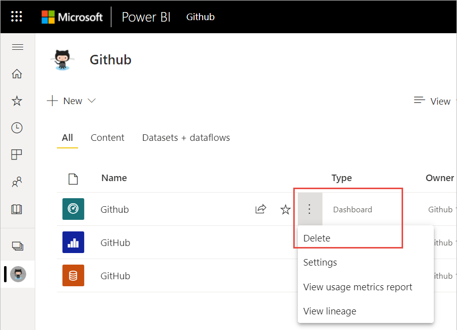
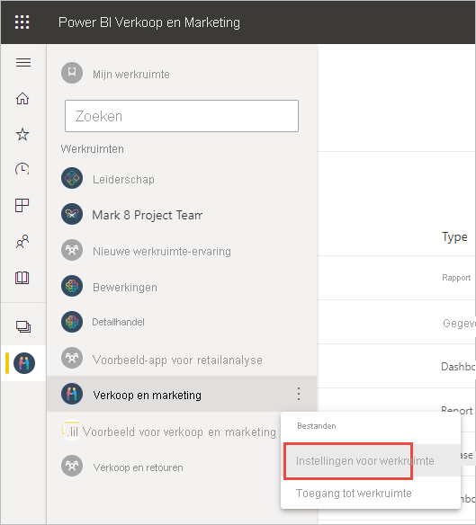
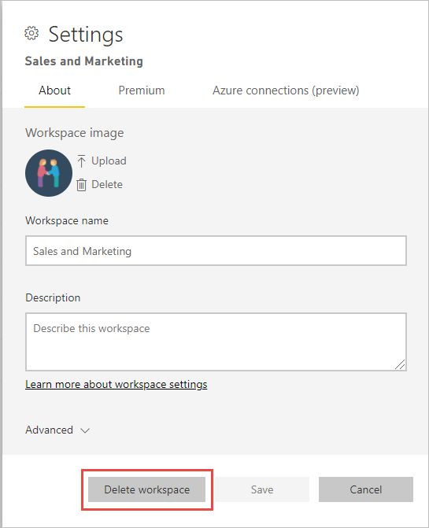

# Vrijwel alles verwijderen in de Power BI-service
In dit artikel ziet u hoe u een dashboard, rapport, rapportpagina, werkmap, gegevensset, app of werkruimte verwijdert in de Power BI-service. U kunt bijna alles verwijderen uit de Power BI-service, met enkele uitzonderingen. 

## Een dashboard, rapport, gegevensset of werkmap verwijderen

1. Selecteer in uw werkruimte het tabblad **Alle**.
1. Selecteer **Meer opties (...)** naast de asset die u wilt verwijderen en selecteer **Verwijderen**.

    

1. Klik op **Verwijderen** om de wisactie te bevestigen.

## Een app verwijderen van de pagina met uw app-lijst

U kunt eenvoudig apps verwijderen van de pagina met uw app-lijst. Als u een app verwijdert, wordt de app niet verwijderd voor andere leden. Alleen een beheerder of lid of een werkruimte kan de app permanent uit die werkruimte verwijderen.

1. Selecteer in het navigatievenster **Apps** om de pagina met de app-lijst te openen.
2. Houd de muis boven de app die u wilt verwijderen en selecteer het verwijderpictogram :::image type="icon" source="media/service-delete/power-bi-delete-report2.png" border="false":::.

   

   Als u per ongeluk een app verwijdert, hebt u verschillende opties om deze terug te zetten.  U kunt de maker van de app vragen om de app opnieuw te sturen, het oorspronkelijke e-mailbericht met de koppeling naar de app zoeken, uw [meldingencentrum](../consumer/end-user-notification-center.md) controleren om te zien of de melding voor die app nog wordt weergegeven, of de [AppSource](../consumer/end-user-apps.md) van uw organisatie controleren.

## Een werkruimte verwijderen of wissen

Power BI heeft twee verschillende werkruimten: de originele, of *klassieke* , werkruimten en de nieuwe werkruimten. De processen voor het verwijderen of wissen hiervan verschillen. Meer informatie over [nieuwe en klassieke werkruimten](../collaborate-share/service-new-workspaces.md).

### Leden verwijderen uit een nieuwe werkruimte

Alleen beheerders van een werkruimte kunnen personen uit een nieuwe werkruimte verwijderen. Als u een beheerder bent, kunt u uzelf of iemand anders verwijderen. Maar als u de enige beheerder voor een werkruimte bent, kunt u met Power BI niet uzelf verwijderen.

1. Selecteer in de lijstweergave werkruimte **Toegang** in de rechterbovenhoek.

    :::image type="content" source="media/service-delete/power-bi-select-access.png" alt-text="Schermopname van Toegang selecteren.":::

1. Selecteer in het deelvenster **Toegang** **Meer opties (...)** naast de naam van de persoon die u wilt verwijderen en selecteer **Verwijderen**.

    :::image type="content" source="media/service-delete/power-bi-access-remove.png" alt-text="Schermopname van In het deelvenster Toegang, Verwijderen selecteren.":::

### Een nieuwe werkruimte verwijderen

Wanneer u een van de *nieuwe werkruimten* maakt, maakt u geen gekoppelde Microsoft 365-groep. Als u beheerder van een werkruimte bent, kunt u een nieuwe werkruimte verwijderen zonder dat dit van invloed is op Microsoft 365-groepen. Meer informatie over [nieuwe en klassieke werkruimten](../collaborate-share/service-new-workspaces.md).

Als beheerder voor een werkruimte kunt u deze verwijderen of anderen eruit verwijderen. Wanneer u deze verwijdert, wordt de bijbehorende app ook verwijderd voor alle groepsleden en verwijderd uit AppSource. 

1. Selecteer **Werkruimten** in het navigatievenster.

2. Selecteer **Meer opties** (...) aan de rechterkant van de werkruimte die u wilt verwijderen en kies **Instellingen voor werkruimte**.

    

3. In het venster **Instellingen voor werkruimte** selecteert u **Werkruimte verwijderen** > **verwijderen**.

### U kunt als volgt een klassieke werkruimte uit uw lijst verwijderen

Als u geen lid meer wilt zijn van een klassieke werkruimte, kunt u deze * *_verlaten_* _ en wordt deze vervolgens uit uw lijst verwijderd. Als u een werkruimte verlaat, blijft deze bestaan voor alle andere leden van de werkruimte.  

> [!NOTE]
> Als u de enige beheerder van de werkruimte bent, geeft Power BI u geen toestemming om deze te verlaten.
>

1. Start in de werkruimte die u wilt verwijderen.

2. Selecteer in de rechterbovenhoek _ *Meer opties* * (...) en kies **Werkruimte verlaten** > **Verlaten**.

      :::image type="content" source="media/service-delete/power-bi-leave-workspace.png" alt-text="Schermopname van Meer opties, Werkruimte verlaten.":::

   > [!NOTE]
   > De opties die worden weergegeven in de vervolgkeuzelijst zijn afhankelijk van uw rol in de werkruimte: Beheerder of Lid.
   >

### Een klassieke werkruimte verwijderen

> [!WARNING]
> Wanneer u een *klassieke* werkruimte maakt, maakt u een Microsoft 365-groep. Wanneer u een klassieke werkruimte verwijdert, verwijdert u deze Microsoft 365-groep. De groep wordt ook verwijderd uit andere Microsoft 365-producten, zoals SharePoint en Microsoft Teams.
> 

Het verwijderen van een werkruimte is iets anders dan het verlaten van een werkruimte. U moet een beheerder van de werkruimte zijn om deze te verwijderen. Wanneer u deze verwijdert, wordt de bijbehorende app ook verwijderd voor alle groepsleden en verwijderd uit AppSource. Maar als u de enige beheerder voor een werkruimte bent, laat Power BI u deze niet verlaten.

1. Selecteer **Werkruimten** in het navigatievenster.

2. Selecteer naast de werkruimte die moet worden verwijderd **Meer opties (...)**  > **Instellingen voor werkruimte**.

    

3. In het venster **Instellingen** selecteert u **Werkruimte verwijderen** en bevestigt u **Verwijderen**.

    

## Overwegingen en beperkingen

- Als u een *dashboard* verwijdert, worden de onderliggende gegevensset of rapporten die zijn gekoppeld aan dit dashboard niet verwijderd.
- Als u de *eigenaar van een dashboard of rapport* bent, kunt u deze verwijderen. Als u het hebt gedeeld met collega's, verwijdert u deze uit uw eigen Power BI-werkruimte maar ook uit hun Power BI-werkruimten.
- Als een *dashboard of rapport met u wordt gedeeld* , kunt u het niet verwijderen.
- Als u een rapport verwijdert, wordt de gegevensset waarop het rapport is gebaseerd niet verwijderd.  Visualisaties die u van het rapport hebt vastgemaakt aan een dashboard, zijn ook veilig. Ze blijven op het dashboard totdat u ze afzonderlijk verwijdert.
- U kunt een *gegevensset* verwijderen. Met het verwijderen van een gegevensset verwijdert u echter ook alle rapporten en dashboardtegels die gegevens uit die gegevensset bevatten.
- U kunt *werkmappen* verwijderen. Met het verwijderen van een werkmap verwijdert u echter ook alle rapporten en dashboardtegels die gegevens uit deze werkmap bevatten. Als een werkmap is opgeslagen in OneDrive voor Bedrijven, wordt deze niet verwijderd uit OneDrive als u deze verwijdert uit Power BI.
- Als een *dashboard of rapport* deel uitmaakt van een [organisatie-inhoudspakket](../collaborate-share/service-organizational-content-pack-disconnect.md), kunt u dit niet verwijderen met deze methode.  Zie [De verbinding met een organisatie-inhoudspakket verwijderen](../collaborate-share/service-organizational-content-pack-disconnect.md).
- Als een *gegevensset* deel uitmaakt van een of meer organisatie-inhoudspakketten, kunt u deze alleen verwijderen als u de inhoudspakketten verwijdert waarin deze wordt gebruikt, wacht totdat de verwijdering is verwerkt, en daarna opnieuw probeert om de gegevensset te verwijderen.

## Volgende stappen

In dit artikel hebben we beschreven hoe u de belangrijkste bouwstenen van de Power BI-service verwijdert. Hier volgen enkele andere dingen die u ook kunt verwijderen.  

- [Uw aanbevolen dashboard verwijderen](../consumer/end-user-featured.md)
- [Een dashboard verwijderen (uit uw favorieten)](../consumer/end-user-favorite.md)
- [Een dashboardtegel verwijderen](service-dashboard-edit-tile.md)

Hebt u nog vragen? [Misschien dat de Power BI-community het antwoord weet](https://community.powerbi.com/)