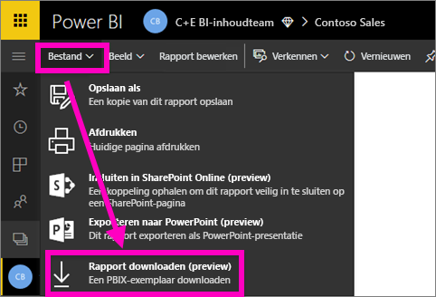
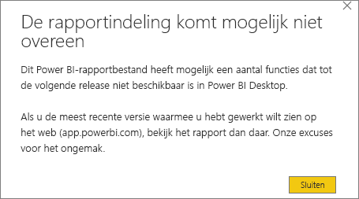
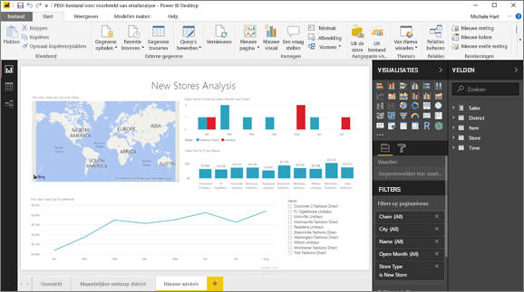

# Een rapport van de Power BI-service downloaden naar Power BI Desktop (preview)
In Power BI Desktop kunt u een rapport (een *PBIX*-bestand) van uw lokale computer publiceren in de Power BI-service. Power BI-rapporten kunnen ook de andere kant op gaan: U kunt een rapport van de Power BI-service downloaden naar Power BI Desktop (preview). De extensie voor een Power BI-rapport is in beide gevallen .pbix.

U moet rekening houden met enkele beperkingen. Deze worden elders in dit artikel besproken in de sectie [Overwegingen en probleemoplossing](#considerations-and-troubleshooting).

## Het rapport downloaden als een PBIX-bestand

U kunt alleen rapporten downloaden die [zijn gemaakt met een Power BI Desktop-versie](/learn/modules/publish-share-power-bi/2-publish-reports) van na 23 november 2016 en die sindsdien is bijgewerkt. Als dit niet het geval is, wordt de optie **Rapport downloaden** in de Power BI-service grijs weergegeven.

Volg deze stappen om het .pbix-bestand te downloaden:

1. Open in de Power BI-service het rapport dat u wilt downloaden in de [Bewerkweergave](https://docs.microsoft.com/power-bi/service-interact-with-a-report-in-editing-view).

2. Selecteer **Bestand > Rapport downloaden** in het bovenste navigatievenster.
   
3. Tijdens het downloaden van het rapport wordt de voortgang weergegeven in een statusbanner. Wanneer het bestand gereed is, wordt u gevraagd waar u het PBIX-bestand wilt opslaan. De standaardnaam van het bestand is gelijk aan de titel van het rapport.
   
4. [Installeer Power BI Desktop](../fundamentals/desktop-get-the-desktop.md) als u dat nog niet hebt gedaan en open het PBIX-bestand vervolgens in Power BI Desktop.
   
    Wanneer u het rapport opent in Power BI Desktop, wordt er mogelijk een waarschuwing weergegeven dat sommige functies die beschikbaar zijn in het rapport van de Power BI-service, niet beschikbaar zijn in Power BI Desktop.
   
    

5. De rapporteditor in Power BI Desktop is vergelijkbaar met de rapporteditor in de Power BI-service.  
   
    

## Aandachtspunten en probleemoplossing
Er zijn enkele belangrijke overwegingen en beperkingen met betrekking tot het downloaden van een PBIX-bestand vanuit de Power BI-service.

* Als u het bestand wilt downloaden, moet u bewerkingstoegang tot het rapport hebben.
* Het rapport moet zijn gemaakt met Power BI Desktop en moet zijn *gepubliceerd* in de Power BI-service, of het PBIX-bestand moet zijn *geüpload* naar de Power BI-service.
* Rapporten moeten zijn gepubliceerd of bijgewerkt na 23 november 2016. Eerder gepubliceerde rapporten kunnen niet worden gedownload.
* Deze functie werkt niet met rapporten en inhoudspakketten die oorspronkelijk zijn gemaakt in de Power BI-service.
* Gebruik altijd de nieuwste versie van Power BI Desktop wanneer u gedownloade bestanden opent. Gedownloade PBIX-bestanden kunnen mogelijk niet worden geopend in versies van Power BI Desktop die niet up-to-date zijn.
* Als uw beheerder de mogelijkheid om gegevens te downloaden heeft uitgeschakeld, is deze functie niet zichtbaar in de Power BI-service.
* Gegevenssets met incrementeel vernieuwen kunnen niet worden gedownload in een PBIX-bestand.
* Als u een Power BI-rapport maakt op basis van een gegevensset in één werkruimte en het rapport vervolgens publiceert in een andere werkruimte, kunnen u en uw gebruikers het niet downloaden. De downloadfunctie wordt momenteel niet ondersteund in dit scenario.

## Volgende stappen
Bekijk de één minuut durende video **Guy in a Cube** over deze functie:

<iframe width="560" height="315" src="https://www.youtube.com/embed/ymWqU5jiUl0" frameborder="0" allowfullscreen></iframe>

Hier zijn nog enkele aanvullende artikelen met informatie over het gebruik van de Power BI-service:

* [Rapporten in Power BI](../consumer/end-user-reports.md)
* [Basisconcepten voor ontwerpers in de Power BI-service](../fundamentals/service-basic-concepts.md)

Nadat u Power BI Desktop hebt geïnstalleerd, kunt u het volgende artikel raadplegen om snel aan de slag te gaan:

* [Getting Started with Power BI Desktop](../fundamentals/desktop-getting-started.md) (Aan de slag met Power BI Desktop)

Hebt u nog vragen? [Misschien dat de Power BI-community het antwoord weet](https://community.powerbi.com/).
