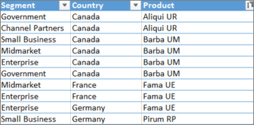
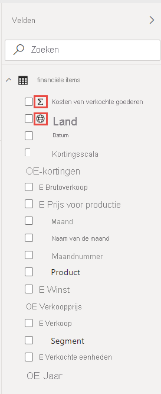

# Zelfstudie: Van een Excel-werkmap naar een rapport in de Power BI-service naar Microsoft Teams
Uw manager wil aan het eind van de dag een rapport bekijken over uw meest recente verkoop- en winstcijfers. De meest recente gegevens bevinden zich echter op verschillende systemen en in bestanden van derden op uw laptop. In het verleden duurde het uren om visuals en een rapport te maken, en u begint zich zorgen te maken.

Nergens voor nodig. Met Power BI kunt u in een handomdraai een verbluffend rapport maken en dit in Microsoft Teams delen.

:::image type="content" source="media/service-from-excel-to-stunning-report/power-bi-financial-report-service.png" alt-text="Schermopname van een voltooid Financieel voorbeeld-rapport":::

In deze zelfstudie uploaden we een Excel-bestand, maken we een nieuw rapport en delen we het met collega's in Microsoft Teams, allemaal vanuit Power BI. U leert het volgende:

> [!div class="checklist"]
> * Uw gegevens in Excel voorbereiden.
> * Voorbeeldgegevens downloaden.
> * Een rapport maken in de Power BI-service.
> * Rapportvisuals vastmaken aan een dashboard.
> * Een koppeling delen op het dashboard.
> * Het dashboard delen in Microsoft Teams

## Gegevens in Excel voorbereiden
We nemen een eenvoudig Excel-bestand als voorbeeld. 

1. Voordat u uw Excel-bestand in Power BI kunt laden, moet u uw gegevens indelen in een platte tabel. In een platte tabel bevat elke kolom hetzelfde gegevenstype, bijvoorbeeld tekst, datum, getal of valuta. Als het goed is, bevat uw tabel een rij met veldnamen, maar geen kolommen of rijen met totalen.

   

2. Maak vervolgens uw gegevens op als een tabel. Selecteer in Excel op het tabblad **Start** in de groep **Stijlen** de optie **Opmaken als tabel**. 

3. Selecteer een tabelstijl die u op het werkblad wilt toepassen. 

   Uw Excel-werkblad is nu gereed om te laden in Power BI.

   

## Uw Excel-bestand naar de Power BI-service uploaden
In de Power BI-service wordt verbinding gemaakt met veel gegevensbronnen, waaronder Excel-bestanden die op uw computer aanwezig zijn. 

 > [!NOTE] 
 > Download de [werkmap Financieel voorbeeld](https://go.microsoft.com/fwlink/?LinkID=521962) voor de rest van deze zelfstudie.

1. Meld u aan bij de Power BI-service om te beginnen. Als u zich nog niet hebt aangemeld, [kunt u dit gratis doen](https://powerbi.com).
1. Selecteer in **Mijn werkruimte** de opties **Nieuw** > **Een bestand uploaden**.

    :::image type="content" source="media/service-from-excel-to-stunning-report/power-bi-new-upload.png" alt-text="Schermopname van de optie Een bestand uploaden.":::

1. Selecteer **Lokaal bestand**, blader naar de locatie waar u het Excel-bestand Financieel voorbeeld hebt opgeslagen en selecteer **Openen**.
7. Selecteer op de pagina **Lokaal bestand** de optie **Importeren**.

    U hebt nu een gegevensset Financieel voorbeeld. Power BI maakt ook automatisch een leeg dashboard. Als u het dashboard niet ziet, vernieuwt u uw browser.

    :::image type="content" source="media/service-from-excel-to-stunning-report/power-bi-financial-dataset.png" alt-text="Schermopname van Mijn werkruimte met de gegevensset Financieel voorbeeld.":::

2. U wilt een rapport maken. Selecteer nog steeds in **Mijn werkruimte** **Nieuw** > **Rapport**.

   

3. Selecteer in het dialoogvenster **Een gegevensset selecteren om een rapport te maken** de gegevensset **Financieel voorbeeld** > **Maken**.

   

## Uw rapport maken
 
Het rapport wordt geopend in de bewerkweergave en geeft het lege rapportcanvas weer. Aan de rechterkant staan de deelvensters **Visualisaties**, **Filters** en **Velden**. De tabelgegevens van uw Excel-werkmap in het deelvenster **Velden** worden weergegeven. Bovenaan staat de naam van de tabel, **Financiën**. Daaronder geeft Power BI de kolomkoppen weer als afzonderlijke velden.

Ziet u de Sigma-symbolen in de lijst Velden? Power BI heeft gedetecteerd dat die velden numeriek zijn. Power BI geeft ook een geografisch veld aan met een wereldbol-symbool.

1. Als u meer ruimte nodig hebt voor het rapportcanvas, selecteert u **Het navigatievenster verbergen** en minimaliseert u het deelvenster **Filters**.

    :::image type="content" source="media/service-from-excel-to-stunning-report/power-bi-hide-nav-pane.png" alt-text="Schermopname van het minimaliseren van het navigatievenster."::: 

1. U kunt nu beginnen met het maken van visualisaties. Stel dat uw manager de winst over een bepaalde periode wil bekijken. Sleep in het deelvenster **Velden** de optie **Winst** naar het rapportcanvas. 

   Standaard wordt in Power BI een kolomdiagram met één kolom weergegeven. 

    :::image type="content" source="media/service-from-excel-to-stunning-report/power-bi-profit-column.png" alt-text="Schermopname van een kolomdiagram met één kolom.":::

3. Sleep **Datum** naar het rapportcanvas. 

   In Power BI wordt een update van het kolomdiagram uitgevoerd waarin de winst per datum is weergegeven.

   

    December 2014 was de meest winstgevende maand.
   
    > [!TIP]
    > Als uw diagramwaarden er niet uitzien zoals verwacht, controleert u uw aggregaties. Selecteer bijvoorbeeld in de bron **Waarden** het veld **Winst** dat u zojuist hebt toegevoegd en controleer of de gegevens op de gewenste manier worden geaggregeerd. In dit voorbeeld gebruiken we **Som**.
    > 

### Een kaart maken

Uw manager wil weten welke landen het meest winstgevend zijn. Maak indruk op uw manager met een kaartvisualisatie. 

1. Selecteer een leeg gebied op het rapportcanvas. 

2. Sleep vanuit het deelvenster **Velden** het veld **Land** naar het rapportcanvas en vervolgens het veld **Winst** naar de kaart.

   Power BI maakt een kaartvisualisatie met bellen die de relatieve winst per locatie aangeven.

   

    Het lijkt erop dat in de Europese landen beter presteren dan de Noord-Amerikaanse landen.

### Een visual maken met verkoopcijfers

En hoe kan een visualisatie met verkoop per product en marktsegment worden weergegeven? Simpel. 

1. Selecteer het lege canvas.

1. Selecteer in het deelvenster **Velden** de velden **Verkoop**, **Product** en **Segment**. 
   
   In Power BI wordt een geclusterd kolomdiagram gemaakt. 

2. Wijzig het type van de grafiek door een van de pictogrammen in het menu **Visualisaties** te kiezen. Wijzig het type bijvoorbeeld in een **Gestapeld kolomdiagram**. 

   

3. Als u de grafiek wilt sorteren, selecteert u **Meer opties** (...) > **Sorteren op**.

### De visuals verfraaien

Maak de volgende wijzigingen op het tabblad **Opmaak** in het deelvenster Visualisaties.

:::image type="content" source="media/desktop-excel-stunning-report/power-bi-format-tab-visualizations.png" alt-text="Schermopname van het tabblad Opmaak in het deelvenster Visualisaties.":::

1. Selecteer het kolomdiagram **Winst per datum**. Wijzig in de sectie **Titel** de **Tekstgrootte** van de titel in **16 pt**. Zet **Schaduw** op **Aan**. 

1. Selecteer het gestapelde kolomdiagram **Verkopen per product en segment**. In de sectie **Titel** wijzigt u de **Tekstgrootte** van de titel in **16 pt**. Zet **Schaduw** op **Aan**.

1. Selecteer de kaart **Winst per land**. In de sectie **Kaartstijlen** wijzigt u **Thema** in **Grijswaarden**. In de sectie **Titel** wijzigt u de **Tekstgrootte** van de titel in **16 pt**. Zet **Schaduw** op **Aan**.

## Vastmaken aan een dashboard

U kunt nu al uw visuals vastmaken aan het lege dashboard dat standaard wordt gemaakt in Power BI. 

1. Beweeg de muisaanwijzer over een visual en selecteer **Visual vastmaken**.

   

1. U moet uw rapport opslaan voordat u een visual aan het dashboard kunt vastmaken. Geef uw rapport een naam en selecteer **Opslaan**.
1. Maak elke visual vast aan het dashboard dat in Power BI is gemaakt, **Financieel voorbeeld.xlsx**.
1. Wanneer u de laatste visual hebt vastgemaakt, selecteert u **Naar het dashboard gaan**.
1. In Power BI wordt een tijdelijke tegel, Financieel voorbeeld.xlsx, automatisch aan het dashboard toegevoegd. Selecteer **Meer opties (...)**  > **Tegel verwijderen**.

    :::image type="content" source="media/service-from-excel-to-stunning-report/power-bi-tile-more-options.png" alt-text="Schermopname van Meer opties voor een tegel.":::

1. U kunt de tegels op elke gewenste manier opnieuw ordenen en vergroten/verkleinen.

Het dashboard en rapport zijn gereed.

## Een koppeling naar het dashboard delen

U gaat nu uw dashboard delen met uw manager. U kunt uw dashboard en het bijbehorende rapport delen met een collega die een Power BI-account heeft. Deze kan met uw rapport werken, maar geen wijzigingen opslaan. Als u dit toestaat, kunnen ze opnieuw delen met anderen of een nieuw rapport maken op basis van de onderliggende gegevensset.

1. Als u uw rapport wilt delen, selecteert u **Delen** aan de bovenkant van het dashboard.

   

2. Voer op de pagina **Dashboard delen** de e-mailadressen van de ontvangers in het vak **E-mailadressen invoeren** in en voeg een bericht toe in het vak eronder. 

3. Bepaal welke van deze opties u eventueel wilt:

    - **Ontvangers toestaan uw dashboard te delen**. 
    - **Ontvangers toestaan om nieuwe inhoud samen te stellen met de onderliggende gegevenssets**.
    - **Een e-mailmelding verzenden naar ontvangers.**

   

1. Selecteer **Delen**.

## Delen in Microsoft Teams

U kunt ook rapporten en dashboards rechtstreeks delen met uw collega's in Microsoft Teams.

1. Als u uw rapport wilt delen in Teams, selecteert u **Delen in Teams** bovenaan het dashboard.

   

2. Power BI geeft het dialoogvenster **Delen in Teams** weer. Voer de naam van een persoon, groep of kanaal in en selecteer **Delen**. 
   
    :::image type="content" source="media/service-from-excel-to-stunning-report/power-bi-share-teams-dialog.png" alt-text="Schermopname van het dialoogvenster Delen in Teams":::

3. De koppeling wordt weergegeven in **Berichten** voor die persoon, die groep of dat kanaal.

   

## Volgende stappen

* Nu u een basisrapport in de Power BI-service hebt gemaakt, gaan we verder met het maken van een rapport in Power BI Desktop. Probeer de zelfstudie [Aantrekkelijke rapporten van Excel-werkmappen maken in Power BI Desktop](desktop-excel-stunning-report.md).

Hebt u nog vragen? [Misschien dat de Power BI-community het antwoord weet](https://community.powerbi.com/).
