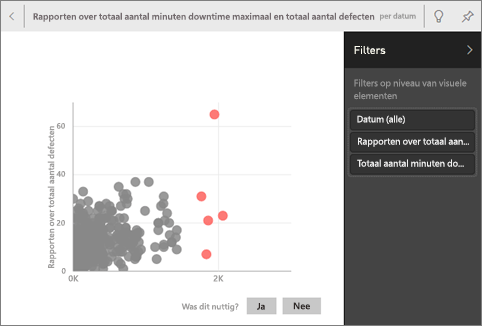

# Automatisch inzichten genereren voor een gegevensset met Power BI
Hebt u een nieuwe gegevensset en weet u niet waar u moet beginnen?  Moet u snel een dashboard bouwen?  Wilt u snel inzichten zoeken die u hebt gemist?

Voer snelle inzichten uit om interessante visualisaties op basis van uw gegevens te genereren. In dit artikel wordt uitgelegd hoe u snelle inzichten kunt uitvoeren op een volledige gegevensset (snelle inzichten). U kunt ook [snelle inzichten uitvoeren op een specifieke dashboardtegel](../consumer/end-user-insights.md) (inzichten voor een bepaald bereik). U kunt inzichten zelfs uitvoeren op een inzicht.

> [!NOTE]
> Inzichten werken niet met DirectQuery, maar alleen met gegevens die zijn geüpload naar Power BI.
> 

We hebben de Insights-functie gebaseerd op een groeiende [set geavanceerde analytische algoritmes](../consumer/end-user-insight-types.md) die we hebben ontwikkeld met Microsoft Research. We blijven deze algoritmes gebruiken om ervoor te zorgen dat meer mensen inzicht krijgen in hun gegevens, op nieuwe en intuïtieve manieren. U wilt misschien ook weten hoe u [uw gegevens optimaliseert voor snelle inzichten](service-insights-optimize.md).

## Snelle inzichten uitvoeren op een gegevensset
Kijk hoe Amanda snelle inzichten uitvoert op een gegevensset en een inzicht opent in de focusmodus. Amanda maakt een inzicht als een tegel vast aan het dashboard en haalt vervolgens inzichten op voor een dashboardtegel.

<iframe width="560" height="315" src="https://www.youtube.com/embed/et_MLSL2sA8" frameborder="0" allowfullscreen></iframe>

Nu is het uw beurt. Verken inzichten door gebruik te maken van het [voorbeeld Kwaliteitsanalyse van leveranciers](sample-supplier-quality.md).

1. Selecteer **Meer opties** (...) op het tabblad **Gegevenssets** en kies vervolgens **Snelle inzichten verkrijgen**.
   
    
   
    
2. Er worden [verschillende algoritmen](../consumer/end-user-insight-types.md) in Power BI gebruikt om trends in uw gegevensset te zoeken.
   
    
3. Uw inzichten zijn binnen enkele seconden klaar.  Selecteer **Inzichten weergeven** om visualisaties weer te geven.
   
    
   
    > [!NOTE]
    > Met sommige gegevenssets kunt u geen inzichten genereren, omdat de gegevens statistisch gezien niet significant zijn.  Zie [Uw gegevens optimaliseren voor inzichten](service-insights-optimize.md) voor meer informatie.
    > 
    
4. De visualisaties worden weergeven op een speciaal canvas voor **Snelle inzichten** met maximaal 32 afzonderlijke kaarten met inzichten. Elke kaart bevat een grafiek of diagram plus een korte beschrijving.
   
    

## Interactie met de kaarten met inzichten

1. Beweeg de muisaanwijzer over de kaart en selecteer het speldpictogram om de visualisatie toe te voegen aan een dashboard.

2. Beweeg de muisaanwijzer over een kaart, selecteer **Meer opties** (...) en kies vervolgens **Inzichten weergeven**. 

    Het scherm met inzichten wordt geopend in de focusmodus.
   
    
3. In de focusmodus kunt u het volgende:
   
   * De visualisaties filteren. Als het deelvenster **Filters** nog niet is geopend, vouwt u het uit door de pijl aan de rechterkant van het venster te selecteren.

       
   * Maak de inzichtenkaart vast op een dashboard door **Visual vastmaken** te selecteren.
   * Voer inzichten uit op de kaart zelf. Dit wordt vaak aangeduid als *scoped inzichten*. Selecteer in de rechterbovenhoek het gloeilamppictogram  of selecteer **Inzichten verkrijgen**.
     
       
     
     Het inzicht wordt aan de linkerkant weergegeven. Nieuwe kaarten, die uitsluitend zijn gebaseerd op de gegevens in dat ene inzicht, worden aan de rechterkant weergegeven.
     
       
4. Selecteer in de linkerbovenhoek **Focusmodus sluiten** om terug te keren naar het oorspronkelijk canvas inzichten.

## Volgende stappen
- Als u de eigenaar van een gegevensset bent, kunt u deze [optimaliseren voor Snelle inzichten](service-insights-optimize.md).
- Meer informatie over de [typen Snelle inzichten die beschikbaar zijn](../consumer/end-user-insight-types.md).

Hebt u nog vragen? [Misschien dat de Power BI-community het antwoord weet](https://community.powerbi.com/).
