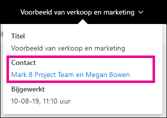
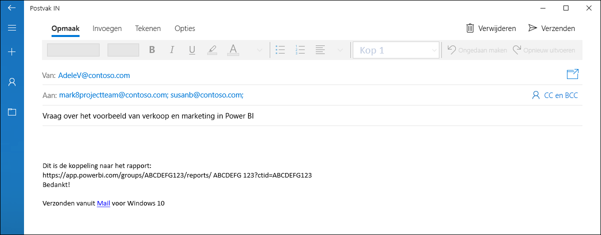
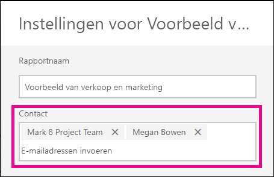
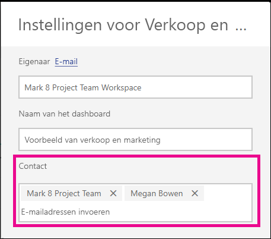

# Contactgegevens instellen voor rapporten en dashboards in de Power BI-service
In dit artikel leest u hoe u in de Power BI-service contactgegevens kunt instellen voor een dashboard of rapport.

> [!NOTE]
> Contactgegevens kunnen worden ingesteld voor items in een klassieke of nieuwe werkruimte. U kunt geen contactgegevens instellen voor items in Mijn werkruimte. De infokaart wordt weergegeven wanneer u een rapport of dashboard bekijkt in het [nieuwe uiterlijk](../consumer/service-new-look.md).

U kunt meerdere gebruikers of groepen toevoegen aan de contactpersoon voor een item. Dit kan het volgende zijn:
* Een persoon
* Een Microsoft 365-groep
* Een beveiligingsgroep waarvoor e-mail is ingeschakeld
* Een distributielijst

De persoon die een nieuw rapport of dashboard maakt, is standaard de contactpersoon voor het rapport of dashboard. Als u een waarde instelt, wordt de standaardinstelling overschreven. U kunt uiteraard alle mensen of groepen uit de lijst met contactpersonen verwijderen. Wanneer u dit doet, wordt voor klassieke werkruimten de Microsoft 365-groep voor de werkruimte weergegeven. Voor werkruimten in de nieuwe werkruimte-ervaring wordt de [lijst met contactpersonen van werkruimte](../collaborate-share/service-create-the-new-workspaces.md#workspace-contact-list) gebruikt. Als de lijst met contactpersonen van de werkruimte niet is ingesteld, worden de werkruimtebeheerders weergegeven.

De contactgegevens worden weergegeven voor personen die het item bekijken. 

 

Wanneer u op de lijst met contactpersonen klikt, wordt er een e-mailbericht gemaakt zodat u vragen kunt stellen of hulp kunt krijgen. 

 
 
De gegevens van de lijst met contactpersonen worden ook op andere locaties gebruikt. Deze worden bijvoorbeeld weergegeven in een aantal foutscenario's in het dialoogvenster met de foutmelding. Automatische e-mailberichten met betrekking tot het item, zoals toegangsaanvragen, worden verzonden naar de lijst met contactpersonen. 

> [!NOTE]
> Wanneer u een app publiceert, worden de contactgegevens die voor afzonderlijke items zijn ingesteld, ingesteld op de persoon die de app heeft gepubliceerd of bijgewerkt. U kunt de URL van de app-ondersteuning instellen, zodat gebruikers van de app de hulp krijgen die ze nodig hebben.

## Contactgegevens voor een rapport instellen
1. Selecteer in uw werkruimte het tabblad **Rapporten**.
2. Zoek het gewenste rapport en selecteer het pictogram **Instellingen**.
3. Zoek het invoerveld **Contactpersoon** op en stel een waarde in.

     

## Contactgegevens instellen voor een dashboard
1. Selecteer in uw werkruimte het tabblad **Dashboards**.
2. Zoek het gewenste dashboard en selecteer het pictogram **Instellingen**.
3. Zoek het invoerveld **Contactpersoon** op en stel een waarde in.

     

## Beperkingen en overwegingen
* De contactpersoon wordt automatisch ingesteld voor nieuwe items die zijn gemaakt in de Power BI-service. Voor bestaande items wordt de standaardinstelling van de werkruimte weergegeven.
* U kunt elke gebruiker of groep in de lijst met contactpersonen instellen, maar deze krijgen niet automatisch een machtiging voor het item toegewezen. Maak gebruik van delen of geef een gebruiker die toegang tot de werkruimte nodig heeft deze via een rol. 
* De lijst met contactpersonen op itemniveau wordt niet naar apps gepusht wanneer deze worden gepubliceerd. De nieuwe versie voor app-navigatie biedt een ondersteunings-URL die u configureert om te helpen feedback te beheren van een groot aantal app-gebruikers.

## Volgende stappen

Hebt u nog vragen? [Misschien dat de Power BI-community het antwoord weet](https://community.powerbi.com/)
