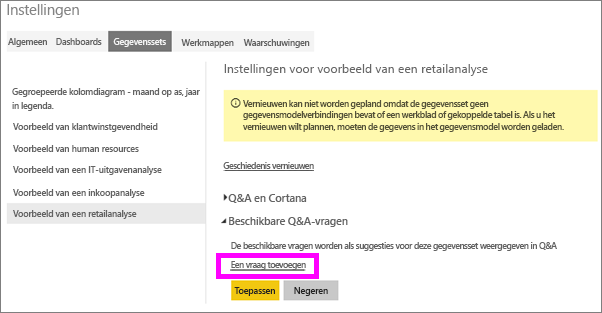
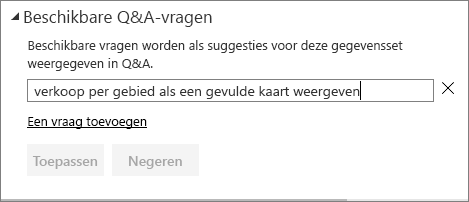
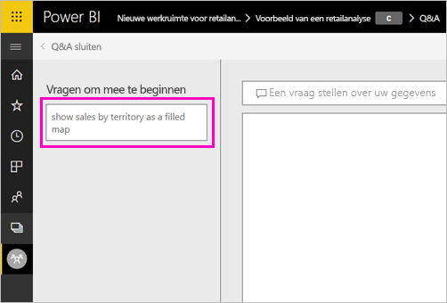
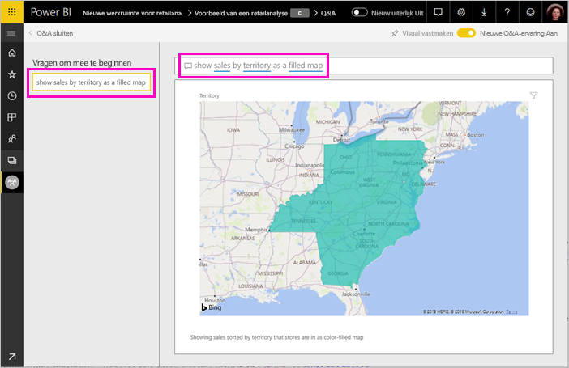

# Aanbevolen vragen voor Q&A-functie van Power BI maken
Als u beschikt over een gegevensset, kunt u uw eigen aanbevolen vragen toevoegen aan deze dataset. Power BI Q&A toont deze vragen aan collega's die rapporten gebruiken op basis van die gegevensset.  Aanbevolen vragen geven uw collega's ideeën over de typen vragen die ze kunnen stellen over de gegevensset. U bepaalt zelf welke aanbevolen vragen u toevoegt: u kunt populaire vragen, vragen die interessante resultaten weergeven of vragen die mogelijk moeilijk zijn te formuleren toevoegen.

> [!NOTE]
> Vragen in Q&A zijn beschikbaar voor gebruik in de [Microsoft Power BI-app voor iOS op iPads, iPhones en iPod Touch-apparaten](../consumer/mobile/mobile-apps-ios-qna.md) en in de Q&A van Power BI Desktop. Er kunnen echter alleen vragen worden gemaakt in de Power BI-service (app.powerbi.com).
> 

## Een aanbevolen vraag maken

In dit artikel wordt het [voorbeeld van een retailanalyse](sample-datasets.md) gebruikt. Volg de stapsgewijze instructies om zelf een gegevensset te verkennen.

1. Selecteer het vakje Q&A op het dashboard.   U ziet dat Q&A al een handige lijst weergeeft met termen die voorkomen in de gegevensset.
2. Als u items wilt toevoegen aan deze lijst, selecteert u het tandwielpictogram in de rechterbovenhoek van Power BI.  
   
3. Selecteer **Instellingen** &gt; **Gegevenssets** &gt; **Voorbeeld van een retailanalyse** &gt; **Aanbevolen Q&A-vragen** .  
4. Selecteer **Een vraag toevoegen**.
   
   
5. Typ uw vraag in het tekstvak in en selecteer **Toepassen**.   Selecteer desgewenst **Een vraag toevoegen** om nog een vraag toe te voegen.  
   
6. Ga terug naar het Power BI-dashboard voor het voorbeeld van een retailanalyse en plaats de cursor in het Q&A-vraagvak.   
   
7. De nieuwe aanbevolen vraag, **Verkoop per regio als een kaart**, wordt als eerste in de lijst weergegeven. Selecteer deze vraag.  
8. Power BI maakt het antwoord en geeft dit weer als een visualisatie van een Choropletenkaart.  
   

## Volgende stappen

- [Q&A voor gebruikers](../consumer/end-user-q-and-a.md)  
- [Q&A in dashboards en rapporten gebruiken](power-bi-tutorial-q-and-a.md)  
- [Basisconcepten voor ontwerpers in de Power BI-service](../fundamentals/service-basic-concepts.md)  

Hebt u nog vragen? [Misschien dat de Power BI-community het antwoord weet](https://community.powerbi.com/)
