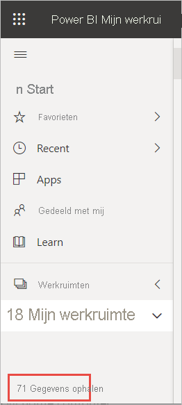
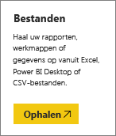
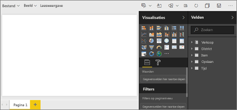
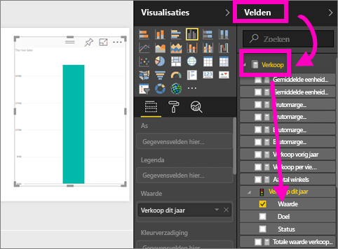
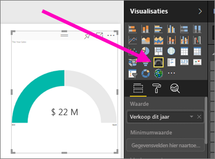
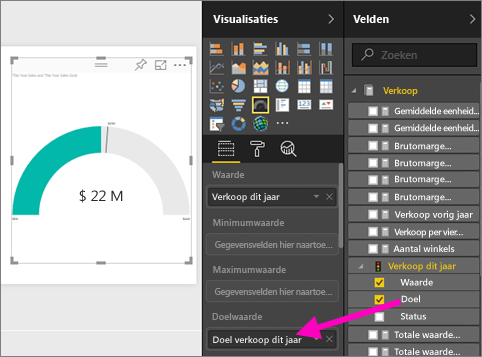
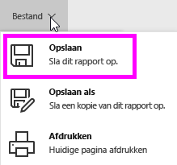
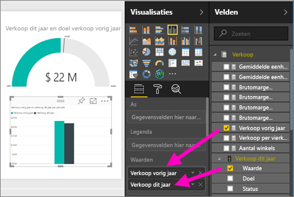
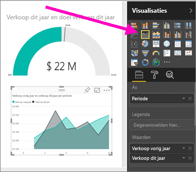
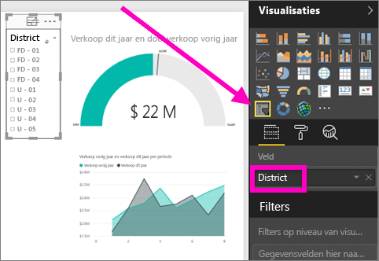

# Een rapport maken op basis van een Excel-bestand in de Power BI-service
U hebt [Rapporten in Power BI](../consumer/end-user-reports.md) gelezen en u wilt nu uw eigen rapport maken. Er zijn verschillende manieren om een rapport te maken. In dit artikel gaan we eerst in de Power BI-service een basisrapport maken op basis van een Excel-bestand. Als u de basisbeginselen van het maken van een rapport onder de knie hebt, kunt u met [Volgende stappen](#next-steps) aan het einde naar meer geavanceerde onderwerpen over rapporten gaan.  

## Vereisten
- [Meld u aan voor de Power BI-service](../fundamentals/service-self-service-signup-for-power-bi.md). 
- [Download het Excel-bestand Voorbeeld van een retailanalyse](https://go.microsoft.com/fwlink/?LinkId=529778) en sla het bestand op de computer op of in OneDrive voor Bedrijven.

## Het Excel-bestand importeren
Bij deze methode om een rapport te maken begint u met een bestand en een leeg rapportcanvas. U kunt meedoen aan de hand van het Excel-bestand Voorbeeld van een retailanalyse.

1. Selecteer **Mijn werkruimte** in het navigatievenster.
   
   :::image type="content" source="media/service-report-create-new/power-bi-select-my-workspace.png" alt-text="Schermopname van het selecteren van Mijn werkruimte.":::
2. Selecteer **Gegevens ophalen** onderaan het navigatievenster.
   
   
3. Selecteer **Bestanden** en navigeer naar de locatie waar u het voorbeeld van een retailanalyse hebt opgeslagen.
   
    
4. Selecteer voor deze oefening **Importeren**.
   
   
5. Selecteer **Openen**.

   Zodra het Excel-bestand is geïmporteerd, wordt het als een *gegevensset* vermeld in de lijst met werkruimten.

1. Selecteer **Meer opties (...)** naast de gegevensset en selecteer **Rapport maken**.
   
   :::image type="content" source="media/service-report-create-new/power-bi-dataset-create-report.png" alt-text="Schermopname van het selecteren van Rapport maken.":::
6. De rapporteditor wordt geopend. 
   
   

> [!TIP]
> Selecteer het menupictogram om het navigatiedeelvenster te verbergen, zodat u meer ruimte krijgt.
> 
> :::image type="content" source="../media/power-bi-hide-navigation-pane.png" alt-text="Schermopname van Selecteer het menupictogram om het navigatiedeelvenster te verbergen.":::

## Een radiale meter toevoegen aan het rapport
Nu onze gegevensset is geïmporteerd, kunnen we vragen beantwoorden.  Onze Chief Marketing Officer (CMO) wil weten hoe dicht we de verkoopdoelstellingen voor dit jaar zijn genaderd. Een meter is een [goede visualisatiekeuze](../visuals/power-bi-report-visualizations.md) om dit soort informatie weer te geven.

1. Selecteer **Verkoop** > **Omzet van dit jaar** > **Waarde** in het deelvenster Velden.
   
    
2. Converteer de visual naar een meter door de metersjabloon te selecteren  in het deelvenster **Visualisaties**.
   
    
3. Sleep **Verkoop** > **Omzet van dit jaar** > **Doel** naar de bron **Doelwaarde**. Het lijkt erop dat we heel dicht bij ons doel zijn.
   
    
4. Dit is een goed moment om uw rapport op te slaan.
   
   

## Een vlakdiagram en slicer toevoegen aan het rapport
Onze CMO heeft nog een paar vragen voor ons. Ze willen graag weten hoe de omzet dit jaar zich verhoudt tot de omzet van vorig jaar. En ze willen graag de resultaten per district zien.

1. Laten we eerst wat ruimte maken op ons canvas. Selecteer de meter en verplaats deze naar de rechterbovenhoek. Pak en sleep een van de hoeken om het vlak kleiner te maken.
2. Hef de selectie van de meter op. Selecteer **Verkoop** > **Omzet van dit jaar** > **Waarde** in het deelvenster Velden en selecteer **Verkoop** > **Omzet van vorig jaar**.
   
    
3. Converteer de visual naar een vlakdiagram door de vlakdiagramsjabloon  te selecteren in het deelvenster **Visualisaties**.
4. Selecteer **Tijd** > **Periode** om deze toe te voegen aan de bron **As**.
   
    
5. Als u de visualisatie wilt sorteren op tijdsperiode, selecteert u de weglatingstekens en kiest u **Sorteren op periode**.
6. Nu gaan we de slicer toevoegen. Selecteer een leeg gebied in het canvas en kies de sjabloon  Slicer. We hebben nu een lege slicer op ons canvas.
   
        
7. Selecteer **District** > **District** in het deelvenster Velden. Verplaats de slicer en verander het formaat ervan.
   
      
8. Ga met de slicer zoeken naar patronen en inzichten per district.
   
     

Blijf uw gegevens verkennen en visualisaties toevoegen. Wanneer u interessante inzichten tegenkomt, kunt u deze [vastmaken aan een dashboard](service-dashboard-pin-tile-from-report.md).

## Volgende stappen

* [Visualisaties aan een dashboard vastmaken](service-dashboard-pin-tile-from-report.md)
* [Rapportinstellingen in de Power BI-service wijzigen](power-bi-report-settings.md)
* Hebt u nog vragen? [Misschien dat de Power BI-community het antwoord weet](https://community.powerbi.com/)
