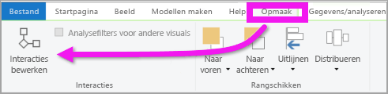
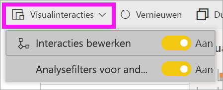
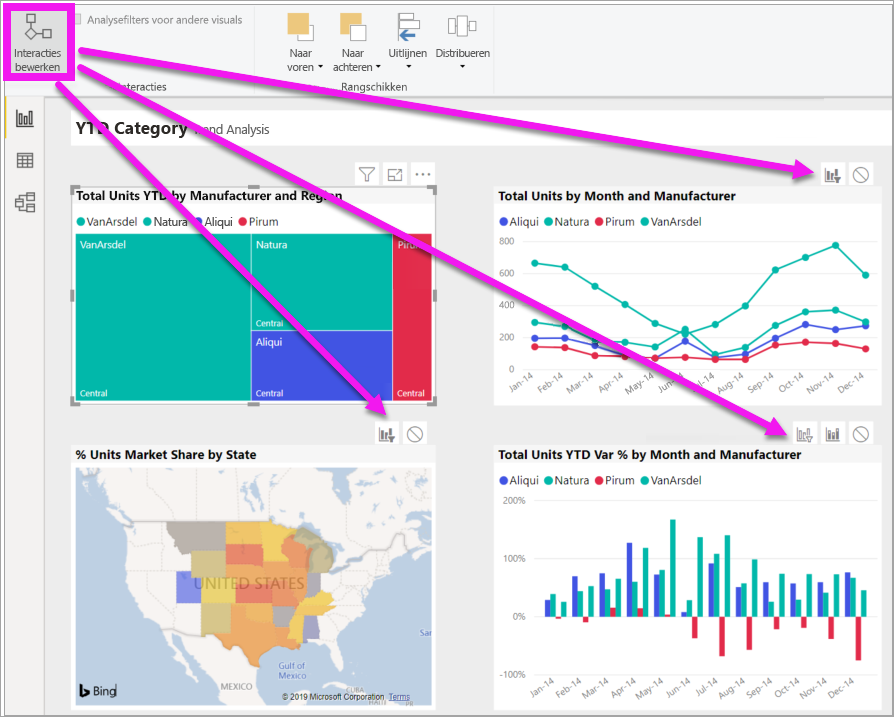
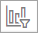
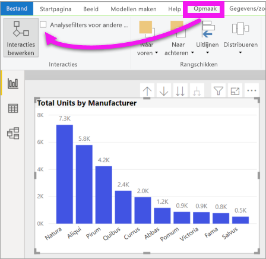
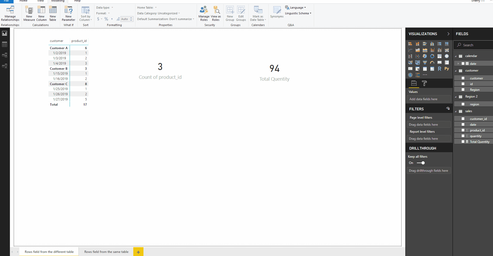

# De interactie tussen visuals in een Power BI-rapport wijzigen
Als u machtigingen hebt om een rapport te bewerken, kunt u **Visuele interacties** gebruiken om te wijzigen hoe visualisaties op een rapportpagina invloed op elkaar hebben. 

## Inleiding tot visuele interacties
Visualisaties op een rapportpagina kunnen standaard worden gebruikt voor het kruislings filteren en markeren van de andere visualisaties op de pagina.
Als u bijvoorbeeld een staat op een kaartvisualisatie selecteert, wordt de kolomdiagram gemarkeerd en wordt het lijndiagram zo gefilterd dat alleen de gegevens worden weergegeven die van toepassing zijn voor die staat.
Zie [Over filteren en markeren](power-bi-reports-filters-and-highlighting.md). En als u een visualisatie hebt die ondersteuning biedt voor [analyseren](../consumer/end-user-drill.md), heeft het analyseren van één visualisatie standaard geen invloed op de andere visualisaties op de rapportpagina. Maar deze standaardgedragsuitingen kunnen beide worden genegeerd en er kunnen interacties worden ingesteld per visualisatie.

In dit artikel ziet u hoe u **visuele interacties** gebruikt in Power BI Desktop. Het proces is hetzelfde in de [bewerkingsweergave](service-interact-with-a-report-in-editing-view.md) van Power BI-service. Als u alleen toegang hebt tot de leesweergave, of als het rapport met u is gedeeld, kunt u de instellingen voor visuele interacties niet wijzigen.

De termen *kruislings filteren* en *kruislings markeren* worden gebruikt om het hier beschreven gedrag te onderscheiden van wat er gebeurt wanneer u het venster **Filters** gebruikt om visualisaties te *filteren* en *markeren*.  

> [!NOTE]
> In deze video wordt gebruikgemaakt van oudere versies van Power BI Desktop en de Power BI-service. 
>
>

<iframe width="560" height="315" src="https://www.youtube.com/embed/N_xYsCbyHPw?list=PL1N57mwBHtN0JFoKSR0n-tBkUJHeMP2cP" frameborder="0" allowfullscreen></iframe>

## De besturingselementen voor visuele interactie inschakelen
Als u beschikt over bewerkingsmachtigingen voor een rapport, kunt u de besturingselementen voor visuele interactie inschakelen en vervolgens aanpassen hoe de visualisaties op uw rapportpagina elkaar filteren en markeren. 

1. Selecteer een visualisatie om deze actief te maken.  
2. Toon de opties voor **Visuele interacties**.
    

    - Selecteer in Desktop **Indeling > Interacties**.

        

    - Open in de Power BI-service het rapport in de bewerkingsweergave en selecteer de vervolgkeuzelijst op de rapportmenubalk.

        

3. Als u de besturingselementen voor visualisatie-interactie wilt weergeven, selecteert u **Interacties bewerken**. In Power BI worden pictogrammen voor filteren en markeren toegevoegd aan alle andere visualisaties op de rapportpagina. We kunnen zien dat het lijndiagram en de kaart kruislings worden gefilterd door de structuurkaart. Het kolomdiagram wordt kruislings gemarkeerd door de structuurkaart. U kunt nu wijzigen hoe de interactie van de geselecteerde visualisatie met de andere visualisaties op de rapportpagina verloopt.
   
    

## Het interactiegedrag wijzigen
Maak uzelf vertrouwd met hoe de interactie van visualisaties verloopt door elke visualisatie op de rapportpagina te selecteren, één tegelijk.  Selecteer een gegevenspunt of een balk of vorm, en bekijk het effect op de andere visualisaties. Als u niet het gewenste gedrag ziet, kunt u de interacties wijzigen. Deze wijzigingen worden samen met het rapport opgeslagen, zodat u en de gebruikers van uw rapport werken met dezelfde visuele interacties.

Begin door een visualisatie te selecteren om deze actief te maken.  U ziet dat bij alle andere visualisaties op de pagina nu interactiepictogrammen worden weergegeven. Het vetgedrukte pictogram geeft de actie aan die wordt toegepast. Bepaal vervolgens welke impact de **geselecteerde visualisatie** moet hebben op de andere.  Herhaal dit eventueel voor alle andere visualisaties op de rapportpagina.

Als de geselecteerde visualisatie:
   
   * een van de andere visualisaties op de pagina kruislings moet filteren, selecteert u het pictogram **Filteren** in de rechterbovenhoek van die visualisatie .
   * een van de andere visualisaties op de pagina kruislings moet markeren, selecteert u het pictogram **Markeren** .
   * geen invloed moet hebben op een van de andere visualisaties op de pagina, selecteert u het pictogram **geen impact** .

## De interacties wijzigen van visualisaties waarop kan worden ingezoomd
[Op bepaalde Power BI-visualisaties kan worden ingezoomd](../consumer/end-user-drill.md). Wanneer u inzoomt op een visualisatie, heeft dit standaard geen invloed op de andere visualisaties op de rapportpagina. Dit gedrag kan echter worden gewijzigd. 

> [!TIP]
> Probeer het zelf met behulp van het [Human Resources PBIX-voorbeeldbestand](https://download.microsoft.com/download/6/9/5/69503155-05A5-483E-829A-F7B5F3DD5D27/Human%20Resources%20Sample%20PBIX.pbix). Het tabblad **Nieuwe medewerkers** bevat een kolomdiagram waarop is ingezoomd.
>

1. Selecteer de visual waarop kan worden ingezoomd, om deze te activeren. 

2. Schakel inzoomen in door het pictogram Inzoomen te selecteren.

    

2. Selecteer in de menubalk de opties **Indeling** > **Analysefilters voor andere visuals**.  Wanneer u nu omlaag (of omhoog) gaat in een visualisatie, worden de andere visualisaties op de rapportpagina gewijzigd om uw huidige analyseselectie weer te geven. 

    

3. Als u niet het gewenste gedrag ziet, kunt u de interacties wijzigen [zoals hierboven wordt beschreven](#change-the-interaction-behavior).

## Aandachtspunten en probleemoplossing
Als u een matrix met velden uit verschillende tabellen maakt en vervolgens kruislings probeert te markeren door meerdere items op verschillende hiërarchieniveaus te selecteren, krijgt u fouten in de andere visuals. 

    
## Volgende stappen
[Filteren en markeren in Power BI-rapporten](power-bi-reports-filters-and-highlighting.md)