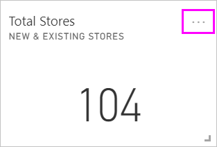
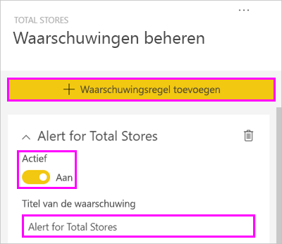
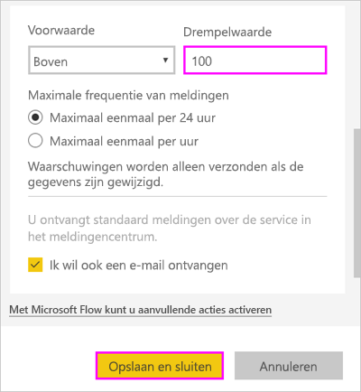
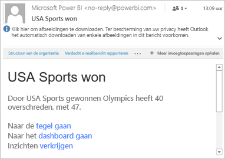
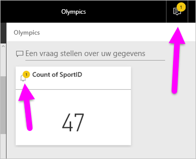
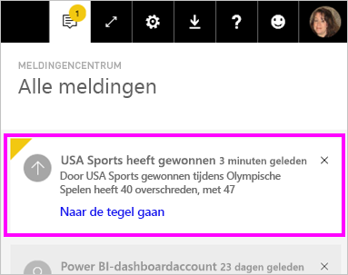
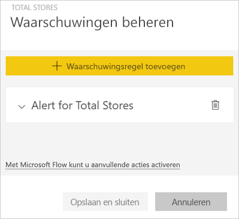
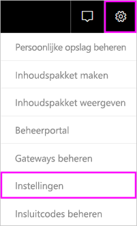
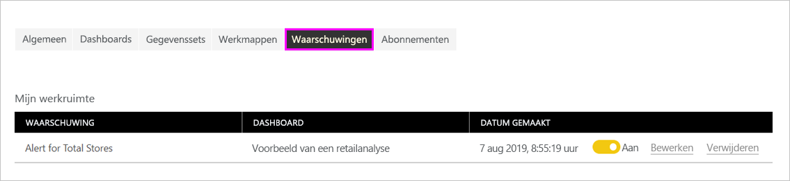

# Gegevenswaarschuwingen in de Power BI-service

Stel meldingen in om u te waarschuwen als wijzigingen aan de gegevens in uw dashboards de limieten overschrijden die u hebt ingesteld.

U kunt waarschuwingen instellen voor tegels in uw Mijn werkruimte. U kunt ook waarschuwingen instellen als iemand een dashboard deelt dat zich in een [Premium-capaciteit](../admin/service-premium-what-is.md) bevindt. Als u een Power BI Pro-licentie hebt, kunt u ook waarschuwingen instellen voor tegels in een andere werkruimte. Waarschuwingen kunnen alleen worden ingesteld voor tegels die zijn vastgemaakt vanuit rapportvisuals, en alleen voor meters, KPI's en kaarten. Waarschuwingen kunnen worden ingesteld voor visuals die zijn gemaakt op basis van streaminggegevenssets die u van een rapport vastmaakt aan een dashboard. Er kunnen geen waarschuwingen worden ingesteld voor streamingtegels die rechtstreeks op het dashboard zijn gemaakt met **Tegel toevoegen** > **Aangepaste streaminggegevens**.

U bent zelf de enige die de door u ingestelde meldingen kunt zien, ook als u uw dashboard deelt. Zelfs voor de dashboardeigenaar worden de waarschuwingen die u hebt ingesteld in uw weergave van het dashboard niet weergegeven. Gegevensmeldingen worden volledig met alle platforms gesynchroniseerd. Stel gegevensmeldingen in en bekijk ze [in de mobiele Power BI-apps](../consumer/mobile/mobile-set-data-alerts-in-the-mobile-apps.md) (Engelstalig) en in de Power BI-service. Deze zijn niet beschikbaar voor Power BI Desktop. U kunt waarschuwingen ook automatiseren en integreren met Power Automate. U kunt dit zelf proberen in dit artikel over [Power Automate en Power BI](../collaborate-share/service-flow-integration.md).

> [!WARNING]
> Gegevensgestuurde meldingen bieden informatie over uw gegevens. Als u uw Power BI-gegevens op een mobiel apparaat weergeeft en dat apparaat zoekraakt of gestolen wordt, is het aan te raden de Power BI-service te gebruiken om alle gegevensgestuurde waarschuwingsregels uit te schakelen.

## Gegevensmeldingen instellen in de Power BI-service

Kijk hoe Amanda enkele meldingen toevoegt aan tegels op het dashboard. Gebruik vervolgens de stapsgewijze instructies onder de video om het zelf te proberen.

<iframe width="560" height="315" src="https://www.youtube.com/embed/JbL2-HJ8clE" frameborder="0" allowfullscreen></iframe>

In dit voorbeeld wordt een kaarttegel gebruikt van het voorbeelddashboard voor retailanalyse. [Haal het Voorbeeld van een retailanalyse op](sample-retail-analysis.md#get-the-content-pack-for-this-sample) als u mee wilt doen.

1. Begin op een dashboard. Selecteer op de tegel **Totaal aantal winkels** het beletselteken.

   

1. Selecteer het belpictogram  om een of meer waarschuwingen toe te voegen aan **Totaal aantal winkels**.

1. Selecteer eerst **+ Waarschuwingsregel toevoegen**. Controleer vervolgens of de schuifregelaar **Actief** is ingesteld op **Aan** en geef uw waarschuwing een titel. Titels helpen u de meldingen makkelijk te herkennen.

   

1. Schuif omlaag en voer de details van de melding in.  In dit voorbeeld maakt u een waarschuwing die u eenmaal per dag informeert als het totale aantal winkels de honderd overschrijdt.

   

    Waarschuwingen worden weergegeven in het **Meldingencentrum**. U ontvangt ook een e-mail van Power BI over de waarschuwing als u het selectievakje inschakelt.

1. Selecteer **Opslaan en sluiten**.

## Meldingen ontvangen

Als de bijgehouden gegevens een van de ingestelde drempelwaarden bereiken, vinden er diverse dingen plaats. Eerst controleert Power BI of het langer dan een uur of langer dan 24 uur (afhankelijk van de optie die u hebt geselecteerd) geleden is sinds de vorige waarschuwing. U ontvangt een waarschuwing als de gegevens de drempelwaarde overschrijden.

Vervolgens wordt vanuit Power BI een waarschuwing verzonden naar het **Meldingencentrum** en ontvangt u optioneel een e-mail. Elke melding bevat een rechtstreekse koppeling naar uw gegevens. Selecteer de koppeling om de betreffende tegel te zien, vanaf waar u kunt gaan verkennen, delen en meer informatie kunt krijgen.  

* Als de melding zo is ingesteld dat u een e-mail ontvangt, vindt u iets soortgelijks als hieronder in uw Postvak IN.

   

* Er wordt een bericht aan het **meldingencentrum** toegevoegd en een nieuw meldingenpictogram aan de desbetreffende tegel.

   

* De waarschuwingsdetails worden weergegeven in het **Meldingencentrum**.

    

   > [!NOTE]
   > Waarschuwingen werken alleen voor vernieuwde gegevens. Als gegevens worden vernieuwd, controleert Power BI of er een melding voor die gegevens is ingesteld. Als de gegevens een drempelwaarde voor de waarschuwing hebben bereikt, wordt er in Power BI een waarschuwing geactiveerd.

## Meldingen beheren

U kunt meldingen op diverse manieren beheren:

* Vanuit de dashboardtegel.

* Vanuit het menu Instellingen in Power BI.

* Vanuit een tegel in de [mobiele Power BI-apps](../consumer/mobile/mobile-set-data-alerts-in-the-mobile-apps.md).

### Vanuit de dashboardtegel

1. Als u een waarschuwing voor een tegel wilt wijzigen of verwijderen, opent u opnieuw het venster **Waarschuwingen beheren** door het belpictogram  te selecteren.

    Alle waarschuwingen die u voor die tegel hebt ingesteld, worden weergegeven in Power BI.

    

1. Als u een tegel wilt wijzigen, selecteert u de pijl links van de naam van de melding.

    

1. Als u een tegel wilt verwijderen, selecteert u de prullenbak rechts van de naam van de melding.

      

### Vanuit het menu Instellingen in Power BI

1. Selecteer het tandwielpictogram in de Power BI-menubalk en selecteer **Instellingen**.

    .

1. Selecteer onder **Instellingen** de optie **Meldingen**.

    

1. Hier kunt u meldingen in- en uitschakelen, het venster **Meldingen beheren** openen om wijzigingen aan te brengen of de melding verwijderen.

## Aandachtspunten en probleemoplossing

* Waarschuwingen worden niet ondersteund voor kaarttegels met datum-/tijdmetingen.
* Meldingen werken alleen met numerieke gegevenstypen.
* Waarschuwingen werken alleen voor vernieuwde gegevens. Ze werken niet met statische gegevens.
* Waarschuwingen werken alleen voor streaminggegevenssets als u een KPI-, kaart- of metervisual maakt en u deze visual vervolgens aan het dashboard vastmaakt.

## Volgende stappen

* [Een Power Automate-item maken dat een gegevenswaarschuwing bevat](../collaborate-share/service-flow-integration.md).

* [Gegevenswaarschuwingen instellen op uw mobiele apparaat](../consumer/mobile/mobile-set-data-alerts-in-the-mobile-apps.md).

* [Wat is Power BI?](../fundamentals/power-bi-overview.md)

Nog vragen? [Misschien dat de community van Power BI het antwoord weet](https://community.powerbi.com/).
