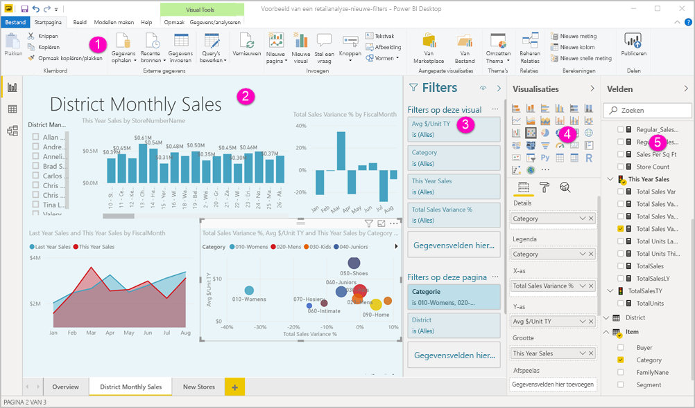
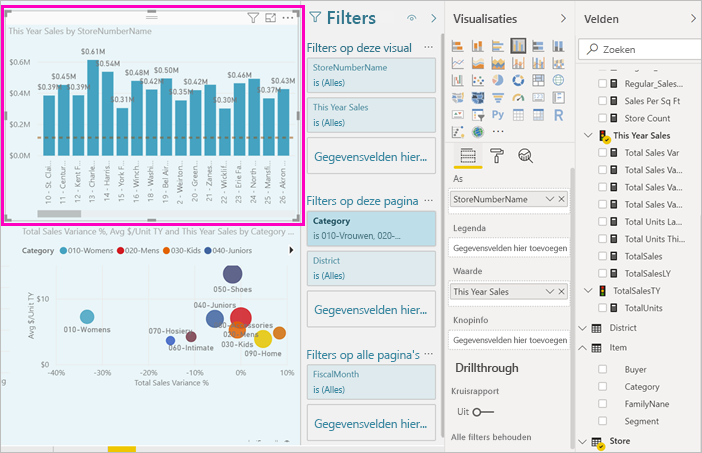
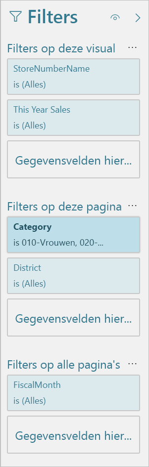
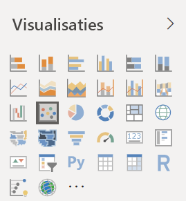
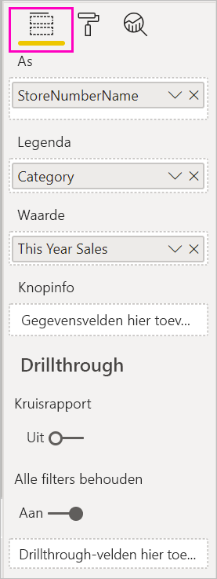
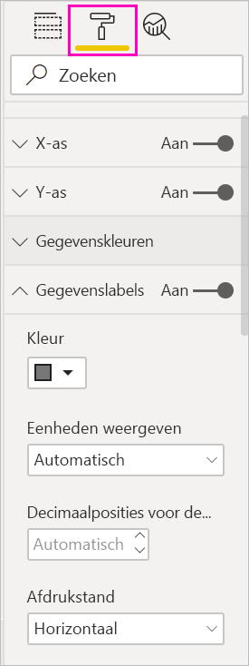
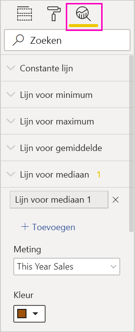
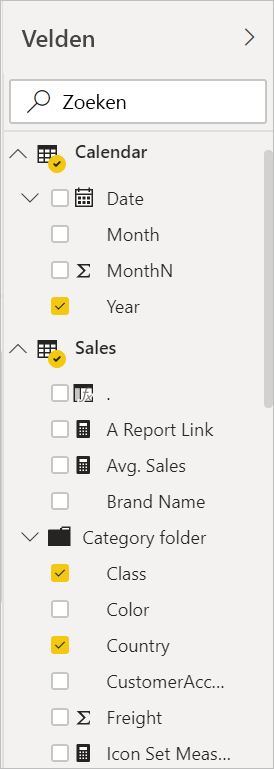

# Rondleiding door de rapporteditor in Power BI

In Power BI Desktop en in de Power BI-service is de *rapporteditor* de locatie waar u de rapporten ontwerpt die uw consumenten te zien krijgen, met grafieken, tabellen, kaarten en andere visuals. De rapporteditor is in beide omgevingen vergelijkbaar. Het is gebruikelijk in Power BI Desktop te beginnen als u een rapport maakt. Vervolgens publiceert u het in de Power BI-service, waar u het verder kunt aanpassen. De Power BI-service is ook de plek waar u de dashboards op basis van uw rapporten maakt.

Nadat u uw dashboards en rapporten hebt gemaakt, deelt u ze met de gebruikers van uw rapporten. Afhankelijk van de manier waarop u de rapporten deelt, kunnen uw eindgebruikers deze raadplegen (maar niet bewerken) in de leesweergave van de Power BI-service. Lees meer over [wat gebruikers van rapporten kunnen doen in de Power BI-service](../consumer/end-user-reading-view.md). 

Deze video toont de rapporteditor in Power BI Desktop. In dit artikel wordt ook de rapporteditor in Power BI Desktop getoond. 

<iframe width="560" height="315" src="https://www.youtube.com/embed/IkJda4O7oGs" frameborder="0" allowfullscreen></iframe>

In de Power BI-service is de rapporteditor alleen beschikbaar in de bewerkingsweergave. Als u een rapport in de Bewerkweergave wilt openen, moet u de eigenaar of maker van een rapport zijn of een inzender zijn van de werkruimte waarin het rapport zich bevindt.

De Power BI-rapporteditor is onderverdeeld in verschillende hoofdsecties:  

1. Het lint
1. Rapportcanvas
1. Deelvenster Filters
1. Deelvenster Visualisaties
1. Deelvenster Velden

## 1. Het lint
Er zijn talrijke acties beschikbaar in het lint en er worden ook voortdurend nieuwe acties aan toegevoegd. Gebruik de inhoudsopgave in de Power BI-documentatie of het vak Zoeken voor informatie over een bepaalde actie.

## 2. Het rapportcanvas
In het rapportcanvas wordt uw werk weergegeven. Wanneer u de deelvensters Velden, Filters en Visualisaties gebruikt om visuele elementen te maken, worden deze samengesteld en weergegeven op uw rapportcanvas. Elk tabblad aan de onderkant van het canvas vertegenwoordigt een pagina in het rapport. Selecteer een tabblad om die pagina te openen. 

## De deelvensters van de rapporteditor

Er zijn drie deelvensters zichtbaar wanneer u een rapport voor de eerste keer opent: Filters, Visualisaties en Velden. Links vindt u de eerste twee deelvensters, Filters en Visualisaties, waarin het uiterlijk van uw visualisaties (type, kleuren, filters en opmaak) wordt beheerd. Rechts vindt u het laatste deelvenster, Velden, waarin de onderliggende gegevens van de visualisaties worden beheerd. De inhoud die wordt weergegeven in de rapporteditor, hangt af van de selecties die u in het rapportcanvas maakt. 

Bijvoorbeeld wanneer u een afzonderlijke visual selecteert, zoals dit kolomdiagram:

In het deelvenster **Filters** worden filters voor de visual, de pagina of alle pagina's weergegeven. In dit geval zijn er filters op paginaniveau, maar geen filters op visualniveau.

**De bovenkant van het deelvenster Visualisatie** toont het type visual dat wordt gebruikt. In dit voorbeeld is dat een gegroepeerd kolomdiagram. 

**De onderkant van het deelvenster Visualisatie** bevat drie tabbladen:

In  **Velden** worden de velden in de visual weergegeven. Mogelijk moet u omlaag schuiven om alle details te zien. Dit diagram maakt gebruik van StoreNumberName en This Year Sales.

 **Opmaak** Selecteer het verfrollerpictogram om het opmaakvenster weer te geven voor de geselecteerde visualisatie.

 **Analyse** Selecteer het vergrootglaspictogram om het deelvenster Analyse weer te geven.

In **het deelvenster Velden** worden alle beschikbare tabellen in het gegevensmodel weergegeven. Wanneer u een tabel uitvouwt, ziet u de velden in die tabel. Aan de gele markering ziet u dat ten minste één veld uit deze tabel zich in een visualisatie bevindt.

Lees verder voor meer informatie over elk deelvenster.

## 3. Het deelvenster Filters
Via het deelvenster Filters kunt u permanente filters bekijken, instellen en aanpassen voor uw rapporten op niveau van pagina, rapport, drillthrough en visuele elementen. Ja, u kunt ad-hocfilters toepassen voor rapportpagina's en visuals door elementen van de visuals te selecteren of door hulpmiddelen als slicers te gebruiken. Als u filtert vanaf het deelvenster Filters heeft dat als voordeel dat de status van de filters bij het rapport wordt opgeslagen. 

Het deelvenster Filters heeft nog een andere krachtige functie: u kunt filteren op een veld *dat nog niet in gebruik is in een van de visuals in uw rapport*. Dit werkt als volgt. Wanneer u een visualisatie maakt, voegt Power BI automatisch alle velden in de visualisatie toe aan het gebied met filters op visualniveau van het deelvenster Filters. Als u een filter wilt instellen voor een visual, pagina, drillthrough of rapport met behulp van een veld dat momenteel niet in gebruik is in de visualisatie, sleept u het naar een van de filterbuckets.

De nieuwe filterervaring biedt meer flexibiliteit. U kunt filters bijvoorbeeld zo opmaken dat deze eruitzien als het rapport zelf. U kunt ook filters vergrendelen of verbergen voor de gebruikers van uw rapport. 

Lees meer over de [nieuwe filterervaring](power-bi-report-filter.md).

## 4. Het deelvenster Visualisaties

Het deelvenster Visualisaties bevat vier secties. We beginnen aan de bovenkant van het deelvenster.

Hier selecteert u een visualisatietype. In de kleine pictogrammen ziet u de verschillende typen visualisaties die u kunt maken. In de bovenstaande afbeelding is het bellendiagram geselecteerd. Als u een visualisatie samenstelt door velden te selecteren zonder eerst een type visualisatie te selecteren, kiest Power BI het type visualisatie voor u. U kunt de selectie van Power BI behouden, maar u kunt het type ook wijzigen door een ander pictogram te selecteren.

U kunt aangepaste visualisaties downloaden naar Power BI Desktop. De pictogrammen ervan worden ook in dit deelvenster weer gegeven. 

### De velden in een visualisatie beheren

Welke buckets (ook wel *bronnen* genoemd) in dit deelvenster worden weergegeven, is afhankelijk van het type visualisatie dat u hebt geselecteerd.  Als u bijvoorbeeld een staafdiagram hebt geselecteerd, ziet u As, Legenda en Waarden. Wanneer u een veld selecteert of dit naar het canvas sleept, voegt Power BI dat veld toe aan een van de buckets.  U kunt ook velden uit de lijst Velden rechtstreeks in de buckets slepen.  Sommige buckets zijn beperkt tot bepaalde typen gegevens.  **Waarden** accepteert bijvoorbeeld geen niet-numerieke velden. Dus als u een veld **Categorie** naar de bucket **Waarden** sleept, verandert Power BI dit in **Aantal categorieën**.

Zie [Visualisaties toevoegen aan een Power BI-rapport](../visuals/power-bi-report-add-visualizations-i.md) voor meer informatie.

Dit deel van het deelvenster bevat ook opties om het [drillthrough-](desktop-drillthrough.md) en filtergedrag te beheren.

### Uw visuele elementen opmaken
Selecteer het pictogram met de verfroller om het venster Opmaken weer te geven. Welke opties er beschikbaar zijn, is afhankelijk van het type visualisatie dat is geselecteerd.

De opmaakmogelijkheden zijn zeer uitgebreid.  Als u meer wilt weten of zelf op verkenning wilt uitgaan, leest u deze artikelen:

* [De titel, achtergrond en legenda van een visualisatie aanpassen](../visuals/power-bi-visualization-customize-title-background-and-legend.md)
* [Kleuropmaak](../visuals/service-getting-started-with-color-formatting-and-axis-properties.md)
* [De eigenschappen van de X-as en Y-as aanpassen](../visuals/power-bi-visualization-customize-x-axis-and-y-axis.md)

### Analytische gegevens toevoegen aan uw visualisaties
Selecteer het vergrootglaspictogram om het deelvenster Analyse weer te geven. Welke opties er beschikbaar zijn, is afhankelijk van het type visualisatie dat is geselecteerd.

Met het deelvenster Analyse in de Power BI-service kunt u dynamische referentielijnen aan visualisaties toevoegen en de aandacht vestigen op belangrijke trends en inzichten. Zie [Het deelvenster Analyse in Power BI Desktop](../transform-model/desktop-analytics-pane.md) voor meer informatie.

## 5. Het deelvenster Velden
In het deelvenster Velden worden de tabellen, mappen en velden in uw gegevens weergegeven die u kunt gebruiken om visualisaties te maken.

:::row:::
    :::column:::
        
    :::column-end:::
    :::column:::
        <ul><li>Sleep een veld naar de pagina om een nieuwe visualisatie te starten.  U kunt ook een veld naar een bestaande visualisatie slepen om het veld toe te voegen aan die visualisatie.  </li> <li>Wanneer u een selectievakje naast een veld inschakelt, voegt Power BI dat veld toe aan de actieve (of nieuwe) visualisatie. En het programma beslist ook in welke bucket dat veld moet worden geplaatst.  Moet het veld bijvoorbeeld worden gebruikt als een legenda, as of waarde? Power BI maakt een inschatting en u kunt het indien nodig verplaatsen van die bucket naar een andere.   </li><li>In beide gevallen wordt elk geselecteerde veld toegevoegd aan het deelvenster Visualisaties in de rapporteditor.</li></ul>
    :::column-end:::
:::row-end:::

In Power BI Desktop hebt u ook opties om velden weer te geven of te verbergen, berekeningen toe te voegen, enzovoort.

## De veldpictogrammen

In Power BI worden verschillende pictogrammen gebruikt om het type velden in een rapport aan te geven. Wanneer u deze kunt herkennen, begrijpt u de functies ervan in verschillende visuals beter. Zie de [sectie Pictogrammen in de veldenlijst van De veldenlijst gebruiken in Power BI Desktop](../transform-model/desktop-field-list.md#field-list-changes) voor een volledige lijst.

## Volgende stappen
[Een rapport maken](service-report-create-new.md)

Meer informatie over rapporten in de [Power BI-service](service-report-create-new.md), [Power BI Desktop](desktop-report-view.md) en [mobiele Power BI-apps](../consumer/mobile/mobile-apps-view-phone-report.md).

[Basisconcepten voor Power BI-ontwerpers](../fundamentals/service-basic-concepts.md)

Hebt u nog vragen? [Misschien dat de Power BI-community het antwoord weet](https://community.powerbi.com/)
