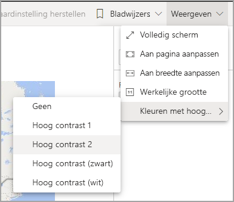
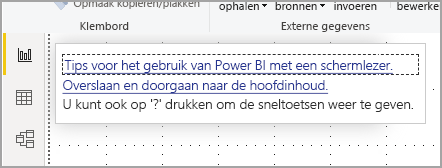
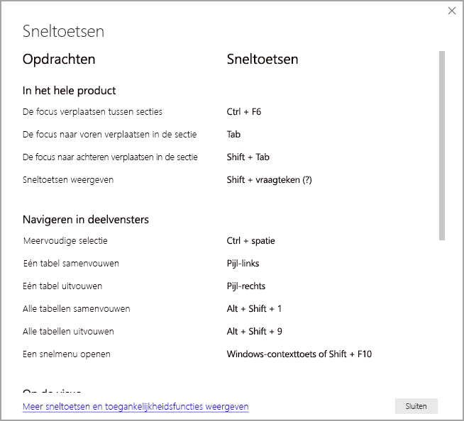

# Rapporten gebruiken in Power BI met toegankelijkheidshulpprogramma’s
Power BI bevat veel functies die het gebruikers met een handicap gemakkelijker maken om Power BI-rapporten te gebruiken en ermee te werken. Met deze hulpprogramma's kunnen gebruikers dezelfde informatie ophalen uit een rapport als mensen die geen ondersteunende technologie gebruiken.

Er zijn een paar termen die u moet kennen als u dit artikel leest:

* **Focus** is waar uw muis zich bevindt op de pagina. Focus wordt meestal aangeduid met een blauwe rand rond een object.
* **Canvas** is het paginagebied van het rapport.

In de volgende secties worden de hulpprogramma's voor toegankelijkheid beschreven die beschikbaar zijn om Power BI-rapporten te gebruiken.

## Toetsenbordnavigatie

Wanneer u Power BI Desktop of de Power BI-service start, wordt er knopinfo weergegeven in de rechterbovenhoek als u op **Tab** drukt. De koppeling met de titel **Tips voor het gebruik van Power BI met een schermlezer** brengt u naar dit artikel, met informatie over het gebruiken van een rapport met hulpprogramma's voor toegankelijkheid. Door te klikken op de koppeling **Overslaan om naar hoofdinhoud te gaan** gaat u naar het rapportcanvas.

Als u drukt op **?** wordt een dialoogvenster geopend met de meestgebruikte sneltoetsen in Power BI. Als u een volledige lijst met sneltoetsen wilt zien die beschikbaar zijn in Power BI, kunt u naar de koppeling onderaan het dialoogvenster navigeren. Hiermee gaat u naar de Power BI-documentatie over [sneltoetsen](desktop-accessibility-keyboard-shortcuts.md).

Met **Ctrl + F6** kunt u de focus verplaatsen tussen de tabbladen van het rapport of de objecten op een rapportpagina. Wanneer de focus op een geladen rapportpagina ligt, drukt u op de **TAB-toets** om de focus te verplaatsen tussen alle objecten op de pagina, zoals tekstvakken, afbeeldingen, vormen en diagrammen. 

In het algemeen zijn **Enter** voor selecteren of tekst invoeren en **ESC** voor afsluiten algemene opdrachten in Power BI.

### Toetsenbordnavigatie voor visuals

Veel makers van Power BI-rapporten maken rapporten met veel gegevens. Als u door een visual beweegt, kan het vervelend zijn om door elk element in een visual te bladeren. Toetsenbordnavigatie voor visuals is ontworpen als een hiërarchie, met drie niveaus. Deze drie niveaus worden in de volgende alinea's beschreven.

Als u door het eerste niveau wilt navigeren, wanneer u naar een visual navigeert, drukt u op **Ctrl + pijl-rechts** om naar die visual te gaan. Zodra u in die visual bent gekomen, kunt u op **Tab** drukken om door de hoofdgebieden van de visual te bladeren. De belangrijkste gebieden die u kunt doorlopen, zijn het tekengebied voor gegevens, de ascategorieën (indien van toepassing op de visual) en de legenda (indien de visual er een heeft).

De volgende GIF laat zien hoe een gebruiker het eerste niveau van een visual doorloopt:

Het tweede niveau van de hiërarchie is het invoeren van een van de hoofdgebieden (gegevenstekengebied, x-as-categorieën, legenda) van de visual. Als u een rapport gebruikt, kunt u naar een van deze hoofdgebieden gaan en door de gegevenspunten of categorieën in dat deel van de visual bladeren. Wanneer u besluit welk gebied u verder wilt verkennen, kunt u op **Enter** drukken om dat specifieke gebied te doorlopen.

Als u alle gegevenspunten in een reeks wilt selecteren, gaat u naar de legenda en drukt u op **Enter**. In de legenda kunt u op **Tab** drukken om door de verschillende categorieën in de legenda te navigeren. Druk op **Enter** om een specifieke reeks te selecteren.

Als u specifieke gegevenspunten in een reeks wilt selecteren, gaat u het gegevenstekengebied en drukt u op **Enter**. In het gegevenstekengebied kunt u op **Tab**  drukken om door de gegevenspunten te navigeren. Als uw visual meerdere reeksen heeft, kunt u op de **pijl omhoog** of **pijl omlaag** drukken om naar de gegevenspunten in een andere reeks te springen.

Als u alle gegevenspunten op een categorische as wilt selecteren, navigeert u naar de aslabels en drukt u op **Enter**. In de aslabels kunt u op **Tab**  drukken om door de labelnamen te navigeren. Druk op **Enter** om een labelnaam te selecteren.

Als u naar een laag hebt genavigeerd, kunt u op **Esc** drukken om uit die laag te komen. De volgende GIF laat zien hoe een gebruiker de niveaus van een visual kan openen en sluiten en gegevenspunten en categorielabels voor de x-as kan selecteren, naar een andere reeks kan springen en alle gegevenspunten in een reeks kan selecteren.

Als u tijdens het gebruik van een toetsenbord niet naar een object of visual kunt navigeren, kan dat zijn omdat de auteur van het rapport heeft besloten dat object uit de tabvolgorde te verbergen. Ontwerpers van rapporten verbergen vaak decoratieve objecten uit de tabvolgorde. Als u merkt dat u een rapport niet op logische wijze kunt doorlopen, dient u contact op te nemen met de auteur van het rapport. Auteurs van rapporten kunnen de tabvolgorde instellen voor objecten en visuals.

### Toetsenbordnavigatie voor slicers

Slicers hebben ook een ingebouwde toegankelijkheidsfunctionaliteit. Wanneer u een slicer selecteert, past u de waarde van de slicer aan door met **Ctrl+pijl-rechts** door de verschillende besturingselementen binnen de slicer te gaan. Als u bijvoorbeeld voor het eerst op **Ctrl+ pijl-rechts** drukt, krijgt de gum de focus. Als u vervolgens op de **spatiebalk** drukt, staat dat gelijk aan klikken op de knop Gum, waarmee alle waarden in de slicer worden gewist.

U kunt door de besturingselementen in een slicer gaan door op **Tab** te drukken. Als u op de gum staat en op de **Tab-toets** drukt, springt u naar de vervolgkeuzeknop. Als u nog een keer op de **TAB-toets** drukt, gaat u naar de eerste slicerwaarde (als er meerdere waarden voor de slicer zijn, zoals een bereik).

### Schakelen tussen pagina’s

Als de focus op een van de tabbladen op de rapportpagina ligt, kunt u focus met de **TAB-toets** of de **pijltoetsen** van de ene naar de andere rapportpagina verplaatsen. De titel van de rapportpagina wordt gelezen door de schermlezer, en ook of de rapportpagina momenteel is geselecteerd. Druk op **Enter** of de **spatiebalk** om de rapportpagina waarop de focus momenteel ligt, te laden.

### Toegang tot de visualheader
Als u tussen visuals navigeert, kunt u **op Alt+Shift+F10** drukken om de focus naar de visualheader te verplaatsen. De visualheader bevat verschillende opties, waaronder sorteren, het exporteren van de gegevens waarop het diagram is gebaseerd en Focusmodus. De pictogrammen die in de visualheader worden weergegeven, zijn afhankelijk van de opties die de auteur van het rapport wil weergeven.

## Schermlezer

Wanneer u een rapport bekijkt, kunt u het beste de scanmodus uitschakelen. Power BI moet meer worden behandeld als een toepassing en minder als een document, dus het is ingesteld met aangepaste navigatie om het navigeren gemakkelijker te maken. Wanneer u een schermlezer met Power BI Desktop gebruikt, moet u er ook voor zorgen dat uw schermlezer is geopend voordat u Power BI Desktop opent.

Bij het navigeren door objecten leest de schermlezer het type object en de titel van het object (indien aanwezig). Ook wordt de beschrijving van dat object (alternatieve tekst) gelezen, als deze door de auteur van het rapport is opgegeven.

### Gegevens weergeven
U kunt op **Alt+Shift+F11** drukken om een toegankelijke versie van het venster **Gegevens weergeven** weer te geven. In dit venster kunt u de gegevens die in de visual worden gebruikt, verkennen in een HTML-tabel met behulp van dezelfde toetsenbordsneltoetsen die u normaal gesproken voor de schermlezer gebruikt.

De functie **Gegevens weergeven** is een HTML-tabel die alleen via deze toetsenbordsneltoets toegankelijk is voor een schermlezer. Als u **Gegevens weergeven** opent vanuit de optie in de visualheader, wordt een tabel weergegeven die *niet* compatibel is met de schermlezer.  Wanneer u **Gegevens weergeven** via sneltoetsen op het toetsenbord gebruikt, kunt u de scanmodus inschakelen om te profiteren van alle sneltoetsen van de schermlezer.

Als u de weergave **Gegevens weergeven** wilt verlaten en terug wilt keren naar een rapport, drukt u op **Esc**.

## Hoogcontrastmodi

In de Power BI-service wordt geprobeerd de instellingen voor hoog contrast te detecteren die voor Windows zijn geselecteerd. De effectiviteit en nauwkeurigheid van die detectie zijn afhankelijk van de browser waarin de Power BI-service wordt weer gegeven. Als u het thema handmatig wilt instellen in de Power BI-service, selecteert u **Weergave > Kleuren met hoog contrast**. Selecteer vervolgens het thema dat u wilt toepassen op het rapport.

## Volgende stappen

De verzameling van artikelen voor Power BI-toegankelijkheid is als volgt:

* [Overzicht van toegankelijkheid in Power BI](desktop-accessibility-overview.md) 
* [Toegankelijke Power BI-rapporten maken](desktop-accessibility-creating-reports.md) 
* [Power BI-rapporten maken met hulpprogramma's voor toegankelijkheid](desktop-accessibility-creating-tools.md)
* [Sneltoetsen voor toegankelijkheid in Power BI-rapporten](desktop-accessibility-keyboard-shortcuts.md)
* [Controlelijst voor toegankelijkheid van rapporten](desktop-accessibility-creating-reports.md#report-accessibility-checklist)

