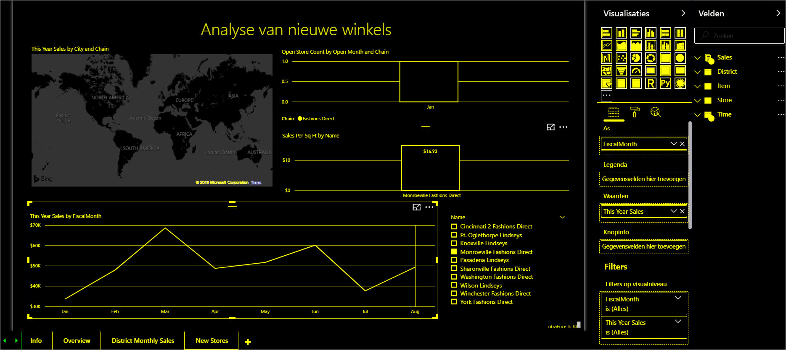

# Overzicht van toegankelijkheid in Power BI

Wanneer u met Power BI werkt, moet u rekening houden met de verschillende typen gebruikers die mogelijk met uw rapporten werken. U kunt rapporten maken die eenvoudig te navigeren en te begrijpen zijn voor toetsenbord- of schermlezergebruikers. Met dergelijke rapporten kunnen gebruikers met een visuele of fysieke handicap uw rapporten gebruiken.

Dit artikel biedt een overzicht van Power BI en toegankelijkheid. In extra artikelen vindt u richtlijnen en hulpprogramma's waarmee u goede rapporten met het oog op toegankelijkheid kunt maken.

## Universeel ontwerp

Universeel ontwerp is het ontwerp van producten die door zoveel mogelijk mensen kunnen worden gebruikt, zonder speciale aanpassingen te doen of een gespecialiseerd ontwerp te maken. Wanneer u rapporten of ervaringen in Power BI maakt, is het belangrijk om rekening te houden met de behoeften van uw gebruikers. Van het ontwerpen van een toegankelijke ervaring profiteren niet alleen uw eindgebruikers met eventuele gehoorproblemen of motorische, cognitieve of visuele beperkingen. Het kan nuttig zijn voor alle eindgebruikers in uw organisatie. Power BI biedt u de hulpprogramma's om toegankelijke rapporten te maken en te gebruiken. Het is uw taak, als rapportontwerper, om die hulpprogramma's te gebruiken om de ervaring van anderen te verbeteren.

## Toegankelijkheidsstandaarden

Power BI voldoet aan de volgende toegankelijkheidsstandaarden. Met deze standaarden kunt u ervoor zorgen dat uw Power BI-ervaringen voor zoveel mogelijk mensen toegankelijk zijn. Mobiele Power BI-apps zijn gecertificeerd voor toegankelijkheidsniveau C. Wanneer u toegankelijke rapporten of dashboards bouwt, is die inhoud toegankelijk voor iedereen die deze bekijkt via Power BI - Mobiel.

### WCAG 2.1

Met WCAG (Web Content Accessibility Guidelines, richtlijnen voor toegankelijkheid van webinhoud) kunt u webinhoud toegankelijk maken voor mensen met een handicap. Hier volgen de belangrijkste principes van de richtlijnen:

1. **Waarneembaar**. informatie en onderdelen van de gebruikersinterface moeten aan gebruikers worden aangeboden op een manier die voor hun waarneembaar is.
2. **Uitvoerbaar**. onderdelen van de gebruikersinterface en navigatie moeten kunnen worden uitgevoerd.
3. **Begrijpelijk**. informatie en de werking van de gebruikersinterface moeten kunnen worden begrepen.

### US Section 508

US Section 508 is een standaard waardoor overheden en federale instanties hun elektronische technologie en informatietechnologie toegankelijk moeten maken voor mensen met een beperking.

### EN 301 549

EN 301 549 is de geharmoniseerde Europese norm voor toegankelijkheidsvereisten voor ICT-producten en -services.  

## Volgende stappen

Raadpleeg de volgende resources voor meer informatie over toegankelijkheid van Power BI:

* [Power BI-rapporten ontwerpen met het oog op toegankelijkheid](desktop-accessibility-creating-reports.md)
* [Power BI-rapporten gebruiken met behulp van functies voor toegankelijkheid](desktop-accessibility-consuming-tools.md)
* [Rapporten maken in Power BI met behulp van toegankelijkheidsprogramma’s](desktop-accessibility-creating-tools.md)
* [Sneltoetsen in Power BI Desktop](desktop-accessibility-keyboard-shortcuts.md)
* [Controlelijst voor toegankelijkheid van rapporten](desktop-accessibility-creating-reports.md#report-accessibility-checklist)

