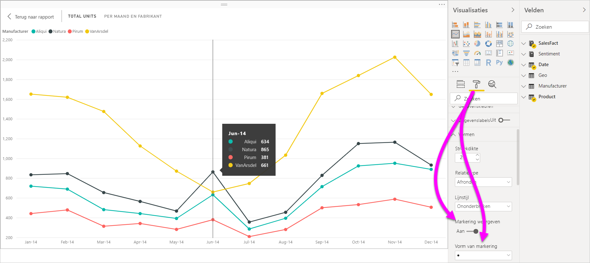
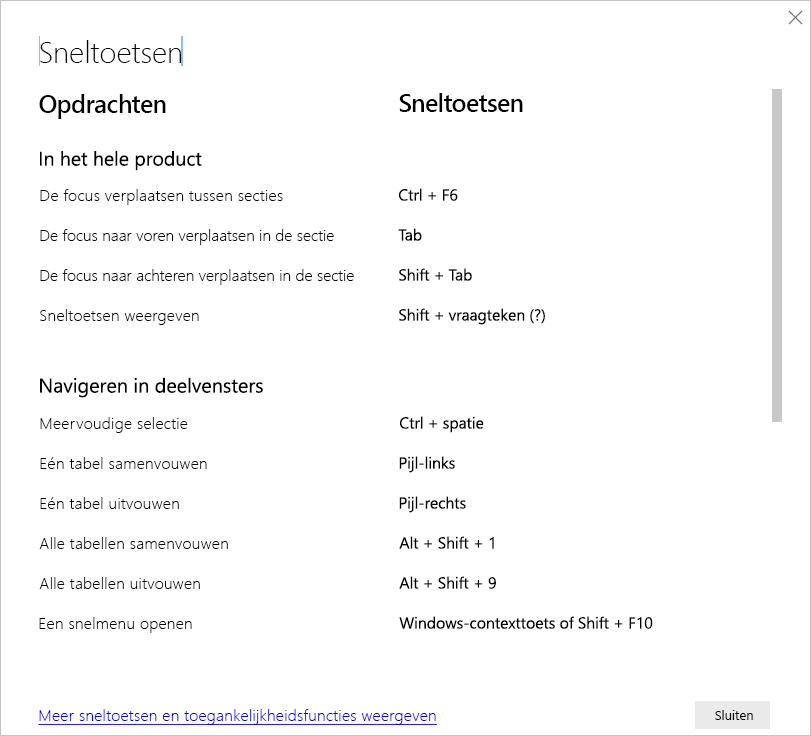
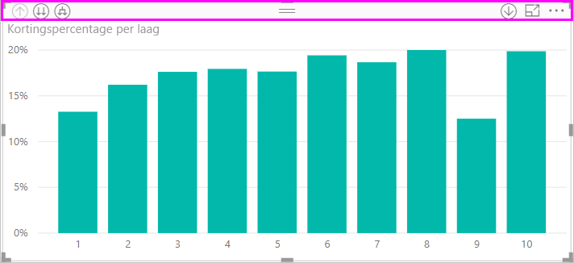
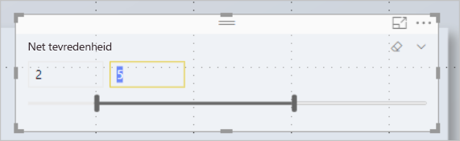
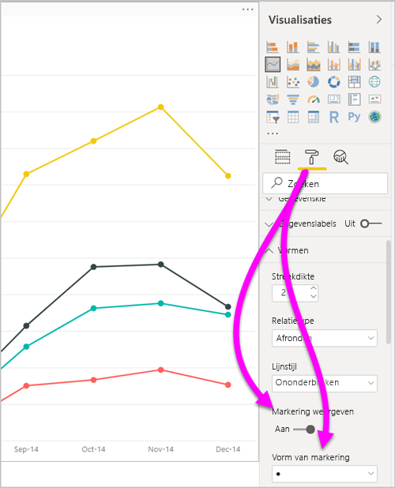
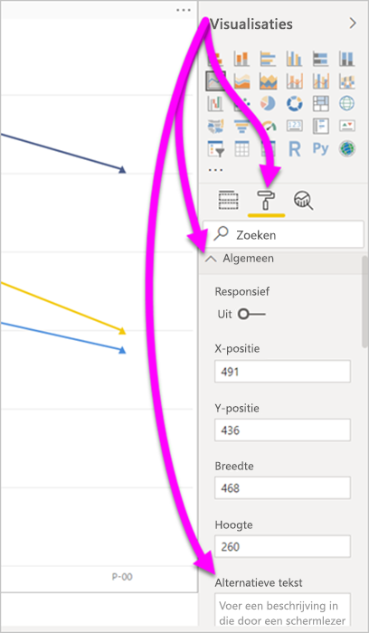
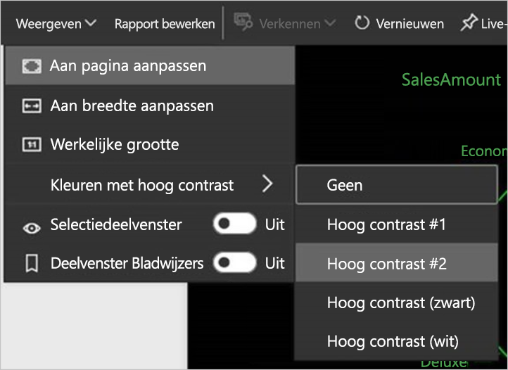

# Toegankelijkheid in Power BI Desktop-rapporten
Power BI bevat functies die het gebruikers met een handicap gemakkelijker maken om Power BI-rapporten te gebruiken en ermee te werken. Deze functies omvatten de mogelijkheid om een rapport te gebruiken met het toetsenbord of een schermlezer, de focus te verplaatsen naar verschillende objecten op een pagina met de tabtoets, en handig gebruik te maken van markeringen in visualisaties.

## Een Power BI Desktop-rapport gebruiken met een toetsenbord of schermlezer
Vanaf de **Power BI Desktop**-versie van september 2017 kunt u op **Shift+?** drukken om een venster weer te geven met een beschrijving van de beschikbare sneltoetsen voor toegankelijkheid in **Power BI Desktop**.

Dankzij deze verbeteringen voor toegankelijkheid kunt u een Power BI-rapport gebruiken met een toetsenbord of een schermlezer. Dit kan met behulp van de volgende technieken:

> [!NOTE]
> Wanneer u een rapport bekijkt, moet in het algemeen de scanmodus zijn uitgeschakeld.

Met **Ctrl+F6** kunt u de focus verplaatsen tussen de tabbladen van het rapport of de objecten op een rapportpagina.

* Als de focus op een van de tabbladen op de rapportpagina ligt, kunt u focus met de **TAB-toets** of de **pijltoetsen** van de ene naar de andere rapportpagina verplaatsen. De titel van de rapportpagina wordt gelezen door de schermlezer, en ook of de rapportpagina momenteel is geselecteerd. Druk op **Enter** of de spatiebalk om de rapportpagina waarop de focus momenteel ligt, te laden.
* Wanneer de focus op een geladen rapportpagina ligt, drukt u op de **TAB-toets** om de focus te verplaatsen tussen alle objecten op de pagina, zoals tekstvakken, afbeeldingen, vormen en diagrammen. Het type object en de titel van het object (indien van toepassing) worden door de schermlezer gelezen. Ook wordt de beschrijving van dat object gelezen, als deze door de auteur van het rapport is opgegeven. 

Als u tussen visuals navigeert, kunt u **op Alt+Shift+F10** drukken om de focus naar de visualheader te verplaatsen. De visualheader bevat verschillende opties, waaronder sorteren, het exporteren van de gegevens waarop het diagram is gebaseerd en Focusmodus. 

U kunt op **Alt+Shift+F11** drukken om een toegankelijke versie van het venster **Gegevens weergeven** weer te geven. In dit venster kunt u de gegevens die in de visual worden gebruikt, verkennen in een HTML-tabel met behulp van dezelfde toetsenbordsneltoetsen die u normaal gesproken voor de schermlezer gebruikt. 

> [!NOTE]
> De functie **Gegevens weergeven** is alleen via deze toetsenbordsneltoets toegankelijk voor een schermlezer. Als u de functie **Gegevens weergeven** opent via de optie in de visualheader is deze functie niet toegankelijk voor een schermlezer. Wanneer u **Gegevens weergeven** gebruikt, kunt u de scanmodus inschakelen om te profiteren van alle sneltoetsen van de schermlezer.

Sinds de release van **Power BI Desktop** in juli 2018 hebben slicers ook ingebouwde toegankelijkheidsfuncties. Wanneer u een slicer selecteert, past u de waarde van de slicer aan door met **Ctrl+pijl-rechts** door de verschillende besturingselementen binnen de slicer te gaan. Als u bijvoorbeeld voor het eerst op **Ctrl+ pijl-rechts** drukt, krijgt de gum de focus. Als u vervolgens op de spatiebalk drukt, staat dat gelijk aan klikken op de knop Gum, waarmee alle waarden in de slicer worden gewist. 

U kunt door de besturingselementen in een slicer gaan door op de **TAB-toets** te drukken. Als u op de gum staat en op de **TAB-toets** drukt, springt u naar de vervolgkeuzeknop. Als u nog een keer op de **TAB-toets** drukt, gaat u naar de eerste slicerwaarde (als er meerdere waarden voor de slicer zijn, zoals een bereik). 

Met deze toegankelijkheidsfuncties kunnen gebruikers volledig gebruikmaken van Power BI-rapporten met een schermlezer en toetsenbordnavigatie.

## Tips voor het maken van toegankelijke rapporten
De volgende tips kunt u helpen bij het maken van **Power BI Desktop**-rapporten die beter toegankelijk zijn.

### Algemene tips voor toegankelijke rapporten

* Schakel voor de visuals **Regel**, **Gebied** en **Keuzelijst met invoervak** en voor de visuals **Spreidingsdiagram** en **Beldiagram** de wisselknop **Markeringen weergeven** in en gebruik voor elke regel een andere **Vorm van markering**.
  
  * Als u de wisselknop **Markeringen weergeven** wilt inschakelen, selecteert u de sectie **Opmaak** in het deelvenster **Visualisaties** en vouwt u de sectie **Vormen** uit. Schuif omlaag om de knop **Markeringen weergeven** te vinden en deze **Aan** te zetten.
  * Als u afzonderlijke regels wilt aanpassen, zoekt u de wisselknop **Reeks aanpassen** en zet u deze **Aan**. Selecteer vervolgens de naam van elke regel (of elk gebied, als u een **vlakdiagram** gebruikt) in de vervolgkeuzelijst in de sectie **Vormen**. Onder de vervolgkeuzelijst kunt u veel aspecten van de gebruikte markering voor de geselecteerde regel aanpassen, met inbegrip van de vorm, kleur en grootte.
  
    
  
  * Als u voor elke lijn een andere **vorm van markering** gebruikt, is het makkelijker voor gebruikers om verschillende lijnen (of vlakken) van elkaar te onderscheiden.
* Ter aanvulling op het vorige punt: vertrouw niet alleen op kleuren om informatie over te brengen. Vertrouw bij het gebruik van vormen in lijn- en spreidingsdiagrammen niet alleen op voorwaardelijke opmaak om inzichten te bieden in tabellen en matrices. 
* Kies een opzettelijke sorteervolgorde voor elke visual in uw rapport. Wanneer gebruikers van schermlezers door de gegevens achter de grafiek navigeren, wordt dezelfde volgorde als in de visual gebruikt.
* Selecteer in de themagalerie een thema met hoog contrast dat geschikt is voor kleurenblinden. Importeer het met behulp van de [preview-functie **Thema's**](desktop-report-themes.md).
* Geef voor elk object in een rapport alternatieve tekst op. Zo zorgt u ervoor dat uw rapportgebruikers begrijpen wat u met een visual wilt overbrengen. Dat helpt ook als ze de visual, de afbeelding, de vorm of het tekstvak niet kunnen zien. U kunt als volgt alternatieve tekst opgeven voor elk gewenst object in een **Power BI Desktop**-rapport: selecteer het object (een visual, vorm enzovoort) en selecteer in het deelvenster **Visualisaties** de sectie **Opmaak**. Vouw vervolgens **Algemeen** uit, schuif naar de onderkant en vul het tekstvak **Alternatieve tekst** in.
  
  
  
  U kunt alternatieve tekst ook dynamisch wijzigen met een expressie, om bijvoorbeeld filters die op een visual zijn toegepast te reflecteren. U stelt expressies net zo in als voor een titel van een visual. [Voorwaardelijke opmaak voor titels van visuals](desktop-conditional-format-visual-titles.md)
  
* Zorg ervoor dat er in uw rapporten voldoende contrast is tussen tekst en de achtergrondkleuren. Er zijn verschillende hulpprogramma's zoals [Kleurcontrastanalyse](https://developer.paciellogroup.com/resources/contrastanalyser/) die u kunt gebruiken om de kleuren van uw rapport te controleren. 
* Gebruik tekengrootten en lettertypen die gemakkelijk kunnen worden gelezen. Teksten met een kleine tekengrootte of lettertypen die moeilijk leesbaar zijn, komen de toegankelijkheid niet ten goede.
* Neem een titel, aslabels en gegevenslabels op in alle visuele elementen.
* Gebruik zinvolle titels voor alle rapportpagina's.
* Vermijd indien mogelijk decoratieve vormen en afbeeldingen in uw rapport, aangezien deze in de tabvolgorde van het rapport worden ingesloten. Als u decoratieve objecten in uw rapport moet opnemen, werkt u de alternatieve tekst van het object bij zodat gebruikers van schermlezers weten dat dit voor de sier is.

### Items rangschikken in veldbuckets
Vanaf de **Power BI Desktop**-versie van oktober 2018 kunt u door de bron **Velden** navigeren met een toetsenbord, en dat is te gebruiken met schermlezers. 

Er is een contextmenu beschikbaar om het maakproces van rapporten met schermlezers te verbeteren. Via het menu kunt u velden in de bron omhoog of omlaag verplaatsen in de lijst **Velden**. Via het menu kunt u het veld ook naar andere bronnen verplaatsen, zoals een **Legenda** of **Waarde**.

## Ondersteuning voor hoge contrasten in rapporten

Als u modi met hoge contrasten gebruikt in Windows, worden de instellingen daarvoor en het kleurenpalet dat u selecteert ook toegepast op rapporten in **Power BI Desktop**. 

In **Power BI Desktop** wordt automatisch gedetecteerd welk thema met hoog contrast in Windows wordt gebruikt. Deze instellingen worden vervolgens ook toegepast op uw rapporten. De kleuren in hoog contrast blijven zichtbaar in het rapport wanneer het via de Power BI-service of elders wordt gepubliceerd.

In de Power BI-service wordt ook geprobeerd de instellingen voor hoog contrast te detecteren die voor Windows zijn geselecteerd. De effectiviteit en nauwkeurigheid van die detectie zijn afhankelijk van de browser waarin de Power BI-service wordt weer gegeven. Als u het thema handmatig wilt instellen in de Power BI-service, selecteert u **Weergave** > **Kleuren met hoog contrast** en selecteert u vervolgens het thema dat u op het rapport wilt toepassen.

## Overwegingen en beperkingen
Er zijn enkele bekende problemen en beperkingen met betrekking tot de toegankelijkheidsfuncties. Beschrijvingen van deze problemen en beperkingen vindt u in de volgende lijst:

* Als u schermlezers met **Power BI Desktop** gebruikt, krijgt u de beste ervaring als u de schermlezer opent voordat u bestanden opent in **Power BI Desktop**.
* Als u Verteller gebruikt, zijn er enkele beperkingen wanneer u door **Gegevens weergeven** als HTML-tabel navigeert.

## Sneltoetsen
Sneltoetsen zijn handig voor het navigeren in Power BI-rapporten met behulp van een toetsenbord. De volgende tabellen beschrijven de snelkoppelingen die beschikbaar zijn in een Power BI-rapport. Deze toetsenbordsneltoetsen werken niet alleen in **Power BI Desktop**, maar ook in de volgende ervaringen:

* Dialoogvenster **Q&A Explorer**
* Dialoogvenster **Aan de slag**
* Menu **Bestand** en dialoogvenster **Info**
* Balk **Waarschuwing**
* Dialoogvenster **Bestand terugzetten**
* Dialoogvenster **Fronsen**

We zetten ons voortdurend in om de toegankelijkheid te verbeteren. Bovenstaande elementen ondersteunen daarom ook schermlezers en instellingen voor hoog contrast.

### Veelgebruikte sneltoetsen
| Uit te voeren actie           | Actie                |
| :------------------- | :------------------- |
| De focus verplaatsen tussen secties  | **Ctrl+F6** |
| De focus naar voren verplaatsen in de sectie | **TAB-toets**         |
| De focus naar achteren verplaatsen in de sectie | **Shift+TAB-toets** |
| Een object selecteren of de selectie van een object wissen | **Enter** of **spatiebalk** |
| Meerdere objecten selecteren | **Ctrl+spatiebalk** |

### Op de visual
| Uit te voeren actie           | Actie                |
| :------------------- | :------------------- |
| De focus verplaatsen naar het menu van de visual | **Alt+Shift+F10** |
| Gegevens weergeven | **Alt+Shift+F11**  |
| Een visual invoeren | **Ctrl+pijl-rechts** |
| Een laag openen | **Enter** |
| Een laag of visual verlaten | **Esc** |
| Een gegevenspunt selecteren of de selectie van een gegevenspunt wissen | **Enter** of **spatiebalk** |
| Meervoudige selectie | **Ctrl+Enter** of **Ctrl+spatiebalk** |
| Klikken met de rechtermuisknop | <ul><li>Windows-toetsenbord: **Windows-contexttoets+F10**. De Windows-snelmenutoets bevindt zich tussen de linker Alt-toets en de pijl-links</li><li>Ander toetsenbord: **Shift+F10**</li></ul> |
| Selectie wissen | **Ctrl+Shift+C** |

### Tabel- en matrixnavigatie
| Uit te voeren actie          | Actie                |
| :------------------- | :------------------- |
| De focus één cel omhoog/omlaag verplaatsen (binnen alle cellen in alle gebieden)  | **Pijl-omhoog** / **Pijl-omlaag** |
| De focus één cel naar links/rechts verplaatsen (binnen alle cellen in alle gebieden)  | **Pijl-links** / **Pijl-rechts** |

### Navigeren in deelvensters
| Uit te voeren actie           | Actie                |
| :------------------- | :------------------- |
| Meervoudige selectie | **Ctrl+spatiebalk** |
| Eén tabel samenvouwen | **Pijl-links** |
| Eén tabel uitvouwen | **Pijl-rechts** |
| Alle tabellen samenvouwen | **Alt+Shift+1** |
| Alle tabellen uitvouwen | **Alt+Shift+9** |
| Een snelmenu openen | <ul><li>Windows-toetsenbord: **Windows-contexttoets+F10**.  De Windows-snelmenutoets bevindt zich tussen de linker Alt-toets en de pijl-links</li><li>Ander toetsenbord: **Shift+F10**</li></ul> |

### Slicer
| Uit te voeren actie         | Actie                |
| :------------------- | :------------------- |
| Communiceren met een slicer | **Ctrl+pijl-rechts** |

### Selectiedeelvenster
| Uit te voeren actie           | Actie                |
| :------------------- | :------------------- |
| Het selectievenster activeren | **F6** |
| Een object omhoog verplaatsen in de lagen | **Ctrl+Shift+F** |
| Een object omlaag verplaatsen in de lagen | **Alt+Shift+B** |
| Een object verbergen/weergeven (in-/uitschakelen) | **Alt+Shift+S** |

### DAX Editor
| Uit te voeren actie          | Actie                |
| :------------------- | :------------------- |
| Regel omhoog/omlaag verplaatsen | **Alt+Pijl-omhoog** / **Pijl-omlaag** |
| Regel omhoog/omlaag kopiëren | **Shift+Pijl-omhoog** / **Pijl-omlaag** |
| Regel onder invoegen | **Ctrl+Enter** |
| Regel boven invoegen | **Ctrl+Shift+Enter** |
| Ga naar overeenkomend haakje | **Ctrl+Shift+**  \ |
| Regel inspringen/regel uitbreiden naar de marge | **Ctrl + ]**  /  **[** |
| Cursor invoegen | **Alt+klikken** |
| Huidige regel selecteren | **Ctrl+I** |
| Selecteer alle instanties van de huidige selectie | **Ctrl+Shift+L** |
| Alle instanties van het huidige woord selecteren | **Ctrl+F2** |

### Gegevens invoeren
| Uit te voeren actie           | Actie                |
| :------------------- | :------------------- |
| Bewerkbaar raster afsluiten | **Ctrl+TAB-toets** |

## Volgende stappen
* [Rapportthema's gebruiken in Power BI Desktop (preview)](desktop-report-themes.md)

