# Bladwijzers in Power BI Desktop maken om inzichten te delen en verhalen te vertellen
Met *bladwijzers* in Power BI Desktop kunt u de momenteel geconfigureerde weergave van een rapportpagina vastleggen, inclusief filters en de status van visuals. Later kunt u naar die status terugkeren door de opgeslagen bladwijzer te selecteren. 

U kunt ook een verzameling bladwijzers maken, deze rangschikken in de gewenste volgorde en later de bladwijzers doorlopen in een presentatie om een reeks inzichten te markeren of uw verhaal te vertellen aan de hand van visuele elementen en rapporten. 

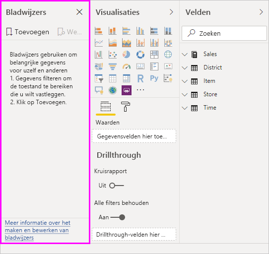

Er zijn vele toepassingen voor bladwijzers. U kunt bladwijzers bijvoorbeeld gebruiken om uw eigen voortgang bij het maken van rapporten bij te houden (u kunt bladwijzers eenvoudig toevoegen, verwijderen en wijzigen) en u kunt bladwijzers maken om een PowerPoint-achtige presentatie te maken, waarbij u bladwijzers op volgorde doorloopt om zo met uw rapport een verhaal te vertellen. 

> [!TIP]
> Ga naar [Announcing personal bookmarks in the Power BI Service](https://powerbi.microsoft.com/blog/announcing-personal-bookmarks-in-the-power-bi-service/) (Maak kennis met persoonlijke bladwijzers in de Power BI-service) voor meer informatie over het gebruik van persoonlijke bladwijzers in de Power BI-service. 

## Bladwijzers gebruiken
Als u bladwijzers wilt gebruiken, selecteert u het tabblad **Beeld** op het lint van Power BI Desktop en selecteert u **Deelvenster Bladwijzers**. 

Wanneer u een bladwijzer maakt, worden de volgende elementen opgeslagen met de bladwijzer:

* De huidige pagina
* Filters
* Slicers, met inbegrip van het type slicer (bijvoorbeeld vervolgkeuzelijst of lijst) en de status van de slicer
* Selectiestatus van visual (zoals filters voor kruislings markeren)
* Sorteervolgorde
* Zoomlocatie
* Zichtbaarheid van een object (via het deelvenster **Selectie**)
* De focus- of **Spotlight**-modus van een zichtbaar object

Configureer een rapportpagina zoals u deze wilt weergeven in de bladwijzer. Nadat de rapportpagina en visuele elementen naar wens zijn gerangschikt, selecteert u **Toevoegen** in het deelvenster **Bladwijzers** om een bladwijzer toe te voegen. 

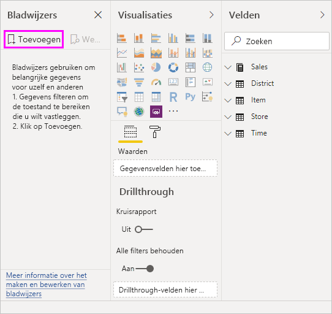

Power BI Desktop maakt een bladwijzer en geeft deze een algemene naam. U kunt gemakkelijk de **Naam wijzigen** van een bladwijzer, een bladwijzer **Verwijderen** of een bladwijzer **Bijwerken** door de drie puntjes naast de naam van de bladwijzer te selecteren en een bewerking te selecteren in het menu dat wordt weergegeven.

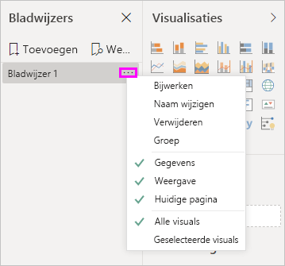

Nadat u een bladwijzer hebt gemaakt, kunt u deze weergeven door de bladwijzer te selecteren in het deelvenster **Bladwijzers**. 

U kunt ook kiezen of elke bladwijzer **Gegevenseigenschapen** zal toepassen, zoals filters en slicers, **Weergave**-eigenschappen zoals spotlight en de zichtbaarheid ervan; en **Huidige paginawijzigingen** die de pagina tonen die zichtbaar was toen de bladwijzer werd toegevoegd. Deze mogelijkheden zijn nuttig wanneer u bladwijzers gebruikt om tussen rapportweergaven of visualisatieselecties te schakelen. In dat geval wilt u waarschijnlijk de gegevenseigenschappen uitschakelen, zodat filters niet opnieuw worden ingesteld als gebruikers wisselen van weergave door de selectie van een bladwijzer. 

Om dergelijke wijzigingen aan te brengen kiest u het beletselteken naast de naam van de bladwijzer en (de)selecteert u de vinkjes bij **Gegevens**, **Weergave** en andere besturingselementen. 

## Bladwijzers ordenen
Wanneer u bladwijzers maakt, is de volgorde waarin u ze maakt mogelijk niet dezelfde volgorde waarin u ze aan uw publiek wilt laten zien. Geen probleem. U kunt eenvoudig de volgorde van bladwijzers wijzigen.

- Versleep de bladwijzers in het deelvenster **Bladwijzers** om de volgorde te wijzigen. 

   De gele balk tussen bladwijzers geeft aan waar de gesleepte bladwijzer wordt geplaatst.

   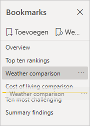

De volgorde van uw bladwijzers kan belangrijk zijn wanneer u de functie **Weergave** van bladwijzers gebruikt, zoals wordt beschreven in de volgende sectie.

## Bladwijzers als een diavoorstelling
Wanneer u een verzameling bladwijzers hebt die u in een bepaalde volgorde wilt presenteren, kunt u **Weergave** selecteren in het deelvenster **Bladwijzers** om een diavoorstelling te starten.

In de **weergavemodus** moet u op enkele dingen letten.

   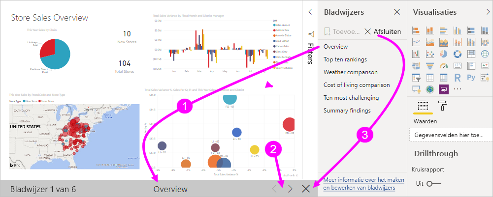

1. De naam van de bladwijzer wordt weergegeven in de bladwijzerbalk, onderaan op het canvas.

2. De bladwijzerbalk bevat pijlen waarmee u naar de volgende of vorige bladwijzer kunt gaan.

3. U kunt de **Weergavemodus** afsluiten door **Afsluiten** te selecteren in het deelvenster **Bladwijzers** of door de **X** op de bladwijzerbalk te selecteren. 

In de **weergavemodus** kunt u het deelvenster **Bladwijzers** sluiten door de **X** in dit deelvenster te selecteren om meer ruimte vrij te maken voor de presentatie. In de **Weergavemodus** zijn alle visuele elementen interactief en beschikbaar voor kruislingse markering, net zoals wanneer u er rechtstreeks mee werkt. 

## Zichtbaarheid: Het Selectiedeelvenster gebruiken
Het **Selectiedeelvenster** is verwant aan het deelvenster **Bladwijzers** en bevat een lijst met alle objecten op de huidige pagina. Hier kunt u een object selecteren en opgeven of dit zichtbaar is. 

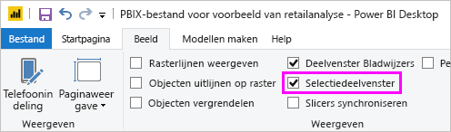

In het **Selectiedeelvenster** kunt u een object selecteren en instellen of het object momenteel zichtbaar is door het oogpictogram rechts van het object te selecteren. 

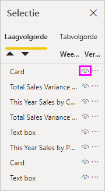

Wanneer u een bladwijzer toevoegt, wordt de zichtbaarheidsstatus van elk object ook opgeslagen op basis van de instelling in het **selectiedeelvenster**. 

Het is belangrijk te weten dat slicers een rapportpagina blijven filteren, ongeacht of ze zichtbaar zijn. U kunt daardoor verschillende bladwijzers met verschillende slicerinstellingen maken en één rapportpagina maken die er verschillend uitziet (met verschillende inzichten) in meerdere bladwijzers.

## Bladwijzers voor vormen en afbeeldingen
U kunt ook vormen en afbeeldingen koppelen aan bladwijzers. Als u via deze functie een object selecteert, wordt de bladwijzer weergegeven die aan dat object is gekoppeld. Deze functie kan vooral handig zijn wanneer u met knoppen werkt. Zie [Knoppen gebruiken in Power BI](desktop-buttons.md) voor meer informatie. 

Een bladwijzer toewijzen aan een object: 

1. Selecteer het object in het rapportcanvas. Stel de schuifregelaar **Actie** in het deelvenster **Vorm opmaken** dat wordt weergegeven in op **Aan**.

2. Breid de sectie **Actie** uit. Selecteer **Bladwijzer** onder **Type**.

3. Selecteer een bladwijzer onder **Bladwijzers**.

   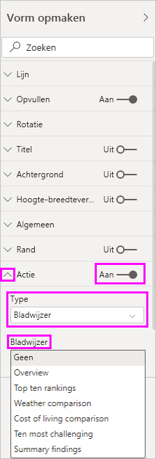

U kunt allerlei interessante dingen doen met bladwijzers die aan objecten zijn gekoppeld. U kunt een visuele inhoudsopgave op de rapportpagina maken of u kunt verschillende weergaven (zoals visuele) van dezelfde gegevens maken.

Wanneer u aan het werk bent in de bewerkingsmodus, drukt u op **Ctrl** en selecteert u de koppeling om deze te volgen. Wanneer u niet aan het werk bent in de bewerkingsmodus, selecteert u het object om de koppeling te volgen. 

## Bladwijzergroepen

Sinds de release van augustus 2018 van Power BI Desktop kunt u bladwijzergroepen maken en gebruiken. De bladwijzergroep is een door u opgegeven verzameling bladwijzers, die kan worden weergegeven en ingedeeld als een groep. 

Een bladwijzergroep maken: 
1. Druk op **Ctrl** en selecteer de bladwijzers die u wilt opnemen in de groep. 

2. Selecteer het beletselteken naast de bladwijzers die u hebt geselecteerd en selecteer vervolgens **Groep** in het menu dat wordt weergegeven.

   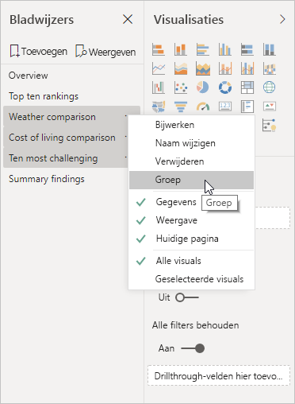

Power BI Desktop noemt de groep automatisch *Groep 1*. U kunt het beletselteken naast deze naam selecteren, **Naam wijzigen** selecteren en de naam naar wens wijzigen.

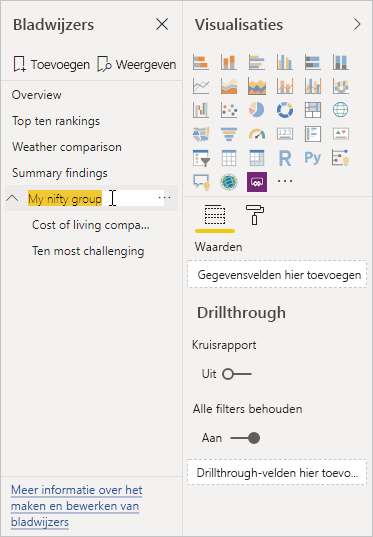

Wanneer u bij een bladwijzergroep de naam van de bladwijzergroep uitbreidt, wordt de bladwijzergroep alleen uitgevouwen of samengevouwen. De groep vormt op zichzelf geen bladwijzer. 

Wanneer u de functie **Weergeven** voor bladwijzers gebruikt, zijn de volgende details van toepassing:

* Als de geselecteerde bladwijzer zich in een groep bevindt wanneer u **Weergeven** selecteert in Bladwijzers, worden alleen de bladwijzers *in die groep* weergegeven in de weergavesessie. 

* Als de geselecteerde bladwijzer zich niet in een groep bevindt, of als deze zich op het hoogste niveau bevindt (zoals de naam van een bladwijzergroep), dan worden alle bladwijzers voor het gehele rapport afgespeeld, met inbegrip van bladwijzers in een groep. 

Een bladwijzergroep opheffen: 
1. Selecteer een bladwijzer in een groep en selecteer het beletselteken. 

2. Selecteer **Groep opheffen** in het menu dat wordt weergegeven.

   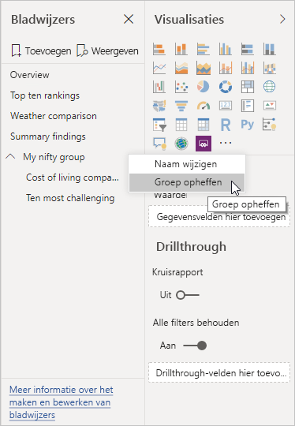

   Wanneer u **Groep opheffen** selecteert voor een bladwijzer in een groep, worden alle bladwijzers uit de groep gehaald. De groep wordt verwijderd, maar niet de bladwijzers zelf. 

Een enkele bladwijzer uit een groep verwijderen: 
1. **Hef de groep** van een bladwijzer in die groep op. Op die manier wordt de volledige groepering verwijderd. 

2. Selecteer de bladwijzers die u in de nieuwe groep wilt hebben door op **Ctrl** te drukken en elke bladwijzer te selecteren. Selecteer vervolgens opnieuw **Groeperen**. 

## Spotlight gebruiken
Een andere functie die samen met bladwijzers is uitgebracht, is *spotlight*. Met spotlight kunt u de aandacht vestigen op een specifieke grafiek, bijvoorbeeld wanneer u bladwijzers presenteert in de **Weergavemodus**.

We vergelijken spotlight met de focusmodus om te zien hoe ze verschillen:

1. Met focusmodus selecteert u het pictogram **Focusmodus** van een visual, waardoor het volledige canvas wordt gevuld door de visual.

2. Met spotlight kunt u **Spotlight** selecteren via het beletselteken van een visual in de oorspronkelijke grootte, waardoor alle andere visuals op de pagina vervagen, zodat ze bijna helemaal transparant zijn. 

Wanneer u het pictogram **Focusmodus** van de visual in de vorige afbeelding selecteert, wordt de pagina als volgt weergegeven:

Als daarentegen **Spotlight** wordt geselecteerd via het beletseltekenmenu van de visual, wordt de pagina als volgt weergegeven:

Als de focusmodus of de spotlightmodus is geselecteerd wanneer u een bladwijzer toevoegt, blijft die modus bewaard in de bladwijzer.

## Bladwijzers in de Power BI-service
Wanneer u een rapport met ten minste één bladwijzer publiceert naar de Power BI-service, kunt die bladwijzers zien en gebruiken in de Power BI-service. Wanneer bladwijzers beschikbaar zijn in een rapport, geeft u de deelvensters **Selectie** en **Bladwijzers** weer door **Weergave** > **Selectiedeelvenster** of **Weergave** > **Deelvenster Bladwijzers** te selecteren. 

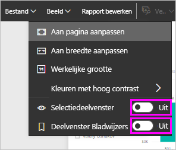

In de Power BI-service werkt het deelvenster **Bladwijzers** hetzelfde als in Power BI Desktop, inclusief de mogelijkheid om **Weergave** te selecteren om uw bladwijzers op volgorde weer te geven, zoals een diavoorstelling.

Gebruik de grijze titelbalk voor bladwijzers in plaats van de zwarte pijlen om door de bladwijzers te navigeren. (Met de zwarte pijlen navigeert u door de rapportpagina’s, niet door de bladwijzers.)

## Preview-functie voor bladwijzers inschakelen (versies vóór maart 2018)
Met ingang van de versie van maart 2018 van Power BI Desktop zijn bladwijzers algemeen beschikbaar. 

We raden altijd aan om een upgrade naar de meest recente versie uit te voeren. Maar als uw Power BI Desktop-versie van vóór deze release is, kunt u de functie voor bladwijzers uitproberen vanaf de release van oktober 2017 van Power BI Desktop en ook voor rapporten waarvoor bladwijzers zijn ingeschakeld in de Power BI-service. 

De Preview-functie voor bladwijzers inschakelen: 

1. Selecteer **Bestand** > **Opties en instellingen** > **Opties** > **Preview-functies** en selecteer vervolgens **Bladwijzers**. 

   

2. Start Power BI Desktop opnieuw om preview-versie van bladwijzers in te schakelen.

## Beperkingen en overwegingen
Houd rekening met de volgende beperkingen en overwegingen in deze release van de bladwijzersfuncties.

* De meeste aangepaste visualisaties zouden goed met bladwijzers moeten werken. Als u echter problemen ondervindt met bladwijzers en een aangepaste visual, neem dan contact op met de maker van die aangepaste visual en vraag deze om ondersteuning voor bladwijzers toe te voegen. 
* Als u een visueel element toevoegt aan een rapportpagina nadat u een bladwijzer hebt gemaakt, wordt het visuele element weergegeven in de standaardstaat. Dit betekent dat als u een slicer toevoegt aan een pagina waarop u eerder bladwijzers hebt gemaakt, de slicer in de standaardstaat wordt uitgevoerd.
* Als visuele elementen worden verplaatst nadat een bladwijzer is gemaakt, wordt dit automatisch weerspiegeld in de bladwijzer. 

## Volgende stappen
Raadpleeg de volgende artikelen voor meer informatie over functies die vergelijkbaar zijn of samenwerken met bladwijzers:

* [Drillthrough gebruiken in Power BI Desktop](desktop-drillthrough.md)
* [Een dashboardtegel of rapportvisual weergeven in de focusmodus](consumer/end-user-focus.md)

