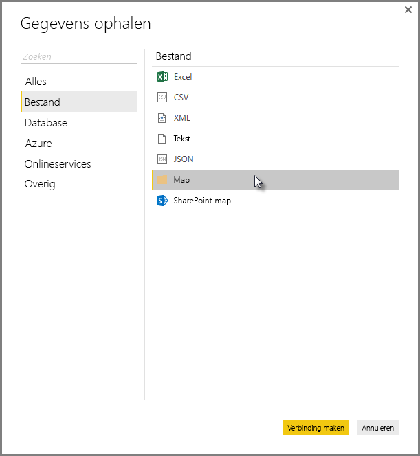
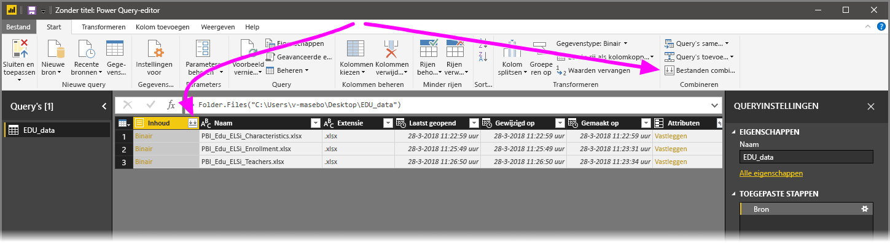
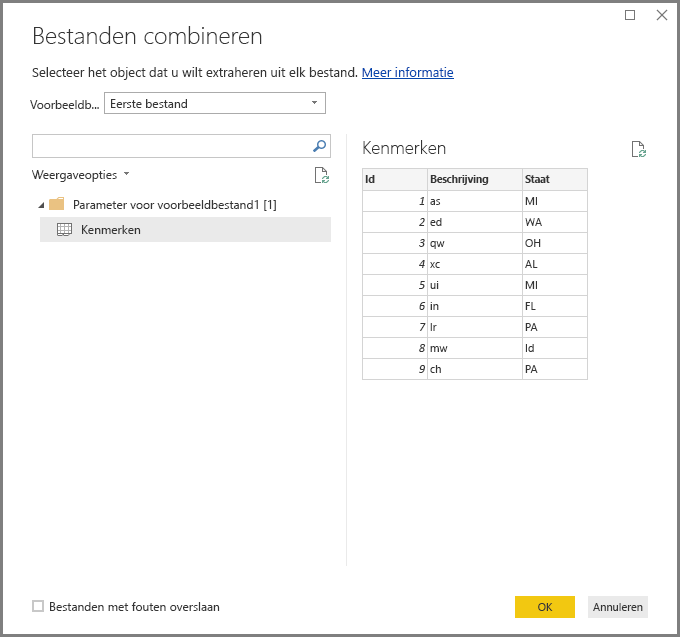
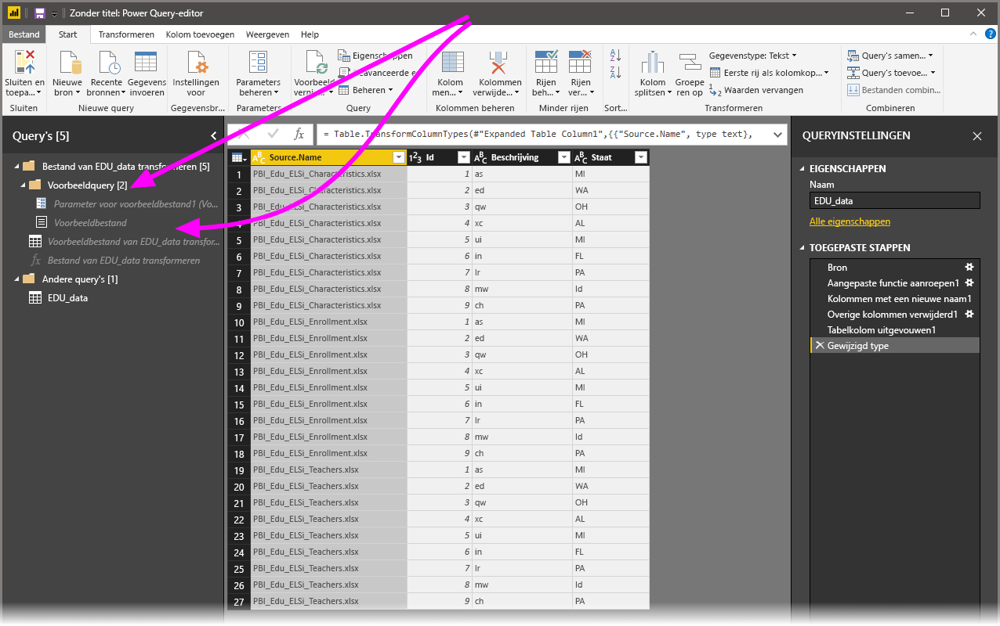

# Bestanden (binaire) combineren in Power BI Desktop
Een krachtige aanpak voor het importeren van gegevens in **Power BI Desktop** bestaat uit het combineren van meerdere bestanden, die hetzelfde schema hebben, tot één logische tabel. Deze gebruiksvriendelijke en populaire aanpak is nog eenvoudiger en uitgebreider gemaakt, zoals in dit artikel wordt beschreven.

Selecteer **Gegevens ophalen > Bestand > Map** om het proces van het combineren van bestanden vanuit dezelfde map te starten.

## Gedrag van het combineren van bestanden
U kunt **bestanden combineren (binaire bestanden)** door **Bestanden combineren** te selecteren op het linttabblad **Startpagina** in **Query-editor** of in de kolom zelf.

De transformatie **Bestanden combineren** werkt als volgt:

* De transformatie **Bestanden combineren** analyseert elk invoerbestand en bepaalt de juiste bestandsindeling, bijvoorbeeld *tekstbestand*, *Excel-werkmap* of *JSON-bestand*.
* Met de transformatie kunt u uit het eerste bestand een specifiek object selecteren, bijvoorbeeld om een *Excel-werkmap* te extraheren.
  
  
* Door **Bestanden combineren** worden vervolgens de volgende query's automatisch uitgevoerd:
  
  * Er wordt een voorbeeldquery gemaakt waarmee alle vereiste extractiestappen in één bestand worden uitgevoerd.
  * Er wordt een *functiequery* gemaakt waarmee de (binaire) bestandsinvoer in parameters wordt uitgedrukt voor de *voorbeeldquery*. De voorbeeldquery en de functiequery worden gekoppeld, zodat de wijzigingen aan de voorbeeldquery in de functiequery worden weerspiegeld.
  * De *functiequery* wordt toegepast op de oorspronkelijke query met binaire invoerbestanden (bijvoorbeeld de query *Map*). De functiequery wordt dus op elke rij toegepast voor binaire invoer. Vervolgens wordt de resulterende gegevensextractie als kolommen op het bovenste niveau uitgevouwen.
    
    

> [!NOTE]
> Het bereik van uw selectie in een Excel-werkmap is van invloed op het gedrag van het combineren van binaire bestanden. U kunt bijvoorbeeld een specifiek werkblad selecteren om dat werkblad te combineren of de hoofdmap selecteren om het volledige bestand te combineren. Als u een map selecteert, worden de bestanden in die map gecombineerd. 

Dankzij het gedrag van **Bestanden combineren** kunt u eenvoudig alle bestanden in een bepaalde map combineren, zolang ze hetzelfde bestandstype en dezelfde structuur (zoals dezelfde kolommen) hebben.

Bovendien kunt u eenvoudig aanvullende transformaties of extractiestappen toepassen door de automatisch gemaakte *voorbeeldquery* te wijzigen, zonder dat u zich zorgen hoeft te maken over het wijzigen of maken van aanvullende stappen voor een *functiequery*. Wijzigingen aan de *voorbeeldquery* worden automatisch in de gekoppelde *functiequery* gegenereerd.

## Volgende stappen
Met Power BI Desktop kunt u verbinding maken met allerlei andere gegevens. Bekijk de volgende bronnen voor meer informatie over gegevensbronnen:

* [Wat is Power BI Desktop?](desktop-what-is-desktop.md)
* [Data Sources in Power BI Desktop](desktop-data-sources.md) (Gegevensbronnen in Power BI Desktop)
* [Shape and Combine Data with Power BI Desktop](desktop-shape-and-combine-data.md) (Gegevens vormgeven en combineren met Power BI Desktop)
* [Connect to CSV files in Power BI Desktop](desktop-connect-csv.md) (Verbinding met CSV-bestanden maken in Power BI Desktop)   
* [Enter data directly into Power BI Desktop](desktop-enter-data-directly-into-desktop.md) (Rechtstreeks gegevens in Power BI Desktop invoeren)   

