# Algemene querytaken uitvoeren in Power BI Desktop

Wanneer u werkt in het venster Power Query-editor van Power BI Desktop, beschikt u over een aantal veelgebruikte taken. In dit document worden die veelgebruikte taken gedemonstreerd en ziet u koppelingen voor meer informatie.

De hier gedemonstreerde algemene querytaken zijn de volgende:

* Verbinding maken met gegevens
* Gegevens vormgeven en combineren
* Rijen groeperen
* Kolommen draaien
* Aangepaste kolommen maken
* Queryformules

We maken gebruik van enkele gegevensverbindingen om deze taken uit te voeren. De gegevens zijn beschikbaar voor downloaden of om er verbinding mee te maken voor het geval u deze taken zelf wilt doorlopen.

De eerste gegevens verbinding is [een Excel-werkmap](https://download.microsoft.com/download/5/7/0/5701F78F-C3C2-450C-BCCE-AAB60C31051D/PBI_Edu_ELSi_Enrollment_v2.xlsx)die u lokaal kunt downloaden en opslaan. De andere is een Webresource die ook wordt gebruikt in andere Power BI Desktop-artikelen:

<https://www.bankrate.com/retirement/best-and-worst-states-for-retirement/>

De stappen om met beide gegevensbronnen verbinding te maken, vormen het begin van de algemene querytaken.

## Verbinding maken met gegevens

Als u verbinding wilt maken met gegevens in Power BI Desktop, selecteert u **Start** en vervolgens **Gegevens ophalen**. Power BI Desktop geeft een menu met de meest voorkomende gegevensbronnen weer. Voor een volledige lijst met gegevensbronnen waarmee Power BI Desktop verbinding kan maken, selecteert u de knop **Meer** onderaan het menu. Zie [Gegevensbronnen in Power BI Desktop](desktop-data-sources.md) voor meer informatie.

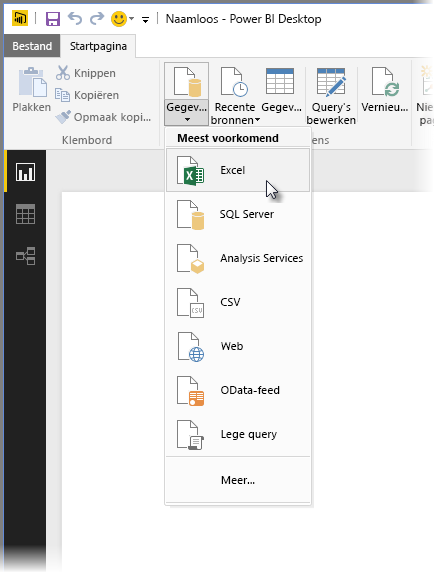

Als u wilt starten, selecteert u **Excel**, geeft u de Excel-werkmap op die eerder is vermeld en selecteert u vervolgens **Openen**. Query inspecteert de werkmap en geeft de gegevens weer die zijn gevonden in het **Navigator**-venster nadat u een tabel hebt geselecteerd.

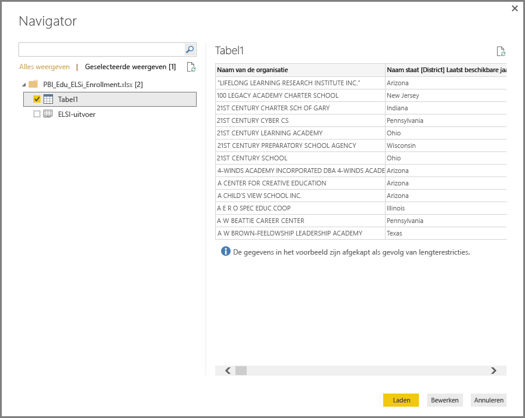

U kunt **Gegevens transformeren** om de gegevens te bewerken, aan te passen of *vorm te geven* voordat u deze in Power BI Desktop laadt. Bewerken is vooral nuttig wanneer u werkt met grote gegevenssets die u wilt downloaden voordat u deze laadt.

Verbinding maken met verschillende soorten gegevens is net zo gemakkelijk. U wilt ook verbinding maken met een Web-resource. Kies **Gegevens ophalen** > **Meer**en selecteer vervolgens **Andere** > **Web** > **Verbinden**.

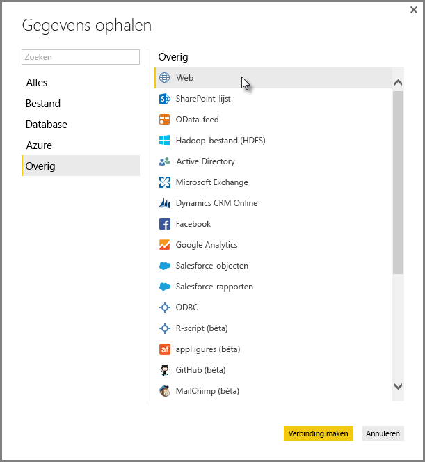

Het dialoogvenster **Van web** wordt weergegeven, waarin u de URL van de webpagina typt.

Selecteer **OK**. Net als voorheen inspecteert Power BI Desktop de gegevens van de webpagina en worden de preview-opties weer gegeven in het dialoog venster **Navigator**. Wanneer u een tabel selecteert, wordt er een voorbeeld van de gegevens weergegeven.

Andere gegevensverbindingen lijken daar op. Als verificatie vereist is voor het maken van een gegevensverbinding, vraagt Power BI Desktop u de juiste referenties op te geven.

Zie [Verbinding maken met gegevens in Power BI Desktop](desktop-connect-to-data.md)voor een stapsgewijze demonstratie van het maken van verbinding met gegevens in Power BI Desktop.

## Gegevens vormgeven en combineren

U kunt gegevens eenvoudig vormgeven en combineren met de Power Query-editor. Deze sectie bevat enkele voorbeelden van de manieren waarop u gegevens kunt vormgeven. Zie [Gegevens vormgeven en combineren met Power BI Desktop](desktop-shape-and-combine-data.md) voor een volledigere demonstratie van hoe men gegevens kan vormgeven en combineren.

In de vorige sectie hebben we verbinding gemaakt met twee gegevenssets: een Excel-werkmap en een web-resource. Nadat de gegevens in de Power Query-editor zijn geladen, selecteert u de query van de webpagina in de beschikbare query's in het deel venster **Query's**, zoals hier wordt weergegeven:

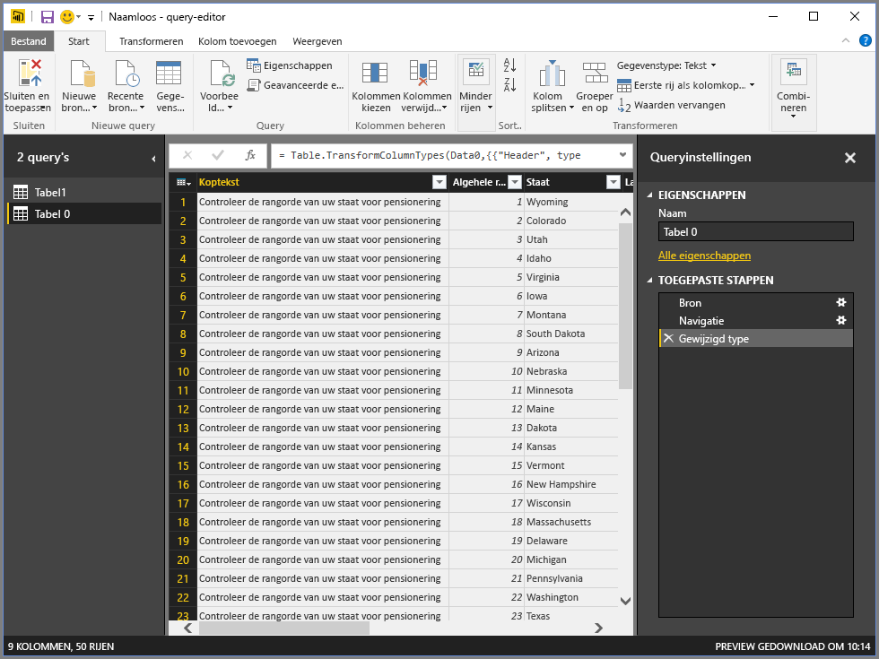

Wanneer u gegevens vormgeeft, zet u een gegevensbron om in de vorm en indeling die aan uw behoeften voldoen.

In de Power Query-editor zijn veel opdrachten op het lint en in een contextgevoelig snelmenu te vinden. Wanneer u bijvoorbeeld met de rechtermuisknop op een kolom klikt, kunt u de kolom verwijderen met het contextmenu dat wordt geopend. U kunt ook een kolom selecteren en vervolgens de knop **Kolommen verwijderen** van het tabblad **Start** in het lint selecteren.

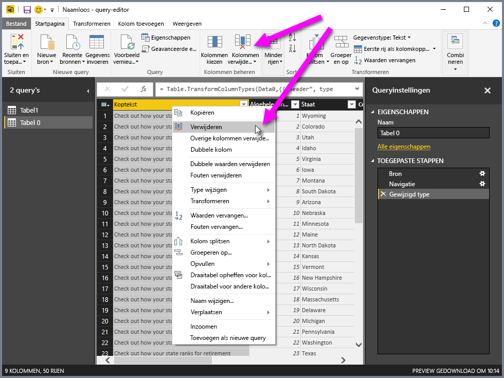

U kunt de gegevens op vele andere manieren in deze query vorm geven. U kunt elk willekeurig aantal rijen uit de bovenste of onderste verwijderen. U kunt ook kolommen toevoegen, kolommen splitsen, waarden vervangen en andere vormgevingstaken uitvoeren. Met deze functies kunt u de Power Query-editor omleiden om de gewenste gegevens op te halen.

## Rijen groeperen

In Power Query-editor kunt u de waarden uit meerdere rijen samenbrengen in één enkele waarde. Deze functie kan nuttig zijn bij het samenvatten van het aantal aangeboden producten, de totale verkoopcijfers of het aantal studenten.

In dit voorbeeld groeperen we rijen in een gegevensset met inschrijvingen voor een onderwijsinstelling. De gegevens zijn afkomstig uit de Excel-werkmap. Deze is in de Power Query-editor zodanig gewijzigd dat u alleen de gewenste kolommen krijgt, de tabel een andere naam kunt geven en enkele andere transformaties kunt maken.

Laten we eens kijken hoeveel Instanties elke staat heeft. (Instanties kunnen onder meer schooldistricten en andere onderwijsinstituten, zoals regionale serviceregio's, bevatten.) Selecteer de kolom **Instantie-ID - NCES-toegewezen \[District\] Laatste beschikbare jaar** en selecteer vervolgens de knop **Groeperen op** op het tabblad **Transformeren** of het tabblad **Start** van het lint. (**Groeperen op** is beschikbaar op beide tabbladen.)

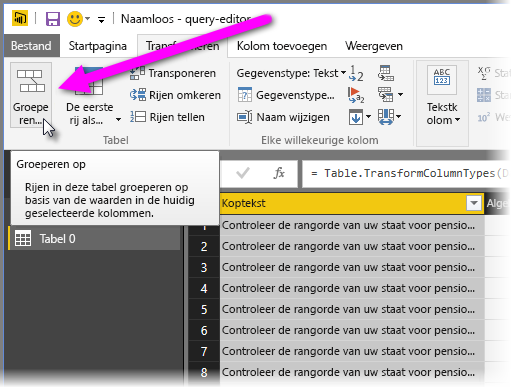

Het dialoogvenster **Groeperen op** wordt weergegeven. Wanneer de Power Query-editor rijen groepeert, wordt er een nieuwe kolom gemaakt waarin de resultaten van **Groeperen op** worden opgenomen. U kunt de **Groeperen op**-bewerking op verschillende manieren aanpassen:

1. De vervolgkeuzelijst zonder labels specificeert de kolom die moet worden gegroepeerd. In de Power Query-editor wordt deze waarde standaard ingesteld op de geselecteerde kolom, maar u kunt deze wijzigen in elke kolom in de tabel.
2. **Nieuwe kolomnaam**: De Power Query-editor stelt een naam voor de nieuwe kolom voor op basis van de bewerking die wordt toegepast op de kolom die wordt gegroepeerd. U kunt de nieuwe kolom echter elke gewenste naam geven.
3. **Bewerking**: U kunt kiezen welke bewerking de Power Query-editor toepast, zoals **Som**, **Mediaan**of **Aantal afzonderlijke rijen**. De standaardwaarde is **Rijen tellen**.
4. **Groeperingen toevoegen** en **Aggregatie toevoegen**: Deze knoppen zijn alleen beschikbaar als u de optie **Geavanceerd** selecteert. U kunt in één bewerking groepeerbewerkingen (**Groeperen op**-acties) op veel kolommen maken en verschillende aggregaties maken met behulp van deze knoppen. De Power Query-editor maakt een nieuwe kolom, gebaseerd op uw selecties in dit venster, die op meerdere kolommen van toepassing is.

Selecteer de knop **Groepering toevoegen** of **Aggregatie toevoegen** om meer groeperingen of aggregaties toe te voegen aan een **Groeperen op**-bewerking. Als u een groepering of aggregatie wilt verwijderen, selecteert u het pictogram met het weglatingsteken ( **...** ) aan de rechterkant van de rij en vervolgens **Verwijderen**. Probeer de **Groeperen op**-bewerking uit te proberen met behulp van de standaardwaarden om te zien wat er gebeurt.

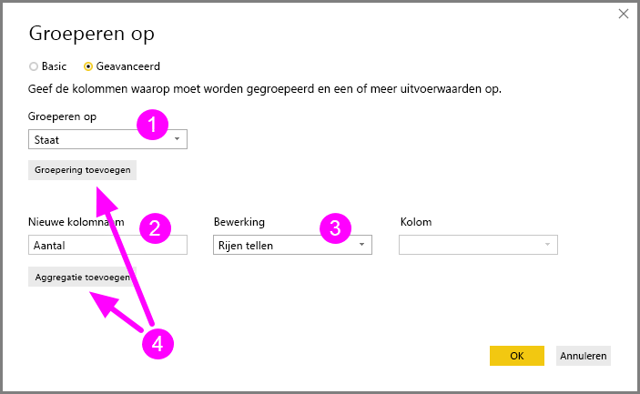

Wanneer we **OK** selecteren, wordt de **Groeperen op**-bewerking door Query uitgevoerd en worden de resultaten weergegeven. En wat blijkt: Ohio, Texas, Illinois en Californië hebben nu elk meer dan duizend instanties!

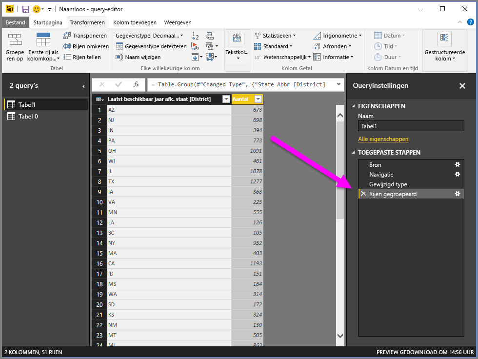

En met de Power Query-editor kunt u altijd de laatste vormbewerking verwijderen. Selecteer in het deelvenster **Query-instellingen** onder **Toegepaste stappen** de **X** naast de stap recent voltooid. Ga dus verder met experimenteren. Als de resultaten u niet bevallen, voert u de stap opnieuw uit totdat de Power Query-editor uw gegevens op de gewenste manier vormgeeft.

## Kolommen draaien

Met Power BI Desktop kunt u kolommen draaien en een tabel maken die geaggregeerde waarden voor elke unieke waarde in een kolom bevat. Als u bijvoorbeeld wilt weten hoeveel verschillende producten u in elke productcategorie hebt, kunt u snel een tabel maken die dat doet.

Hier volgt een voorbeeld. De volgende tabel **Products_by_Categories** is zodanig vormgegeven dat alleen elk uniek product (op naam) wordt weergegeven, samen met de categorie waartoe elk product behoort. Als u een nieuwe tabel wilt maken die het aantal producten voor elke categorie weergeeft (op basis van de kolom **CategoryName**), selecteert u de kolom en vervolgens **Transformeren** > **Draai kolom**.

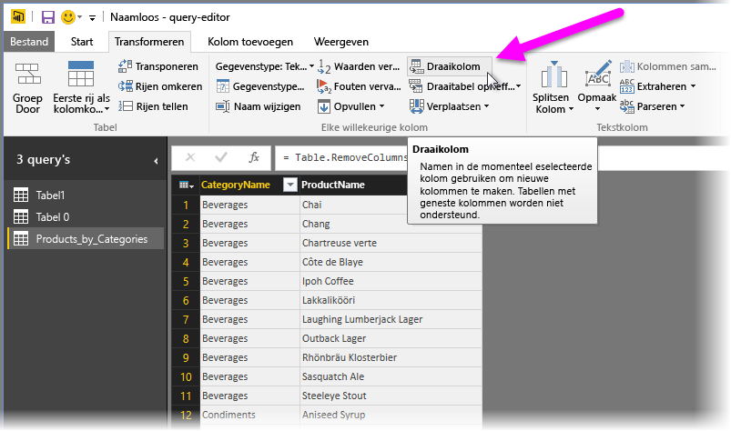

Het dialoogvenster **Draai kolom** wordt weergegeven, zodat u weet welke waarden in de kolom worden gebruikt om nieuwe kolommen te maken (1). (Als de gewenste kolomnaam van **CategoryName** niet wordt weergegeven, selecteert u deze in de vervolgkeuzelijst.) Wanneer u **Geavanceerde opties** (2) uitvouwt, kunt u de functie selecteren die wordt toegepast op de geaggregeerde waarden (3).

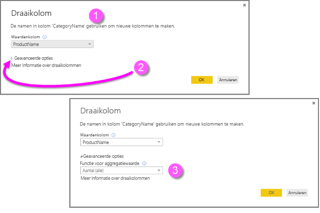

Wanneer u **OK** selecteert, wordt de tabel weergegeven op basis van de transformatie-instructies in het dialoogvenster **Draai kolom**.

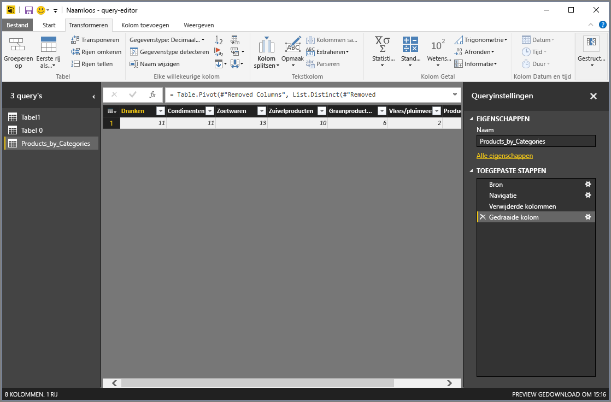

## Aangepaste kolommen maken

In de Power Query-editor kunt u aangepaste formules maken die worden toegepast op meerdere kolommen in de tabel. Vervolgens kunt u de resultaten van dergelijke formules in een nieuwe (aangepaste) kolom plaatsen. De Power Query-editor maakt het gemakkelijk om aangepaste kolommen te maken.

Met de Excel-werkmap gegevens in de Power Query-editor gaat u naar het tabblad **Kolom toevoegen** op het lint en selecteert u vervolgens **Aangepaste kolom**.

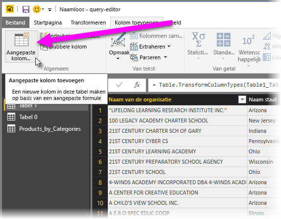

Het volgende dialoogvenster wordt weergegeven. In het volgende voorbeeld maken we een aangepaste kolom met de naam *Percent ELL* waarin van het totaal aantal studenten het percentage wordt berekend dat de Engelse taal leert.

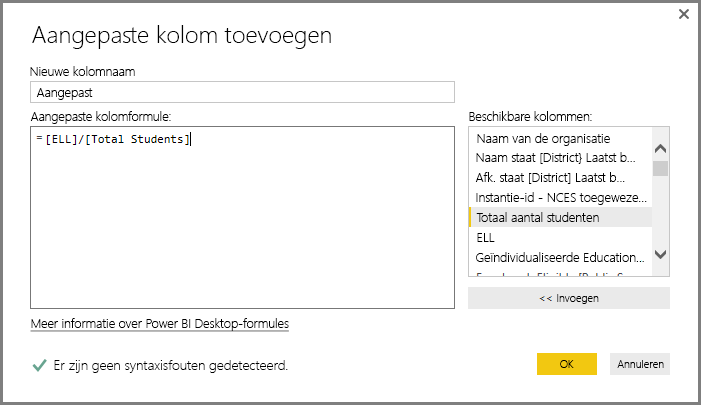

Net als bij elke andere toegepaste stap in de Power Query-editor, kunt u de stap verwijderen als de nieuwe aangepaste kolom niet de gegevens bevat die u zoekt. Selecteer in het deelvenster **Query-instellingen** onder **Toegepaste stappen** de **X** naast de stap **Aangepast toegevoegd**.

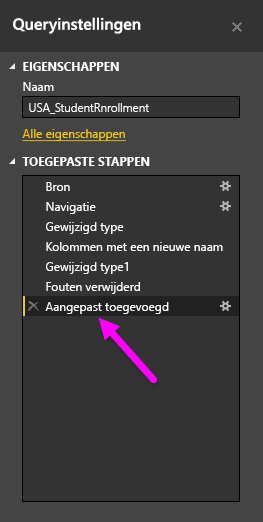

## Queryformules

U kunt de stappen bewerken die door de Power Query-editor worden gegenereerd. U kunt ook aangepaste formules maken, waarmee u uw gegevens nauwkeuriger kunt maken maakt en vormgeven. Wanneer de Power Query-editor een actie uitvoert op gegevens, wordt de aan de actie gekoppelde formule weergegeven in de formulebalk. U kunt de formulebalk weergeven door naar het tabblad **Weergeven** van het lint te gaan en **Formulebalk** te selecteren.

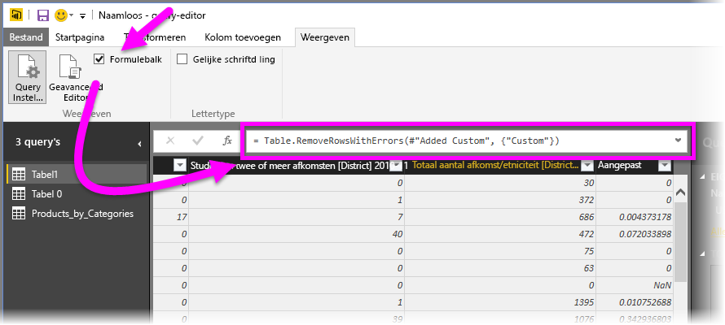

De Power Query-editor bewaart alle toegepaste stappen voor elke query in de vorm van tekst die u kunt weergeven of wijzigen. U kunt de tekst voor elke query weergeven of wijzigen met behulp van de **Geavanceerde editor**. Selecteer **Weergave** en daarna **Geavanceerde editor**.

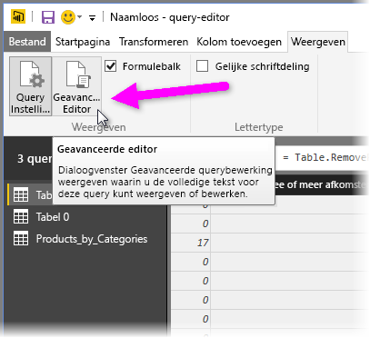

Hier ziet u de **Geavanceerde editor** met de querystappen die zijn gekoppeld aan de weergegeven **USA\_StudentEnrollment**-query. Deze stappen zijn gemaakt in de Power Query-formuletaal, die vaak wordt aangeduid als *M*. Zie [Informatie over Power Query-formules](https://support.office.com/article/learn-about-power-query-formulas-6bc50988-022b-4799-a709-f8aafdee2b2f) voor meer informatie. Zie [Specificatie van de formuletaal van Power Query M](/powerquery-m/power-query-m-language-specification) als u de taalspecificatie zelf wilt zien.

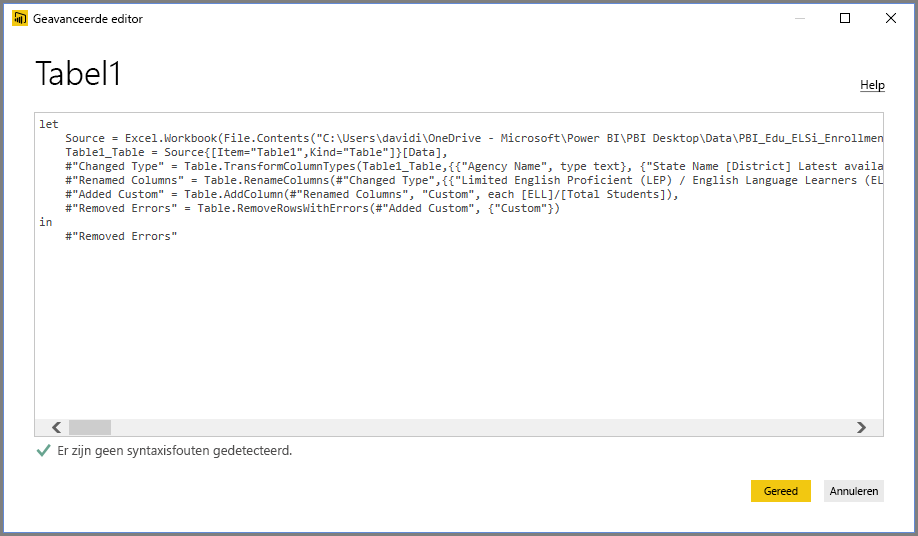

Power BI Desktop biedt een uitgebreide reeks formulecategorieën. Ga naar [Functieverwijzing voor Power Query M](/powerquery-m/power-query-m-function-reference) voor meer informatie en een volledig overzicht van alle formules in de Power Query-editor.

## Volgende stappen

U kunt allerlei handelingen uitvoeren met Power BI Desktop. Bekijk de volgende resources voor meer informatie over de vele mogelijkheden:

* [Wat is Power BI Desktop?](desktop-what-is-desktop.md)
* [Query-overzicht met Power BI Desktop](desktop-query-overview.md)
* [Gegevensbronnen in Power BI Desktop](desktop-data-sources.md)
* [Verbinding maken met gegevens in Power BI Desktop](desktop-connect-to-data.md)
* [Gegevens vormgeven en combineren met Power BI Desktop](desktop-shape-and-combine-data.md)
