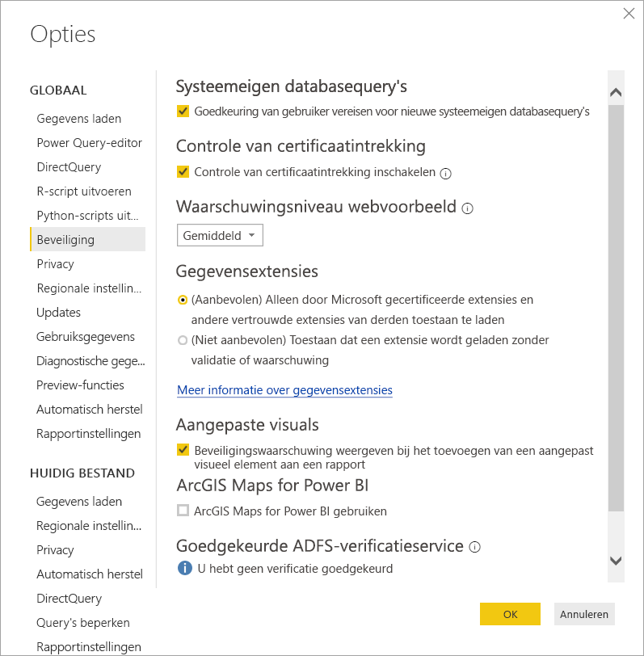

# Uitbreidbaarheid van connectors in Power BI

Power BI kan verbinding maken met gegevens door bestaande connectors en algemene gegevensbronnen te gebruiken, zoals ODBC, OData, OLE DB, Web, CSV, XML en JSON. Ontwikkelaars kunnen ook nieuwe gegevensbronnen inschakelen met aangepaste gegevensextensies, die *aangepaste connectors* worden genoemd. Sommige aangepaste connectors worden gecertificeerd en gedistribueerd door Microsoft als *gecertificeerde connectors*.

Als u niet-gecertificeerde aangepaste connectors wilt gebruiken die door u of een externe partij zijn ontwikkeld, moet u de beveiligingsinstellingen van Power BI Desktop aanpassen zodat extensies zonder validatie of waarschuwing kunnen worden geladen. Aangezien deze code referenties kan verwerken, inclusief het verzenden van deze referenties via HTTP, en privacyniveaus kan negeren, moet u deze beveiligingsinstelling alleen gebruiken als u uw aangepaste connectors absoluut vertrouwt.

Een andere mogelijkheid is dat de ontwikkelaar de connector met een certificaat ondertekent en de informatie biedt die u nodig hebt om de connector te gebruiken zonder uw beveiligingsinstellingen te wijzigen. Zie [Informatie over vertrouwde externe connectoren](desktop-trusted-third-party-connectors.md) voor meer informatie.

## Aangepaste connectors

Er zijn talloze niet-gecertificeerde aangepaste connectors, van kleine API's die van groot belang zijn voor uw bedrijf tot grote, branchespecifieke services waarvoor Microsoft nog geen connector beschikbaar heeft gesteld. Veel connectors worden gedistribueerd door leveranciers. Als u een specifieke gegevensconnector nodig hebt, neemt u contact op met de leverancier. 

Als u een niet-gecertificeerde aangepaste connector wilt gebruiken, plaatst u het *.pq*-, *.pqx*-, *.m*- of *.mez*-bestand in de map *\[Documenten\\Power BI Desktop\\Aangepaste connectors*. Als de map niet bestaat, maakt u deze.

Pas de beveiligingsinstellingen voor gegevensextensies als volgt aan:

In Power BI Desktop selecteert u **Bestand** > **Opties en instellingen** > **Opties** > **Beveiliging**.

Onder **Gegevensextensies** selecteert u **(Niet aanbevolen) Toestaan dat een extensie wordt geladen zonder validatie of waarschuwing**. Selecteer **OK** en start Power BI Desktop vervolgens opnieuw. 

De standaardbeveiligingsinstelling van Power BI Desktop voor gegevensextensies is **(Aanbevolen) Alleen door Microsoft gecertificeerde extensies en andere vertrouwde extensies van derden toestaan te laden**. Als u deze instelling inschakelt en er niet-gecertificeerde, aangepaste connectors in uw systeem aanwezig zijn, wordt het dialoogvenster **Niet-gecertificeerde connectors** weergegeven bij het starten van Power BI Desktop, waarin de connectors worden vermeld die niet veilig kunnen worden geladen.

Om de fout op te lossen, kunt u de beveiligingsinstelling voor **Gegevensextensies** wijzigen of de niet-gecertificeerde connectors uit de map *Aangepaste connectors* verwijderen.

## Gecertificeerde connectors

Een beperkte subset gegevensextensies wordt als *gecertificeerd* beschouwd. Microsoft distribueert deze connectors wel, maar kan niet verantwoordelijk worden gehouden voor de prestaties of de functionaliteit op de lange termijn. De externe ontwikkelaar die de connector heeft gemaakt, is verantwoordelijk voor het onderhoud en de ondersteuning van de connector. 

In Power BI Desktop worden gecertificeerde connectors van derden weergegeven in de lijst in het dialoogvenster **Gegevens ophalen**, samen met algemene connectors. U hoeft de beveiligingsinstellingen niet aan te passen als u de gecertificeerde connectors wilt gebruiken.

Als u een aangepaste connector wilt laten certificeren, laat u uw leverancier contact opnemen met dataconnectors@microsoft.com.
