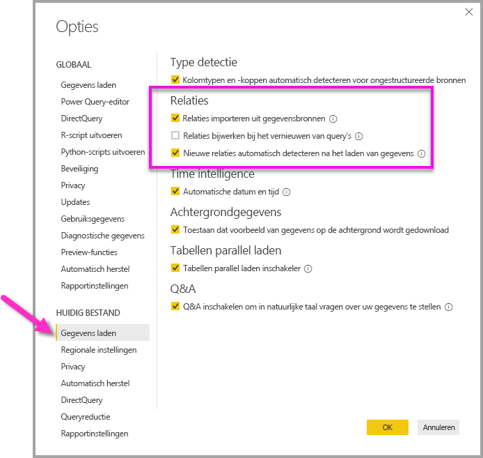

# Relaties maken en beheren in Power BI Desktop
Wanneer u meerdere tabellen importeert, gaat u waarschijnlijk analyses uitvoeren met gegevens uit de tabellen. Relaties tussen deze tabellen zijn nodig om nauwkeurig resultaten te berekenen en de juiste gegevens in uw rapporten weer te geven. Met Power BI Desktop is het maken van deze relaties eenvoudig. In de meeste gevallen hoeft u niets eens iets te doen en kan de functie Autodetectie dit voor u doen. In sommige gevallen moet u echter mogelijk zelf relaties maken of moet u enkele wijzigingen in een relatie aanbrengen. Hoe dan ook is het belangrijk om relaties in Power BI Desktop te begrijpen en te weten hoe u ze maakt en bewerkt.

## Autodetectie tijdens laden
Als u twee of meer tabellen in query op hetzelfde moment, wanneer de gegevens zijn geladen, probeert Power BI Desktop om te zoeken en relaties voor u maken. De eigenschappen voor Kardinaliteit, Kruisfilterrichting en Actief worden automatisch ingesteld. Power BI Desktop kijkt naar kolomnamen in de tabellen waarop u query's toepast om te bepalen of er mogelijke relaties zijn. Als dat het geval is, worden de relaties automatisch gemaakt. Als Power BI Desktop kan niet worden vastgesteld met een hoge mate van vertrouwen is er een overeenkomst, het maakt niet automatisch de relatie. U kunt nog steeds het dialoogvenster Relaties beheren gebruiken om relaties te maken of te bewerken.

## Een relatie maken met behulp van Autodetectie
Klik op het tabblad **Start** op **Relaties beheren** \> **Autodetectie**.

## Handmatig een relatie maken
1. Klik op het tabblad **Start** op **Relaties beheren** \> **Nieuw**.
2. In de **relatie maken** dialoogvenster, selecteer een tabel in de eerste tabel vervolgkeuzelijst lijst en selecteer vervolgens de kolom die u wilt gebruiken in de relatie.
3. In de tweede tabel vervolgkeuzelijst, selecteer de gewenste tabel in de relatie, en selecteer vervolgens de andere kolom die u wilt gebruiken, en klik vervolgens op **OK**.

Standaard Power BI Desktop automatisch geconfigureerd door de kardinaliteit (richting), kruisfilterrichting en actief eigenschappen voor uw nieuwe relatie; u kunt echter de instellingen wijzigen indien nodig. Zie het gedeelte 'Inzicht in extra opties' verderop in dit artikel voor meer informatie.

U ziet een fout die aangeeft dat *moet een van de kolommen unieke waarden bevatten* als geen van de tabellen die zijn geselecteerd voor de relatie unieke waarden heeft. Ten minste één tabel in een relatie *moet* over een specifieke, unieke lijst sleutelwaarden beschikken. Dit is een algemene vereiste voor alle databasetechnologieën op basis van relaties. 

Als deze fout optreedt, zijn er verschillende manieren om het probleem te verhelpen:

* Gebruik Dubbele rijen verwijderen om een kolom met unieke waarden te maken. Het nadeel van deze benadering is dat er informatie verloren gaat bij het verwijderen van dubbele rijen. Vaak wordt een sleutel (rij) met een goede reden gedupliceerd.
* Voeg een tussenliggende tabel op basis van de lijst afzonderlijke sleutelwaarden toe aan het model. Deze tabel wordt dan gekoppeld aan beide oorspronkelijke kolommen in de relatie.

Zie voor meer informatie, de [blogbericht](https://blogs.technet.microsoft.com/cansql/2016/12/19/relationships-in-power-bi-fixing-one-of-the-columns-must-have-unique-values-error-message/).

## Een relatie bewerken
1. Klik op het tabblad **Start** op **Relaties beheren**.
2. Selecteer in het dialoogvenster **Relaties beheren** de relatie en klik op **Bewerken**.

## Extra opties configureren
Wanneer u een relatie maakt of bewerkt, kunt u extra opties configureren. Standaard extra opties automatisch geconfigureerd op basis van een schatting, die kan verschillen voor elke relatie op basis van de gegevens in de kolommen.

## Kardinaliteit
**Veel-op-één (\*: 1)** : de meeste algemene, standaardtype, wat betekent de kolom in de ene tabel meer dan één exemplaar van een waarde en de andere, gerelateerde tabel kan hebben dat, weten vaak de opzoektabel genoemd slechts één exemplaar van een waarde heeft.

**Eén op één (1:1)** : de kolom in de ene tabel slechts één exemplaar van een bepaalde waarde heeft en de andere, gerelateerde tabel slechts één exemplaar van een bepaalde waarde heeft.

**Veel-op-veel-relaties**: U kunt veel-op-veel-relaties tussen tabellen die Hiermee verwijdert u de vereisten voor unieke waarden in tabellen tot stand te brengen met samengestelde modellen. Ook zijn eerdere tijdelijke oplossingen niet meer nodig, zoals de introductie van nieuwe tabellen om relaties tot stand te brengen. Zie [Relaties met een veel-veel-kardinaliteit](https://docs.microsoft.com/power-bi/desktop-many-to-many-relationships) voor meer informatie. 

Zie het gedeelte Inzicht in extra opties verderop in dit artikel voor meer informatie over wanneer kardinaliteit het beste kan worden gewijzigd.

## Kruisfilterrichting
**Beide** : de meest voorkomende, standaardrichting, wat betekent dat voor het filteren van doeleinden, beide tabellen worden behandeld alsof ze één tabel. **Beide** werkt goed samen met een tabel met een aantal opzoektabellen eromheen. Een voorbeeld is een tabel van de actuele verkoop met een opzoektabel voor afdelingen. Dit wordt vaak een configuratie met een stervormig schema genoemd (een centrale tabel met verschillende opzoektabellen.) Als u twee of meer tabellen hebt die ook opzoektabellen hebben (met een aantal gemeenschappelijke), kunt u de instelling Beide beter niet gebruiken. We gaan door met het vorige voorbeeld. Stel dat u ook een tabel voor verkoopbudget hebt die het beoogde budget voor elke afdeling bevat. Daarnaast is de afdelingstabel gekoppeld aan de verkoop- en de budgettabel. Vermijd de instelling Beide voor dit type configuratie.

**Één** -Filterkeuzes in gekoppelde tabellen werken op de tabel waarin waarden worden samengevoegd. Als u een Power Pivot in een Excel 2013-gegevensmodel of een eerder gegevensmodel importeert, hebben alle relaties één richting. 

Zie het gedeelte 'Inzicht in extra opties' verderop in dit artikel voor meer informatie over wanneer de kruisfilterrichting het beste kan worden gewijzigd.

## Deze relatie activeren
Wanneer deze optie is ingeschakeld, betekent dit dat de relatie als de actieve, standaard relatie fungeert. In gevallen waarbij er meer dan één relatie tussen twee tabellen bestaat, helpt de actieve relatie Power BI Desktop om automatisch visualisaties te maken die beide tabellen bevatten.

Zie het gedeelte 'Inzicht in extra opties' verderop in dit artikel voor meer informatie over wanneer u het beste een bepaalde relatie actief kunt maken.

## Inzicht in relaties
Als u een relatie tussen twee tabellen tot stand hebt gebracht, kunt u in beide tabellen met de gegevens werken alsof ze één tabel vormen. Zo hoeft u zich niet druk te maken om relatiegegevens of het samenvoegen van tabellen tot één tabel voordat u ze importeert. In veel gevallen kan Power BI Desktop automatisch relaties voor u maken, zodat u deze relaties misschien niet eens zelf hoeft te maken. Echter, als Power BI Desktop niet met een hoge mate van zekerheid dat een relatie tussen twee tabellen bestaat, het maakt niet automatisch de relatie. In dat geval moet u de relatie maken. 

We gaan via een snelle zelfstudie voor meer inzicht krijgt in de werking van relaties in Power BI Desktop.

>[!TIP]
>U kunt deze les zelf afronden. Kopieer de onderstaande ProjectHours-tabel naar een Excel-werkblad, selecteert alle cellen en klik op **INVOEGEN** \> **Tabel**. Klik in het dialoogvenster **Tabel maken** op **OK**. Bij **Tabelnaam** typt u **ProjectHours**. Doe hetzelfde voor de tabel CompanyProject. U kunt de gegevens vervolgens importeren met behulp van **Gegevens ophalen** in Power BI Desktop. Selecteer uw werkmap en tabellen als gegevensbron.

De eerste tabel, ProjectHours, is een overzicht van werktickets met het aantal uren dat een persoon aan een bepaald project heeft gewerkt. 

**ProjectHours**

| **Ticket** | **SubmittedBy** | **Hours** | **Project** | **DateSubmit** |
| ---:|:--- | ---:|:--- | ---:|
| 1001 |Brewer, Alan |22 |Blauw |1/1/2013 |
| 1002 |Brewer, Alan |26 |Rood |2/1/2013 |
| 1003 |Ito, Shu |34 |Geel |12/4/2012 |
| 1004 |Brewer, Alan |13 |Oranje |1/2/2012 |
| 1005 |Bowen, Eli |29 |Paars |10/1/2013 |
| 1006 |Bento, Nuno |35 |Groen |2/1/2013 |
| 1007 |Hamilton, David |10 |Geel |10/1/2013 |
| 1008 |Han, Mu |28 |Oranje |1/2/2012 |
| 1009 |Ito, Shu |22 |Paars |2/1/2013 |
| 1010 |Bowen, Eli |28 |Groen |10/1/2013 |
| 1011 |Bowen, Eli |9 |Blauw |10/15/2013 |

Deze tweede tabel, CompanyProject, is een lijst met projecten met een toegewezen prioriteit: A, B of C. 

**CompanyProject**

| **ProjName** | **Priority** |
| --- | --- |
| Blauw |A |
| Rood |B |
| Groen |C |
| Geel |C |
| Paars |B |
| Oranje |C |

U ziet dat elke tabel een projectkolom bevat. Elke kolom heeft een net iets andere naam, maar de waarden lijken hetzelfde te zijn. Dat is belangrijk en we je krijgt in binnenkort.

Nu we de twee tabellen in een model hebben geïmporteerd, gaan we een rapport maken. Het eerste dat we willen ophalen, is het aantal uren dat is ingediend per projectprioriteit. Daarvoor selecteren we **Priority** en **Hours** in Velden.

 

Als u de tabel in het rapportcanvas bekijkt, ziet u dat het aantal uren **256,00** is voor elk project, en dat is ook het totale aantal. Dat is duidelijk niet correct. Hoe kan dat? Dit komt doordat we niet een totaalaantal van waarden uit één tabel kunnen berekenen (Hours in de tabel Project) en dit kunnen delen door waarden in een andere tabel (Priority in de tabel CompanyProject) zonder dat er een relatie tussen deze twee tabellen bestaat.

Daarom gaan we een relatie tussen deze twee tabellen maken.

Weet u nog, die kolommen in beide tabellen met een projectnaam, maar met waarden die op elkaar lijken? We gaan deze twee kolommen gebruiken om een relatie tussen de tabellen te maken.

Waarom deze kolommen? Als we kijken naar de kolom Project in de tabel ProjectHours, zien we waarden zoals blauw, rood, geel, oranje enzovoort. Er zijn zelfs meerdere rijen die dezelfde waarde hebben. We hebben veel kleurwaarden voor Project.

In de kolom ProjName in de tabel CompanyProject zien we dat er maar één van elk van de kleurwaarden voor project is. Elke kleurwaarde in deze tabel is uniek, en dat is belangrijk, omdat we een relatie tussen deze twee tabellen kunnen maken. In dit geval een veel-op-een-relatie. Bij een veel-op-een-relatie moet ten minste één kolom in een van de tabellen unieke waarden bevatten. Er zijn voor sommige relaties een aantal extra opties; deze bekijken we later. We maken in dit voorbeeld een relatie tussen de kolommen Project in elk van de twee tabellen.

### De nieuwe relatie maken
1. Klik op **Relaties beheren**.
2. In **relaties beheren**, klikt u op **nieuw** openen de **relatie maken** dialoogvenster waarin we selecteren kunt in de tabellen, kolommen en geef de overige instellingen voor onze de relatie.
3. Selecteer in de eerste tabel **ProjectHours** en selecteer vervolgens de kolom **Project**. Dit is de 'veel'-zijde van de relatie.
4. Selecteer in de tweede tabel **CompanyProject** en selecteer vervolgens de kolom **ProjName**. Dit is de 'een'-zijde van de relatie. 
5. Klik op **OK** in zowel het dialoogvenster **Relatie maken** als het dialoogvenster **Relaties beheren**.

Uit oogpunt van volledige openbaarmaking u zojuist hebt gemaakt deze relatie de moeilijke manier. U kunt net hebt geklikt op de knop autodetectie kunnen klikken in het dialoogvenster Relaties beheren. Autodetect had de relatie kunnen maken toen u de gegevens laadde als beide kolommen dezelfde naam hadden gehad. Maar daar zit natuurlijk geen uitdaging in.

Kijk nu nog eens naar de tabel in het Rapportcanvas.

 

Dat ziet er een stuk beter uit, toch?

Als we uren optellen per prioriteit, Power BI Desktop ziet er uit voor elk exemplaar van de unieke kleurwaarden in de opzoektabel companyproject, en vervolgens zoeken naar elke instantie van elk van deze waarden in de tabel CompanyProject en totale aantal voor elke unieke waarde berekenen .

Dat was eenvoudig, in feite, met autodetectie, hebt u mogelijk ook geen nog veel eenvoudiger.

## Inzicht in extra opties
Wanneer een relatie is gemaakt, met autodetectie of handmatig, configureert Power BI Desktop automatisch extra opties op basis van de gegevens in de tabellen. U kunt deze extra relatie-eigenschappen die zich in de laagste gedeelte bevinden van het dialoogvenster van de relatie maken/bewerken.

 

Zoals gezegd, worden deze eigenschappen meestal automatisch ingesteld en hoeft u er niks aan te veranderen. Er zijn echter een aantal situaties waarin u mogelijk deze opties zelf wilt configureren.

## Relatie van automatische updates

U kunt beheren hoe Power BI worden behandeld en wordt automatisch aangepast relaties in uw rapporten en modellen. U kunt opgeven hoe relaties opties worden verwerkt door Power BI **bestand > Opties en instellingen > opties** vanuit Power BI Desktop, selecteert u vervolgens **laden van gegevens** in het linkerdeelvenster. Vervolgens ziet u opties voor **relaties**.

 

Er zijn drie opties die kunnen worden geselecteerd en ingeschakeld. 

De eerste optie is *relaties importeren uit gegevensbronnen*, en is standaard geselecteerd. Als u selecteert, Power BI controleert voor relaties gedefinieerd in uw gegevensbron, zoals refererende sleutel / primaire sleutel van relaties in uw datawarehouse. Als deze relaties bestaat, worden ze gespiegeld in het gegevensmodel van Power BI wanneer u in eerste instantie gegevens laadt. Deze optie kunt u snel aan de slag met het model, in plaats van dat u hoeft zoeken of deze relaties zelf definiëren.

De tweede optie is *bijwerken of verwijderen van relaties bij het vernieuwen van gegevens*, en deze is standaard uitgeschakeld. Als u hebt geselecteerd (ingeschakeld door het selectievakje naast de optie), Power BI controleert op wijzigingen in de relaties tussen de bron van gegevens als uw gegevensset wordt vernieuwd. Als deze relaties gewijzigd of verwijderd, worden deze wijzigingen in een eigen gegevensmodel in Power BI gespiegeld bijwerken of verwijderen zodat deze overeenkomt met.

> [!WARNING]
> Als u beveiliging op rijniveau die is gebaseerd op de gedefinieerde relaties gebruikt, raden we niet te selecteren van de tweede optie, *bijwerken of verwijderen van relaties bij het vernieuwen van gegevens*. Als een relatie wordt verwijderd dat uw instellingen voor beveiliging op Rijniveau afhankelijk zijn, is het mogelijk dat uw model minder goed beveiligd. 

De derde optie *nieuwe relaties automatisch detecteren nadat gegevens zijn geladen*, die wordt beschreven de [autodetectie tijdens laden](#autodetect-during-load) sectie eerder in dit artikel. 

## Toekomstige updates voor de gegevens vereisen een andere kardinaliteit
Power BI Desktop kan normaal gesproken automatisch de beste kardinaliteit voor de relatie bepalen. Als u de automatische instelling wilt overschrijven omdat u weet dat de gegevens in de toekomst veranderen, selecteert u deze in het besturingselement Kardinaliteit. Hieronder volgt een voorbeeld waarin een andere kardinaliteit moet worden geselecteerd.

De tabel CompanyProjectPriority hieronder bevat een lijst met alle bedrijfsprojecten en de bijbehorende prioriteit. De tabel ProjectBudget bevat de projecten waarvoor het budget is goedgekeurd.

**ProjectBudget**

| **Approved Projects** | **BudgetAllocation** | **AllocationDate** |
|:--- | ---:| ---:|
| Blauw |40,000 |12/1/2012 |
| Rood |100,000 |12/1/2012 |
| Groen |50,000 |12/1/2012 |

**CompanyProjectPriority**

| **Project** | **Priority** |
| --- | --- |
| Blauw |A |
| Rood |B |
| Groen |C |
| Geel |C |
| Paars |B |
| Oranje |C |

We maken als volgt een relatie tussen de kolom Project in de tabel CompanyProjectPriority en de kolom ApprovedProjects in de tabel ProjectBudget:

 

De kardinaliteit is automatisch ingesteld op Eén-op-één (1:1) en kruislings filteren op Beide (zoals weergegeven). Dit komt doordat voor Power BI Desktop de beste combinatie van de twee tabellen er als volgt uitziet:

| **Project** | **Priority** | **BudgetAllocation** | **AllocationDate** |
|:--- | --- | ---:| ---:|
| Blauw |A |40,000 |12/1/2012 |
| Rood |B |100,000 |12/1/2012 |
| Groen |C |50,000 |12/1/2012 |
| Geel |C |  |  |
| Paars |B |  |  |
| Oranje |C |  |  |

Er is een één-op-éénrelatie tussen de twee tabellen omdat er geen herhaalde waarden zijn in de kolom Project van de gecombineerde tabel. De kolom Project is uniek, omdat elke waarde slechts één keer voorkomt. Daardoor kunnen de rijen van de twee tabellen rechtstreeks zonder duplicatie worden gecombineerd.

Maar stel dat u weet dat de gegevens worden gewijzigd de volgende keer dat u ze vernieuwd. Een vernieuwde versie van de tabel ProjectBudget bevat nu extra rijen voor blauw en rood:

**ProjectBudget**

| **Approved Projects** | **BudgetAllocation** | **AllocationDate** |
| --- | ---:| ---:|
| Blauw |40,000 |12/1/2012 |
| Rood |100,000 |12/1/2012 |
| Groen |50,000 |12/1/2012 |
| Blauw |80,000 |6/1/2013 |
| Rood |90,000 |6/1/2013 |

 Dit betekent dat de beste combinatie van de twee tabellen er nu zo uitziet: 

| **Project** | **Priority** | **BudgetAllocation** | **AllocationDate** |
| --- | --- | ---:| ---:|
| Blauw |A |40,000 |12/1/2012 |
| Rood |B |100,000 |12/1/2012 |
| Groen |C |50,000 |12/1/2012 |
| Geel |C |  |  |
| Paars |B |  |  |
| Oranje |C |  |  |
| Blauw |A |80000 |6/1/2013 |
| Rood |B |90000 |6/1/2013 |

In deze nieuwe gecombineerde tabel bevat de kolom Project herhaalde waarden. De twee oorspronkelijke tabellen hebben geen één-op-éénrelatie meer zodra de tabel wordt vernieuwd. Omdat in dit geval toekomstige updates ertoe leiden dat de kolom Project dubbele waarden krijgt, kunt u de kardinaliteit het beste op Veel-op-een (\*: 1) instellen, met 'veel' aan de zijde van ProjectBudget en 'een' aan de zijde van CompanyProjectPriority.

## De kruisfilterrichting aanpassen voor een complexe reeks tabellen en relaties
Voor de meeste relaties wordt de richting voor kruislings filteren ingesteld op 'Beide'. Er zijn echter enkele meer ongewone gevallen waarin u van de standaardinstelling wilt afwijken, bijvoorbeeld als u een model vanuit een oudere versie van Power Pivot wilt importeren, waarbij elke relatie in één richting is ingesteld. 

Met de instelling Beide kan Power BI Desktop alle aspecten van de gekoppelde tabellen behandelen alsof ze bij één tabel horen. Er zijn echter een aantal situaties waarin Power BI Desktop de kruisfilterrichting van een relatie niet op Beide kan instellen en tegelijkertijd een ondubbelzinnige set standaardinstellingen kan bieden voor rapportagedoeleinden. Als de kruisfilterrichting van een relatie niet op Beide wordt ingesteld, komt dit meestal omdat er anders dubbelzinnigheid zou ontstaan. Als de standaardinstelling voor kruislings filteren niet handig is, kunt u proberen het filteren op een bepaalde tabel of op Beide in te stellen.

Kruislings filteren in één richting werkt in de meeste gevallen. Als u een model uit Power Pivot in Excel 2013 of eerder hebt geïmporteerd, worden alle relaties op één richting ingesteld. Eén richting betekent dat filterkeuzes in gekoppelde tabellen worden toegepast op de tabel waarin waarden worden samengevoegd. Kruislings filteren kan soms lastig te begrijpen zijn. Daarom volgt hier een voorbeeld.

 

Als u kruislings filteren in één richting gebruikt, kunt u een rapport maken dat een overzicht van de projecturen bevat, en u kunt ervoor kiezen om deze vervolgens te sorteren (of te filteren) op CompanyProject, Priority of CompanyEmployee, City. U kunt echter niet het aantal werknemers per project tellen (een minder gebruikelijke opdracht). U krijgt een kolom met waarden die allemaal hetzelfde zijn. In het voorbeeld hieronder is de kruisfilterrichting van beide relaties ingesteld op één richting: in de richting van de tabel ProjectHours:

 

Filterspecificatie wordt overgebracht van CompanyProject naar CompanyEmployee (zoals weergegeven in de onderstaande afbeelding), maar deze stroom wordt niet naar CompanyEmployee. Als u de kruisfilterrichting echter instelt op Beide, werkt het wel. De instelling Beide zorgt ervoor dat de filterspecificatie naar Employee kan worden overgebracht.

 

Wanneer de kruisfilterrichting op Beide is ingesteld, wordt het rapport correct weergegeven:

 

Kruislings filteren in beide richtingen is geschikt voor een patroon van relaties tussen tabellen die lijkt op het bovenstaande patroon. Dit wordt meestal een stervormig schema genoemd en ziet er als volgt uit:

 

De kruisfilterrichting werkt niet goed met een meer algemeen patroon dat vaak geldt voor databases, zoals in dit diagram:

 

Als u een dergelijk tabelpatroon hebt, met lussen, kan kruislings filteren een reeks dubbelzinnige relaties vormen. Als u bijvoorbeeld een veld van TableX optelt en vervolgens filtert op een veld in TableY, is het niet duidelijk hoe het filter moet worden toegepast: via de bovenste of onderste tabel. Een veelvoorkomend voorbeeld voor dit type patroon is wanneer TableX een verkooptabel is met actuele gegevens en TableY budgetgegevens is. In dat geval zijn de tabellen in het midden opzoektabellen die door beide tabellen worden gebruikt, zoals Division of Region. 

Net als bij actieve/inactieve relaties staat Power BI Desktop niet toe dat een relatie wordt ingesteld op Beide als er daardoor dubbelzinnigheid in rapporten ontstaat. Er zijn verschillende manieren om dit op te lossen. We noemen hier de twee meest voorkomende:

* Verwijder relaties of stel ze in als inactief om dubbelzinnigheid te verminderen. Vervolgens kunt u kruislings filteren voor een relatie mogelijk op Beide instellen.
* Haal een tabel twee keer op (de tweede keer met een andere naam) om lussen te voorkomen. Hierdoor wordt het patroon van relaties vergelijkbaar met een stervormig schema. Bij een stervormig schema kunnen alle relaties op Beide worden ingesteld.

## Verkeerde actieve relatie
Wanneer Power BI Desktop automatisch relaties maakt, wordt er soms meer dan één relatie tussen twee tabellen aangetroffen. In een dergelijk geval wordt maar een van de relaties als actief ingesteld. De actieve relatie fungeert als de standaardrelatie, zodat Power BI Desktop automatisch een visualisatie voor u kan maken wanneer u velden uit twee verschillende tabellen kiest. In sommige gevallen is de automatisch geselecteerde relatie echter de verkeerde. U kunt in het dialoogvenster Relaties beheren een relatie als actief of inactief instellen. U kunt ook de actieve relatie instellen in het dialoogvenster Relatie bewerken. 

Power BI Desktop staat slechts één actieve relatie tegelijk tussen twee tabellen toe om ervoor te zorgen dat er een standaardrelatie is. Eerst moet de huidige relatie dus als inactief worden ingesteld en vervolgens de gewenste relatie op actief worden ingesteld.

Hier volgt een voorbeeld. De eerste tabel is ProjectTickets en de volgende tabel is EmployeeRole.

**ProjectTickets**

| **Ticket** | **OpenedBy** | **SubmittedBy** | **Hours** | **Project** | **DateSubmit** |
| ---:|:--- |:--- | ---:|:--- | ---:|
| 1001 |Perham, Tom |Brewer, Alan |22 |Blauw |1/1/2013 |
| 1002 |Roman, Daniel |Brewer, Alan |26 |Rood |2/1/2013 |
| 1003 |Roth, Daniel |Ito, Shu |34 |Geel |12/4/2012 |
| 1004 |Perham, Tom |Brewer, Alan |13 |Oranje |1/2/2012 |
| 1005 |Roman, Daniel |Bowen, Eli |29 |Paars |10/1/2013 |
| 1006 |Roth, Daniel |Bento, Nuno |35 |Groen |2/1/2013 |
| 1007 |Roth, Daniel |Hamilton, David |10 |Geel |10/1/2013 |
| 1008 |Perham, Tom |Han, Mu |28 |Oranje |1/2/2012 |
| 1009 |Roman, Daniel |Ito, Shu |22 |Paars |2/1/2013 |
| 1010 |Roth, Daniel |Bowen, Eli |28 |Groen |10/1/2013 |
| 1011 |Perham, Tom |Bowen, Eli |9 |Blauw |10/15/2013 |

**EmployeeRole**

| **Employee** | **Role** |
| --- | --- |
| Bento, Nuno |Project Manager |
| Bowen, Eli |Project Lead |
| Brewer, Alan |Project Manager |
| Hamilton, David |Project Lead |
| Han, Mu |Project Lead |
| Ito, Shu |Project Lead |
| Perham, Tom |Project Sponsor |
| Roman, Daniel |Project Sponsor |
| Roth, Daniel |Project Sponsor |

Er bestaan hier eigenlijk twee relaties. De ene relatie is tussen SubmittedBy in de tabel ProjectTickets en Employee in de tabel EmployeeRole, en de andere is tussen OpenedBy in de tabel ProjectTickets en Employee in de tabel EmployeeRole.

 

Als we beide relaties aan het model toevoegen (OpenedBy eerst), wordt in het dialoogvenster Relaties beheren weergegeven dat OpenedBy actief is:

 

Nu, als we een rapport dat gebruikmaakt van de velden Role en Employee uit EmployeeRole, en het veld Hours uit ProjectTickets in een tabelvisualisatie in het rapportcanvas maakt, zien we alleen projectsponsoren omdat ze alleen degene die een projectticket geopend.

 

We kunnen de actieve relatie wijzigen en SubmittedBy in plaats van OpenedBy ophalen. In Relaties beheren schakelt u de relatie van ProjectTickets(OpenedBy) naar EmployeeRole(Employee) uit en schakelt u vervolgens de relatie Project Tickets(SubmittedBy) naar EmployeeRole(Employee) in.

## Al uw relaties bekijken in de weergave van relaties
Soms heeft uw model meerdere tabellen en complexe relaties tussen deze tabellen. De relatieweergave in Power BI Desktop bevat alle relaties in het model, de bijbehorende richting en de kardinaliteit in een eenvoudig en aanpasbaar diagram. Zie [Relatieweergave in Power BI Desktop](desktop-relationship-view.md) voor meer informatie.

