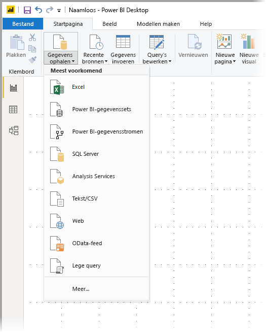
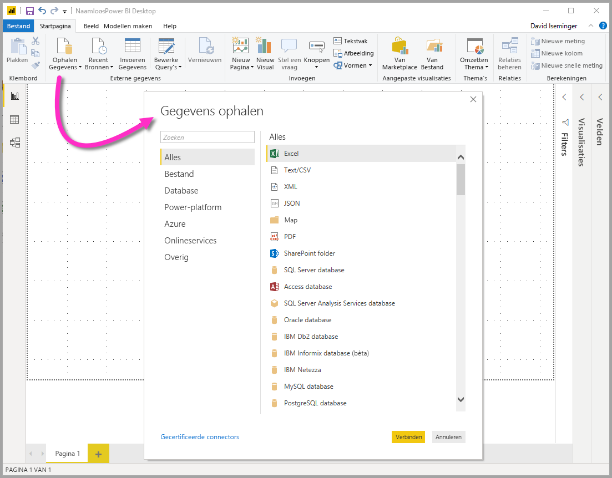
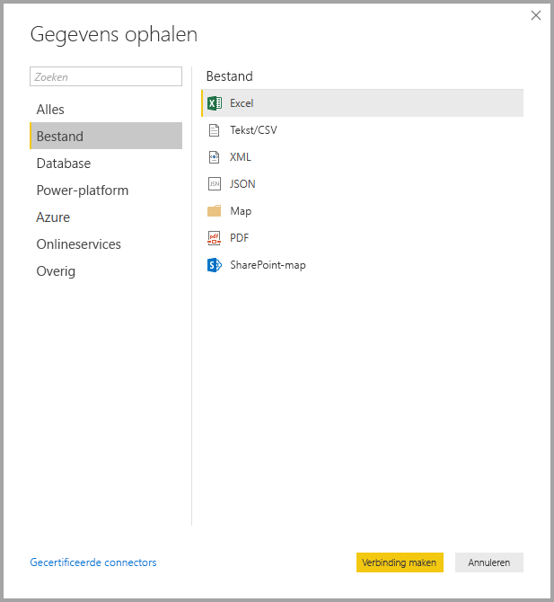
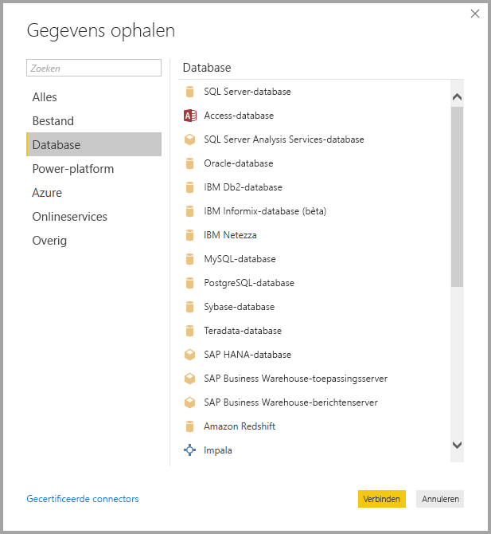
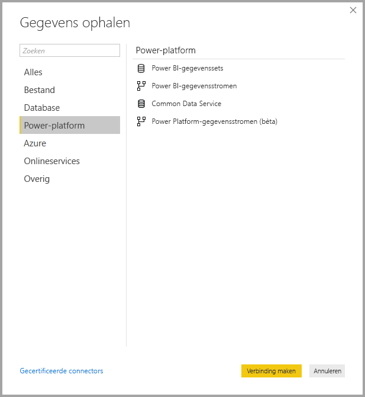
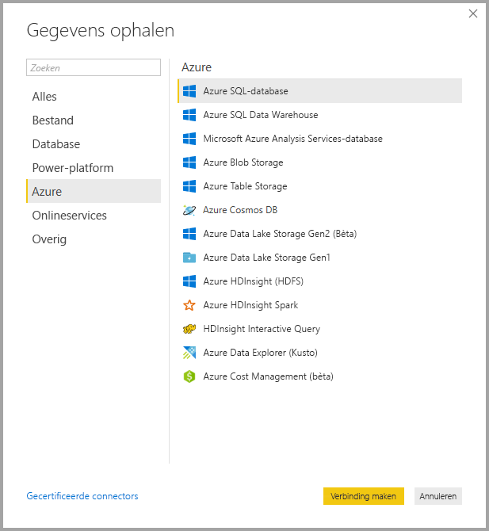
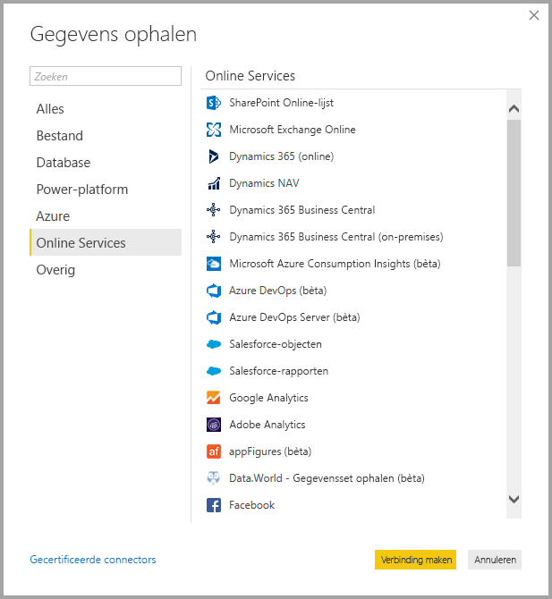
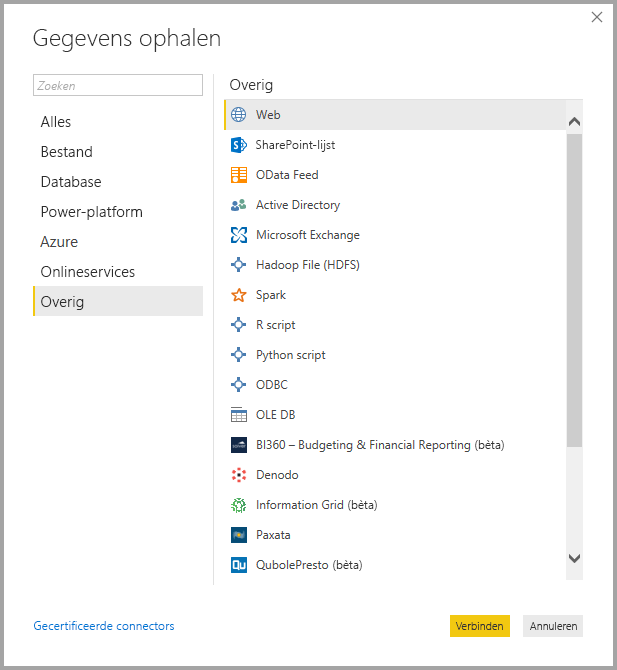
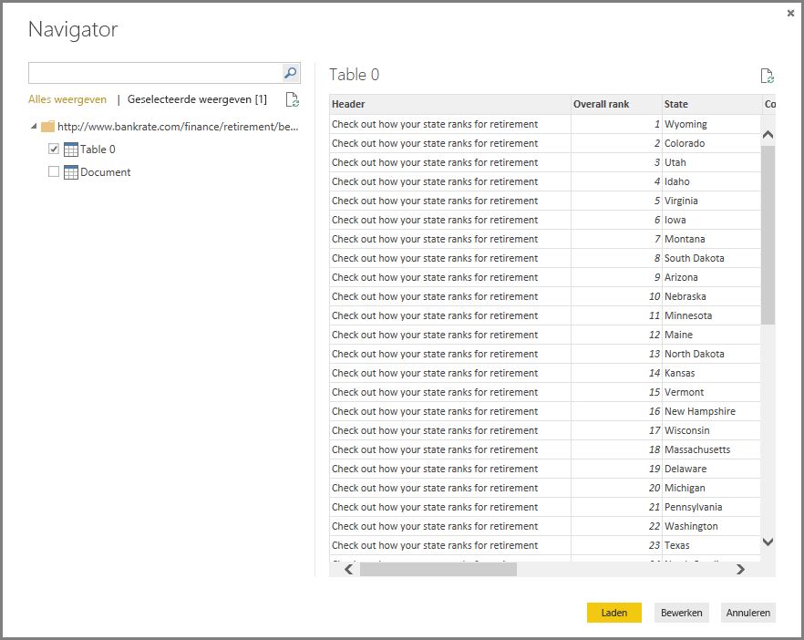

# <a name="data-sources-in-power-bi-desktop"></a>Gegevensbronnen in Power BI Desktop
Met Power BI Desktop kunt u verbinding maken met gegevens uit veel verschillende bronnen. Onderaan op deze pagina vindt u een volledige lijst met beschikbare gegevensbronnen.

Als u verbinding wilt maken met gegevens, selecteert u **Gegevens ophalen** op het lint **Start**. Als u de pijl-omlaag selecteert of de tekst **Gegevens ophalen** op de knop, wordt het menu met **meest voorkomende** gegevenstypen weergegeven, zoals in de volgende afbeelding:



Als u **Meer...** selecteert in het menu **Meest voorkomend**, wordt het venster **Gegevens ophalen** weergegeven. U kunt het venster **Gegevens ophalen** ook weergeven (en het menu **Meest voorkomend** omzeilen) door de **pictogramknop** **Gegevens ophalen** rechtstreeks te selecteren.



> [!NOTE]
> Het Power BI-team breidt de beschikbare gegevensbronnen voor **Power BI Desktop** en de **Power BI-service** voortdurend uit. Daarom ziet u vaak vroege versies van gegevensbronnen waaraan wordt gewerkt en die worden aangeduid als *bèta* of *preview*. Een gegevensbron die wordt gemarkeerd als *bèta* of *preview*, heeft beperkte ondersteuning en functionaliteit en dient niet te worden gebruikt in een productieomgeving. 

> Daarnaast is het mogelijk dat gegevensbronnen die als *bèta* of *preview* voor **Power BI Desktop** zijn gemarkeerd, pas beschikbaar zijn voor gebruik in de **Power BI-service** of in andere Microsoft-services als de gegevensbron algemeen beschikbaar is.

## <a name="data-sources"></a>Gegevensbronnen
Gegevenstypen zijn ingedeeld in de volgende categorieën:

* Alle
* Bestand
* Database
* Power BI
* Azure
* Onlineservices
* Overige

De categorie **Alle** omvat alle gegevenstypen uit alle categorieën.

De categorie **Bestand** biedt de volgende gegevensverbindingen:

* Excel
* Tekst/CSV
* XML
* JSON
* Map
* PDF
* SharePoint-map

In de volgende afbeelding ziet u het venster **Gegevens ophalen** voor **Bestand**.



De categorie **Database** biedt de volgende gegevensverbindingen:

* SQL Server-database
* Access-database
* SQL Server Analysis Services-database
* Oracle-database
* IBM DB2-database
* IBM Informix-database (bèta)
* IBM Netezza
* MySQL-database
* PostgreSQL-database
* Sybase-database
* Teradata
* SAP HANA-database
* SAP Business Warehouse-toepassingsserver
* SAP Business Warehouse-berichtenserver
* Amazon Redshift
* Impala
* Google BigQuery
* Vertica
* Snowflake
* Essbase
* AtScale-kubussen (bèta)
* BI-connector
* Dremio
* Exasol
* Indexima (bèta)
* InterSystems IRIS (bèta)
* Jethro (bèta)
* Kyligence Enterprise (bèta)
* MarkLogic (bèta)

> [!NOTE]
> Sommige databaseconnectors moet u eerst inschakelen door **Bestand > Opties en instellingen > Opties** te selecteren en vervolgens **Voorbeeldfuncties** en de connector in te schakelen. Als u geen van de hierboven genoemde connectors ziet en ze wel wilt gebruiken, controleert u de instellingen voor **Voorbeeldfuncties**. Houd er ook rekening mee dat een gegevensbron die wordt gemarkeerd als *bèta* of *preview*, beperkte ondersteuning en functionaliteit heeft en niet dient te worden gebruikt in een productieomgeving.

In de volgende afbeelding ziet u het venster **Gegevens ophalen** voor **Database**.



De categorie **Power Platform** biedt de volgende gegevensverbindingen:

* Power BI-gegevenssets
* Power BI-gegevensstromen
* Common Data Service
* Power Platform-gegevensstromen (bèta)

In de volgende afbeelding ziet u het venster **Gegevens ophalen** voor **Power Platform**.



De categorie **Azure** biedt de volgende gegevensverbindingen:

* Azure SQL-database
* Azure SQL Data Warehouse
* Microsoft Azure Analysis Services-database
* Azure Blob Storage
* Azure Table Storage
* Azure Cosmos DB
* Azure Data Lake Storage Gen2 (Bèta)
* Azure Data Lake Storage Gen1
* Azure HDInsight (HDFS)
* Azure HDInsight Spark
* HDInsight Interactive Query
* Azure Data Explorer (Kusto)
* Azure Cost Management (bèta)

In de volgende afbeelding ziet u het venster **Gegevens ophalen** voor **Azure**.



De categorie **Onlineservices** biedt de volgende gegevensverbindingen:

* SharePoint Online-lijst
* Microsoft Exchange Online
* Dynamics 365 (online)
* Dynamics NAV
* Dynamics 365 Business Central
* Dynamics 365 Business Central (on-premises)
* Microsoft Azure Consumption Insights (bèta)
* Azure DevOps (bèta)
* Azure DevOps Server (bèta)
* Salesforce-objecten
* Salesforce-rapporten
* Google Analytics
* Adobe Analytics
* appFigures (bèta)
* Data.World - Gegevensset ophalen (bèta)
* Facebook
* GitHub (bèta)
* MailChimp (bèta)
* Marketo (bèta)
* Mixpanel (bèta)
* Planview Enterprise One - PRM (bèta)
* Planview Projectplace (bèta)
* QuickBooks Online (bèta)
* Smartsheet
* SparkPost (bèta)
* Stripe (bèta)
* SweetIQ (bèta)
* Planview Enterprise One - CMT (bèta)
* Twilio (bèta)
* tyGraph (bèta)
* Webtrends (bèta)
* Zendesk (bèta)
* Dynamics 365 Customer Insights (Bèta)
* Emigo Data Source (bèta)
* Entersoft Business Suite (bèta)
* Industrial App Store
* Intune Data Warehouse (bèta)
* Microsoft Graph Security (bèta)
* Quick Base
* TeamDesk (bèta)


In de volgende afbeelding ziet u het venster **Gegevens ophalen** voor **Onlineservices**.



De categorie **Overige** biedt de volgende gegevensverbindingen:

* Web
* SharePoint-lijst
* OData-feed
* Active Directory
* Microsoft Exchange
* Hadoop-bestand (HDFS)
* Spark
* R-script
* Python-script
* ODBC
* OLE DB
* BI360 - Budgeting & Financial Reporting (bèta)
* Denodo
* Information Grid (bèta)
* Paxata 
* QubolePresto (bèta)
* Roamler (bèta)
* SurveyMonkey (bèta)
* Tenforce (Smart)List (bèta)
* Workforce Dimensions (bèta)
* Lege query

In de volgende afbeelding ziet u het venster **Gegevens ophalen** voor **Overige**.



> [!NOTE]
> Op dit moment is het niet mogelijk om verbinding te maken met aangepaste gegevensbronnen die zijn beveiligd met Azure Active Directory.

## <a name="connecting-to-a-data-source"></a>Verbinding maken met een gegevensbron
Als u verbinding wilt maken met een gegevensbron, selecteert u de gegevensbron in het venster **Gegevens ophalen** en selecteert u **Verbinding maken**. In de volgende afbeelding is **Web** geselecteerd in de categorie **Overige**.


Er wordt een verbindingsvenster weergegeven dat specifiek is voor het type gegevensverbinding. Als referenties zijn vereist, wordt u gevraagd ze op te geven. In de volgende afbeelding ziet u hoe een URL wordt ingevoerd om verbinding te maken met een webgegevensbron.


Nadat u de URL of de gegevens voor de bronverbinding hebt ingevoerd, selecteert u **OK**. Power BI Desktop maakt de verbinding met de gegevensbron en toont de beschikbare gegevensbronnen in de **Navigator**.



U kunt de gegevens laden door de knop **Laden** onderaan in het deelvenster **Navigator** te selecteren of de query bewerken voordat gegevens worden geladen door de knop **Bewerken** te selecteren.

Dat is alles wat u hoeft te weten om verbinding te maken met gegevensbronnen in Power BI Desktop! Probeer verbinding te maken met onze groeiende lijst gegevensbronnen en kom regelmatig terug. We blijven deze lijst voortdurend uitbreiden.

## <a name="using-pbids-files-to-get-data"></a>Gegevens ophalen met behulp van PBIDS-bestanden

PBIDS-bestanden zijn Power BI Desktop-bestanden die een specifieke structuur hebben, samen met een .PBIDS-extensie om aan te geven dat het een Power BI-gegevensbronbestand betreft.

U kunt een .PBIDS-bestand maken voor het stroomlijnen van de **Get Data**-ervaring voor rapportontwerpers in uw organisatie. Het wordt aanbevolen dat beheerders deze bestanden maken voor veelgebruikte verbindingen, om het gebruik van PBIDS-bestanden voor nieuwe rapportontwerpers te vereenvoudigen. 

Wanneer een ontwerper een .PBIDS-bestand opent, wordt Power BI Desktop geopend en wordt de gebruiker gevraagd om referenties te verifiëren en verbinding te maken met de gegevensbron die in het bestand is opgegeven. Het navigatievenster wordt weergegeven en de gebruiker moet de tabellen van die gegevensbron selecteren om in het model te laden. Gebruikers moeten wellicht ook de database(s) selecteren als er geen is opgegeven in het .PBIDS-bestand. 

Vanaf dat moment kan de gebruiker beginnen met het samenstellen van visualisaties of aan de slag gaan met recente bronnen om een nieuwe set tabellen in het model te laden. 

Momenteel ondersteunen .PBIDS-bestanden slechts één gegevensbron in één bestand. Als u meer dan één gegevensbron opgeeft, resulteert dat in een fout. 

Om het .PBIDS-bestand te maken, moeten beheerders de vereiste invoer opgeven voor één verbinding en kunnen ze de modus van de verbinding opgeven, als **DirectQuery** of als **Importeren**. Als **mode** ontbreekt in het bestand, wordt de gebruiker die het bestand opent in Power BI Desktop gevraagd om DirectQuery of Importeren te selecteren. 

### <a name="pbids-file-examples"></a>Voorbeelden van PBIDS-bestanden

Deze sectie bevat enkele voorbeelden van veelgebruikte gegevensbronnen. Dit .PBIDS-bestandstype ondersteunt alleen gegevensverbindingen die ook worden ondersteund in Power BI Desktop, met twee uitzonderingen: Live Connect en lege query. 

Dit .PBIDS-bestand bevat *geen* verificatie-informatie en tabel- en schema-informatie.  

Hier volgen enkele algemene voorbeelden voor .PBIDS-bestanden. Ze zijn echter niet volledig of allesomvattend. Voor andere gegevensbronnen kunt u verwijzen naar de [DSR-indeling (Data Source Reference) voor protocol- en adresgegevens ](https://docs.microsoft.com/azure/data-catalog/data-catalog-dsr#data-source-reference-specification).

Deze voorbeelden zijn alleen bedoeld voor het gemak. Ze zijn niet volledig en bevatten niet alle ondersteunde connectors in DSR-indeling. Beheerders of organisaties kunnen hun eigen gegevensbronnen definiëren aan de hand van deze voorbeelden, zodat ze hun eigen gegevensbronbestanden kunnen maken en ondersteunen. 


**Azure AS**
```
{ 
    "version": "0.1", 
    "connections": [ 
    { 
        "details": { 
        "protocol": "analysis-services", 
        "address": { 
            "server": "server-here" 
        }, 
        } 
    } 
    ] 
}
```


 

**Map**
```
{ 
  "version": "0.1", 
  "connections": [ 
    { 
      "details": { 
        "protocol": "folder", 
        "address": { 
            "path": "folder-path-here" 
        } 
      } 
    } 
  ] 
} 
```

**OData**
```
{ 
  "version": "0.1", 
  "connections": [ 
    { 
      "details": { 
        "protocol": "odata", 
        "address": { 
            "url": "URL-here" 
        } 
      } 
    } 
  ] 
} 
```
 
**SAP BW**
```
{ 
  "version": "0.1", 
  "connections": [ 
    { 
      "details": { 
        "protocol": "sap-bw-olap", 
        "address": { 
          "server": "server-name-here", 
          "systemNumber": "system-number-here", 
          "clientId": "client-id-here" 
        }, 
      } 
    } 
  ] 
} 
```
 
**SAP Hana**
```
{ 
  "version": "0.1", 
  "connections": [ 
    { 
      "details": { 
        "protocol": "sap-hana-sql", 
        "address": { 
          "server": "server-name-here:port-here" 
        }, 
      } 
    } 
  ] 
} 
```

**SharePoint-lijst**

De URL moet verwijzen naar de SharePoint-site zelf en niet naar een lijst binnen de site. Gebruikers krijgen een navigator waarmee ze een of meer lijsten op die site kunnen selecteren, waarbij elk van die lijsten een tabel in het model wordt. 
```
{ 
  "version": "0.1", 
  "connections": [ 
    { 
      "details": { 
        "protocol": "sharepoint-list", 
        "address": { 
          "url": "URL-here" 
        }, 
       } 
    } 
  ] 
} 
```
 
 
**SQL Server**
```
{ 
  “version”: “0.1”, 
  “connections”: [ 
    { 
      “details”: { 
        “protocol”: “tds”, 
        “address”: { 
          “server”: “server-name-here”, 
          “database”: “db-name-here (optional)” 
        } 
      }, 
      “options”: {}, 
      “mode”: “DirectQuery” 
    } 
  ] 
} 
} 
```
 

**Tekstbestand**
```
{ 
  "version": "0.1", 
  "connections": [ 
    { 
      "details": { 
        "protocol": "file", 
        "address": { 
            "path": "path-here" 
        } 
      } 
    } 
  ] 
} 
```
 

**Web**
```
{ 
  "version": "0.1", 
  "connections": [ 
    { 
      "details": { 
        "protocol": "http", 
        "address": { 
            "url": "URL-here" 
        } 
      } 
    } 
  ] 
} 
```
 


## <a name="next-steps"></a>Volgende stappen
U kunt allerlei handelingen uitvoeren met Power BI Desktop. Bekijk de volgende bronnen voor meer informatie over de vele mogelijkheden:

* [Wat is Power BI Desktop?](desktop-what-is-desktop.md)
* [Query Overview with Power BI Desktop](desktop-query-overview.md) (Queryoverzicht met Power BI Desktop)
* [Gegevenstypen in Power BI Desktop](desktop-data-types.md)
* [Gegevens vormgeven en combineren met Power BI Desktop](desktop-shape-and-combine-data.md)
* [Common Query Tasks in Power BI Desktop](desktop-common-query-tasks.md) (Algemene querytaken in Power BI Desktop)    
