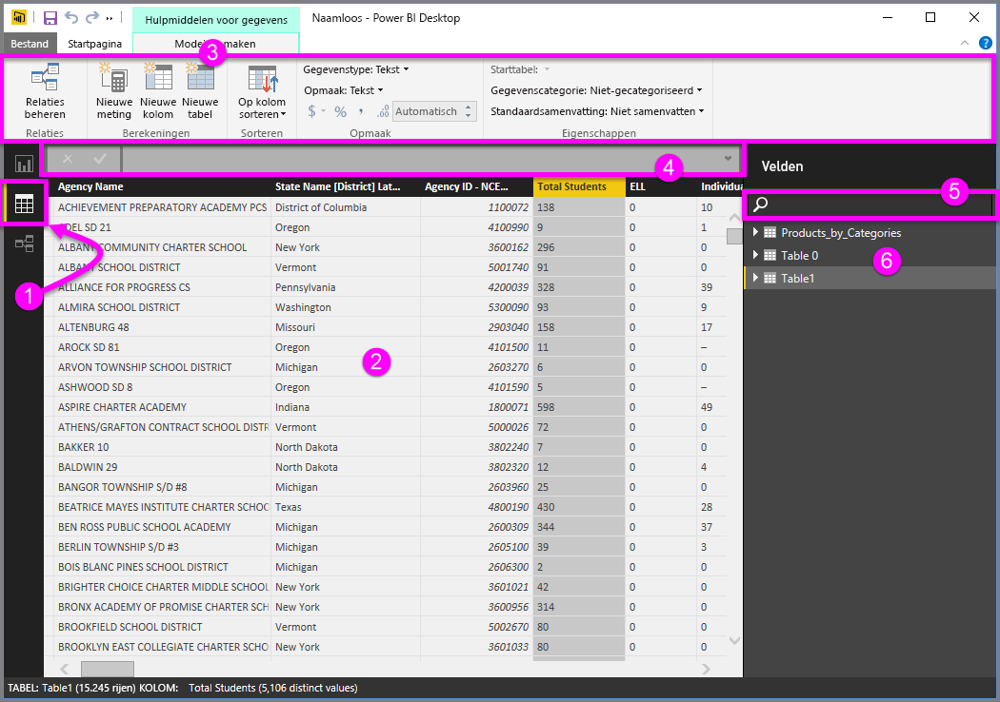
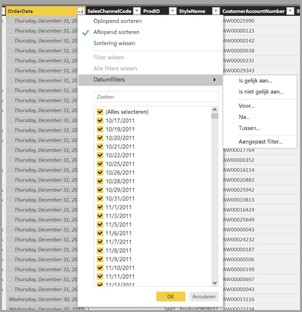

# Gegevensweergave in Power BI Desktop
De **gegevensweergave** helpt u bij het controleren, onderzoeken en begrijpen van gegevens in uw **Power BI Desktop**-model. Het verschilt van de manier waarop u tabellen, kolommen en gegevens in **Query-editor** bekijkt. In de gegevensweergave bekijkt u gegevens *nadat* deze in het model zijn geladen.

Wanneer u een gegevensmodel maakt, wilt u soms zien wat een tabel of kolom nu echt bevat zonder een visueel element te maken op het rapportcanvas, vaak tot rijniveau aan toe. Dit is vooral handig wanneer u metingen en berekende kolommen maakt of als u een gegevenstype of gegevenscategorie moet identificeren.

Laten we enkele van de elementen uit de **gegevensweergave** nader bekijken.

1. **Het pictogram Gegevensweergave**: selecteer dit pictogram om de gegevensweergave te openen.

2. **Gegevensraster**: hiermee geeft u de geselecteerde tabel en alle kolommen en rijen die deze bevat weer. Kolommen die zijn verborgen in het **rapport** worden grijs weergegeven. U kunt met de rechtermuisknop op een kolom klikken voor opties.

3. **Het lint Model maken**: hier kunt u relaties beheren, berekeningen maken en het gegevenstype, de indeling en de gegevenscategorie voor een kolom wijzigen.

4. **Formulebalk**: DAX-formules invoeren voor metingen en berekende kolommen.

5. **Zoeken**: een tabel of kolom zoeken in het model.

6. **Lijst met velden**: een tabel of kolom selecteren om weer te geven in het gegevensraster.

## Filteren in de gegevensweergave

U kunt in de **gegevensweergave** ook filteren op gegevens en gegevens sorteren. Elke kolom bevat een pictogram waarmee de sorteerrichting wordt geïdentificeerd (indien toegepast).

U kunt op afzonderlijke waarden filteren of geavanceerde filters gebruiken op basis van de gegevens in de kolom. 

> [!NOTE]
> Als u een Power BI-model maakt voor een andere cultuur dan die van uw huidige gebruikersinterface (het model is bijvoorbeeld gemaakt voor Amerikaans Engels en u bekijkt het in het Spaans), wordt het zoekvak in de gebruikersinterface Gegevensweergave alleen weergegeven voor tekstvelden.
