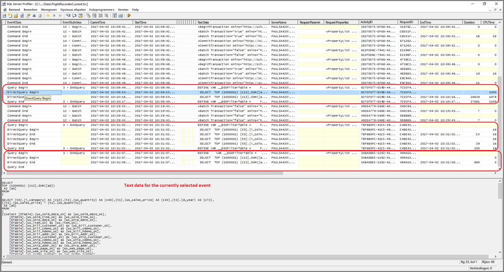
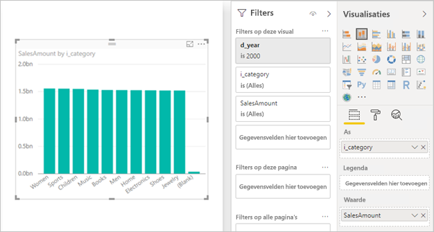

# <a name="directquery-model-troubleshooting-in-power-bi-desktop"></a>Problemen met het DirectQuery-model in Power BI Desktop oplossen

Dit artikel is gericht op gegevensmodelleerders die Power BI DirectQuery-modellen ontwikkelen met behulp van Power BI Desktop of de Power BI-service. Hierin wordt beschreven hoe u de oorzaak van prestatieproblemen kunt achterhalen en hoe u meer gedetailleerde informatie kunt verzamelen met als doel rapporten te optimaliseren.

## <a name="performance-analyzer"></a>Performance Analyzer

Het wordt ten zeerste aangeraden om een diagnose van prestatieproblemen te beginnen in Power BI Desktop, niet in Power BI (de service of Power BI Report Server). Het is vaak het geval dat prestatieproblemen het gevolg zijn van het prestatieniveau van de onderliggende gegevensbron. Deze problemen zijn eenvoudiger te identificeren en op te lossen in de meer geïsoleerde omgeving van Power BI Desktop en bovendien worden direct al bepaalde onderdelen uitgesloten (zoals de Power BI-gateway). Alleen als de prestatieproblemen niet optreden met Power BI Desktop moet de aandacht worden verlegd naar de details van het rapport in Power BI. [Performance Analyzer](desktop-performance-analyzer.md) is een handig hulpmiddel voor het opsporen van problemen tijdens dit proces.

Zo is het ook beter om eerst te proberen het probleem te beperken tot een bepaalde visualisatie, in plaats van een groot aantal visualisaties op dezelfde pagina.

Laten we er gemakshalve van uitgaan dat die stappen (uit de vorige alinea's in dit onderwerp) zijn doorlopen en dat we het probleem hebben beperkt tot één visual op een pagina in Power BI Desktop die nog steeds traag is. U kunt Performance Analyzer gebruiken om te bepalen welke query's door Power BI Desktop naar de onderliggende bron worden verzonden. Het is ook mogelijk om traceringen/diagnostische gegevens weer te geven die mogelijk door de onderliggende gegevensbron zijn verzonden. Dergelijke traceringen bevatten mogelijk ook nuttige informatie over de manier waarop de query is uitgevoerd en hoe deze kan worden verbeterd.

Zelfs in de afwezigheid van dergelijk traceringen van de bron, is het mogelijk om de query's weer te geven die zijn verzonden door Power BI, samen met hun uitvoeringstijden, zoals hieronder wordt beschreven.

## <a name="review-trace-files"></a>Traceringbestanden controleren

De standaardinstelling is dat er tijdens een sessie gebeurtenissen worden vastgelegd door Power BI Desktop. Deze worden opgeslagen in het traceringsbestand **FlightRecorderCurrent.trc**.

Voor sommige DirectQuery-bronnen bevat dit logboek alle query's die zijn verzonden naar de onderliggende gegevensbron (de resterende DirectQuery-bronnen worden mogelijk in de toekomst ondersteund). Dit zijn de bronnen waarvoor de query's in het logboek worden geschreven:

- SQL Server
- Azure SQL Database
- Azure SQL Data Warehouse
- Oracle
- Teradata
- SAP HANA

Het traceringsbestand vindt u in de map **AppData** voor de huidige gebruiker: _\\\<User>\AppData\Local\Microsoft\Power BI Desktop\AnalysisServicesWorkspaces_

Dit is een eenvoudige manier om bij de deze map te openen: Open Power BI Desktop en selecteer _Bestand > Opties en instellingen > Opties_ en selecteer vervolgens de pagina **Diagnostische gegevens**. Het volgende dialoogvenster wordt weergegeven:


Wanneer u de koppeling **Map met crashcumps/traceringen openen** selecteert, wordt onder Crashdumpverzameling de volgende map geopend: _\\\<User>\AppData\Local\Microsoft\Power BI Desktop\Traces_

Als u naar de bovenliggende map van die map navigeert, komt u in een map met _AnalysisServicesWorkspaces_, met daarin één werkruimtesubmap voor elk geopend exemplaar van Power BI Desktop. Deze submappen hebben een naam met een achtervoegsel dat bestaat uit een geheel getal, zoals _AnalysisServicesWorkspace2058279583_.

In deze map bevindt zich een submap _\Data_, die het traceringsbestand FlightRecorderCurrent.trc bevat voor de huidige Power BI-sessie. De bijbehorende werkruimtemap wordt verwijderd wanneer de bijbehorende sessie van Power BI Desktop wordt beëindigd.

De traceringsbestanden kunnen worden geopend met het hulpprogramma SQL Server Profiler, dat gratis kan worden gedownload als onderdeel van SQL Server Management Studio. U kunt het programma [hier downloaden](/sql/ssms/download-sql-server-management-studio-ssms?view=sql-server-2017).

Nadat u SQL Server Management Studio hebt gedownload en geïnstalleerd, voert u SQL Server Profiler uit.



Ga als volgt te werk om het traceringsbestand te openen:

1. Selecteer in SQL Server Profiler achtereenvolgens _Bestand > Openen > Traceringsbestand_
2. Voer het pad in naar het traceringsbestand voor de momenteel geopende Power BI-sessie, zoals: _\\\<User>\AppData\Local\Microsoft\Power BI Desktop\AnalysisServicesWorkspaces\AnalysisServicesWorkspace2058279583\Data_
3. _FlightRecorderCurrent.trc_ openen

Alle gebeurtenissen uit de huidige sessie worden weergegeven. Hieronder ziet u een voorbeeld waarin groepen gebeurtenissen zijn gemarkeerd. Voor elke groep zijn de volgende gegevens vastgelegd:

- Een gebeurtenis _Query Begin_ en _Query End_, die het begin en het einde aangeven van een DAX-query die is gegenereerd door de gebruikersinterface (bijvoorbeeld van een visualisatie of door het invullen van een lijst met waarden in de filterinterface).
- Een of meer sets gebeurtenissen van _DirectQuery Begin_ en _DirectQuery End_, die een query voorstellen die is verzonden naar de onderliggende gegevensbron, als onderdeel van het evalueren van de DAX-query

Er kunnen meerdere DAX-query's tegelijk worden uitgevoerd, wat betekent dat gebeurtenissen uit verschillende groepen elkaar kunnen overlappen. Aan de hand van de waarde van de ActivityID kan worden vastgesteld welke gebeurtenissen bij dezelfde groep horen.


Hier volgen nog enkele andere interessante kolommen:

- **TextData:** De tekstinhoud van de gebeurtenis. Voor _Query Begin/End_-gebeurtenissen ziet u hier de DAX-query. Voor _DirectQuery Begin/End_-gebeurtenissen is dit de SQL-query die is verzonden naar de onderliggende gegevensbron. De waarde _TextData_ voor de geselecteerde gebeurtenis wordt ook onderaan het venster weergegeven.
- **EndTime:** Wanneer de gebeurtenis is voltooid.
- **Duration:** De duur in milliseconden die nodig is voor het uitvoeren van de DAX- of SQL-query.
- **Error:** Geeft aan of er een fout is opgetreden. In dat geval wordt de gebeurtenis ook in rood weergegeven.

In de bovenstaande afbeelding zijn enkele minder interessante kolommen smaller gemaakt, zodat de interessante kolommen beter te lezen zijn.

Dit is de aanbevolen aanpak voor het vastleggen van een tracering die u kan helpen bij het analyseren van een mogelijk prestatieprobleem:

- Open één Power BI Desktop-sessie (om verwarring door meerdere werkruimtemappen te voorkomen)
- Voer in Power BI Desktop de reeks acties uit waarin u bent geïnteresseerd. Voer nog enkele aanvullende acties uit, zodat u zeker weet dat de interessante gebeurtenissen worden weggeschreven naar het traceringsbestand.
- Open SQL Server Profiler en bekijk de tracering, volgens de eerder beschreven instructies. Vergeet niet dat het traceringsbestand wordt verwijderd zodra u Power BI Desktop afsluit. Ook is het zo dat nieuwe acties in Power BI Desktop niet meteen worden weergegeven. U moet het traceringsbestand eerst sluiten en opnieuw openen om de nieuwe gebeurtenissen te zien.
- Gebruik redelijk kleine, afzonderlijke sessies (met tien seconden aan acties en niet honderden) om het traceringsbestand makkelijker te kunnen interpreteren (en omdat er een limiet geldt voor de grootte van het traceringsbestand, waardoor het bij lange sessies mogelijk is dat er vroege gebeurtenissen worden verwijderd).

## <a name="understand-queries-sent-to-the-source"></a>Query's die naar de bron worden verzonden begrijpen

Voor de algemene indeling van query's die door Power BI Desktop worden gegenereerd en verzonden, worden subquery's gebruikt voor elk van de modeltabellen waarnaar wordt verwezen, waarbij de subquery wordt gedefinieerd door de Power Query-query. Ga bijvoorbeeld uit van de volgende TPC-DS-tabellen in een relationele SQL Server-database:


Bekijk de volgende visual en de configuratie daarvan en houd er rekening mee dat de meetwaarde **SalesAmount** wordt gedefinieerd met de volgende expressie:

```dax

SalesAmount = SUMX(Web_Sales, [ws_sales_price] * [ws_quantity])

```



Het vernieuwen van deze visual resulteert in de T-SQL-query die wordt weergegeven onder de volgende alinea. Zoals u ziet, zijn er drie subquery's voor de modeltabellen **Webverkoop**, **Item** en **Datum_dim**. Door elk van deze tabellen worden alle modeltabelkolommen geretourneerd, ook al wordt door de visual maar naar vier kolommen verwezen. Deze subquery's (deze zijn gearceerd) vormen de exacte definitie van de Power Query-query's. Het op deze manier gebruiken van subquery's is niet nadelig gebleken voor de prestaties, althans niet voor de gegevensbronnen die tot nu toe worden ondersteund voor DirectQuery. Gegevensbronnen zoals SQL Server zorgen ervoor dat de verwijzingen worden geoptimaliseerd voor niet-gebruikte kolommen.

Een van de redenen waarom dit patroon door Power BI wordt gebruikt, is dat u een Power Query-query kunt definiëren om een specifieke query-instructie te gebruiken. Deze wordt "zoals is opgegeven" gebruikt, zonder een poging om deze te herschrijven. Let op: deze patronen beperken het gebruik van queryinstructies waarvoor CTE's (Common Tabel Expressions) en opgeslagen procedures worden gebruikt. Deze instructies kunnen niet worden gebruikt in subquery's.


## <a name="gateway-performance"></a>Gateway-prestaties

Lees het artikel [Problemen met gateways oplossen - Power BI](service-gateway-onprem-tshoot.md) voor informatie over het oplossen van problemen met gatewayprestaties.

## <a name="next-steps"></a>Volgende stappen

Bekijk de volgende bronnen voor meer informatie over DirectQuery:

- [DirectQuery in Power BI Desktop gebruiken](desktop-use-directquery.md)
- [DirectQuery-modellen in Power BI Desktop](desktop-directquery-about.md)
- [Richtlijnen voor het DirectQuery-model in Power BI Desktop](guidance/directquery-model-guidance.md)
- Vragen? [Misschien dat de Power BI-community het antwoord weet](https://community.powerbi.com/)
