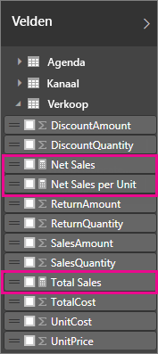
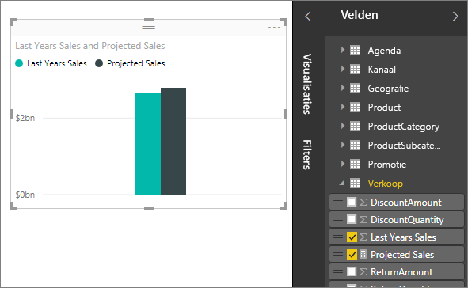
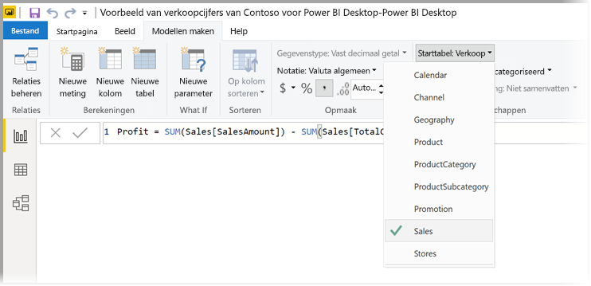
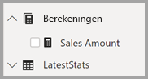

# <a name="create-measures-for-data-analysis-in-power-bi-desktop"></a>Metingen maken voor gegevensanalyse in Power BI Desktop

Met Power BI Desktop kunt u met een paar klikken inzicht in uw gegevens krijgen. Maar soms bevatten die gegevens niet de antwoorden op uw belangrijkste vragen. Dankzij metingen kunt u die wel krijgen.

Metingen worden gebruikt in enkele van de meest voorkomende data-analyses. Eenvoudige overzichten, zoals sommen, gemiddelden, minimum, maximum en aantallen, kunnen worden ingesteld via **Velden**. De berekende resultaten van metingen zijn altijd onderhevig aan wijzigingen, afhankelijk van uw interactie met de rapporten, waardoor een snelle en dynamische ad-hocverkenning van de gegevens mogelijk is. Laten we dit eens nader bekijken. Zie [Berekende maateenheden maken](/learn/modules/model-data-power-bi/4b-create-calculated-measures) voor meer informatie.

## <a name="understanding-measures"></a>Informatie over metingen

In Power BI Desktop worden metingen gemaakt en weergegeven in een *rapportweergave* of *gegevensweergave*. Metingen die u zelf maakt, worden met een rekenmachinepictogram aangegeven in de lijst **Velden**. U kunt de metingen elke naam geven die u wilt en ze toevoegen aan een nieuwe of bestaande visualisatie, net zoals elk ander veld.



> [!NOTE]
> Wellicht bent u ook geïnteresseerd in *snelle metingen*. Dit zijn kant-en-klare metingen die u in een dialoogvenster kunt selecteren. Hiermee kunt u snel metingen maken en tevens de syntaxis van DAX (Data Analysis Expressions) leren. U kunt de automatisch gemaakte DAX-formules in een snelle meting namelijk ook weergeven. Zie [snelle metingen](desktop-quick-measures.md) voor meer informatie.
> 
> 

## <a name="data-analysis-expressions"></a>Data Analysis Expressions

Metingen berekenen een resultaat van een expressieformule. Als u uw eigen metingen maakt, gebruikt u de formuletaal [Data Analysis Expressions](/dax/) (DAX). DAX bevat een bibliotheek met meer dan 200 functies, operatoren en constructies. Deze biedt zodoende een uitgebreide flexibiliteit bij het maken van metingen voor het berekenen van resultaten voor vrijwel elke gegevensanalyse.

DAX-formules lijken veel op Excel-formules. DAX bevat zelfs veel dezelfde functies als Excel, zoals `DATE`, `SUM` en `LEFT`. Maar de functies in DAX worden gebruikt voor het werken met relationele gegevens, zoals die in Power BI Desktop.

## <a name="lets-look-at-an-example"></a>Hier volgt een voorbeeld

Elsje is salesmanager bij Contoso. Elsje is gevraagd naar de verkoopprognoses van de wederverkopers voor het volgende belastingjaar. Elsje besluit haar prognoses te baseren op de omzetten van het vorige jaar en gaat uit van een jaarlijkse toename van zes procent als gevolg van diverse reclamecampagnes die de komende zes maanden op stapel staan.

Voor de rapportage importeert Elsje de verkoopcijfers van het vorige jaar in Power BI Desktop. Elsje zoekt het veld **Omzet** in de tabel **Verkopen wederverkopers**. Omdat de geïmporteerde gegevens slechts de omzetten van het vorige jaar bevatten, geeft Elsje het veld **Omzet** de naam *Verkoop afgelopen jaar*. Vervolgens sleept Elsje **Verkoop afgelopen jaar** naar het rapportcanvas. De gegevens worden in een diagram als één waarde weergegeven, die de som is van de verkopen van alle wederverkopers van het afgelopen jaar.

Hoewel ze zelf geen berekening heeft opgegeven, ziet Elsje dat er een automatisch wordt voorgesteld. Power BI Desktop heeft zelf een meting gemaakt door alle waarden in **Verkoop afgelopen jaar** bij elkaar op te tellen.

Maar Elsje heeft een meting nodig om de verkoopprognoses te berekenen voor het komende jaar. Deze wordt gebaseerd op de verkopen van het afgelopen jaar, vermenigvuldigt met 1,06 vanwege de verwachte stijging in de verkoopcijfers met zes procent. Voor deze berekening maakt Elsje een meting. Met de functie *Nieuwe meting* maakt ze een nieuwe meting. Vervolgens voert ze de volgende DAX-formule in:

```dax
    Projected Sales = SUM('Sales'[Last Years Sales])*1.06
```

Vervolgens sleept Elsje de meting Geraamde verkoop naar het diagram.



Ze beschikt nu snel en nagenoeg moeiteloos over een meting om de geraamde verkopen te berekenen. Elsje kan de prognoses verder analyseren door te filteren op specifieke wederverkopers of door andere velden aan het rapport toe te voegen.

## <a name="data-categories-for-measures"></a>Gegevenscategorieën voor metingen

U kunt ook gegevenscategorieën voor metingen kiezen.

Met gegevenscategorieën kunt u met behulp van metingen dynamisch URL's maken en de gegevenscategorie markeren als Web-URL.

U kunt tabellen maken die de metingen als Web-URL's weergeven en op de URL klikken die op basis van uw selectie is gemaakt. Deze benadering is vooral nuttig als u deze wilt koppelen aan andere Power BI-rapporten met [URL-filterparameters](service-url-filters.md).

## <a name="organizing-your-measures"></a>Uw metingen ordenen

Metingen hebben een tabel *Start* waarin wordt gedefinieerd waar ze zich in de lijst met velden bevinden. U kunt de locatie ervan wijzigen door een locatie in de tabellen in uw model te kiezen.



U kunt ook velden in een tabel indelen in *weergavemappen*. Selecteer **Model** aan de linkerkant van Power BI Desktop. Selecteer in het deelvenster**Eigenschappen** het veld dat u wilt verplaatsen in de lijst met beschikbare velden. Voer een naam in voor een nieuwe map in **Map weergeven** om een map te maken. Als u een map maakt, wordt het geselecteerde veld naar die map verplaatst.


U kunt submappen maken met behulp van een backslash-teken. Met *Financiën\Valuta* maakt u een map met de naam *Financiën* met daarin de map *Valuta*.

U kunt een veld in meerdere mappen weergeven door gebruik te maken van een puntkomma om de mapnamen van elkaar te scheiden. Bijvoorbeeld: *Producten\Namen;Afdelingen* zorgt ervoor dat het veld wordt weergegeven in de map *Afdelingen* en de map *Namen* in de map *Product*.

U kunt een speciale tabel maken die alleen metingen bevat. Deze tabel wordt altijd boven in **Velden**weergegeven. Hiervoor maakt u een tabel met slechts één kolom. U kunt **Gegevens invoeren** gebruiken om die tabel te maken. Verplaats uw metingen vervolgens naar die tabel. Verberg de kolom, niet de tabel die u hebt gemaakt. Selecteer de pijl boven in **Velden** om de lijst met velden te sluiten en opnieuw te openen om de wijzigingen weer te geven.



## <a name="learn-more"></a>Meer informatie

We hebben hier slechts een korte inleiding over metingen gegeven. Er is nog veel meer informatie over hoe u uw eigen metingen kunt maken. Zie [Zelfstudie: Uw eigen metingen maken in Power BI Desktop](desktop-tutorial-create-measures.md). U kunt een voorbeeldbestand downloaden en stapsgewijs zien hoe u meer metingen maakt.  

Als u meer wilt weten over DAX, lees dan [Standaard DAX-bewerkingen in Power BI Desktop](desktop-quickstart-learn-dax-basics.md). In [Naslag voor Data Analysis Expressions (DAX)](/dax/) vindt u uitgebreide artikelen over al deze functies, de syntaxis, operatoren en naamgevingsconventies. DAX bestaat al enkele jaren in Power Pivot in Excel en SQL Server Analysis Services. Er zijn nog veel meer informatiebronnen beschikbaar. Bekijk ook de wiki [DAX Resource Center](https://social.technet.microsoft.com/wiki/contents/articles/1088.dax-resource-center.aspx) (Bronnenmateriaal voor DAX) waar invloedrijke leden van de BI-community hun kennis van DAX delen.
