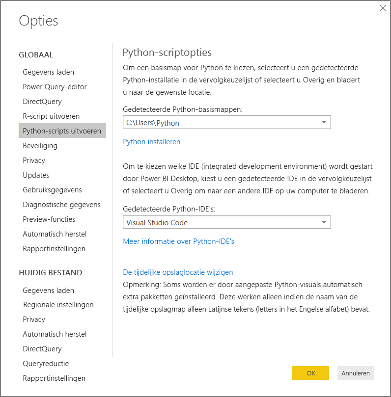
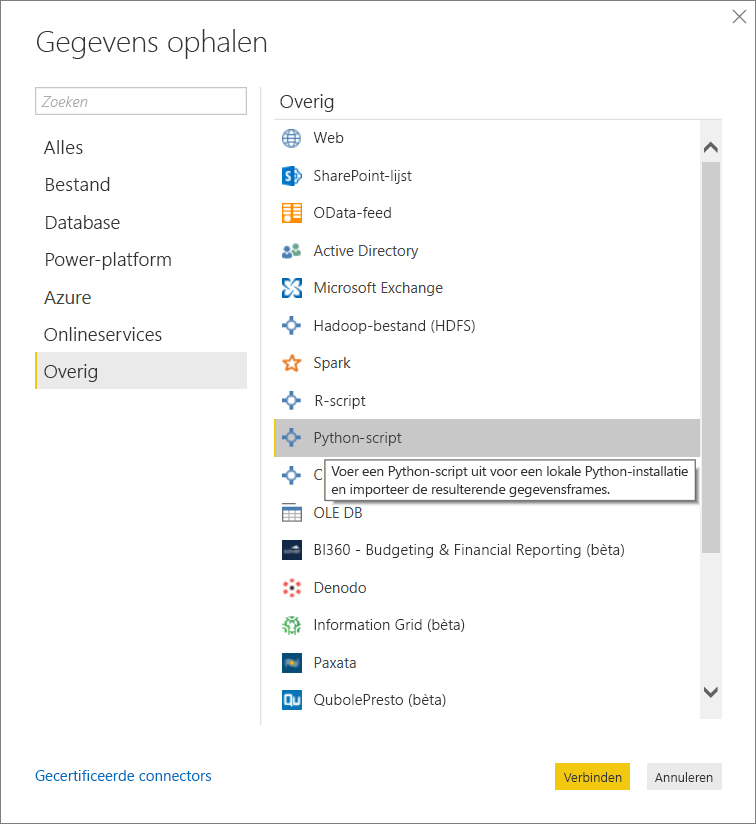
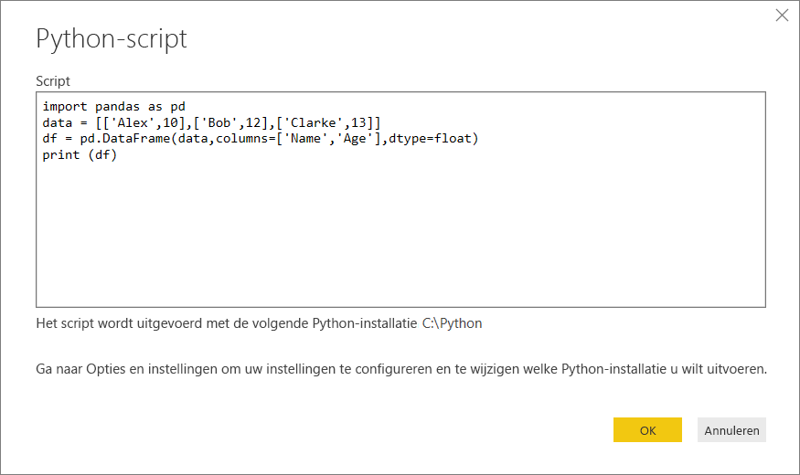
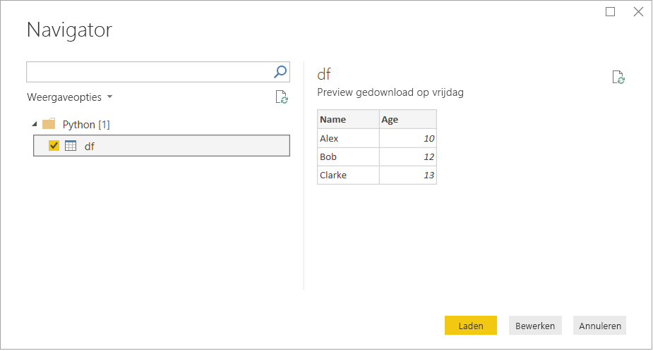

# <a name="run-python-scripts-in-power-bi-desktop"></a>Python-scripts uitvoeren in Power BI Desktop

U kunt Python-scripts rechtstreeks in **Power BI Desktop** uitvoeren en de resulterende gegevenssets in een Power BI Desktop-gegevensmodel importeren.

## <a name="install-python"></a>Python installeren

Als u Python-scripts wilt uitvoeren in Power BI Desktop, moet u **Python** afzonderlijk installeren op de lokale computer. U kunt **Python** downloaden via de [officiële Python-downloadpagina](https://www.python.org/). In de huidige release voor het uitvoeren van Python-scripts worden Unicode-tekens en spaties in het installatiepad ondersteund.

### <a name="install-required-python-packages"></a>Vereiste Python-pakketten installeren

Voor de integratie van Python met Power BI moeten er twee Python-pakketten worden geïnstalleerd:

- [Pandas](https://pandas.pydata.org/): een softwarebibliotheek voor het bewerken en analyseren van gegevens. Pandas biedt gegevensstructuren en bewerkingen voor het bewerken van numerieke tabellen en tijdreeksen. Uw geïmporteerde gegevens moeten zich in een [Pandas-gegevensframe](https://www.tutorialspoint.com/python_pandas/python_pandas_dataframe.htm) bevinden. Een gegevensframe is een tweedimensionale gegevensstructuur. Gegevens worden bijvoorbeeld tabelvormig in rijen en kolommen uitgelijnd.
- [Matplotlib](https://matplotlib.org/): een tekenbibliotheek voor Python en de numerieke wiskundige uitbreiding ervan, [NumPy](https://www.numpy.org/). Matplotlib biedt een objectgeöriënteerde API voor het insluiten van plots in toepassingen met behulp van algemene GUI-werksets (zoals Tkinter, wxPython, Qt of GTK+).

1. Gebruik in een console of shell het opdrachtregelprogramma [pip](https://pip.pypa.io/en/stable/) om de twee pakketten te installeren. Het hulpprogramma pip wordt geleverd met recentere Python-versies.

```CMD
pip install pandas
pip install matplotlib
```

## <a name="enable-python-scripting"></a>Het uitvoeren van Python-scripts inschakelen

Het uitvoeren van Python-scripts inschakelen:

1. In Power BI Desktop selecteert u **Bestand** > **Opties en instellingen** > **Opties** > **Python-scripts uitvoeren**. De pagina Python-scriptopties wordt weergegeven.

   

1. Geef indien nodig uw lokale Python-installatiepad op in het tekstvak **Gedetecteerde Python-basismappen**. 

   In de bovenstaande afbeelding is het lokale Python-installatiepad **C:\Python**. Zorg dat het pad leidt naar de lokale Python-installatie die u voor Power BI Desktop wilt gebruiken.

1. Selecteer **OK**.

Nadat u uw Python-installatie hebt opgegeven, bent u klaar om Python-scripts uit te voeren in Power BI Desktop.

## <a name="run-python-scripts"></a>Python-scripts uitvoeren

In slechts enkele stappen kunt u Python-scripts uitvoeren en een gegevensmodel maken. Vanuit dit model kunt u rapporten maken en deze delen in de Power BI-service.

### <a name="prepare-a-python-script"></a>Een Python-script voorbereiden
Maak eerst een script in uw lokale omgeving voor Python-ontwikkeling en controleer of het script foutloos wordt uitgevoerd. Hier volgt een voorbeeld van een eenvoudig Python-script waarmee Pandas worden geïmporteerd en een gegevensframe wordt gebruikt:

```python
import pandas as pd
data = [['Alex',10],['Bob',12],['Clarke',13]]
df = pd.DataFrame(data,columns=['Name','Age'],dtype=float)
print (df)
```
Bij het uitvoeren wordt het volgende afgedrukt:

```python
     Name   Age
0    Alex  10.0
1     Bob  12.0
2  Clarke  13.0
```

Als u een Python-script in Power BI Desktop voorbereidt en uitvoert, gelden er enkele beperkingen:

* Er worden alleen Pandas-gegevensframes geïmporteerd. Zorg er dus voor dat de gegevens die u in Power BI wilt importeren, in een gegevensframe worden weergegeven
* Python-scripts waarvan het uitvoeren langer duurt dan dertig minuten, worden door een time-out afgebroken
* Bij interactieve aanroepen in het Python-script, zoals het wachten op gebruikersinvoer, wordt het uitvoeren van het script onderbroken
* Als de werkmap in het Python-script wordt ingesteld, *moet* u een volledig pad naar de werkmap definiëren in plaats van een relatief pad
* Geneste tabellen worden momenteel niet ondersteund 

### <a name="run-your-python-script-and-import-data"></a>Python-script uitvoeren en gegevens importeren

Uw Python-script uitvoeren in Power BI Desktop:

1. Selecteer in het lint Start **Gegevens ophalen** > **Meer...** .
   
1. Selecteer **Anders** > **Python-script**, zoals wordt weergegeven in de volgende afbeelding:

   
   
1. Selecteer **Verbinding maken**. De nieuwste Python-versie die op uw lokale machine is geïnstalleerd, wordt geselecteerd als uw Python-engine. Kopieer uw script in het dialoogvenster Python-script dat wordt weergegeven. Hier voeren we het eenvoudige Python-script in dat eerder is weergegeven.

   

1. Selecteer **OK**. Als het script is uitgevoerd, wordt het dialoogvenster Navigator weergegeven en kunt u de gegevens laden en gebruiken. Schakel bijvoorbeeld het selectievakje **df** in, zoals wordt weergegeven in de afbeelding, en selecteer vervolgens **Laden**.

    

### <a name="troubleshooting"></a>Problemen oplossen

Als Python niet is geïnstalleerd of niet wordt geïdentificeerd, wordt er een waarschuwing weergegeven. U kunt ook een waarschuwing krijgen als u meerdere installaties op de lokale machine hebt. Ga terug en bekijk de vorige secties Python installeren en Het uitvoeren van Python-scripts inschakelen opnieuw.


### <a name="refresh"></a>Vernieuwen

U kunt een Python-script in Power BI Desktop vernieuwen. Ga naar het lint **Start** en selecteer **Vernieuwen** om te vernieuwen. Als u een Python-script vernieuwt, wordt het opnieuw uitgevoerd in Power BI Desktop.

## <a name="next-steps"></a>Volgende stappen

Raadpleeg de volgende aanvullende informatie over Python in Power BI.

* [Python-visuals maken in Power BI Desktop](desktop-python-visuals.md)
* [Een externe Python IDE met Power BI gebruiken](desktop-python-ide.md)
