# Queryoverzicht in Power BI Desktop
Met Power BI Desktop kunt u verbinding maken met de wereld van gegevens, overtuigende en gefundeerde rapporten maken en uw resultaten delen met anderen, die verder kunnen bouwen op uw werk en hun business intelligence-activiteiten kunnen uitbreiden.

U kunt kiezen uit drie weergaven in Power BI Desktop:

* **Rapport**: gebruik query's om overtuigende visualisaties te maken, gerangschikt zoals u dat wilt, met meerdere pagina's die u met anderen kunt delen
* **Gegevens**: bekijk de gegevens in uw rapport in de indeling van een gegevensmodel waarmee u metingen kunt toevoegen, nieuwe kolommen kunt maken en relaties kunt beheren
* **Relaties**: maak een grafische weergave van de relaties die zijn vastgelegd in uw gegevensmodel, en beheer of wijzig deze zo nodig.

Open deze weergaven door een van de drie pictogrammen aan de linkerkant van Power BI Desktop te selecteren. In de volgende afbeelding is de weergave **Rapport** geselecteerd. Dit is te zien aan de gele band naast het pictogram.  

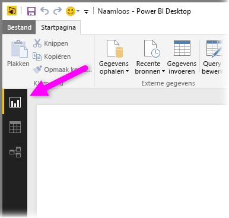

Power BI Desktop wordt ook geleverd bij Power Query-editor. Gebruik Power Query-editor om verbinding te maken met een of meer gegevensbronnen, de gegevens naar behoefte vorm te geven en te transformeren, en dat model vervolgens in Power BI Desktop te laden.

Dit document geeft een overzicht van het werken met gegevens in de Power Query-editor, maar er is meer te leren. U vindt aan het einde van dit document koppelingen naar gedetailleerde richtlijnen over ondersteunde gegevenstypen. Ook vindt u hier informatie over het maken van verbinding met gegevens, het vormgeven van gegevens, het maken van relaties en hoe u kunt beginnen.

Maar laten we eerst kennismaken met Power Query-editor.

## Power Query-editor
Selecteer **Query's bewerken** op het tabblad **Start** van Power BI Desktop om Power BI-editor te openen.  

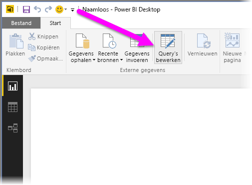

Zonder gegevensverbindingen wordt Power Query-editor weergegeven als een leeg venster dat gereed is voor gegevens.  

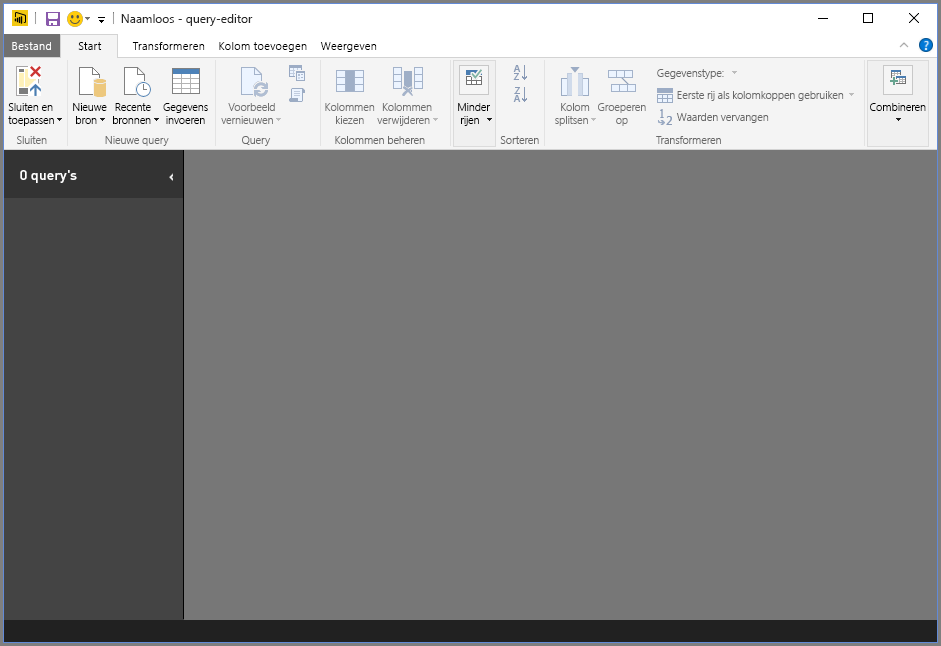

Nadat een query is geladen, wordt het venster van Power Query-editor een stuk interessanter. Als we verbinding maken met de volgende webgegevensbron, wordt er in Power Query-Editor informatie over de gegevens geladen. Vervolgens kunt u deze gaan vormgeven:

[*https://www.bankrate.com/retirement/best-and-worst-states-for-retirement/*](https://www.bankrate.com/retirement/best-and-worst-states-for-retirement/)

Power Query-editor ziet er ongeveer als volgt uit zodra een verbinding tot stand is gebracht:

1. In het lint zijn veel knoppen actief om de gegevens in de query te gebruiken.
2. In het linkerdeelvenster worden query's vermeld die beschikbaar zijn om te worden geselecteerd, weergegeven en vormgegeven.
3. In het middelste deelvenster worden gegevens uit de geselecteerde query weergegeven en geactiveerd voor weergave.
4. Het deelvenster **Query-instellingen** wordt weergegeven, waarin de eigenschappen van de query en de toegepaste stappen worden weergegeven.  
   
   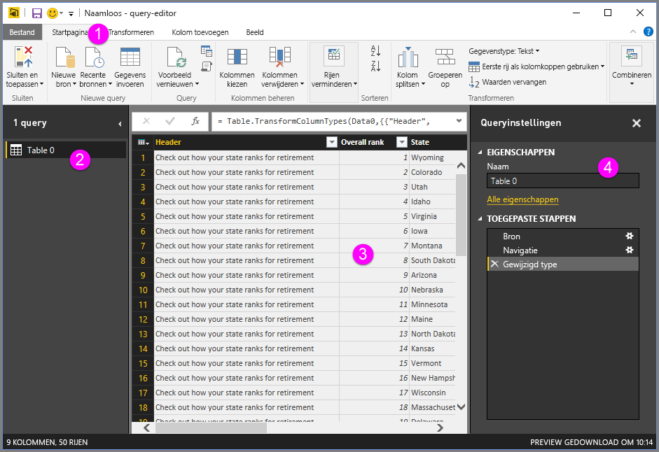

Elk van deze vier gebieden: het lint, het deelvenster met query's, het deelvenster met gegevens en het deelvenster Query-instellingen.

## Het lint in Query-editor
Het lint in Power Query-editor bestaat uit vier tabbladen: **Start**, **Transformeren**, **Kolom toevoegen** en **Weergave**.

Het tabblad **Start** bevat de algemene querytaken.

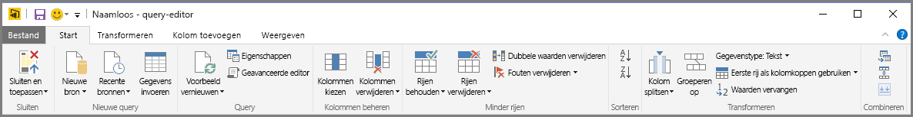

Selecteer **Nieuwe bron** om een verbinding met gegevens te maken en te beginnen met het opbouwen van een query. Er verschijnt een menu met de meestvoorkomende gegevensbronnen.  

Zie **Gegevensbronnen** voor meer informatie over beschikbare gegevensbronnen. Zie **Verbinding maken met gegevens** voor meer informatie over het maken van verbindingen met gegevens, inclusief voorbeelden en stappen.

Het tabblad **Transformeren** biedt toegang tot algemene taken voor gegevenstransformatie, zoals:

* Kolommen toevoegen of verwijderen
* Gegevenstypen wijzigen 
* Kolommen splitsen 
* Andere gegevensgestuurde taken

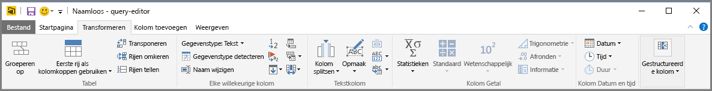

Zie [Zelfstudie: gegevens combineren en vormgeven](https://docs.microsoft.com/power-bi/desktop-shape-and-combine-data) voor meer informatie over het transformeren van gegevens, inclusief voorbeelden.

Het tabblad **Kolom toevoegen** bevat aanvullende taken die zijn gekoppeld aan het toevoegen van een kolom, het opmaken van kolomgegevens en het toevoegen van aangepaste kolommen. De volgende afbeelding toont het tabblad **Kolom toevoegen**.  

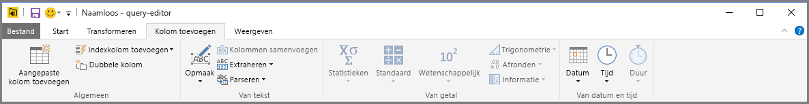

Het tabblad **Weergeven** van het lint wordt gebruikt om te bepalen of bepaalde deelvensters of vensters worden weergegeven. Het wordt ook gebruikt om de geavanceerde editor weer te geven. De volgende afbeelding toont het tabblad **Weergeven**.  

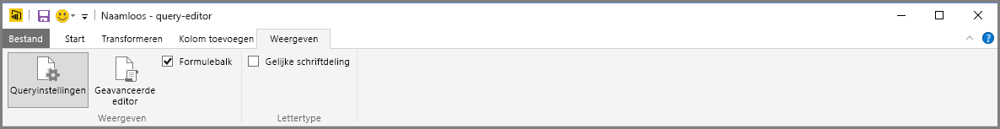

Veel taken in het lint zijn overigens ook beschikbaar door met de rechtermuisknop te klikken op een kolom, of andere gegevens, in het middelste deelvenster.

## Het linkerdeelvenster (Query's)
In het linkerdeelvenster of het deelvenster **Query's** wordt het aantal actieve query's en de naam van de query weergegeven. Wanneer u een query selecteert in het linkerdeelvenster, worden de bijbehorende gegevens weergegeven in het middelste deelvenster, waar u de gegevens naar behoefte kunt vormgeven en transformeren. De volgende afbeelding toont het linkerdeelvenster met een query.  

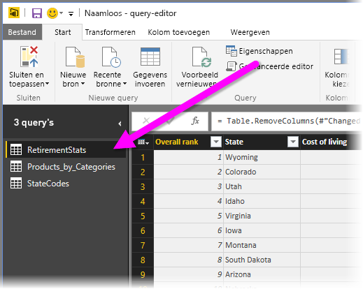

## Het middelste deelvenster (Gegevens)
In het middelste deelvenster, het deelvenster **Gegevens**, worden de gegevens van de geselecteerde query weergegeven. In dit deelvenster worden veel taken van de **queryweergave** uitgevoerd.

In de volgende afbeelding ziet u de verbinding met de webgegevens die eerder tot stand is gebracht. De kolom **Product** is geselecteerd en er is met de rechtermuisknop op de kolomkop geklikt om de beschikbare menu-items weer te geven. U ziet dat veel van deze snelmenu-items hetzelfde zijn als knoppen in de linttabbladen.  

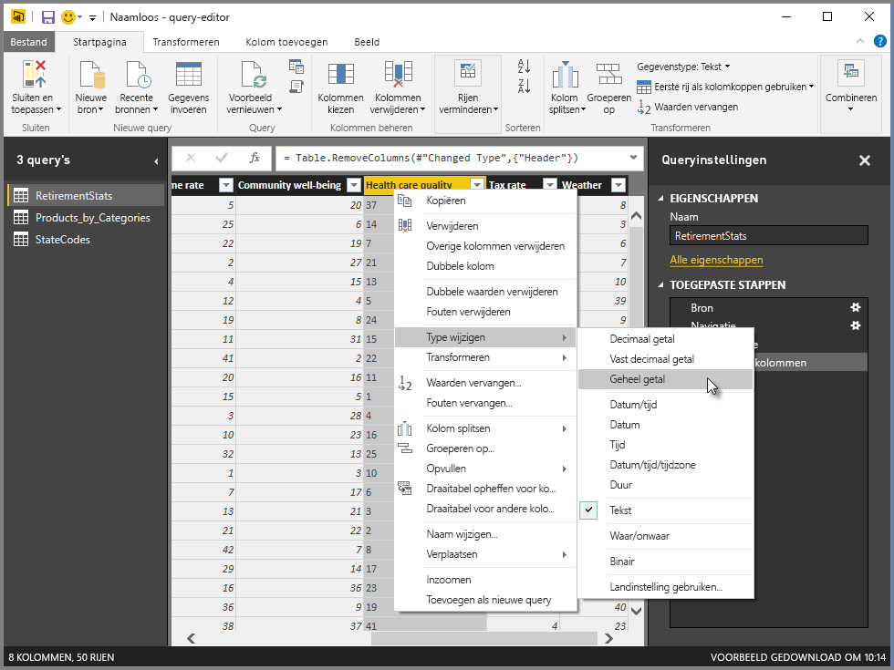

Als u een snelmenu-item (of een knop op het lint) selecteert, past de query de stap toe op de gegevens. Ook wordt de stap opgeslagen als onderdeel van de query zelf. De stappen worden vastgelegd in het deelvenster **Query-instellingen** in sequentiële volgorde, zoals beschreven in de volgende sectie.  

## Het rechterdeelvenster (Query-instellingen)
In het rechterdeelvenster, of het deelvenster **Query-instellingen**, worden alle stappen weergegeven die zijn gekoppeld aan een query. Zo ziet u in de volgende afbeelding van de sectie **Toegepaste stappen** van het deelvenster **Query-instellingen** dat we zojuist het type van de kolom **Totale score** hebben gewijzigd.

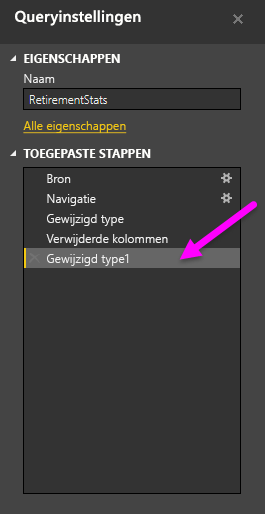

Als u aanvullende vormgevingsstappen toepast op de query, worden deze vastgelegd in de sectie **Toegepaste stappen**.

Het is belangrijk te weten dat de onderliggende gegevens *niet* zijn gewijzigd. In plaats daarvan wordt de weergave van de gegevens in Power Query-editor aangepast en beïnvloed. Ook wordt de weergave van elke interactie met de onderliggende gegevens die plaatsvinden op basis van de gewijzigde en aangepaste weergave van Power Query-editor van die gegevens beïnvloed en aangepast.

In het deelvenster **Query-instellingen** kunt u de namen van stappen wijzigen, stappen verwijderen of de volgorde van de stappen naar wens aanpassen. Hiertoe klikt u met de rechtermuisknop op een stap in de sectie **Toegepaste stappen** en kiest u een optie in het snelmenu. De querystappen worden uitgevoerd in de volgorde waarin ze worden weergegeven in het deelvenster **Toegepaste stappen**.

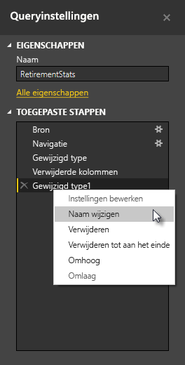

## Geavanceerde editor
Met de **Geavanceerde editor** kunt u de code zien die Power Query-editor maakt bij elke stap. U kunt ook uw eigen bepalende code maken. Om de geavanceerde editor te starten, selecteert u **Weergave** in het lint en vervolgens **Geavanceerde Editor**. Er verschijnt een venster met de bestaande querycode.  
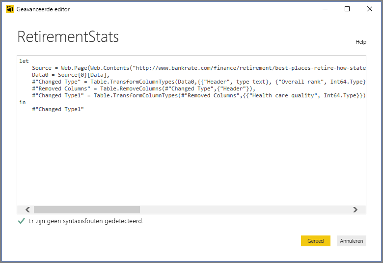

U kunt de code rechtstreeks bewerken in het venster **Geavanceerde editor**. Om het venster te sluiten, selecteert u knop **Gereed** of **Annuleren**.  

## Uw werk opslaan
Als uw query zich op de gewenste plek bevindt, selecteert u **Sluiten en toepassen** in het menu **Bestand** in Power Query-editor. Met deze actie worden de wijzigingen toegepast en wordt de editor gesloten.  
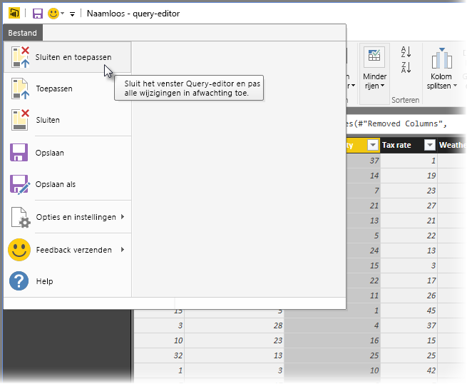

In Power BI Desktop wordt de voortgangsstatus in een dialoogvenster aangegeven.  
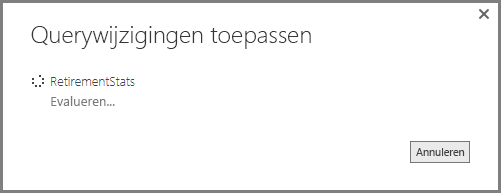

Als u klaar bent, kan Power BI Desktop uw werk opslaan in de vorm van een *pbix*-bestand.

Als u uw werk wilt opslaan, kiest u **Bestand** \> **Opslaan** (of **Bestand** \> **Opslaan als**), zoals wordt weergegeven in de volgende afbeelding.  
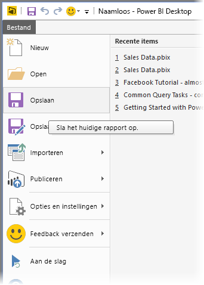

## Volgende stappen
U kunt allerlei handelingen uitvoeren met Power BI Desktop. Bekijk de volgende bronnen voor meer informatie over de vele mogelijkheden:

* [Wat is Power BI Desktop?](desktop-what-is-desktop.md)
* [Gegevensbronnen in Power BI Desktop](desktop-data-sources.md)
* [Verbinding maken met gegevens in Power BI Desktop](desktop-connect-to-data.md)
* [Zelfstudie: Gegevens vormgeven en combineren met Power BI Desktop](desktop-shape-and-combine-data.md)
* [Algemene querytaken uitvoeren in Power BI Desktop](desktop-common-query-tasks.md)   

