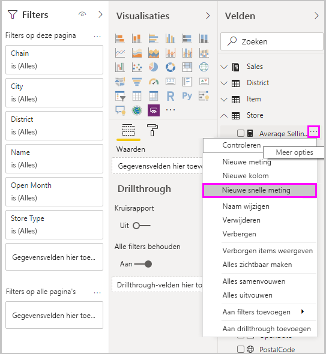
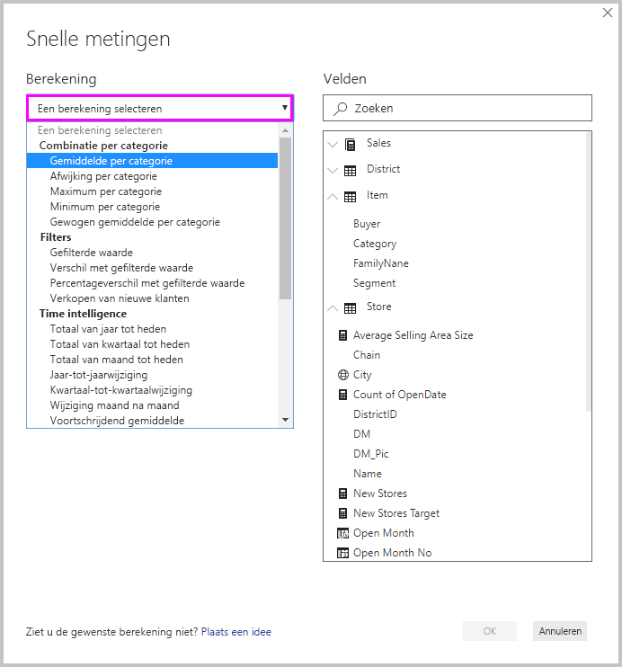
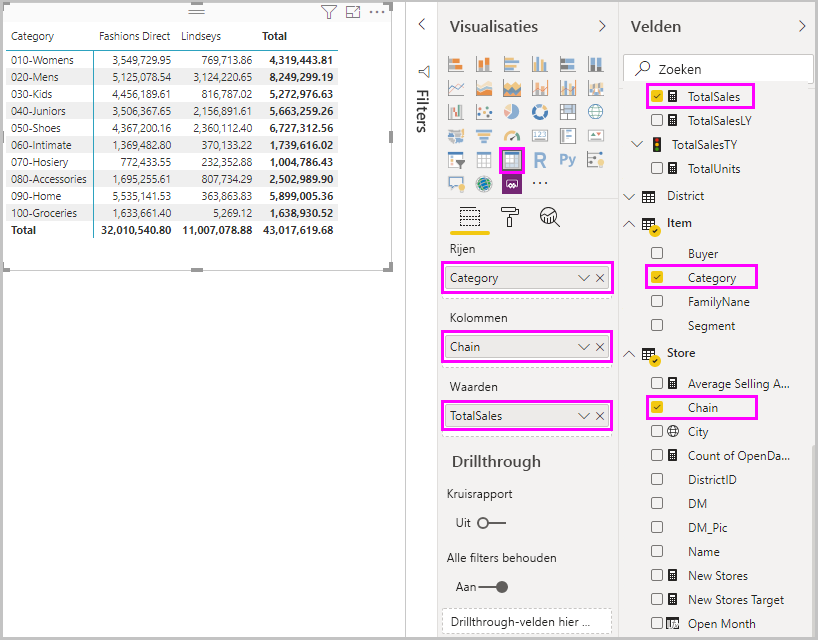
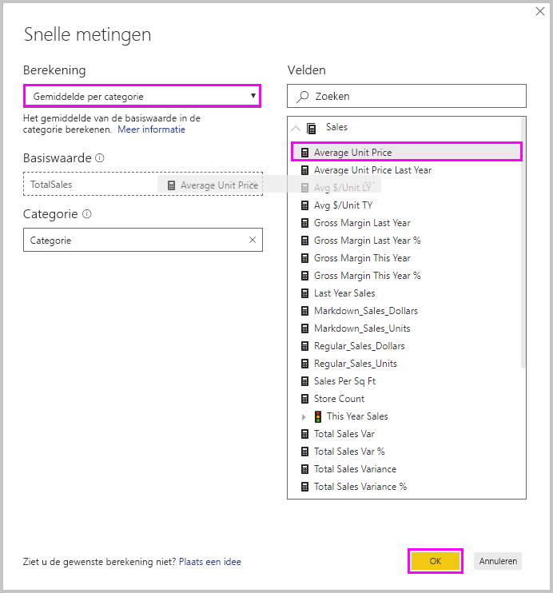
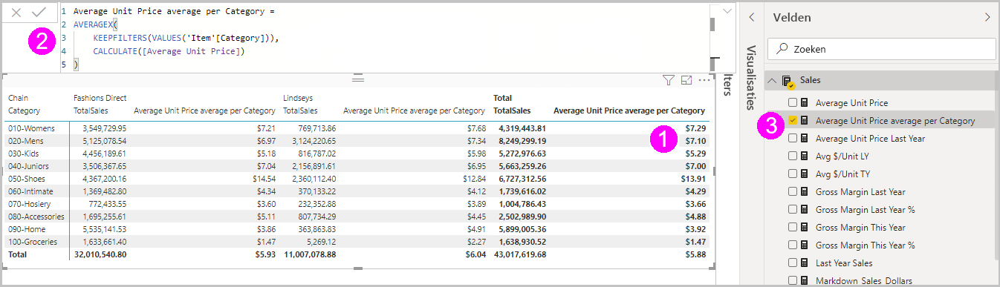
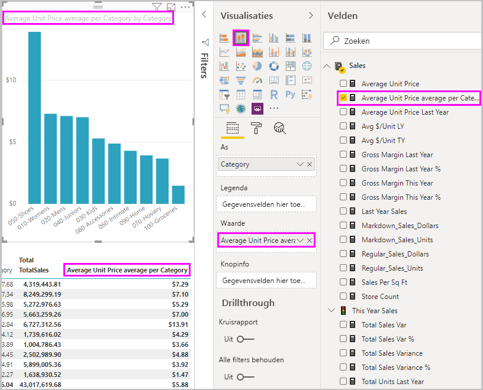
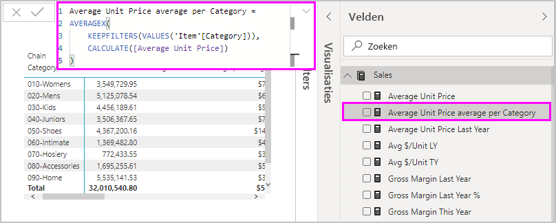
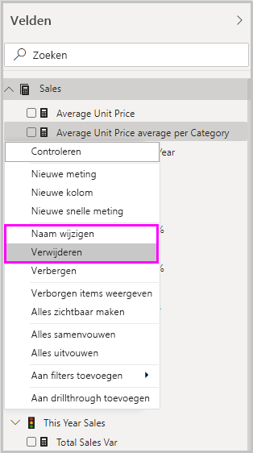

# Snelle metingen gebruiken voor algemene berekeningen
U kunt *snelle metingen* gebruiken om snel en eenvoudig algemene, krachtige berekeningen uit te voeren. Met een snelle meting wordt achter de schermen een reeks DAX-opdrachten (Data Analysis Expressions; expressies voor gegevensanalyse) uitgevoerd; vervolgens worden de resultaten weergegeven die u in uw rapport kunt gebruiken. U hoeft de DAX-opdracht niet te schrijven, dit gebeurt automatisch op basis van de informatie die u in een dialoogvenster invoert. Er zijn veel beschikbare categorieën voor berekeningen en manieren om elke berekening naar wens aan te passen. Bovendien kunt u de DAX bekijken die door de snelle meting wordt uitgevoerd en zo uw eigen kennis van DAX uitbreiden.

## Een snelle meting maken

Als u een snelle meting in Power BI Desktop wilt maken, klikt u met de rechtermuisknop op of selecteert u het beletselteken **...** naast een item in het deelvenster **Velden** en selecteert u **Nieuwe snelle meting** in het menu dat wordt weergegeven. 

U kunt ook met de rechtermuisknop klikken of de vervolgkeuzepijl naast een waarde in de bron **Waarden** voor een bestaande visual selecteren en **Nieuwe snelle meting** in het menu selecteren. 

Wanneer u **Nieuwe snelle meting** selecteert, wordt het venster **Snelle metingen** weergegeven. Hier kunt u de gewenste berekening en de velden waarop de berekening moet worden uitgevoerd, selecteren. 

Selecteer het veld **Een berekening selecteren** voor een lange lijst met beschikbare snelle metingen. 

De vijf berekeningstypen voor snelle metingen, en de bijbehorende berekeningen, zijn:

* **Samenvoegen per categorie**
  * Gemiddelde per categorie
  * Afwijking per categorie
  * Maximum per categorie
  * Minimum per categorie
  * Gewogen gemiddelde per categorie
* **Filters**
  * Gefilterde waarde
  * Verschil met gefilterde waarde
  * Percentageverschil met gefilterde waarde
  * Verkopen van nieuwe klanten
* **Time intelligence**
  * Totaal van jaar tot heden
  * Totaal van kwartaal tot heden
  * Totaal van maand tot heden
  * Jaar-tot-jaarwijziging
  * Kwartaal-tot-kwartaalwijziging
  * Wijziging maand na maand
  * Voortschrijdend gemiddelde
* **Totalen**
  * Voorlopig totaal
  * Totaal voor de categorie (filters toegepast)
  * Totaal voor de categorie (filters niet toegepast)
* **Wiskundige bewerkingen**
  * Optelling
  * Aftrekking
  * Vermenigvuldiging
  * Deling
  * Percentageverschil
  * Correlatiecoëfficiënt
* **Tekst**
  * Sterwaardering
  * Samengevoegde lijst met waarden

Voor het indienen van uw ideeën over nieuwe snelle metingen die u wilt zien, onderliggende DAX-formules of ideeën voor andere snelle metingen, gaat u naar het einde van dit artikel.

> [!NOTE]
> Wanneer u SSAS-liveverbindingen (SQL Server Analysis Services) gebruikt, zijn alleen bepaalde snelle metingen beschikbaar. In Power BI Desktop worden alleen de snelle metingen weergegeven die worden ondersteund voor de versie van SSAS waarmee u verbinding maakt. Als u bent verbonden met een SSAS-livegegevensbron en bepaalde snelle metingen niet in de lijst ziet staan, komt dit omdat de SSAS-versie waarmee u verbinding hebt gemaakt, geen ondersteuning biedt voor DAX-opdrachten die zijn gebruikt om die snelle metingen te implementeren.

Nadat u de berekeningen en gewenste velden voor uw snelle meting hebt geselecteerd, selecteert u **OK**. De nieuwe snelle meting wordt weergegeven in het deelvenster **Velden** en de onderliggende DAX-formule wordt weergegeven in de formulebalk. 

## Voorbeeld van een snelle meting
We gaan kijken naar een snelle meting in actie.

In de volgende matrixvisual ziet u een verkooptabel voor verschillende producten. Het is een basistabel die de totale verkoop voor elke categorie bevat.

Zorg ervoor dat de matrixvisual is geselecteerd en selecteer de vervolgkeuzepijl naast **TotalSales** in de bron **Waarden** en selecteer **Nieuwe snelle meting**. 

In het venster **Snelle metingen**, onder **Berekening**, selecteert u **Gemiddelde per categorie**. 

Sleep **Gemiddelde eenheidsprijs** van het deelvenster **Velden** naar het veld **Basiswaarde**. Laat **Categorie** in het veld **Categorie** en selecteer **OK**. 

Wanneer u **OK** selecteert, gebeuren er een aantal interessante dingen.

1. De matrixvisual bevat een nieuwe kolom met daarin de berekende **Gemiddelde eenheidsprijs per categorie**.
   
2. De DAX-formule voor de nieuwe snelle meting wordt weergegeven in de formulebalk. Zie de [volgende sectie](#learn-dax-by-using-quick-measures) voor meer informatie over de DAX-formule.
   
3. De nieuwe snelle meting wordt geselecteerd en gemarkeerd weergegeven in het deelvenster **Velden**. 

De nieuwe snelle meting is beschikbaar voor elke visual in het rapport, niet alleen voor de visual waarvoor u het rapport hebt gemaakt. In de volgende afbeelding ziet u een beknopte kolomgrafiekvisual die met behulp van het veld voor de nieuwe snelle meting is gemaakt.

## DAX leren kennen door snelle metingen te gebruiken
Een van de grootste voordelen van snelle metingen is dat u hiermee de DAX-formule kunt zien waarmee de meting wordt geïmplementeerd. Wanneer u een snelle meting in het deelvenster **Velden** selecteert, wordt de **formulebalk** weergegeven, met daarin de DAX-formule die door Power BI is gemaakt om de meting te implementeren.

De formulebalk toont niet alleen de formule achter de meting, maar laat u, en dat is misschien belangrijker, zien hoe u onderliggende snelle metingen voor de DAX-formules maakt.

U wilt bijvoorbeeld een jaar-op-jaarberekening uitvoeren, maar u weet niet hoe u de DAX-formule moet opbouwen of waar u moet beginnen. In plaats van naar het scherm te staren, kunt u een snelle meting maken met behulp van de berekening **Wijziging jaar na jaar** en zien hoe deze wordt weergegeven in uw visual en hoe de DAX-formule werkt. Vervolgens kunt u rechtstreeks wijzigingen in de DAX-formule aanbrengen, of een vergelijkbare meting maken die aan uw behoeften en verwachtingen voldoet. Het is alsof u een leraar hebt die onmiddellijk op uw wat-als-vragen reageert in maar een paar klikken. 

U kunt altijd snelle metingen uit uw model verwijderen als u niet tevreden bent over deze metingen. Dit is net zo eenvoudig als op de rechtermuisknop klikken of de **...** naast de meting te selecteren en **Verwijderen** te kiezen. U kunt ook de naam van een snelle meting wijzigen in wat u maar wilt, door **Naam wijzigen** in het menu te selecteren. 

## Beperkingen en overwegingen
Er zijn enkele beperkingen en overwegingen waar u rekening mee moet houden.

- U kunt snelle metingen die aan het deelvenster **Velden** zijn toegevoegd, gebruiken in combinatie met elke visual in het rapport.
- U kunt altijd de DAX zien die aan een snelle meting is gekoppeld, door de meting in de lijst **Velden** te selecteren en de formule in de formulebalk te bekijken.
- Snelle metingen zijn alleen beschikbaar als u het model kunt aanpassen. Dat is niet het geval wanneer u met een aantal liveverbindingen werkt. Liveverbindingen voor tabellaire SSAS worden ondersteund zoals eerder is beschreven.
- U kunt geen snelle time intelligence-meetwaarden maken wanneer u in de DirectQuery-modus werkt. De DAX-functies die worden gebruikt in deze snelle meetwaarden, hebben gevolgen voor de prestaties wanneer u ze omzet in de T-SQL-instructies die naar uw gegevensbron worden verzonden.

> [!IMPORTANT]
> Voor DAX-instructies voor snelle metingen worden alleen komma's als scheidingstekens voor argumenten gebruikt. Als u in een taalversie van Power BI Desktop werkt die komma's als decimaaltekens gebruikt, werken snelle metingen niet goed.

### Time intelligence en snelle metingen
U kunt uw eigen aangepaste datumtabellen gebruiken met snelle metingen met time intelligence. Als u een extern tabellair model gebruikt, is het essentieel dat tijdens het maken van het model de primaire datumkolom in de tabel als datumtabel is gemarkeerd, zoals beschreven in [Specify Mark as Date Table for use with time-intelligence](https://docs.microsoft.com/sql/analysis-services/tabular-models/specify-mark-as-date-table-for-use-with-time-intelligence-ssas-tabular) (Als datumtabel markeren opgeven voor gebruik met time intelligence). Als u uw eigen datumtabel importeert, moet u deze als datumtabel markeren, zoals beschreven in [Datumtabellen instellen en gebruiken in Power BI Desktop](desktop-date-tables.md).

### Aanvullende informatie en voorbeelden
Hebt u een idee voor een nieuwe snelle meting? Mooi! Controleer de pagina [Power BI Ideas](https://go.microsoft.com/fwlink/?linkid=842906) en dien uw ideeën en DAX-formules voor snelle metingen in die u in Power BI Desktop wilt zien. We overwegen deze bij een toekomstige release aan de lijst met snelle metingen toe te voegen.

