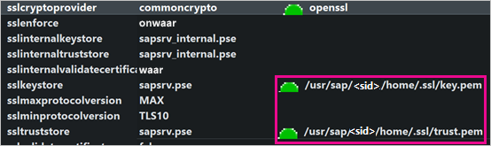
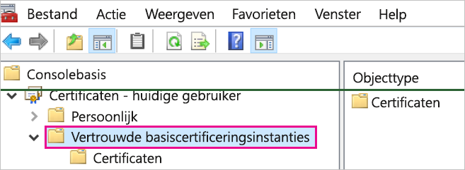
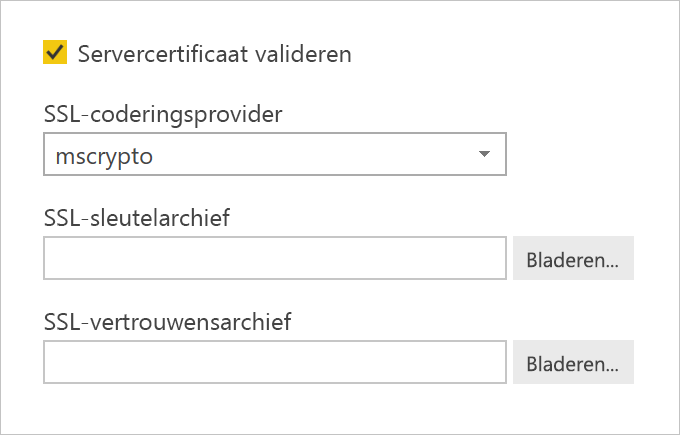
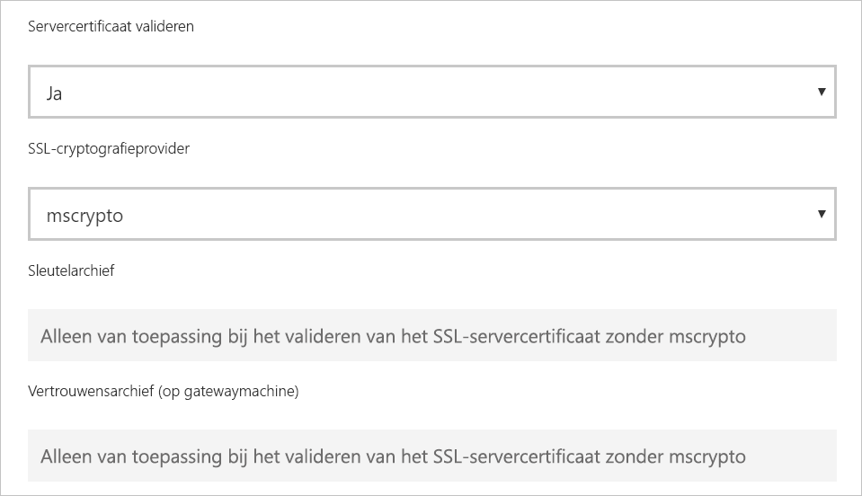

# <a name="enable-encryption-for-sap-hana"></a>Versleuteling voor SAP HANA inschakelen

U wordt aangeraden verbindingen met een SAP HANA-server te versleutelen vanuit Power BI Desktop en de Power BI-service. U kunt HANA-versleuteling inschakelen met behulp van zowel OpenSSL en als de eigen CommonCryptoLib-bibliotheek (voorheen sapcrypto genoemd) van SAP. SAP raadt u aan CommonCryptoLib te gebruiken, maar er zijn basisversleutelingsfuncties beschikbaar voor elke bibliotheek.

In dit artikel krijgt u een overzicht van het inschakelen van versleuteling met behulp van OpenSSL; er wordt verwezen naar een aantal specifieke gebieden van de SAP-documentatie. Inhoud en koppelingen worden periodiek bijgewerkt, maar raadpleeg voor uitgebreide instructies en ondersteuning altijd de officiële SAP-documentatie. Als u versleuteling wilt instellen met behulp van CommonCryptoLib in plaats van OpenSSL, raadpleegt u [TLS/SSL configureren in SAP HANA 2.0](https://blogs.sap.com/2018/11/13/how-to-configure-tlsssl-in-sap-hana-2.0/). Voor instructies voor de migratie van OpenSSL naar CommonCryptoLib raadpleegt u [SAP-notitie 2093286](https://launchpad.support.sap.com/#/notes/2093286) (s-gebruiker vereist).

> [!NOTE]
> De installatiestappen voor versleuteling die in dit artikel worden beschreven, komen deels overeen met de installatie- en configuratiestappen voor SAML SSO. Of u nu OpenSSL of CommonCryptoLib als de versleutelingsprovider van uw HANA-server kiest, u moet ervoor zorgen dat u voor alle SAML- en versleutelingsconfiguraties dezelfde keuze maakt.

Het inschakelen van versleuteling voor SAP HANA met behulp van OpenSSL kent vier fasen. Deze fasen worden hierna besproken.  Zie [De communicatie tussen SAP HANA Studio en SAP HANA-server beveiligen via SSL](https://blogs.sap.com/2015/09/28/securing-the-communication-between-sap-hana-studio-and-sap-hana-server-through-ssl/) voor meer informatie.

## <a name="use-openssl"></a>OpenSSL gebruiken

Zorg ervoor dat uw HANA-server is geconfigureerd voor het gebruik van OpenSSL als versleutelingsprovider. Vervang de ontbrekende padinformatie hieronder door de server-id (sid) van uw HANA-server.



## <a name="create-a-certificate-signing-request"></a>Een aanvraag voor ondertekening van een certificaat indienen

Dien een aanvraag in om een X509-certificaat voor de HANA-server te ondertekenen.

1. Maak via SSH verbinding met de Linux-computer waarop de HANA-server wordt uitgevoerd als \<sid\>adm.

1. Ga naar de basismap _/__usr/sap/\<sid\>/home_.

1. Maak een verborgen map met de naam _.__ssl_ als deze map nog niet bestaat.

1. Voer de volgende opdracht uit:

    ```
    openssl req -newkey rsa:2048 -days 365 -sha256 -keyout Server\_Key.pem -out Server\_Req.pem -nodes
    ```

Met deze opdracht worden een aanvraag voor het ondertekenen van een certificaat en een privésleutel gemaakt. Zodra het certificaat is ondertekend, is dit een jaar lang geldig (zie de -days-parameter). Wanneer u om de algemene naam (CN) wordt gevraagd, voert u de volledig gekwalificeerde domeinnaam (FQDN) in van de computer waarop de HANA-server is geïnstalleerd.

## <a name="get-the-certificate-signed"></a>Het certificaat laten ondertekenen

Laat het certificaat ondertekenen door een certificeringsinstantie (CA) die wordt vertrouwd door de client(s) die u gebruikt om verbinding te maken met de HANA-server.

1. Als u al een vertrouwde zakelijke CA hebt (vertegenwoordigd door CA\_Cert.pem en CA\_Key.pem in het volgende voorbeeld), kunt u het certificaataanvraag ondertekenen door de volgende opdracht uit te voeren:

    ```
    openssl x509 -req -days 365 -in Server\_Req.pem -sha256 -extfile /etc/ssl/openssl.cnf -extensions usr\_cert -CA CA\_Cert.pem -CAkey CA\_Key.pem -CAcreateserial -out Server\_Cert.pem
    ```

    Als u nog niet over een CA beschikt die u kunt gebruiken, kunt u zelf een hoofd-CA maken door de stappen te volgen die worden beschreven in [De communicatie tussen SAP HANA Studio en SAP HANA-server beveiligen via SSL](https://blogs.sap.com/2015/09/28/securing-the-communication-between-sap-hana-studio-and-sap-hana-server-through-ssl/).

1. Maak de HANA-servercertificaatketen door het servercertificaat, de sleutel en het certificaat van de CA te combineren (De naam key.pem is de conventie voor SAP HANA):

    ```
    cat Server\_Cert.pem Server\_Key.pem CA\_Cert.pem \> key.pem
    ```

1. Maak een kopie van CA\_Cert.pem named trust.pem (de naam trust.pem is de conventie voor SAP HANA):

    ```
    cp CA\_Cert.pem trust.pem
    ```

1. Start de HANA-server opnieuw op.

1. Controleer de vertrouwensrelatie tussen een client en de CA die u hebt gebruikt om het certificaat de SAP HANA-server te ondertekenen.

    De client moet de CA vertrouwen die is gebruikt voor het ondertekenen van het X509-certificaat de HANA-server, voordat er een versleutelde verbinding kan worden gemaakt met de HANA-server van de computer van de client.

    U kunt er op verschillende manieren voor zorgen dat deze vertrouwensrelatie bestaat met behulp van Microsoft Management Console (mmc) of de opdrachtregel. U kunt het X509-certificaat (trust.pem) van de CA importeren in de map **Vertrouwde basiscertificeringsinstanties** voor de gebruiker die de verbinding tot stand zal brengen of desgewenst in dezelfde map voor de clientcomputer zelf.

    

    U moet trust.pem eerst omzetten naar een .crt-bestand voordat u het certificaat kunt importeren in de map Vertrouwde basiscertificeringsinstanties, bijvoorbeeld door de volgende OpenSSL-opdracht uit te voeren:

    ```
    openssl x509 -outform der -in your-cert.pem -out your-cert.crt
    ```
    
    Zie de [OpenSSL-documentatie](https://www.openssl.org/docs/manmaster/man1/x509.html) voor informatie over het gebruik van OpenSSL voor de omzetting.

## <a name="test-the-connection"></a>De verbinding testen

Test de verbinding in Power BI Desktop of de Power BI-service.

1. Controleer in Power BI Desktop of op de pagina **Gateways beheren** van de Power BI-service of **Servercertificaat valideren** is ingeschakeld voordat u een verbinding met uw SAP HANA-server tot stand probeert te brengen. Als **SSL-versleutelingsprovider** selecteert u mscrypto als u de OpenSSL-installatiestappen hebt gevolgd en commoncrypto als u die bibliotheek als uw versleutelingsprovider hebt geconfigureerd. Laat de velden voor het SSL-sleutelarchief en het vertrouwde SSL-archief leeg.

    - Power BI Desktop

        

    - Power BI-service

        

1. Controleer of u een versleutelde verbinding met de server tot stand kunt brengen met de optie **Servercertificaat valideren** ingeschakeld, door gegevens te laden in Power BI Desktop of door een gepubliceerd rapport in de Power BI-service te vernieuwen.
