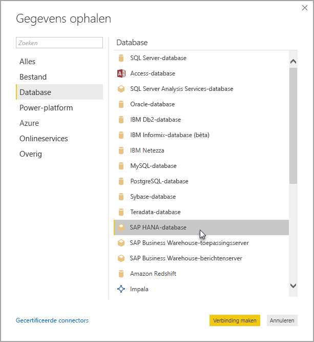

# SAP HANA in Power BI Desktop gebruiken
Met Power BI Desktop hebt u nu toegang tot **SAP HANA**-databases. Om **SAP HANA** te gebruiken moet u het SAP HANA ODBC-stuurprogramma installeren op de lokale clientcomputer. Anders werkt de gegevensverbinding tussen Power BI Desktop en **SAP HANA** niet goed. U kunt de SAP HANA-clienthulpprogramma's downloaden via [SAP-hulpprogramma's voor ontwikkelaars](https://tools.hana.ondemand.com/#hanatools), waar het benodigde ODBC-stuurprogramma te vinden is. U kunt dit ook doen via het [SAP Software Download Center](https://support.sap.com/swdc). Zoek in de Software-portal naar de SAP HANA CLIENT voor Windows-computers. Omdat de indeling van het **SAP Software Download Center** vaak verandert, kunnen we geen specifiekere richtlijnen geven voor de navigatie op die site.

Om verbinding te maken met een **SAP HANA**-database, selecteert u **Gegevens ophalen > Database > SAP HANA-database**, zoals weergegeven op de volgende afbeelding:

Wanneer u verbinding maakt met een SAP HANA-database, moet u de servernaam opgeven. Kies vervolgens de poort in de vervolgkeuzelijst en het invoervak.

In deze release wordt **SAP HANA** in de [DirectQuery](desktop-directquery-sap-hana.md)-modus ondersteund in Power BI Desktop en de Power BI-service. U kunt rapporten die gebruikmaken van **SAP HANA** in de DirectQuery-modus publiceren en uploaden met de Power BI-service. U kunt ook rapporten publiceren en uploaden naar de Power BI-service wanneer u **SAP HANA** niet in de DirectQuery-modus gebruikt.

## Ondersteunde functies voor SAP HANA
Deze release heeft veel mogelijkheden voor **SAP HANA**, zoals wordt weergegeven in de volgende lijst:

* De Power BI-connector voor **SAP HANA** maakt gebruik van het SAP ODBC-stuurprogramma om de beste gebruikerservaring te bieden
* **SAP HANA** ondersteunt opties voor importeren en voor DirectQuery
* Power BI ondersteunt HANA-informatiemodellen (zoals de weergaven Analyse en Berekening) en heeft geoptimaliseerde navigatie
* Met **SAP HANA** kunt u ook de directe SQL-functie gebruiken om verbinding te maken met rij- en kolomtabellen
* Bevat geoptimaliseerde navigatie voor HANA-modellen
* Power BI ondersteunt **SAP HANA**-variabelen en -invoerparameters
* Berekeningsweergaven op basis van een HDI-container
  * Ondersteuning voor berekeningsweergaven op basis van een HDI-container is beschikbaar als openbare preview in de Power BI Desktop-versie van augustus 2019. Om in Power BI toegang tot uw berekeningsweergaven op basis van HDI-containers te krijgen, moeten uw gebruikers van de HANA-database in Power BI toegang hebben tot de HDI-uitvoeringscontainer waarin de weergaven zijn opgeslagen die u wilt gebruiken. Om deze toegang te verlenen, moet u een rol maken die toegang tot uw HDI-container geeft en deze rol toewijzen aan de HANA-databasegebruiker die u in Power BI gebruikt (deze gebruiker moet, zoals gebruikelijk, ook toestemming hebben om systeemtabellen te lezen in het \_SYS\_BI-schema). Raadpleeg de officiële SAP-documentatie voor uitgebreide instructies over het maken en toewijzen van databaserollen. [Deze SAP-blog](https://blogs.sap.com/2018/01/24/the-easy-way-to-make-your-hdi-container-accessible-to-a-classic-database-user/) is mogelijk een goede plaats om te beginnen.
  * Houd er rekening mee dat er momenteel enkele beperkingen gelden voor HANA-variabelen die zijn gekoppeld aan berekeningsweergaven op basis van HDI. Deze beperkingen worden veroorzaakt door fouten aan de HANA-zijde en zullen in toekomstige releases van SAP HANA worden opgelost. Ten eerste is het niet mogelijk om een HANA-variabele toe te passen op een gedeelde kolom van een berekeningsweergave op basis van een HDI-container. Deze beperking kan worden verholpen door een upgrade uit te voeren naar HANA 2, versie 37.02 en later of HANA 2, versie 42 en hoger. Ten tweede worden de standaardwaarden met meerdere invoeren voor variabelen en parameters momenteel niet weergegeven in de gebruikersinterface van Power BI. Dit is ook het gevolg van een fout in SAP HANA, maar SAP heeft nog geen oplossing aangekondigd.

## Beperkingen van SAP HANA
Er zijn ook enkele beperkingen voor het gebruik van **SAP HANA**. Deze worden hieronder weergegeven:

* NVARCHAR-tekenreeksen worden afgekapt tot de maximale lengte van 4000 Unicode-tekens
* SMALLDECIMAL wordt niet ondersteund
* VARBINARY wordt niet ondersteund
* Geldige datums liggen tussen 30-12-1899 en 31-12-9999

## Volgende stappen
Raadpleeg de volgende bronnen voor meer informatie over DirectQuery en SAP HANA:

* [DirectQuery en SAP HANA](desktop-directquery-sap-hana.md)
* [DirectQuery in Power BI](desktop-directquery-about.md)
* [Gegevensbronnen die worden ondersteund door DirectQuery](desktop-directquery-data-sources.md)
* [Versleuteling inschakelen voor SAP HANA](desktop-sap-hana-encryption.md)

