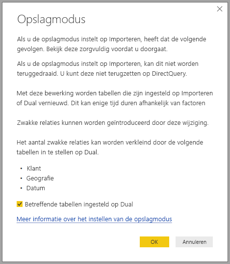

# Opslagmodus in Power BI Desktop beheren

In Microsoft Power BI Desktop kunt u de opslagmodus van een tabel opgeven. Met de opslagmodus kunt u bepalen of tabelgegevens voor rapporten in een geheugencache worden opgeslagen in Power BI Desktop. 

Het instellen van de opslagmodus biedt verschillende voordelen. U kunt de opslagmodus afzonderlijk instellen voor elke tabel in uw model. Met deze actie wordt een enkele gegevensset ingeschakeld, wat de volgende voordelen biedt:

* **Queryprestaties**: terwijl gebruikers werken met visualisaties in Power BI-rapporten, worden er DAX-query's (Data Analysis Expressions) verzonden naar de gegevensset. Het opslaan van gegevens in het cachegeheugen door het juist instellen van de opslagmodus kan de queryprestaties en de interactiviteit van uw rapporten verbeteren.

* **Grote gegevenssets**: tabellen die niet in het cachegeheugen worden opgeslagen, verbruiken geen geheugen voor cachebewerkingen. U kunt interactieve analyse inschakelen voor grote gegevenssets die te groot of te duur zijn om volledig op te slaan in het cachegeheugen. U kunt kiezen welke tabellen moeten worden opgeslagen in de cache en welke niet.

* **Optimalisatie van gegevensvernieuwing**: U hoeft tabellen die niet in de cache worden opgeslagen niet te vernieuwen. U kunt de vernieuwingstijden beperken door alleen de gegevens op te slaan in de cache die noodzakelijk zijn om te voldoen aan de serviceovereenkomsten en uw zakelijke vereisten.

* **Vereisten voor bijna realtime gegevens**: voor tabellen met gegevens die in bijna realtime beschikbaar moeten zijn, kan het beter zijn om de gegevens niet in de cache op te slaan, om zo gegevenslatentie te verminderen.

* **Terugschrijven**: terugschrijven (write-back) stelt zakelijke gebruikers in staat om what-if-scenario's te verkennen door celwaarden te wijzigen. Maatwerktoepassingen kunnen wijzigingen aanbrengen in de gegevensbron. In tabellen die niet in de cache worden opgeslagen, worden wijzigingen direct weergegeven, waardoor de effecten direct kunnen worden geanalyseerd.

De opslagmodusinstelling in Power BI Desktop is een van drie gerelateerde functies:

* **Samengestelde modellen**: hiermee wordt het mogelijk dat een rapport twee of meer gegevensverbindingen heeft, inclusief DirectQuery-verbindingen of importverbindingen, in elke gewenste combinatie. Zie [Samengestelde modellen in Power BI Desktop gebruiken](desktop-composite-models.md) voor meer informatie.

* **Veel-op-veel-relaties**: Met samengestelde modellen kunt u *veel-op-veel-relaties* tussen tabellen tot stand brengen. In een veel-op-veel-relatie zijn unieke waarden in tabellen niet meer vereist. Ook zijn eerdere tijdelijke oplossingen niet meer nodig, zoals de introductie van nieuwe tabellen alleen maar voor het tot stand brengen van relaties. Zie [Veel-op-veel-relaties in Power BI Desktop](desktop-many-to-many-relationships.md) voor meer informatie.

* **Opslagmodus**: Met de opslagmodus kunt u nu opgeven voor welke visualisaties een query naar de back-endgegevensbronnen is vereist. Visuals waarvoor geen query is vereist, worden geïmporteerd zelfs als ze zijn gebaseerd op DirectQuery. De functie helpt de prestaties te verbeteren en de back-end minder te belasten. Eerder werden zelfs voor eenvoudige visualisaties, zoals slicers, query's verzonden naar de back-end-bronnen. 

## De opslagmoduseigenschap gebruiken

De eigenschap **Opslagmodus** is een eigenschap die u kunt instellen voor elke tabel in uw model. U bepaalt hiermee hoe Power BI de tabelgegevens in de cache opslaat.

De eigenschap **Opslagmodus** instellen of de huidige instelling ervan weergeven: 

1. Selecteer in de weergave **Model** de tabel waarvan u de eigenschappen wilt weergeven of instellen. 
2. Vouw in het deelvenster **Eigenschappen** het gedeelte **Geavanceerd** uit en vouw de vervolgkeuzelijst **Opslagmodus** uit.

   

Stel de eigenschap **Opslagmodus** in op een van deze drie waarden:

* **Importeren**: Geïmporteerde tabellen met deze instelling worden opgeslagen in de cache. Query's die worden verzonden naar de Power BI-gegevensset die gegevens retourneren uit importtabellen, kunnen alleen worden uitgevoerd aan de hand van gegevens in de cache.

* **DirectQuery**: Tabellen met deze instelling worden niet in de cache opgeslagen. Query's die u verzendt naar de Power BI-gegevensset, &mdash;zoals DAX-query's&mdash;, en waarmee gegevens uit DirectQuery-tabellen worden geretourneerd, kunnen alleen worden voltooid door query's op aanvraag uit te voeren op de gegevensbron. Query's die u verzendt naar de gegevensbron, gebruiken de querytaal voor deze gegevensbron, bijvoorbeeld SQL.

* **Dual**: Tabellen met deze instelling worden al dan niet in de cache opgeslagen, afhankelijk van de context van de query die wordt verzonden naar de Power BI-gegevensset. In sommige gevallen voert u query's uit vanuit de gegevens in de cache. In andere gevallen voert u query’s uit door een query op aanvraag uit te voeren voor de gegevensbron.

Het wijzigen van de **Opslagmodus** van een tabel in **Import** is een *onomkeerbare* bewerking. Deze eigenschap kan niet worden gewijzigd in **DirectQuery** of **Dual**.

> [!NOTE]
> U kunt de opslagmodus **Dual** in Power BI Desktop en in de Power BI-service gebruiken.

## Beperkingen voor DirectQuery- en Dual-tabellen

Voor Dual-tabellen gelden dezelfde functionele beperkingen als voor DirectQuery-tabellen. Deze beperkingen omvatten beperkte M-transformaties en beperkte DAX-functies in berekende kolommen. Zie [Gevolgen van het gebruik van DirectQuery](desktop-directquery-about.md#implications-of-using-directquery) voor meer informatie.

## Doorgifte van de Dual-instelling
In dit eenvoudige model zijn alle tabellen afkomstig uit één bron, die ondersteuning biedt voor de opslagmodi Importeren en DirectQuery.

Stel dat alle tabellen in dit model in eerste instantie zijn ingesteld op **DirectQuery**. Als u nu de **opslagmodus** van de tabel **SurveyResponse** wijzigt in **Import**, wordt het volgende waarschuwingsvenster weergegeven:

U kunt de dimensietabellen (**Klant**, **Geografie** en **Datum**) instellen op **Dual** om het aantal zwakke relaties in de gegevensset te verminderen en de prestaties te verbeteren. Zwakke relaties bestaan doorgaans uit ten minste één DirectQuery-tabel waarin samenvoeglogica niet naar de bronsystemen kan worden gepusht. Omdat Dual-tabellen kunnen fungeren als DirectQuery- of Import-tabellen, wordt deze situatie vermeden.

De doorgiftelogica is namelijk ontworpen om u te helpen met modellen die veel tabellen bevatten. Stel dat u een model hebt met 50 tabellen en dat alleen bepaalde feitentabellen (met transacties) in de cache moeten worden opgeslagen. Met de logica in Power BI Desktop worden berekend wat de minimale set met dimensietabellen is die moet worden ingesteld op **Dual**, zodat u dit niet hoeft te doen.

De doorgiftelogica wordt slechts aan de een-zijde van een-op-veel-relaties doorlopen.

## Praktijkvoorbeeld van opslagmodus
Laten we verdergaan met het voorbeeld uit het vorige gedeelte en doen alsof we de volgende instellingen van de eigenschap opslagmodus toepassen:

| Tabel                   | Opslagmodus         |
| ----------------------- |----------------------| 
| Verkoop                 | DirectQuery          | 
| SurveyResponse        | Importeren               | 
| Datum                  | Dual                 | 
| Klant              | Dual                 | 
| Geografie             | Dual                 | 

Het instellen van deze eigenschappen van de opslagmodus resulteert in de volgende gedragingen, ervan uitgaande dat de tabel **Sales** voldoende gegevens bevat:
* Dimensietabellen - **Date**, **Customer** en **Geography**, worden in de cache opgeslagen in Power BI Desktop, zodat de laadtijden van rapporten kort zijn bij het ophalen van slicerwaarden om weer te geven.
* Power BI Desktop slaat de tabel **Verkoop** niet op in de cache. Door deze tabel niet in de cache op te slaan, biedt Power BI Desktop de volgende resultaten:
    * De vernieuwingsintervallen van gegevens zijn korter en het geheugenverbruik is lager.
    * Rapportquery’s die zijn gebaseerd op de tabel **Sales**, worden uitgevoerd in de modus **DirectQuery**. Deze query’s duren langer maar liggen dichter bij realtime omdat er geen cachingvertraging optreedt.

* Rapportquery's die zijn gebaseerd op de tabel **SurveyResponse**, worden geretourneerd uit de geheugencache en zijn daarom relatief snel.

## Query's op de cache die wel of geen hit opleveren

Als u SQL Profiler met de diagnostische poort voor Power BI Desktop verbindt, kunt u zien welke query's op de cache succesvol zijn of mislukken door een trace uit te voeren die is gebaseerd op de volgende gebeurtenissen:

* Queries Events\Query Begin
* Query Processing\Vertipaq SE Query Begin
* Query Processing\DirectQuery Begin

Voor elke gebeurtenis *Query Begin* controleert u andere gebeurtenissen met dezelfde *ActivityID*. Als er bijvoorbeeld geen gebeurtenis *DirectQuery Begin* is, maar wel een gebeurtenis *Vertipaq SE-Query Begin*, wordt de query beantwoord vanuit de cache.

Met query's die verwijzen naar Dual-tabellen worden gegevens uit de cache geretourneerd, indien mogelijk, anders vallen ze terug op DirectQuery.

Als we verdergaan met het vorige voorbeeld, verwijst de volgende query alleen naar een kolom uit de tabel **Date**, die is ingesteld als **Dual**. De query moet daarom een hit geven uit de cache:

De volgende query verwijst alleen naar een kolom uit de tabel **Sales**, die in de modus **DirectQuery** staat. De query moet daarom *geen hit* opleveren uit de cache:

De volgende query is interessant omdat hierin beide kolommen worden gecombineerd. Deze query levert geen hit op uit de cache. In eerste instantie verwacht u dat er **CalendarYear**-waarden worden opgehaald uit de cache en **SalesAmount**-waarden uit de bron en dat de resultaten vervolgens worden gecombineerd. Deze aanpak is echter minder efficiënt dan het verzenden van de bewerking SUM/GROUP BY naar het bronsysteem. Als de bewerking naar de bron wordt gepusht, zal het aantal geretourneerde rijen waarschijnlijk veel lager zijn: 

> [!NOTE]
> Dit gedrag verschilt van [veel-op-veel-relaties in Power BI Desktop](desktop-many-to-many-relationships.md) waarbij tabellen die wel en tabellen die niet in de cache zijn opgeslagen, worden gecombineerd.

## Caches moeten steeds worden gesynchroniseerd

De query's in het vorige gedeelte laten zien dat Dual-tabellen soms wel een hit opleveren uit de cache en soms niet. Als gevolg hiervan kunnen er verschillende waarden worden geretourneerd wanneer de cache is verouderd. Bij het uitvoeren van query's wordt er niet geprobeerd om gegevensproblemen te maskeren, bijvoorbeeld door DirectQuery resultaten te filteren zodat deze overeenkomen met de waarden in de cache. Het is uw verantwoordelijkheid om te weten hoe de gegevensstromen lopen en uw ontwerp hierop af te stemmen. Er zijn in de praktijk bewezen technieken om dergelijke gevallen bij de bron af te handelen, indien nodig.

De opslagmodus **Dual** biedt een optimalisatie van prestaties. Gebruik de modus alleen op manieren die geen conflict opleveren met het voldoen aan zakelijke vereisten. Voor een alternatieve aanpak kunt u de technieken overwegen die worden beschreven in het artikel [Veel-op-veel-relaties in Power BI Desktop](desktop-many-to-many-relationships.md).

## Gegevensweergave
Als voor minstens één tabel in de gegevensset de opslagmodus is ingesteld op **Import** of **Dual**, kan het tabblad **Gegevensweergave** worden weergegeven.

Wanneer u Dual- en Import-tabellen selecteert in de weergave **Gegevens**, geven deze gegevens uit de cache weer. DirectQuery-tabellen bevatten geen gegevens. U ziet een bericht met de mededeling dat DirectQuery tabellen niet kunnen worden weergegeven.

## Beperkingen en overwegingen

Er gelden enkele beperkingen voor deze release van de opslagmodus, en de correlatie ervan met samengestelde modellen.

De volgende (multidimensionale) liveverbindingsbronnen kunnen niet worden gebruikt met samengestelde modellen:

* SAP HANA
* SAP Business Warehouse
* SQL Server Analysis Services
* Power BI-gegevenssets
* Azure Analysis Services

Als u met behulp van DirectQuery verbinding maakt met deze multidimensionale bronnen, is het mogelijk om verbinding te maken met een andere DirectQuery-bron of deze te combineren met geïmporteerde gegevens.

De bestaande beperkingen van het gebruik van DirectQuery gelden nog steeds wanneer u samengestelde modellen gebruikt. Veel van deze beperkingen zijn nu per tabel, al naar gelang de opslagmodus van de tabel. Zo kan een berekende kolom in een geïmporteerde tabel verwijzen naar andere tabellen, maar kan een berekende kolom in een DirectQuery-tabel nog steeds alleen verwijzen naar kolommen in dezelfde tabel. Andere beperkingen gelden voor het model als geheel, als een van de tabellen in het model DirectQuery gebruikt. De functies Snelle inzichten en Q&A zijn bijvoorbeeld niet beschikbaar voor een model als een van de tabellen in het model de opslagmodus DirectQuery heeft. 

## Volgende stappen

Zie de volgende artikelen voor meer informatie over samengestelde modellen en DirectQuery:
* [Samengestelde modellen in Power BI Desktop](desktop-composite-models.md)
* [Veel-op-veel-relaties in Power BI Desktop](desktop-many-to-many-relationships.md)
* [DirectQuery in Power BI gebruiken](desktop-directquery-about.md)
* [Gegevensbronnen die worden ondersteund door DirectQuery in Power BI](desktop-directquery-data-sources.md)
