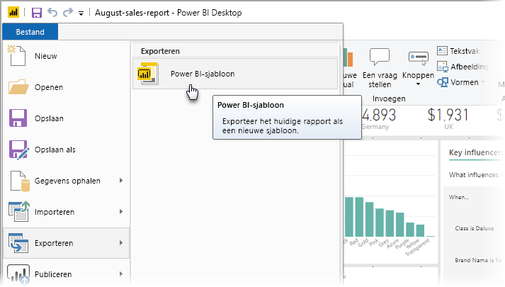
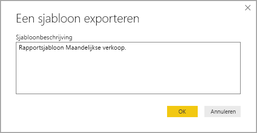
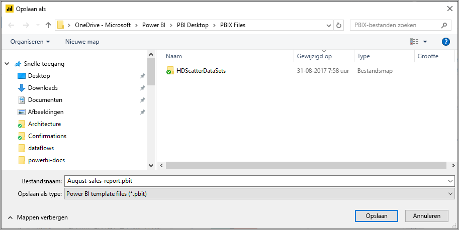
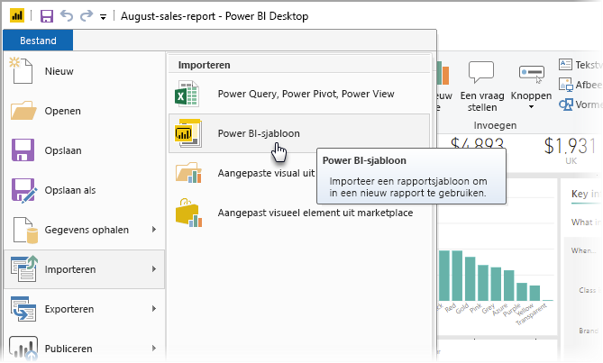
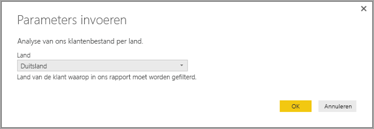
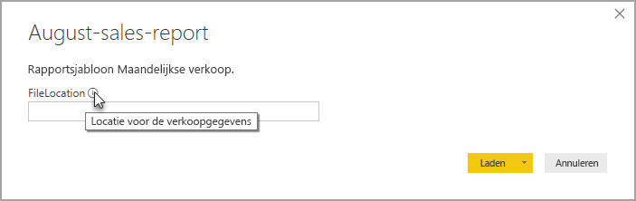

# Rapportsjablonen maken voor Power BI Desktop

Met **Power BI Desktop** kunt u aantrekkelijke rapporten maken om inzichten met uw hele organisatie te delen. Met de **sjablonen** van Power BI Desktop kunt u uw werk stroomlijnen; maak bijvoorbeeld een rapportsjabloon op basis van een bestaande sjabloon die door uzelf en andere gebruikers in uw organisatie kan worden gebruikt als basis voor een nieuwe rapportopmaak, een nieuw gegevensmodel en query's. Met de sjablonen in **Power BI Desktop** kunt u snel aan de slag met het maken van rapporten en hier standaarden voor instellen.

## Sjablonen maken

Power BI-rapportsjablonen bevatten de volgende informatie uit het rapport op basis waarvan ze zijn gegenereerd:

* **Rapportpagina's**, visuals en andere visuele elementen
* De **definitie van het gegevensmodel**, inclusief schema, relaties, meetwaarden en andere artefacten voor modeldefinities
* Alle **querydefinities**, zoals query's, queryparameters en andere query-elementen

Wat *niet* in sjablonen staat, zijn de gegevens van het rapport. 

Voor rapportsjablonen wordt de bestandsextensie .PBIT gebruikt (vergelijk dit met Power BI Desktop-rapporten, waarvoor de extensie .PBIX wordt gebruikt). 

Als u een rapportsjabloon wilt maken, selecteert u **Bestand > Exporteren > Power BI-sjabloon** in het menu. Hiermee wordt het volgende venster geopend, waarin u wordt gevraagd een beschrijving voor de sjabloon op te geven. In dit voorbeeld geven wij de sjabloon de volgende beschrijving: *Rapportsjabloon voor maandelijkse verkoop*.

Selecteer **OK**. U wordt vervolgens gevraagd om een bestandslocatie op te geven om het .PBIT-sjabloonbestand op te slaan.

En dat is alles! Uw Power BI-rapportsjabloon wordt gemaakt op de bestandslocatie die u hebt opgegeven, met de .PBIT-extensie.

> [!NOTE]
> Power BI-rapportsjabloonbestanden zijn over het algemeen veel kleiner dan een Power BI Desktop-rapport, omdat sjablonen geen gegevens bevatten, maar alleen de rapportdefinities zelf. 

## Sjablonen gebruiken

Als u een Power BI-rapportsjabloon wilt gebruiken, hoeft u deze alleen maar in Power BI Desktop te openen en gaan gebruiken. U kunt Power BI-rapportsjablonen op twee manieren openen:

* Dubbelklik op een willekeurig .PBIT-bestand om Power BI Desktop automatisch te openen en de sjabloon te laden
* Selecteer **Bestand > Importeren > Power BI-sjabloon** vanuit Power BI Desktop

Wanneer u een rapportsjabloon opent, wordt een dialoogvenster weergegeven met waarden voor alle parameters die zijn gedefinieerd in het rapport waarop de sjabloon is gebaseerd. Als u bijvoorbeeld een rapport gebruikt om klanten te analyseren op basis van land of regio en het rapport de parameter *Land* bevat om de klantenbasis te specificeren, wordt u in een venster gevraagd om een waarde voor *Land* te selecteren uit de lijst met waarden die zijn opgegeven tijdens het definiëren van de parameter. 

Zodra de vereiste parameters zijn opgegeven, wordt u om de locatie gevraagd van de onderliggende gegevens die aan het rapport zijn gekoppeld. De huidige rapportmaker kan vervolgens verbinding met de gegevens maken op basis van zijn of haar referenties.

Zodra de parameters en gegevens zijn opgegeven, wordt een rapport gemaakt met alle pagina's, visuals, gegevensmodelartefacten en query's die onderdeel zijn van het rapport waarop de sjabloon is gebaseerd. 

Dat is alles. Het is heel eenvoudig om rapportsjablonen in Power BI Desktop te maken en te gebruiken, zodat u eenvoudig aantrekkelijke indelingen en andere aspecten van het rapport kunt reproduceren en deze met anderen kunt delen.

## Volgende stappen
Wellicht bent u ook geïnteresseerd in informatie over **queryparameters**:
* [Queryparameters gebruiken in Power BI Desktop](https://docs.microsoft.com/power-query/power-query-query-parameters).

Daarnaast kunt u allerlei handelingen uitvoeren met Power BI Desktop. Bekijk de volgende bronnen voor meer informatie over de vele mogelijkheden:

* [Wat is Power BI Desktop?](desktop-what-is-desktop.md)
* [Query Overview with Power BI Desktop](desktop-query-overview.md) (Queryoverzicht met Power BI Desktop)
* [Gegevenstypen in Power BI Desktop](desktop-data-types.md)
* [Gegevens vormgeven en combineren met Power BI Desktop](desktop-shape-and-combine-data.md)
* [Common Query Tasks in Power BI Desktop](desktop-common-query-tasks.md) (Algemene querytaken in Power BI Desktop)    
