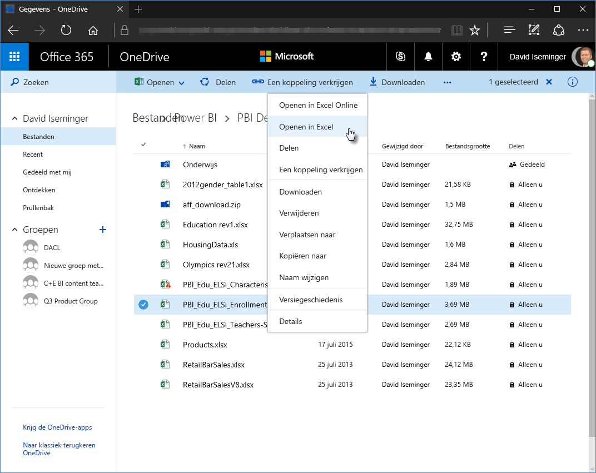
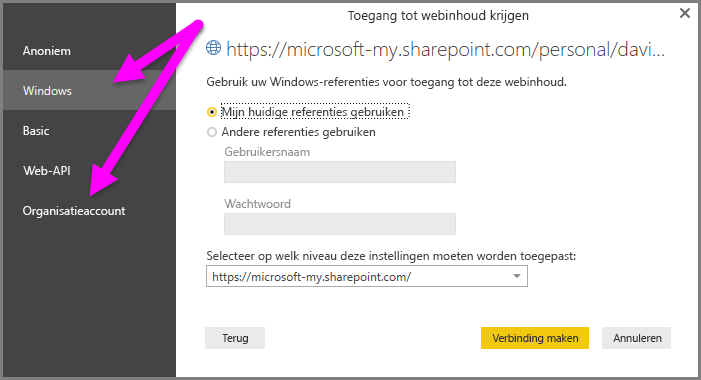

# Koppelingen van OneDrive voor Bedrijven gebruiken in Power BI Desktop
Veel gebruikers hebben Excel-werkmappen opgeslagen in OneDrive voor Bedrijven. Het zou mooi zijn deze met Power BI Desktop te gebruiken. Met Power BI Desktop kunt u onlinekoppelingen voor Excel-bestanden gebruiken die in OneDrive voor Bedrijven zijn opgeslagen en waarmee u rapporten en visuals kunt maken. U kunt een OneDrive voor Bedrijven groepsaccount of een individueel account van OneDrive voor Bedrijven gebruiken.

Voor een onlinekoppeling van OneDrive voor Bedrijven zijn een paar specifieke stappen vereist. In de volgende sectie worden die stappen uitgelegd, zodat u de bestandskoppeling met groepen op verschillende computers en met uw collega's kunt delen.

## Een koppeling ophalen uit Excel
1. Ga via de browser naar uw locatie van OneDrive voor Bedrijven. Klik met de rechtermuisknop o het bestand dat u wilt gebruiken en selecteer **Openen in Excel**.
   
   > [!NOTE]
   > De interface van uw browser kan afwijken van de volgende afbeelding. U kunt **Openen in Excel** (voor bestanden) op diverse manieren selecteren in de browserinterface van OneDrive voor Bedrijven. U kunt elke optie gebruiken om het bestand in Excel te openen.
   > 
   > 
   
   
2. In Excel selecteert u **Bestand** > **Info** en vervolgens **Pad kopiëren** boven **Werkmap beveiligen**.
   
   

## Koppeling gebruiken in Power BI Desktop
In Power BI Desktop kunt u de koppeling gebruiken die u zojuist naar Klembord hebt gekopieerd. Voer de volgende stappen uit:

1. In Power BI Desktop selecteert u **Gegevens ophalen** > **Internet**.
   
   
2. Selecteer de optie **Basic** en plak de koppeling in het dialoogvenster **Van internet**.
3. Verwijder de tekenreeks *?web=1* aan het einde van de koppeling zodat Power BI Desktop naar uw bestand kan navigeren en selecteer vervolgens **OK**.
   
     
4. Als u door Power BI Desktop om uw referenties wordt gevraagd, kiest u **Windows** (voor on-premises SharePoint-sites) of **Organisatieaccount** (voor Office 365- of OneDrive voor Bedrijven-sites).
   
   

   Het dialoogvenster **Navigator** verschijnt. Hier kunt u een selectie maken in een lijst met tabellen, werkbladen en bereiken uit de Excel-werkmap. Daar kunt u het OneDrive voor Bedrijven-bestand gebruiken, net zoals elk ander Excel-bestand. U kunt rapporten maken en deze gebruiken in gegevenssets, zoals u dat ook zou doen met andere gegevensbronnen.

> [!NOTE]
> Als u een bestand van OneDrive voor Bedrijven als een gegevensbron in de Power BI-service wilt gebruiken, waarbij **Service Refresh** voor dat bestand is ingeschakeld, moet u **OAuth2** als **verificatiemethode** selecteren bij het configureren van uw vernieuwingsinstellingen. Als u dat niet doet, krijgt u een foutmelding (bijvoorbeeld *Gegevensbronreferenties bijwerken is mislukt*) als u verbinding wilt maken of vernieuwen. Als u **OAuth2** als verificatiemethode selecteert, wordt deze fout voorkomen.
> 
> 

