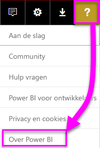
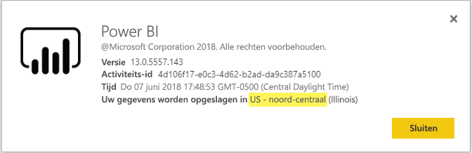

# <a name="frequently-asked-questions-about-power-bi-embedded"></a>Veelgestelde vragen over Power BI Embedded

* Als u andere vragen hebt, kunt u deze stellen [in de Power BI-community](http://community.powerbi.com/).
* Nog steeds geen antwoord? Ga naar de [ondersteuningspagina van Power BI](https://powerbi.microsoft.com/support/).

## <a name="general"></a>Algemeen

### <a name="what-is-power-bi-embedded"></a>Wat is Power BI Embedded?

[Microsoft Power BI Embedded (PBIE)](azure-pbie-what-is-power-bi-embedded.md) zorgt ervoor dat ontwikkelaars van toepassingen schitterende, volledig interactieve rapporten in hun toepassingen kunnen insluiten, zonder dat ze hun eigen gegevensvisualisaties en besturingselementen helemaal zelf moeten bouwen.

### <a name="who-is-the-target-audience-for-power-bi-embedded"></a>Wie is de doelgroep voor Power BI Embedded?

Ontwikkelaars en softwarebedrijven, ook wel onafhankelijke softwareleveranciers (ISV's) genoemd, die toepassingen coderen.

### <a name="how-is-power-bi-embedded-different-from-power-bi-the-service"></a>Hoe verschilt Power BI Embedded van de Power BI-service?

Power BI is een SaaS-oplossing (Software as a Service) voor analytische gegevens waarmee organisaties in één weergave alle meest kritieke zakelijke gegevens kunnen bekijken.

Microsoft heeft Power BI Embedded ontwikkeld voor ISV's die visuals in hun toepassingen willen insluiten zodat hun klanten analytische beslissingen kunnen nemen. Hierdoor hoeven ISV's niet hun eigen analyseoplossing te bouwen. [Ingesloten analyse](embedding.md) biedt zakelijke gebruikers toegang tot zakelijke gegevens en stelt ze in staat query's uit te voeren op deze gegevens om inzichten te genereren in de toepassing.


### <a name="what-is-the-difference-between-power-bi-premium-and-power-bi-embedded"></a>Wat is het verschil tussen Power BI Premium en Power BI Embedded?

Power BI Premium is qua capaciteit afgestemd op ondernemingen die de beschikking willen over een volledige BI-oplossing met één weergave van de organisatie, partners, klanten en leveranciers. Power BI Premium helpt uw organisatie bij het nemen van beslissingen. Power BI Premium is een SaaS-product waarmee gebruikers inhoud kunnen gebruiken via mobiele apps, en intern ontwikkelde apps en in de Power BI-portal.

Power BI Embedded is bedoeld voor ISV's die visuals in hun toepassingen willen insluiten. Power BI Embedded helpt uw klanten bij de besluitvorming omdat Power BI Embedded is bedoeld voor ontwikkelaars van toepassingen en klanten van die toepassingen toegang hebben tot inhoud die is opgeslagen in capaciteit van Power BI Embedded, met inbegrip van iedereen binnen of buiten de organisatie. U kunt geen inhoud binnen de Power BI Embedded-capaciteit delen via publiceren met één klik op internet of via publiceren met één klik naar SharePoint.

### <a name="what-is-the-microsoft-recommendation-for-when-a-customer-should-buy-power-bi-premium-vs-power-bi-embedded"></a>Wat is de aanbeveling van Microsoft voor de keuze tussen Power BI Premium en Power BI Embedded?

Microsoft raadt bedrijven aan Power BI Premium aan te schaffen. Dit is een zakelijke BI-cloudoplossing met selfservicefunctie. ISV's wordt aangeraden Power BI Embedded aan te schaffen voor hun ingesloten analyseonderdelen met cloudondersteuning. Voor klanten maakt het echter niet uit welk product ze aanschaffen.

Er zijn misschien enkele situaties waarin een ISV (meestal groot), naast insluiting in de app, een P-SKU wil gebruiken om te beschikken over de extra voordelen van de vooraf verpakte Power BI-service binnen hun organisatie. Voor sommige ondernemingen is het wellicht verstandig gebruik te maken van A-SKU's in Azure als ze alleen geïnteresseerd zijn in het bouwen van Line-Of-Business-toepassingen met ingesloten analytische gegevens en niet in het gebruik van de vooraf verpakte Power BI-service.

### <a name="how-many-embed-tokens-can-i-create"></a>Hoeveel insluitingstokens kan ik maken?

Insluitingstokens met een PRO-licentie zijn bedoeld voor ontwikkelingstesten. Met een Power BI-hoofdaccount of [service-principal](embed-service-principal.md) kunt u dus maar een beperkt aantal tokens genereren. U moet [een capaciteit aanschaffen](#technical) voor het insluiten van items in een productieomgeving. Wanneer u een capaciteit aanschaft, kunt u een onbeperkt aantal insluitingstokens genereren. Ga naar [Beschikbare functies](https://docs.microsoft.com/rest/api/power-bi/availablefeatures) om de waarde voor het gebruik te controleren. Hiermee wordt het huidige gebruik van insluittokens in procenten aangegeven.

## <a name="technical"></a>Technisch

### <a name="what-is-the-difference-between-the-a-skus-in-azure-and-the-em-skus-in-office-365"></a>Wat is het verschil tussen de A-SKU's in Azure en de EM-SKU's in Office 365?

PowerBI.com is een zakelijke SaaS-oplossing (software als een dienst) die veel mogelijkheden biedt, zoals sociale samenwerking, e-mailabonnementen en andere functies. PowerBI.com wordt gebruikt om ISV's te helpen bij het beheer van de inhoud van hun ingesloten oplossing voor analytische gegevens en instellingen op tenantniveau.

Power BI Embedded is een PaaS-set (platform as a service) met API's die door ontwikkelaars kunnen worden gebruik om een ingesloten analyseoplossing te maken.

De volgende lijst bevat de functieverschillen.

| Functie | Power BI Embedded | Power BI Premium-capaciteit | Power BI Premium-capaciteit |
|----------------------------------------------------------------------------------|-------------------|---------------------------|---------------------------|
|   | A SKU's - Azure-capaciteit | EM-SKU's - O365-capaciteit | P-SKU's - O365-capaciteit |
| Artefacten uit Power BI-app-werkruimten insluiten | Ja | Ja | Ja |
| Power BI-rapporten gebruiken in een ingesloten toepassing - SaaS | Nee | Ja | Ja |
| Power BI-rapporten gebruiken in een ingesloten toepassing - PaaS | Ja | Ja | Ja |
| Power BI-rapporten gebruiken in SharePoint | Nee | Ja | Ja |
| Power BI-rapporten gebruiken in Dynamics | Nee | Ja | Ja |
| Power BI-rapporten gebruiken in Teams (uitgezonderd de mobiele app) | Nee | Ja | Ja |
| Inhoud op Powerbi.com en in de mobiele Power BI-app openen met een GRATIS Power BI-licentie | Nee | Nee | Ja |
| Inhoud die is ingesloten in MS Office-apps openen met een GRATIS Power BI-licentie | Nee | Ja | Ja |

### <a name="power-bi-now-offers-three-skus-for-embedding-a-skus-em-skus-and-p-skus-which-one-should-i-purchase-for-my-scenario"></a>Power BI biedt nu drie SKU’s voor insluiten: A-SKU's, EM-SKU's en P-SKU's. Welke moet ik kopen voor mijn scenario?

|  |A-SKU (Power BI Embedded)  |EM-SKU (Power BI Premium)  |P-SKU (Power BI Premium)  |
|---------|---------|---------|---------|
|Kopen  |Azure-portal |Office |Office |
|Gebruiksvoorbeelden | Inhoud insluiten in uw eigen toepassing | <li> Inhoud insluiten in uw eigen toepassing <br><br><br> <li> Inhoud insluiten in Microsoft Office-toepassingen: <br> - [SharePoint](https://powerbi.microsoft.com/blog/integrate-power-bi-reports-in-sharepoint-online/) <br> - [Teams (uitgezonderd de mobiele app)](https://powerbi.microsoft.com/blog/power-bi-teams-up-with-microsoft-teams/) <br> - [Dynamics 365](https://docs.microsoft.com/dynamics365/customer-engagement/basics/add-edit-power-bi-visualizations-dashboard) | <li> Inhoud insluiten in uw eigen toepassing <br><br><br> <li> Inhoud insluiten in Microsoft Office-toepassingen: <br> - [SharePoint](https://powerbi.microsoft.com/blog/integrate-power-bi-reports-in-sharepoint-online/) <br> - [Teams (uitgezonderd de mobiele app)](https://powerbi.microsoft.com/blog/power-bi-teams-up-with-microsoft-teams/) <br> - [Dynamics 365](https://docs.microsoft.com/dynamics365/customer-engagement/basics/add-edit-power-bi-visualizations-dashboard) <br><br><br> <li> Inhoud delen met gebruikers van Power BI via [Power BI-service](https://powerbi.microsoft.com/)  |
|Facturering |Per uur |Per maand |Per maand |
|Min. periode  |Geen minimumperiode |Jaar  |Maand/jaar |
|Differentiatie |Volledige elasticiteit: omhoog/omlaag schalen, resources onderbreken/hervatten in Azure-portal of via API  |U kunt deze functie gebruiken voor het insluiten van inhoud in SharePoint Online en Microsoft Teams (uitgezonderd de mobiele app) |Insluiten in toepassingen combineren met het gebruik van de Power BI-service in dezelfde capaciteit |

### <a name="what-are-the-prerequisites-to-create-a-pbie-capacity-in-azure"></a>Wat zijn de vereisten voor het maken van een PBIE-capaciteit in Azure?

* Meld u aan bij uw bedrijfsdirectory (Microsoft-accounts worden niet ondersteund).
* U moet een Power BI-tenant hebben. Dat wil zeggen dat ten minste één gebruiker in uw directory moet zijn aangemeld voor Power BI. 
* U moet een Azure-abonnement hebben in uw bedrijfsdirectory.

### <a name="how-can-i-monitor-power-bi-embedded-capacity-consumption"></a>Hoe kan ik het verbruik van de Power BI Embedded-capaciteit bewaken?

* De [Power BI-beheerportal](../service-admin-portal.md#power-bi-embedded) gebruiken.

* De [metrische app](https://docs.microsoft.com/power-bi/service-admin-premium-monitor-capacity) in Power BI downloaden.

* [Logboekregistratie van diagnostische gegevens in Azure](azure-pbie-diag-logs.md) gebruiken.

### <a name="can-my-capacity-scale-automatically-to-adjust-to-my-app-consumption"></a>Wordt de schaal van mijn capaciteit automatisch aangepast aan het verbruik van mijn app?

Hoewel er op dit moment nog geen functie voor automatisch schalen is, zijn alle API's beschikbaar om op ieder gewenst moment te schalen.

### <a name="why-creatingscalingresuming-a-capacity-results-in-putting-the-capacity-into-a-suspended-state"></a>Waarom wordt een capaciteit bij het maken/schalen/hervatten in de status onderbroken geplaatst?

Het inrichten van een capaciteit (schalen/hervatten/maken) mislukt mogelijk. U kunt de API voor het ophalen van details gebruiken om de ProvisioningState van een capaciteit te controleren: [Capaciteiten - Details ophalen](https://docs.microsoft.com/rest/api/power-bi-embedded/capacities/getdetails).

### <a name="can-i-only-create-power-bi-embedded-capacities-in-a-specific-region"></a>Kan ik Power BI Embedded-capaciteiten alleen maken in een specifieke regio?

Met de functie [Meerdere geografische gebieden (preview)](embedded-multi-geo.md) kunt u een [Power BI Embedded-capaciteit](azure-pbie-create-capacity.md) aanschaffen in een andere regio dan uw Power BI-tenantlocatie

### <a name="why-cant-i-see-a-workspace-although-i-have-permissions"></a>Waarom kan ik geen werkruimten zien terwijl ik wel machtigingen heb?

Wanneer machtigingen voor een werkruimte, app of artefact aan een gebruiker worden toegekend, zijn deze machtigingen mogelijk niet direct beschikbaar via API-aanroepen.
Dit kan ertoe leiden dat een artefact in een GET-API-antwoord ontbreekt of dat er zich een fout voordoet wanneer de gebruiker het artefact probeert te gebruiken.
De gebruiker kan dit probleem oplossen door de [refreshUserPermissions-API](https://docs.microsoft.com/rest/api/power-bi/users/refreshuserpermissions) aan te roepen. Hierdoor worden de machtigingen van de gebruiker bijgewerkt.


### <a name="how-can-i-find-my-pbi-tenant-region"></a>Waar kan ik zien wat mijn PBI-tenantregio is?

U kunt de PBI-portal gebruiken om uw PBI-tenantregio te zoeken.

[https://app.powerbi.com/](https://app.powerbi.com/ ) > ? > Over Power BI




### <a name="what-does-the-cloud-solution-provider-csp-channel-support"></a>Wat wordt ondersteund door het CSP-kanaal (Cloud Solution Provider)?

* U kunt PBIE maken voor uw tenant met het abonnementstype CSP
* Het partneraccount kan zich aanmelden bij de klanttenant en PBIE kopen voor de klanttenant. Geef de gebruiker van de klanttenant op als Power BI-capaciteitsbeheerder.

### <a name="why-do-i-get-an-unsupported-account-message"></a>Waarom krijg ik een bericht over een niet-ondersteund account?

Voor Power BI moet u zich aanmelden met een organisatieaccount. Het aanmelden voor Power BI met een Microsoft-account wordt niet ondersteund.

### <a name="can-i-use-apis-to-create-and-manage-azure-capacities"></a>Kan ik API's gebruiken voor het maken en beheren van Azure-capaciteiten?

Ja, er zijn Powershell-cmdlets en REST API's voor Azure Resource Manager die u kunt gebruiken om PBIE-resources te maken en te beheren.

* [REST API's](https://docs.microsoft.com/rest/api/power-bi-embedded/) 
* [PowerShell-cmdlets](https://docs.microsoft.com/powershell/module/azurerm.powerbiembedded/)

### <a name="what-is-the-pbi-embedded-dedicated-capacity-role-in-a-pbi-embedded-solution"></a>Wat is de rol van de toegewezen PBI Embedded-capaciteit in een PBI Embedded-oplossing?

Als u [uw oplossing wilt doorzetten naar productie](embed-sample-for-customers.md#move-to-production), moet u de Power BI-inhoud (app-werkruimte) die in uw toepassing wordt gebruikt, toewijzen aan een Power BI Embedded-capaciteit (A SKU).

### <a name="in-what-azure-regions-is-pbi-embedded-available"></a>In welke Azure-regio's is PBI Embedded beschikbaar?

[PAM](https://ecosystemmanager.azurewebsites.net/home) (EcoManager) - Zie Product availability manager

Beschikbare regio's (16 - dezelfde regio's als Power BI)

* US (6) - US - oost, US - oost 2, US - noord-centraal, US - zuid-centraal, US - west, US - west 2
* Europa (2) - Europa - noord, Europa - west
* Azië en Stille Oceaan (2) - Azië - zuidoost, Azië - oost
* Brazilië (1) - Brazilië - zuid
* Japan (1) Japan - oost
* Australië (1) - Australië - zuidoost
* India (1) - India - west
* Canada (1) Canada Centraal
* Verenigd Koninkrijk (1) - UK - zuid

### <a name="what-is-power-bi-embeddeds-authentication-model"></a>Wat is het verificatiemodel van Power BI Embedded?

Power BI Embedded blijft Azure AD gebruiken voor de verificatie van de hoofdgebruiker (een aangewezen gebruiker met een Power BI Pro-licentie), of met een [service-principal](embed-service-principal.md) voor het verifiëren van de toepassing binnen Power BI.  

 ISV's kunnen hun eigen verificatie en autorisatie voor hun toepassingen implementeren.

U kunt uw bestaande directory gebruiken als u al een Azure AD-tenant hebt. Ook kunt u een nieuwe Azure AD-tenant maken voor uw de beveiliging van de inhoud van uw ingesloten toepassingen.

Als u een AAD-token wilt ophalen, kunt u één van de [Azure Active Directory-verificatiebibliotheken](https://docs.microsoft.com/azure/active-directory/develop/active-directory-authentication-libraries) gebruiken. Er zijn clientbibliotheken beschikbaar voor meerdere platformen.

### <a name="my-application-already-uses-aad-for-user-authentication-how-can-we-use-this-identity-when-authenticating-to-power-bi-in-a-user-owns-data-scenario"></a>Mijn toepassing gebruikt al AAD voor verificatie van de gebruiker. Hoe kunnen we deze identiteit gebruiken bij de verificatie bij Power BI in een scenario waarin de gebruiker eigenaar is van de gegevens?

Er wordt standaard een OAuth-On-Behalf-Of-stroom (<https://docs.microsoft.com/azure/active-directory/develop/web-api>) gebruikt. U moet uw toepassing zo configureren dat hiervoor machtigingen voor de Power BI-service zijn vereist (binnen het vereiste bereik). Wanneer u over een gebruikerstoken voor uw app beschikt, roept u ADAL API AcquireTokenAsync aan met de toegangstoken voor de gebruiker en geeft u de resource-URL van Power BI op as resource-id:

```csharp
var context = new AD.AuthenticationContext(authorityUrl);
var userAssertion = new AD.UserAssertion(userAccessToken);
var clientAssertion = new AD.ClientAssertionCertificate(MyAppId, MyAppCertificate)
var authenticationResult = await context.AcquireTokenAsync(resourceId, clientAssertion, userAssertion);
```

### <a name="what-object-id-is-the-service-principal-object-id"></a>Welke object-id is de object-id van de service-principal?

De *Object-id* van het hoofdvenster van een geregistreerde app is de object-id voor de app.

De object-id die in het gedeelte *Beheerde toepassing in lokale directory > Eigenschappen* staat, is de object-id van de service-principal die u moet gebruiken. Deze object-id wordt gebruikt om naar een service-principal voor bewerkingen te verwijzen of om wijzigingen aan te brengen in de object-id van de service-principal. Bijvoorbeeld het toevoegen van een service-principal als beheerder aan een werkruimte.

### <a name="how-is-power-bi-embedded-different-from-other-azure-services"></a>Hoe verschilt Power BI Embedded van andere Azure-services?

U moet een Power BI-account hebben vóór de aankoop van Power BI Embedded in Azure. Uw geïmplementeerde Power BI Embedded-regio bepaalt wat voor Power BI-account u hebt. U kunt uw Power BI Embedded-resource beheren in Azure om het volgende in te stellen:

* Omhoog/omlaag schalen
* Capaciteitsbeheerders toevoegen
* Service onderbreken/hervatten

Gebruik PowerBI.com om werkruimten toe te wijzen aan uw Power BI Embedded-capaciteit of om hun toewijzing ongedaan te maken.

### <a name="what-content-pack-data-types-can-you-embed"></a>Welke gegevenstypen voor inhoudspakketten kunnen worden ingesloten?

U *kunt geen* **Dashboards** en **tegels** insluiten die zijn gebouwd op basis van gegevenssets van inhoudspakketten. U kunt echter *wel* **rapporten** insluiten die zijn gebouwd zijn op basis van gegevenssets van inhoudspakketten.

### <a name="what-is-the-difference-between-using-row-level-security-rls-vs-javascript-filters"></a>Wat is het verschil tussen het gebruik van RLS en JavaScript-filters?

Er ontstaat vaak verwarring over de vraag wanneer u RLS of JavaScript-filters moet gebruiken, omdat er met de ene methode wordt gecontroleerd wat een specifieke gebruiker ziet en met de andere de weergave van de gebruiker wordt geoptimaliseerd.

Voor RLS beheert de ISV-ontwikkelaar het filteren van gegevens als onderdeel van het maken van modellen en het genereren van insluittokens. De eindgebruiker ziet alleen wat de ISV heeft ingesteld. In dit geval kan de gebruiker ervoor kiezen om minder te bekijken dan wat er met het filter wordt weergegeven, maar de gebruiker kan de RLS-configuratie niet omzeilen en meer bekijken dan is toegestaan.

Voor filtering vanaf de clientzijde (JavaScript) besluit de ISV mogelijk wat de eindgebruiker in eerste instantie ziet, maar de ISV kan wijzigingen die de eindgebruiker mogelijk zelf toepast op de weergave, niet beheren. Omdat Javascript-clientcode van gebruikers het filteren van gegevens op de back-end kan activeren, kan dit niet als veilig worden beschouwd.

Raadpleeg [RLS vs JavaScript-filters](embedded-row-level-security.md#using-rls-vs-javascript-filters) voor meer informatie.

### <a name="how-do-i-manage-permissions-for-service-principals-with-power-bi"></a>Hoe beheer ik machtigingen voor service-principals met Power BI?

Nadat u de [service-principal](embed-service-principal.md) voor gebruik met Power BI hebt ingeschakeld, zijn de AD-machtigingen van de toepassing niet meer geldig. De machtigingen van de toepassing worden dan beheerd via de Power BI-beheerportal.

Service-principals nemen de machtigingen voor alle instellingen van de Power BI-tenant over van hun beveiligingsgroep. Als u deze machtigingen wilt beperken, maakt u een specifieke beveiligingsgroep voor service-principals en voegt u deze toe aan de lijst **Behalve specifieke beveiligingsgroepen** voor de desbetreffende, ingeschakelde Power BI-instellingen.

Deze situatie is belangrijk wanneer u de service-principal als **beheerder** aan de nieuwe werkruimte toevoegt. U kunt deze taak beheren via de [API's](https://docs.microsoft.com/rest/api/power-bi/groups/addgroupuser) of met de Power BI-service.

### <a name="when-to-use-an-application-id-vs-a-service-principal-object-id"></a>Wanneer moet ik een toepassings-id gebruiken en wanneer de object-id van een service-principal?

De **[toepassings-id](embed-sample-for-customers.md#application-id)** wordt gebruikt om het toegangstoken te maken wanneer u de toepassings-id voor verificatie doorgeeft.

Als u naar een service-principal wilt verwijzen voor bewerkingen of om wijzigingen aan te brengen, gebruikt u de **[id van het service-principal-object](embed-service-principal.md#how-to-get-the-service-principal-object-id)** (bijvoorbeeld een service-principal als administrator op een werkruimte toepassen).

### <a name="can-you-manage-an-on-premises-data-gateway-with-service-principal"></a>Kan een on-premises gegevensgateway worden beheerd met een service-principal?

U kunt een on-premises gegevensgateway (gegevensgateway) niet beheren met een [service-principal](embed-service-principal.md) zoals met een hoofdaccount.

Met een hoofdaccount kunt u een gegevensgateway installeren, gebruikers aan de gateway toevoegen, verbinding maken met gegevensbronnen en andere beheerderstaken uitvoeren.

Met een service-principal kunt u [beveiliging op rijniveau (RLS)](embedded-row-level-security.md#on-premises-data-gateway-with-service-principal) configureren met een on-premises SSAS-gegevensbron (SQL Server Analysis Services) met een live-verbinding. Op deze manier kunt u gebruikers en hun toegang tot gegevens in SSAS beheren wanneer u deze met behulp van een service-principal integreert met **Power BI Embedded**.

### <a name="can-you-sign-into-the-power-bi-service-with-service-principal"></a>Kan ik me met een service-principal aanmelden bij de Power BI-service?

Nee, met een service-principal kunt u zich niet aanmelden bij Power BI.

U kunt ook geen inhoud gebruiken als gebruiker van externe toepassingen (ingesloten SaaS), behalve wanneer u een insluittoken genereert.

### <a name="what-are-the-best-practices-to-improve-performance"></a>Wat zijn de aanbevolen procedures om prestaties te verbeteren?

[Prestaties van Power BI Embedded](embedded-performance-best-practices.md)

## <a name="licensing"></a>Licentieverlening

### <a name="how-do-i-purchase-power-bi-embedded"></a>Hoe kan ik Power BI Embedded kopen?

Power BI Embedded is beschikbaar via Azure.

### <a name="what-happens-if-i-already-purchased-power-bi-premium-and-now-i-want-some-power-bi-embedded-in-azure-benefits"></a>Wat gebeurt er als ik Power BI Premium al heb gekocht en ik nu in Azure wil beschikken over enkele voordelen van Power BI Embedded?

Klanten blijven betalen voor bestaande Power BI Premium-aankopen tot het einde van hun huidige abonnementsperiode en kunnen hun Power BI Premium-aankopen op dat moment overzetten.

### <a name="do-i-still-have-to-buy-power-bi-premium-to-get-access-to-power-bi-embedded"></a>Moet ik toch nog Power BI Premium kopen om toegang te krijgen tot Power BI Embedded?

Nee, Power BI Embedded omvat de op Azure gebaseerde capaciteit die u nodig hebt om uw oplossing te implementeren en te distribueren naar klanten.

### <a name="whats-the-purchase-commitment-for-power-bi-embedded"></a>Wat is de aankoopverplichting voor Power BI Embedded?

Klanten kunnen hun gebruik op uurbasis aanpassen. Er is geen maandelijkse of jaarlijkse verplichting voor de Power BI Embedded-service.

### <a name="how-does-the-usage-of-power-bi-embedded-show-up-on-my-bill"></a>Hoe wordt het gebruik van Power BI Embedded weergegeven op mijn factuur?

De facturering voor Power BI Embedded vindt plaats volgens een voorspelbaar uurtarief op basis van het geïmplementeerde type knooppunt (of typen knooppunten). Er worden kosten in rekening gebracht zolang uw bron actief is, ook als u hier geen gebruik van maakt. U moet uw bron onderbreken om de facturering te stoppen.

### <a name="who-needs-a-power-bi-pro-license-for-power-bi-embedded-and-why"></a>Wie moet een Power BI Pro-licentie voor Power BI Embedded hebben en waarom?

U hebt een Power BI Pro-licentie of een [service-principal](embed-service-principal.md) nodig om REST API's te gebruiken. Een analist die rapporten moet toevoegen aan een Power BI-werkruimte heeft hiervoor een Power BI Pro-licentie of een service-principal nodig. Een beheerder die de Power BI-tenant en -capaciteit moet beheren, moet over een Power BI Pro-licentie beschikken.

Omdat met Power BI Embedded het gebruik van de Power BI-portal is toegestaan voor het beheren en valideren van ingesloten inhoud, is de Power BI Pro-licentie vereist voor het verifiëren van de app in PowerBI.com voor toegang tot de rapporten in de juiste opslagplaatsen.

Voor het [maken of bewerken van ingesloten rapporten](https://github.com/Microsoft/PowerBI-JavaScript/wiki/Create-Report-in-Embed-View) binnen uw eigen toepassing heeft de eindgebruiker echter geen Pro-licentie nodig, omdat deze helemaal geen Power BI-gebruiker hoeft te zijn.

### <a name="can-i-get-started-for-free"></a>Kan ik gratis aan de slag?

Ja, u kunt uw [Azure-tegoed](https://azure.microsoft.com/free/) gebruiken voor Power BI Embedded.

### <a name="can-i-get-a-trial-experience-for-power-bi-embedded-in-azure"></a>Is er een evaluatieversie voor Power BI Embedded in Azure?

Power BI Embedded maakt deel uit van Azure en dus is het mogelijk om de service te gebruiken met het [tegoed van $ 200 dat u hebt ontvangen bij uw registratie voor Azure](https://azure.microsoft.com/free/).

### <a name="is-power-bi-embedded-available-for-national-clouds-us-government-germany-china"></a>Is Power BI Embedded beschikbaar voor nationale clouds (US Government, Duitsland, China)?

Power BI Embedded is ook beschikbaar voor [nationale clouds](embed-sample-for-customers-national-clouds.md).

### <a name="is-power-bi-embedded-available-for-non-profits-and-educational"></a>Is Power BI Embedded beschikbaar voor non-profitorganisaties en het onderwijs?

Er gelden geen speciale Azure-prijzen voor non-profitorganisaties en onderwijsinstellingen.

## <a name="power-bi-workspace-collection"></a>Power BI-werkruimteverzameling

### <a name="what-is-power-bi-workspace-collection"></a>Wat is de Power BI-werkruimteverzameling?

De **Power BI-werkruimteverzameling** (**Power BI Embedded** versie 1) is een oplossing die is gebaseerd op de Azure-resource **Power BI-werkruimteverzameling**. Met deze oplossing kunt u **Power BI Embedded**-toepassingen voor uw klanten maken met behulp van Power BI-inhoud in de **Power BI-werkruimteverzameling**, toegewezen API's en werkruimteverzamelingsleutels waarmee de toepassing kan worden geverifieerd in Power BI.

### <a name="can-i-migrate-from-power-bi-workspace-collection-to-power-bi-embedded"></a>Kan ik inhoud van de Power BI-werkruimteverzameling migreren naar Power BI Embedded?

1. U kunt het hulpprogramma voor migratie gebruiken om inhoud van de **Power BI-werkruimteverzameling** te migreren naar Power BI - https://docs.microsoft.com/power-bi/developer/migrate-from-powerbi-embedded#content-migration.

2. U begint met de POC van de **Power BI Embedded**-toepassing waarin gebruik wordt gemaakt van de Power BI-inhoud.

3. Wanneer u klaar bent voor productie, koopt u toegewezen capaciteit van **Power BI Embedded** en wijst u uw Power BI-inhoud (werkruimte) aan die capaciteit toe.

    > [!Note]
    > U kunt de **Power BI-werkruimteverzameling** blijven gebruiken terwijl u daarnaast een **Power BI Embedded**-oplossing bouwt. Zodra u klaar bent, kunt u uw klant naar de nieuwe **Power BI Embedded**-oplossing verplaatsen en de **Power BI-werkruimteverzameling** buiten gebruik stellen.

Zie [Inhoud van de Power BI-werkruimteverzameling migreren naar Power BI Embedded](https://docs.microsoft.com/power-bi/developer/migrate-from-powerbi-embedded) voor meer informatie.

### <a name="is-power-bi-workspace-collection-on-a-deprecation-path"></a>Wordt de Power BI-werkruimteverzameling afgeschaft?

Ja, maar de klanten die al gebruikmaken van de oplossing **Power BI-werkruimteverzameling** kunnen deze blijven gebruiken totdat deze wordt afgeschaft. Daarnaast kunnen klanten nieuwe werkruimteverzamelingen en **Power BI Embedded**-toepassingen maken die nog steeds gebruikmaken van de oplossing **Power BI-werkruimteverzameling**.

Dit betekent echter ook dat er geen nieuwe functies worden toegevoegd aan oplossingen voor **Power BI-werkruimteverzamelingen**. We raden klanten aan hun migratie naar de nieuwe **Power BI Embedded**-oplossing te plannen.

### <a name="when-is-power-bi-workspace-collection-support-discontinued"></a>Wanneer wordt ondersteuning voor de Power BI-werkruimteverzameling stopgezet?

Klanten die al gebruikmaken van de oplossing voor de **Power BI-werkruimteverzamelingen** kunnen deze blijven gebruiken tot eind juni 2018 of tot het einde van de ondersteuningsovereenkomst.

### <a name="in-what-regions-can-i-create-a-pbi-workspace-collection"></a>In welke regio's kan ik een PBI-werkruimteverzameling maken?

Beschikbare regio's zijn Australië - zuidoost, Brazilië - zuid, Canada Centraal, US - oost 2, Japan - oost, US - noord-centraal, Europa - noord, US - zuid-centraal, Azië - zuidoost, VK Zuid, Europa - west, India - west en US - west.

### <a name="why-should-i-migrate-from-pbi-workspace-collection-to-power-bi-embedded"></a>Waarom moet ik inhoud van PBI-werkruimteverzameling migreren naar Power BI Embedded?

De **Power BI Embedded**-oplossing bevat nieuwe functies en mogelijkheden die niet beschikbaar zijn in de **Power BI-werkruimteverzameling**.

Hieronder vindt u enkele voorbeelden van deze functies:
* Alle PBI-gegevensbronnen worden ondersteund. Er worden slechts twee gegevensbronnen voor **Power BI-werkruimteverzamelingen** ondersteund. 
* Nieuwe functies, zoals functies voor Q&A, vernieuwen, bladwijzers, het insluiten van dashboards en tegels, aangepaste menu's, enzovoort, worden alleen ondersteund in de **Power BI Embedded**-oplossing.
* Model voor facturering van capaciteit.

## <a name="embedding-setup-tool"></a>Het installatieprogramma voor insluiten

### <a name="what-is-the-embedding-setup-tool"></a>Wat is het installatieprogramma voor insluiten?

Met het [installatieprogramma voor insluiten](https://aka.ms/embedsetup) kunt u snel aan de slag en een voorbeeldtoepassing downloaden om met het insluiten van inhoud met behulp van Power BI te beginnen.

### <a name="which-solution-should-i-choose"></a>Welke oplossing moet ik kiezen?

* [Door inhoud voor uw klanten in te sluiten](embedding.md#embedding-for-your-customers) kunt u dashboards en rapporten insluiten voor gebruikers die geen account voor Power BI hebben. Voer de oplossing [Insluiten voor uw klanten](https://aka.ms/embedsetup/AppOwnsData) uit.
* [Met het insluiten van inhoud voor uw organisatie](embedding.md#embedding-for-your-organization) kunt u Power BI-service uitbreiden. Voer de oplossing [Insluiten voor uw organisatie](https://aka.ms/embedsetup/UserOwnsData) uit.

### <a name="ive-downloaded-the-sample-app-which-solution-do-i-choose"></a>Ik heb de voorbeeld-app gedownload. Welke oplossing moet ik kiezen?

Als u met de ervaring **Insluiten voor uw klanten** werkt, moet u het bestand *PowerBI-Developer-Samples.zip* opslaan en uitpakken. Open vervolgens de map *PowerBI-Developer-Samples-master\App Owns Data* en voer het bestand *PowerBIEmbedded_AppOwnsData.sln* uit.

Als u met de ervaring **Insluiten voor uw organisatie** werkt, moet u het bestand *PowerBI-Developer-Samples.zip* opslaan en uitpakken. Open vervolgens de map *PowerBI-Developer-Samples-master\User Owns Data\integrate-report-web-app* en voer het bestand *pbi-saas-embed-report.sln* uit.

### <a name="how-can-i-edit-my-registered-application"></a>Hoe kan ik mijn geregistreerde toepassing bewerken?

Voor meer informatie over hoe u geregistreerde Azure AD-toepassingen kunt bewerken, raadpleegt u [Quickstart: Update an application in Azure Active Directory](https://docs.microsoft.com/azure/active-directory/develop/quickstart-v1-update-azure-ad-app) (Quickstart: Een toepassing in Azure Active Directory bijwerken).

### <a name="how-can-i-edit-my-power-bi-user-profile-or-data"></a>How kan ik mijn Power BI-gebruikersprofiel of -gegevens bewerken?

U kunt [hier](https://docs.microsoft.com/power-bi/service-basic-concepts) leren hoe u uw Power BI-gegevens bewerkt.

Zie [Problemen oplossen met uw ingesloten toepassing](embedded-troubleshoot.md) voor meer informatie.

Hebt u nog vragen? [Misschien dat de Power BI-community het antwoord weet](http://community.powerbi.com/)
