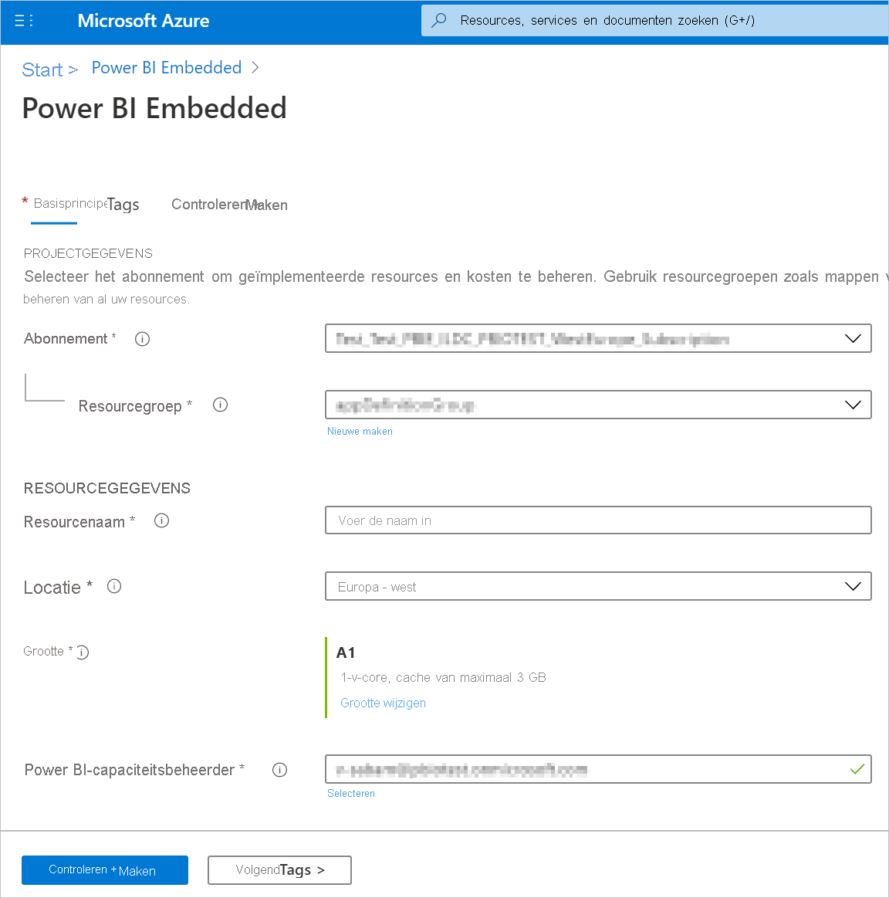
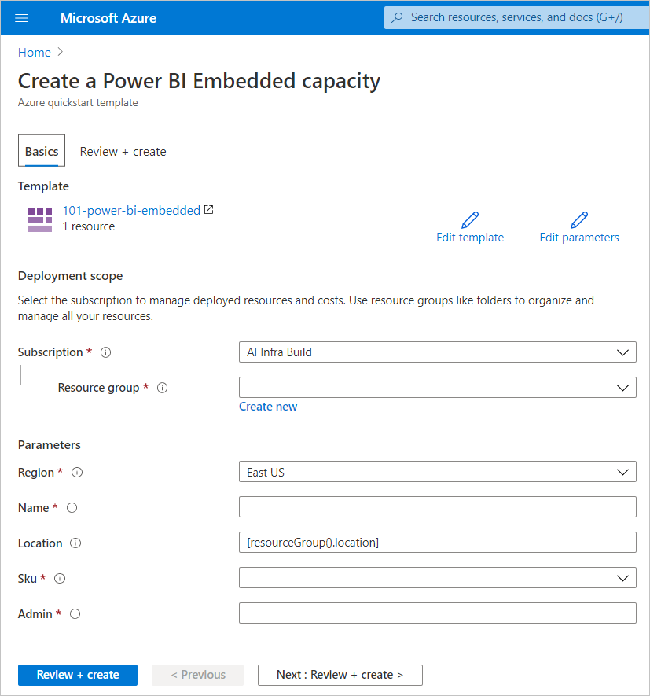
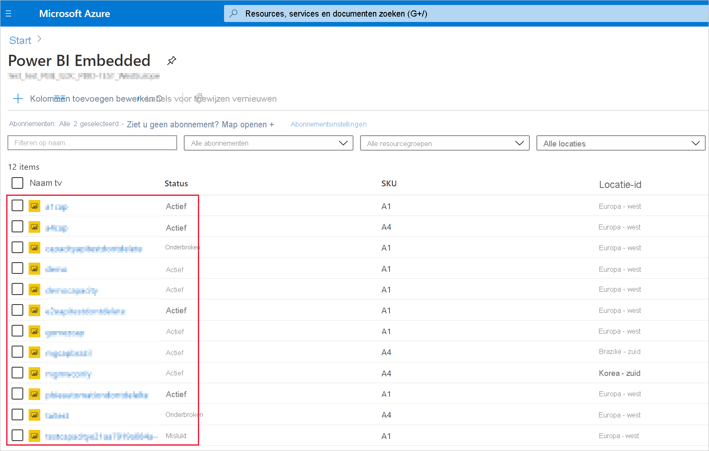
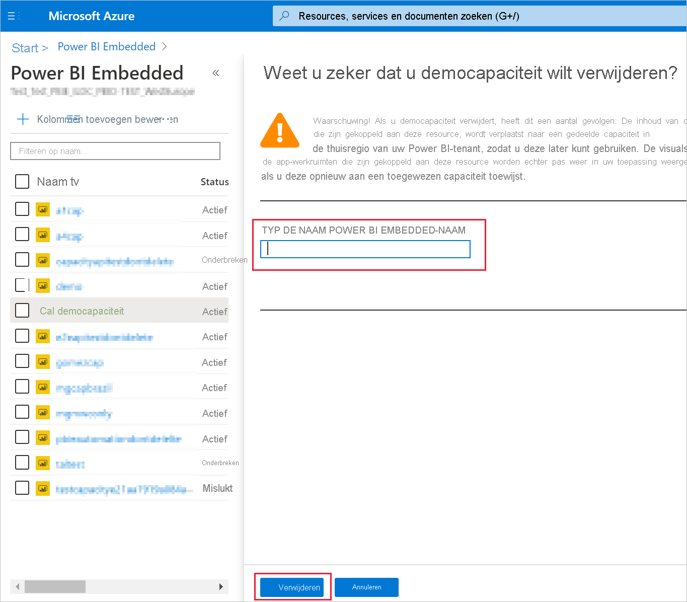

# <a name="create-power-bi-embedded-capacity-in-the-azure-portal"></a>Power BI Embedded-capaciteit maken in Azure Portal

Dit artikel biedt informatie over het maken van [Power BI Embedded](azure-pbie-what-is-power-bi-embedded.md)-capaciteit in Microsoft Azure. Met Power BI Embedded kunt u eenvoudiger gebruikmaken van de Power BI-functionaliteit: u kunt hiermee namelijk snel prachtige visuals, rapporten en dashboards toevoegen aan uw apps.

## <a name="before-you-begin"></a>Voordat u begint

Voor deze snelstartgids hebt u heet volgende nodig:

* **Azure-abonnement:** ga naar [Gratis proefversie van Azure](https://azure.microsoft.com/free/) om een account te maken.

* **Azure Active Directory:** Uw abonnement moet zijn gekoppeld aan een Azure Active Directory-tenant (Azure AD). Bovendien ***moet u zijn aangemeld bij Azure met een account in deze tenant***. Microsoft-accounts worden niet ondersteund. Zie [Verificatie en gebruikersmachtigingen](https://docs.microsoft.com/azure/analysis-services/analysis-services-manage-users) voor meer informatie.

* **Power BI-tenant:** ten minste één account in uw Azure AD-tenant moet zijn geregistreerd voor Power BI.

* **Resourcegroep:** gebruik een resourcegroep die u al hebt of [maak een nieuwe](https://docs.microsoft.com/azure/azure-resource-manager/resource-group-overview).

## <a name="create-a-capacity"></a>Een capaciteit maken

Voordat u een Power BI Embedded-capaciteit maakt, moet u controleren of u zich ten minste één keer hebt aangemeld bij Power BI.

# <a name="portal"></a>[Portal](#tab/portal)

1. Meld u aan bij [Azure Portal](https://portal.azure.com/).

2. Zoek in het zoekvak naar *Power BI Embedded*.

3. In Power BI Embedded selecteert u **Toevoegen**.

4. Vul de vereiste gegevens in en selecteer vervolgens **Beoordelen en maken**.

    

    * **Abonnement**: het abonnement waarvoor u de capaciteit wilt maken.

    * **Resourcegroep**: de resourcegroep die deze nieuwe capaciteit bevat. Kies een bestaande resourcegroep of maak een nieuwe. Zie [Overzicht van Azure Resource Manager](https://docs.microsoft.com/azure/azure-resource-manager/resource-group-overview) voor meer informatie.

    * **Resourcenaam**: de resourcenaam van de capaciteit.

    * **Locatie**: de locatie waar Power BI voor uw tenant wordt gehost. Uw standaardlocatie is uw basisregio. U kunt de regio wijzigen met behulp van [Multi-Geo-opties](embedded-multi-geo.md).

    * **Grootte**: de [A-SKU](../../admin/service-admin-premium-purchase.md#purchase-a-skus-for-testing-and-other-scenarios) die u nodig hebt. Zie [SKU-geheugen en rekenkracht](/power-bi/developer/embedded/embedded-capacity) voor meer informatie.

    * **Power BI-capaciteitsbeheerder**: een beheerder voor de capaciteit.
        >[!NOTE]
        >* Standaard is de capaciteitsbeheerder de gebruiker die de capaciteit maakt.
        >* U kunt een andere gebruiker of service-principal als capaciteitsbeheerder kiezen.
        >* De capaciteitsbeheerder moet deel uitmaken van de tenant waarin de capaciteit wordt ingericht. Business-to-business-gebruikers (B2B) kunnen geen capaciteitsbeheerders zijn.

# <a name="azure-cli"></a>[Azure-CLI](#tab/CLI)

### <a name="use-azure-cloud-shell"></a>Azure Cloud Shell gebruiken

Azure host Azure Cloud Shell, een interactieve shell-omgeving die u via uw browser kunt gebruiken. U kunt Bash of PowerShell gebruiken met Cloud Shell om met Azure-services te werken. U kunt de vooraf geïnstalleerde opdrachten van Cloud Shell gebruiken om de code in dit artikel uit te voeren zonder dat u iets hoeft te installeren in uw lokale omgeving.

Om Azure Cloud Shell op te starten:

| Optie | Voorbeeld/koppeling |
|-----------------------------------------------|---|
| Selecteer **Nu proberen** in de rechterbovenhoek van een codeblok. Als u **Uitproberen** selecteert, wordt de code niet automatisch gekopieerd naar Cloud Shell. |  |
| Ga naar [https://shell.azure.com](https://shell.azure.com), of selecteer de knop **Cloud Shell starten** om Cloud Shell in uw browser te openen. | [](https://shell.azure.com) |
| Klik op de knop **Cloud Shell** in het menu in de balk rechtsboven in de [Azure-portal](https://portal.azure.com). |  |

Om de code in dit artikel in Azure Cloud Shell uit te voeren:

1. Start Cloud Shell.

2. Selecteer de knop **Kopiëren** op een codeblok om de code te kopiëren.

3. Plak de code in de Cloud Shell-sessie door **CTRL**+**Shift**+**V** te selecteren in Windows en Linux of door **Cmd**+**Shift**+**V** op macOS te selecteren.

4. Selecteer **Invoeren** om de code uit te voeren.

## <a name="prepare-your-environment"></a>Uw omgeving voorbereiden

Voor opdrachten voor de Power BI Embedded-capaciteit is versie 2.3.1 of later van de Azure CLI vereist. Voer `az --version` uit om de versie en afhankelijke bibliotheken te vinden die zijn geïnstalleerd. Zie [Azure CLI installeren](/cli/azure/install-azure-cli) als u CLI wilt installeren of upgraden.

1. Meld u aan.

   Meld u aan met behulp van de opdracht [az login](/cli/azure/reference-index#az-login) als u een lokale installatie van de CLI gebruikt.

    ```azurecli
    az login
    ```

    Volg de weergegeven stappen in uw terminal om het verificatieproces te voltooien.

2. Installeer de Azure CLI-extensie.

    Wanneer u met extensieverwijzingen voor de Azure-CLI werkt, moet u eerst de extensie installeren.  Azure CLI-extensies geven u toegang tot experimentele opdrachten en opdrachten in een evaluatieversie die nog niet zijn verzonden als onderdeel van de kern-CLI.  Zie [Extensies gebruiken met Azure CLI](/cli/azure/azure-cli-extensions-overview) voor meer informatie over extensies, waaronder het bijwerken en verwijderen ervan.

    Installeer de extensie voor de Power BI Embedded-capaciteit door de volgende opdracht uit te voeren:

    ```azurecli
    az extension add --name powerbidedicated
    ```

### <a name="create-a-capacity-with-azure-cli"></a>Een capaciteit maken met Azure CLI

Gebruik de opdracht [az Power BI embedded-capacity create](https://docs.microsoft.com/cli/azure/ext/powerbidedicated/powerbi/embedded-capacity?view=azure-cli-latest#ext-powerbidedicated-az-powerbi-embedded-capacity-create) om een capaciteit te maken.

```azurecli
az powerbi embedded-capacity create --location westeurope
                                    --name
                                    --resource-group
                                    --sku-name "A1"
                                    --sku-tier "PBIE_Azure"
```

### <a name="delete-a-capacity-with-azure-cli"></a>Een capaciteit verwijderen met Azure CLI

Gebruik de opdracht [az powerbi embedded-capacity delete](https://docs.microsoft.com/cli/azure/ext/powerbidedicated/powerbi/embedded-capacity?view=azure-cli-latest#ext-powerbidedicated-az-powerbi-embedded-capacity-delete) om een capaciteit te verwijderen met Azure CLI.

```azurecli
az powerbi embedded-capacity delete --name
                                    --resource-group
```

### <a name="manage-your-capacity-with-azure-cli"></a>Uw capaciteit beheren met Azure CLI

In [az powerbi](https://docs.microsoft.com/cli/azure/ext/powerbidedicated/powerbi?view=azure-cli-latest) kunt u alle Power BI Embedded Azure CLI-opdrachten zien.

# <a name="arm-template"></a>[ARM-sjabloon](#tab/ARM-template)

### <a name="use-resource-manager-template"></a>Resource Manager-sjabloon gebruiken

[Resource Manager-sjabloon](https://docs.microsoft.com/azure/azure-resource-manager/templates/overview) is een JavaScript Object Notation-bestand (JSON) dat de infrastructuur en configuratie van uw project definieert. De sjabloon gebruikt een declaratieve syntaxis. Dit is een syntaxis waarmee u kunt aangeven wat u wilt implementeren zonder hiervoor de nodige reeks programmeeropdrachten te hoeven maken. Als u meer wilt weten over het ontwikkelen van Resource Manager-sjablonen, raadpleegt u de [Resource Manager-documentatie](https://docs.microsoft.com/azure/azure-resource-manager/) en het [referentiemateriaal over sjablonen](https://docs.microsoft.com/azure/templates/).

Als u nog geen Azure-abonnement hebt, maakt u een [gratis account](https://azure.microsoft.com/free/) voordat u begint.

### <a name="review-the-template"></a>De sjabloon controleren

De sjabloon die in deze quickstart wordt gebruikt, komt uit [Azure-quickstartsjablonen](https://azure.microsoft.com/resources/templates/101-power-bi-embedded).

```json
{
    "$schema": "https://schema.management.azure.com/schemas/2019-04-01/deploymentTemplate.json#",
    "contentVersion": "1.0.0.0",
    "parameters": {
        "name": {
            "type": "string",
            "metadata": {
              "description": "The capacity name, which is displayed in the Azure portal and the Power BI admin portal"
            }
        },
        "location": {
            "type": "string",
            "defaultValue": "[resourceGroup().location]",
            "metadata": {
              "description": "The location where Power BI is hosted for your tenant"
            }
        },
        "sku": {
            "type": "string",
            "allowedValues": [
                "A1",
                "A2",
                "A3",
                "A4",
                "A5",
                "A6"
            ],
            "metadata": {
              "description": "The pricing tier, which determines the v-core count and memory size for the capacity"
            }
        },
        "admin": {
            "type": "string",
            "metadata": {
              "description": "A user within your Power BI tenant, who will serve as an admin for this capacity"
            }
        }
    },
    "resources": [
        {
            "type": "Microsoft.PowerBIDedicated/capacities",
            "apiVersion": "2017-10-01",
            "name": "[parameters('name')]",
            "location": "[parameters('location')]",
            "sku": {
                "name": "[parameters('sku')]"
            },
            "properties": {
                "administration": {
                    "members": [
                        "[parameters('admin')]"
                    ]
                }
            }
        }
    ]
}
```

In de sjabloon is één Azure-resource gedefinieerd: [Microsoft.PowerBIDedicated/capacities Az](https://docs.microsoft.com/azure/templates/microsoft.powerbidedicated/allversions) - Een Power BI Embedded-capaciteit maken.

### <a name="deploy-the-template"></a>De sjabloon implementeren

1. Selecteer de volgende koppeling om u aan te melden bij Azure en open een sjabloon. Met de sjabloon wordt een Power BI Embedded-capaciteit gemaakt.

    [](https://portal.azure.com/#create/Microsoft.Template/uri/https%3a%2f%2fraw.githubusercontent.com%2fAzure%2fazure-quickstart-templates%2fmaster%2f101-power-bi-embedded%2fazuredeploy.json)

2. Vul de vereiste gegevens in en selecteer vervolgens **Beoordelen en maken**.

    

    * **Abonnement**: het abonnement waarvoor u de capaciteit wilt maken.

    * **Resourcegroep**: de resourcegroep die deze nieuwe capaciteit bevat. Kies een bestaande resourcegroep of maak een nieuwe. Zie [Overzicht van Azure Resource Manager](https://docs.microsoft.com/azure/azure-resource-manager/resource-group-overview) voor meer informatie.

    * **Regio**: de regio waarvan de capaciteit deel uitmaakt.

    * **Naam**: de naam van de capaciteit.

    * **Locatie**: de locatie waar Power BI voor uw tenant wordt gehost. Uw standaardlocatie is uw basisregio. U kunt de regio wijzigen met behulp van [Multi-Geo-opties](https://docs.microsoft.com/power-bi/developer/embedded/embedded-multi-geo
).

    * **SKU**: de [A-SKU](../../admin/service-admin-premium-purchase.md#purchase-a-skus-for-testing-and-other-scenarios) die u nodig hebt. Zie [SKU-geheugen en rekenkracht](/power-bi/developer/embedded/embedded-capacity) voor meer informatie.

    * **Admin**: een beheerder voor de capaciteit.
        >[!NOTE]
        >* Standaard is de capaciteitsbeheerder de gebruiker die de capaciteit maakt.
        >* U kunt een andere gebruiker of service-principal als capaciteitsbeheerder kiezen.
        >* De capaciteitsbeheerder moet deel uitmaken van de tenant waarin de capaciteit wordt ingericht. Business-to-business-gebruikers (B2B) kunnen geen capaciteitsbeheerders zijn.

### <a name="validate-the-deployment"></a>De implementatie valideren

Ga als volgt te werk om de implementatie te valideren:

1. Meld u aan bij [Azure Portal](https://portal.azure.com/).

2. Zoek in het zoekvak naar *Power BI Embedded*.

3. Controleer de lijst met Power BI Embedded-capaciteiten en controleer of de nieuwe capaciteit die u hebt gemaakt, wordt vermeld.

    

### <a name="clean-up-resources"></a>Resources opschonen

Volg de volgende stappen als u de capaciteit die u hebt gemaakt, wilt verwijderen:

1. Meld u aan bij [Azure Portal](https://portal.azure.com/).

2. Zoek in het zoekvak naar *Power BI Embedded*.

3. Open het contextmenu van de capaciteit die u hebt gemaakt en klik op **Verwijderen**.

    

4. Voer op de bevestigingspagina de naam van de capaciteit in en klik op **Verwijderen**.

    

---

## <a name="next-steps"></a>Volgende stappen

>[!div class="nextstepaction"]
>[Capaciteiten beheren](../../admin/service-admin-premium-manage.md)

>[!div class="nextstepaction"]
>[Uw Power BI Embedded-capaciteit onderbreken en starten in Azure Portal](azure-pbie-pause-start.md)

>[!div class="nextstepaction"]
>[Power BI-inhoud insluiten in een toepassing voor uw klanten](embed-sample-for-customers.md)

>[!div class="nextstepaction"]
>[Hebt u nog vragen? Misschien dat de Power BI-community het antwoord weet](https://community.powerbi.com/)
