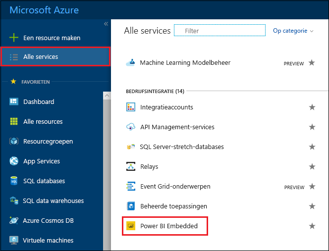
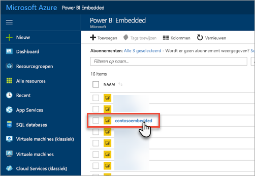
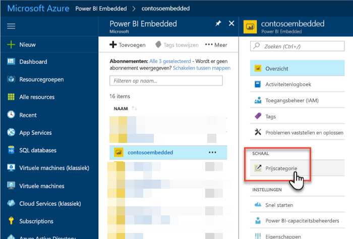
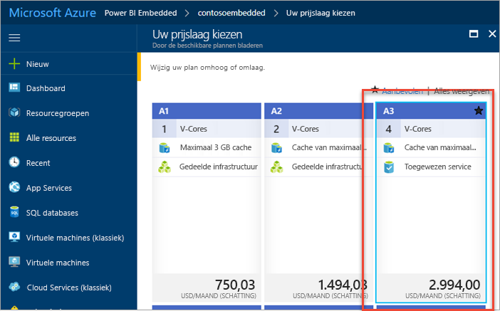
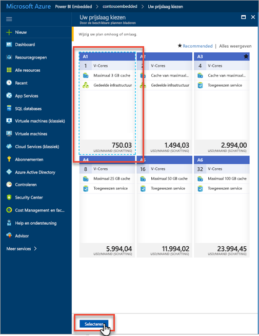
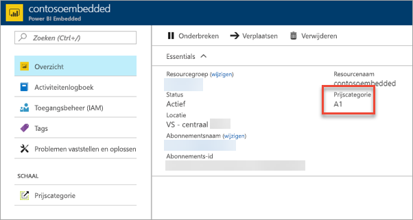

# Uw Power BI Embedded-capaciteit in Azure Portal schalen

Dit artikel biedt informatie over het schalen van Power BI Embedded-capaciteit in Microsoft Azure. Door te schalen kunt u uw capaciteit vergroten of verkleinen.

Hierbij wordt ervan uitgegaan dat u Power BI Embedded-capaciteit hebt gemaakt. Als u dat nog niet hebt gedaan, gaat u naar [Power BI Embedded-capaciteit maken in Azure Portal](azure-pbie-create-capacity.md) om aan de slag te gaan.

> [!NOTE]
> Het aanpassen van de schaal kan ongeveer een minuut duren. Gedurende deze tijd is de capaciteit niet beschikbaar. Ingesloten inhoud wordt mogelijk niet geladen.

## Capaciteit schalen

1. Meld u aan bij [Azure Portal](https://portal.azure.com/).

2. Selecteer **Alle services** > **Power BI Embedded** om uw capaciteiten te bekijken.

    

3. Selecteer de capaciteit die u wilt schalen.

    

4. Selecteer **Prijscategorie** bij **Schaal** in uw capaciteit.

    

    De huidige prijscategorie is blauw gemarkeerd.

    

5. Als u omhoog of omlaag wilt schalen, selecteert u de categorie waarnaar u wilt overstappen. Wanneer u een nieuwe categorie hebt geselecteerd, wordt deze blauw gemarkeerd. Selecteer **Selecteren** om over te stappen naar de nieuwe categorie.

    

    Het schalen van de capaciteit kan een of twee minuten duren.

6. Controleer of de juiste categorie nu is geselecteerd door naar het tabblad Overzicht te gaan. De huidige prijscategorie wordt vermeld.

    

## Volgende stappen

Als u uw capaciteit wilt onderbreken of starten, ziet u [Uw Power BI Embedded-capaciteit onderbreken of starten in Azure Portal](azure-pbie-pause-start.md).

Als u Power BI-inhoud wilt insluiten in uw toepassing, ziet u [Uw Power BI-dashboards, -rapporten en -tegels insluiten](https://powerbi.microsoft.com/documentation/powerbi-developer-embedding-content/).

Hebt u nog vragen? [Misschien dat de Power BI-community het antwoord weet](https://community.powerbi.com/)
