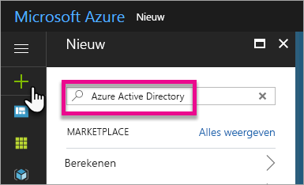
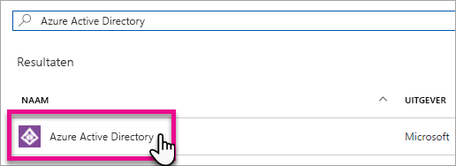

# Een Azure Active Directory-tenant maken voor gebruik met Power BI

Informatie over het maken van een nieuwe Azure Active Directory-tenant (Azure AD) voor een aangepaste toepassing waarmee [Power BI REST API's](../automation/rest-api-reference.md) worden aangeroepen.

Een tenant vertegenwoordigt een organisatie in Azure Active Directory. Het is een toegewezen exemplaar van de Azure AD-service die een organisatie ontvangt en waarvan de organisatie eigenaar is wanneer deze zich aanmeldt voor een Microsoft-cloudservice zoals Azure, Microsoft Intune of Microsoft 365. Elke Azure AD-tenant is uniek en werkt afzonderlijk van andere Azure AD-tenants.

Zodra u een Azure AD-tenant hebt, kunt u een toepassing definiëren en er machtigingen aan toewijzen zodat deze [Power BI REST API's](../automation/rest-api-reference.md) kan aanroepen.

Uw organisatie heeft mogelijk al een Azure AD-tenant die u voor uw toepassing kunt gebruiken. U kunt ook speciaal voor uw toepassing een nieuwe tenant maken. In dit artikel wordt behandeld hoe u een nieuwe tenant maakt.

## Een Azure Active Directory-tenant maken

Als u Power BI in uw aangepaste toepassing wilt integreren, moet u een toepassing definiëren in Azure AD waarvoor een Azure AD-directory nodig is. Deze directory is uw *tenant*. Als uw organisatie nog geen tenant heeft, omdat deze niet Power BI of Microsoft 365 gebruikt, [moet u een ontwikkelingsomgeving instellen](https://docs.microsoft.com/azure/active-directory/develop/active-directory-howto-tenant). U moet er ook een maken als u uw toepassing niet wilt combineren met de tenant van uw organisatie om zaken apart te houden. Of misschien wilt u een tenant alleen maken voor testdoeleinden.

Ga als volgt te werk om een nieuwe Azure AD-tenant te maken:

1. Ga naar [Azure Portal](https://portal.azure.com) en meld u aan met een account met een Azure-abonnement.

2. Selecteer het **plus-pictogram (+)** en zoek naar **Azure Active Directory**.

    

3. Selecteer **Azure Active Directory** in de zoekresultaten.

    

4. Selecteer **Maken**.

5. Geef een **organisatienaam** en een **eerste domeinnaam** op. Selecteer vervolgens **Maken**. De directory is gemaakt.

    

   > [!NOTE]
   > Uw eerste domein maakt deel uit van onmicrosoft.com. U kunt later andere domeinnamen toevoegen. Aan een tenantdirectory kunnen meerdere domeinen worden toegewezen.

6. Nadat het maken van de directory is voltooid, selecteert u het informatievak voor het beheren van uw nieuwe directory.

U gaat vervolgens tenantgebruikers toevoegen.

## Azure Active Directory-tenantgebruikers maken

Nu u een directory hebt, gaan we ten minste twee gebruikers maken. Een is de globale beheerder van de tenant en de andere een hoofdgebruiker voor het insluiten van inhoud. U kunt de laatste als een serviceaccount zien.

1. Zorg dat u zich binnen Azure Portal in het gedeelte van Azure Active Directory bevindt.

    

    Als dit niet het geval is, selecteert u het Azure Active Directory-pictogram in het navigatiegedeelte voor services links.

    

2. Selecteer onder **Beheren** de optie **Gebruikers**.

    

3. Selecteer **Alle gebruikers** en selecteer vervolgens **+ Nieuwe gebruiker**.

4. Geef een **Naam** en **Gebruikersnaam** op voor de globale beheerder van uw tenant. Wijzig **Directory-rol** in **Globale beheerder**. U kunt ook het tijdelijke wachtwoord weergeven. Selecteer **Maken** als u klaar bent.

    

5. Doe hetzelfde voor een gewone tenantgebruiker. U kunt dit account gebruiken voor uw hoofdinsluitingsaccount. Laat **Directory-rol** nu ingesteld staan op **Gebruiker**. Noteer het wachtwoord en selecteer vervolgens **Maken**.

    

6. Meld u aan bij Power BI met het gebruikersaccount dat u in stap 5 hebt gemaakt. Ga naar [powerbi.com](https://powerbi.microsoft.com/get-started/) en selecteer **Gratis proberen** onder **Power BI - samenwerken en delen in de cloud**.

    

    Wanneer u zich aanmeldt, wordt u gevraagd om Power BI Pro gratis 60 dagen te proberen. Als u ervoor kiest Pro-gebruiker te worden, kunt u met het [ontwikkelen van een ingesloten oplossing beginnen](embed-sample-for-customers.md).

   > [!NOTE]
   > Zorg ervoor dat u zich aanmeldt met het e-mailadres van uw gebruikersaccount.

## Volgende stappen

Nu u een Azure AD-tenant hebt, kunt u deze tenant gebruiken om items in Power BI te testen. U kunt ook Power BI-dashboards en -rapporten in uw toepassing insluiten. Zie [Power BI-dashboards, -rapporten en -tegels insluiten](embed-sample-for-customers.md) voor meer informatie.

[Wat is een Azure Active-directory?](https://docs.microsoft.com/azure/active-directory/active-directory-whatis) 
 
[Snelstart: Een ontwikkelaarsomgeving instellen](https://docs.microsoft.com/azure/active-directory/develop/active-directory-howto-tenant)  

Hebt u nog vragen? [Misschien dat de Power BI-community het antwoord weet](https://community.powerbi.com/)
