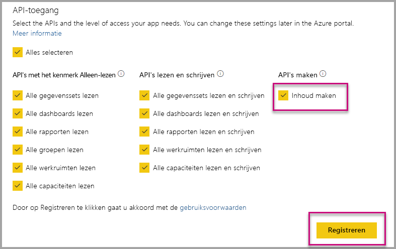

# Power BI-apps automatisch installeren wanneer u ze insluit voor uw organisatie

Als gebruikers die een app insluiten inhoud uit een app willen insluiten, moeten ze [toegang tot die app](../../collaborate-share/service-create-distribute-apps.md) hebben. Als de app voor de gebruiker is geïnstalleerd, betekent dit dat het insluitingsproces goed verloopt. Zie [Rapporten of dashboards uit apps insluiten](embed-from-apps.md) voor meer informatie. Het is mogelijk om in PowerBI.com te definiëren dat alle apps [automatisch kunnen worden geïnstalleerd](https://powerbi.microsoft.com/blog/automatically-install-apps/). Deze actie wordt echter op het tenantniveau uitgevoerd en is van toepassing op alle apps.

## Apps automatisch installeren tijdens insluiten

Als gebruikers toegang tot een app hebben maar die app niet is geïnstalleerd, kan de inhoud niet worden ingesloten. U kunt deze fouten dus voorkomen wanneer u inhoud uit een app insluit: u kunt toestaan dat apps automatisch worden geïnstalleerd wanneer ze worden ingesloten. Dit houdt in dat de app door deze actie automatisch wordt geïnstalleerd wanneer de app die de gebruiker probeert in te sluiten, niet is geïnstalleerd. De inhoud die u wilt insluiten wordt dus direct ingesloten; dit biedt de gebruiker een vlekkeloze ervaring.

## Insluiten voor Power BI-gebruikers (gebruikers is eigenaar van gegevens)

Als u de automatische installatie van apps voor uw gebruikers wilt toestaan, moet u de machtiging 'Inhoud maken' voor uw toepassing instellen tijdens het [registreren van uw toepassing](register-app.md#register-an-azure-ad-app) of deze machtiging toevoegen als u de app al hebt geregistreerd.

Vervolgens moet u de app-id opgeven in de insluitings-URL. Voor het opgeven van de app-id moet de app-ontwikkelaar de app eerst installeren en vervolgens een van de ondersteunde [Power BI REST API](/rest/api/power-bi/)-aanroepen ([Rapporten ophalen](/rest/api/power-bi/reports/getreports) of [Dashboards ophalen](/rest/api/power-bi/dashboards/getdashboards)) gebruiken. Vervolgens moet de app-ontwikkelaar de insluitings-URL uit het REST API-antwoord halen. De app-id wordt in de URL weergegeven als de inhoud afkomstig is uit een app.  Als u de insluitings-URL hebt, kunt u deze gebruiken om inhoud regelmatig in te sluiten.

## Beveiligd insluiten

Voor het gebruik van automatische installatie van apps moet de app-ontwikkelaar eerst de app installeren en vervolgens naar de app op PowerBI.com gaan, naar het rapport navigeren en de koppeling op de gebruikelijke manier ophalen. Alle andere gebruikers met toegang tot de app die de koppeling kunnen gebruiken, kunnen het rapport insluiten.

## Overwegingen en beperkingen

* Voor dit scenario kunt u alleen rapporten en dashboards insluiten.

* Deze functie wordt momenteel niet ondersteund voor de scenario's voor apps die gegevens hebben en voor het insluiten van SharePoint.