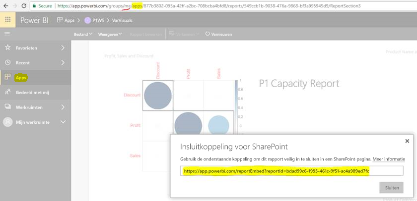

# Rapporten of dashboards uit apps insluiten

In Power BI kunt u apps maken om gerelateerde dashboards en rapporten bij elkaar te brengen, allemaal op één plek samen. Publiceer ze vervolgens naar grote groepen gebruikers in uw organisatie. Het gebruik van die apps is relevant wanneer al uw gebruikers Power BI-gebruikers zijn. U kunt dus inhoud met ze delen met behulp van Power BI-apps. In dit artikel vindt u een aantal korte stappen om inhoud uit een gepubliceerde Power BI-app in te sluiten in een externe toepassing.

## Een rapport-embedURL ophalen om in te sluiten

1. Maak een exemplaar van de toepassing in de gebruikerswerkruimte **Mijn werkruimte**. Deel met uzelf of leid een andere gebruiker om door deze stroom te gaan.

2. Open het gewenste rapport in de Power BI-service.

3. Ga naar **Bestand** > **Insluiten in SharePoint Online** en haal de rapport-embedURL op. In de onderstaande momentopname ziet u een embedURL-voorbeeld. Of roep de GetReports/GetReport REST-API aan en extraheer het bijbehorende embedURL-veld voor rapporten uit het antwoord. De REST-aanroep mag geen werkruimte-id bevatten in de URL, aangezien er in de werkruimte van de gebruiker een exemplaar is gemaakt.

    

4. Gebruik de embedURL die u bij stap 3 hebt opgehaald met de JavaScript-SDK.

## Een dashboard-embedURL ophalen om in te sluiten

1. Maak een exemplaar van de toepassing in de gebruikerswerkruimte **Mijn werkruimte**. Deel met uzelf of leid een andere gebruiker om door deze stroom te gaan.

2. Of roep de GetDashboards REST-API aan en extraheer het bijbehorende embedURL-veld voor dashboards uit het antwoord. De REST-aanroep mag in de URL geen werkruimte-id bevatten, aangezien er in de werkruimte van de gebruiker een exemplaar is gemaakt.

3. Gebruik de embedURL die u bij stap 2 hebt opgehaald met de JavaScript-SDK.

## Volgende stappen

Controleer hoe u inhoud uit werkruimten kunt insluiten voor uw externe klanten en uw organisatie:

> [!div class="nextstepaction"]
>[Insluiten voor externe klanten](embed-sample-for-customers.md)

> [!div class="nextstepaction"]
>[Insluiten voor uw organisatie](embed-sample-for-your-organization.md)
