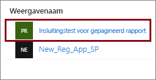
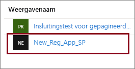
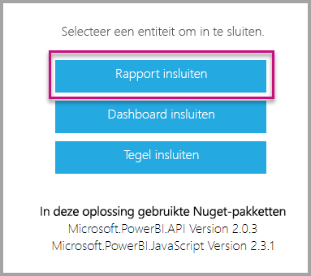

# <a name="tutorial-embed-power-bi-paginated-reports-into-an-application-for-your-customers-preview"></a>Zelfstudie: Gepagineerde Power BI-rapporten insluiten in een app voor uw klanten (preview)

Met **Power BI Embedded in Azure** of **insluiting van Power BI in Office** kunt u gepagineerde rapporten in een app insluiten met de gegevens waarvan de app eigenaar is. Als **de app eigenaar is van de gegevens** kunt u een toepassing gebruiken die Power BI gebruikt als ingesloten analytics platform. Als **ISV** of **ontwikkelaar** kunt u Power BI-inhoud maken waarmee gepagineerde rapporten worden weergegeven in een toepassing die volledig geïntegreerd en interactief is, zonder dat gebruikers een licentie voor Power BI hoeven te hebben. In deze zelfstudie wordt beschreven hoe u een gepagineerd rapport in een toepassing integreert via de .NET SDK voor Power BI met de JavaScript-API voor Power BI.


In deze zelfstudie leert u het volgende:
> [!div class="checklist"]
> * Een toepassing registreren in Azure.
> * Een gepagineerd Power BI-rapport insluiten in een app.

## <a name="prerequisites"></a>Vereisten

U hebt het volgende nodig om aan de slag te gaan:

* Een [service-principal (token voor apps)](embed-service-principal.md)
* Een [Microsoft Azure](https://azure.microsoft.com/)-abonnement
* Een eigen [Azure Active Directory-tenant ](create-an-azure-active-directory-tenant.md)
* Minimaal de [capaciteit](#create-a-dedicated-capacity) A4 of P1 en de werkbelasting [gepagineerde rapporten](../../service-admin-premium-workloads.md#paginated-reports) ingeschakeld

Als u nog geen abonnement voor Azure hebt, maakt u een [gratis account](https://azure.microsoft.com/free/?WT.mc_id=A261C142F) voordat u begint.

> [!IMPORTANT]
> * U moet een **service-principal** gebruiken. Een hoofdgebruiker wordt niet ondersteund.
> * Gegevensbronnen waarvoor eenmalige aanmelding (SSO) is vereist, worden niet ondersteund.
> * Power BI-gegevenssets worden niet ondersteund als een [gegevensbron](../../service-get-data.md).

## <a name="set-up-your-power-bi-environment"></a>Uw Power BI-omgeving instellen

Als u een gepagineerd rapport wilt insluiten, moet u een werkruimte toewijzen aan een toegewezen capaciteit en het rapport uploaden naar de werkruimte.

### <a name="create-an-app-workspace"></a>Een app-werkruimte maken

Als u een [service-principal](embed-service-principal.md) gebruikt voor aanmelding bij uw toepassing, moet u de [nieuwe werkruimten](../../service-create-the-new-workspaces.md) gebruiken. Als *service-principal*moet u ook een beheerder of lid zijn van de app-werkruimten die bij uw app betrokken zijn.

### <a name="create-a-dedicated-capacity"></a>Een toegewezen capaciteit maken

Voordat u een gepagineerd rapport importeert of uploadt om in te sluiten, moet de werkruimte met het rapport minimaal de capaciteit A4 of P1 krijgen. U kunt uit twee soorten capaciteit kiezen:
* **Power BI Premium**: voor het insluiten van een gepagineerd rapport is *P*-SKU vereist. Bij het insluiten van Power BI-inhoud wordt deze oplossing aangeduid als *insluiten van Power BI*. Zie [Wat is Power BI Premium?](../../service-premium-what-is.md) voor meer informatie over dit abonnement
* **Azure Power BI Embedded**: u kunt toegewezen capaciteit kopen in de [Microsoft Azure-portal](https://portal.azure.com). Dit abonnement maakt gebruik van de *A*-SKU's. Voor het insluiten van gepagineerde rapporten hebt u minimaal een *A4*-abonnement nodig. Zie [Power BI Embedded-capaciteit maken in Azure Portal](azure-pbie-create-capacity.md) voor meer informatie over het maken van Power BI Embedded-capaciteit.

In de onderstaande tabel worden de resources en limieten van elke SKU beschreven. Als u wilt weten welke capaciteit het beste bij uw behoeften past, raadpleegt u de tabel [welke SKU moet ik kopen voor mijn scenario?](https://docs.microsoft.com/power-bi/developer/embedded-faq#which-solution-should-i-choose).

| Capaciteitsknooppunten | Totaal aantal v-cores | v-cores voor back-end | RAM (GB) | v-cores voor front-end | 
| --- | --- | --- | --- | --- |
| P1/A4 | 8 | 4 | 25 | 4 |
| P2/A5 | 16 | 8 | 50 | 8 |
| P3/A6 | 32 | 16 | 100 | 16 |
| | | | | |

### <a name="assign-an-app-workspace-to-a-dedicated-capacity"></a>Een app-werkruimte toewijzen aan een toegewezen capaciteit

Zodra u toegewezen capaciteit hebt gemaakt, kunt u uw app-werkruimte toewijzen aan die toegewezen capaciteit.

Als u een toegewezen capaciteit aan een werkruimte wilt toewijzen met behulp van een [service-principal](embed-service-principal.md), gebruikt u de [Power BI REST API](https://docs.microsoft.com/rest/api/power-bi/capacities/groups_assigntocapacity). Wanneer u de Power BI REST API's gebruikt, moet u de [object-id van de service-principal](embed-service-principal.md) gebruiken.

### <a name="create-and-upload-your-paginated-reports"></a>Gepagineerde rapporten maken en uploaden

U kunt uw gepagineerde rapport maken met behulp van [Power BI Report Builder](../../paginated-reports/paginated-reports-report-builder-power-bi.md#create-reports-in-power-bi-report-builder) en vervolgens [het rapport uploaden naar de service](../../paginated-reports/paginated-reports-quickstart-aw.md#upload-the-report-to-the-service).

U kunt gepagineerde rapporten importeren in de nieuwe werkruimten met behulp van de [Power BI REST API's](https://docs.microsoft.com/rest/api/power-bi/imports/postimportingroup).

## <a name="embed-content-using-the-sample-application"></a>Inhoud met behulp van de voorbeeldtoepassing insluiten

We hebben dit voorbeeld voor demonstratiedoeleinden bewust eenvoudig gehouden. Het is aan u of uw ontwikkelaars om het app-geheim te beveiligen.

Volg de onderstaande stappen om inhoud in te sluiten met de voorbeeldtoepassing.

1. Download [Visual Studio](https://www.visualstudio.com/) (versie 2013 of later). Download het meest recente [NuGet-pakket](https://www.nuget.org/profiles/powerbi).

2. Download het [voorbeeld waarin de app eigenaar is van de gegevens](https://github.com/Microsoft/PowerBI-Developer-Samples) vanuit GitHub om aan de slag te gaan.

    

3. Open het bestand **Web.config** in de voorbeeldtoepassing. Er zijn velden die u moet invullen om de toepassing uit te voeren. U kunt **ServicePrincipal** als **verificatietype** selecteren.

    Vul de volgende velden in:
    * [applicationId](#application-id)
    * [workspaceId](#workspace-id)
    * [reportId](#report-id)
    * [applicationsecret](#application-secret)
    * [tenant](#tenant)

    > [!Note]
    > Het standaard ingestelde **verificatietype** in dit voorbeeld is MasterUser. Zorg ervoor dat u deze wijzigt in **ServicePrincipal**. 


    

### <a name="application-id"></a>Toepassings-id

Vul bij **applicationId** de **Toepassings-id** van **Azure** in. De **applicationId** wordt door de toepassing gebruikt om zich te identificeren bij de gebruikers bij wie u machtigingen aanvraagt.

Ga als volgt te werk om de **applicationId** op te halen:

1. Meld u aan bij [Azure Portal](https://portal.azure.com).

2. Selecteer in het navigatiedeelvenster links **Alle services** en zoek **App-registraties**.

    

3. Selecteer de toepassing waarvoor de **applicationID** nodig is.

    

4. U ziet een **toepassings-id** die wordt vermeld als een GUID. Gebruik deze **Toepassings-id** als de **applicationId** voor de toepassing.

    

### <a name="workspace-id"></a>Werkruimte-id

Vul bij **workspaceId** de app-werkruimte (groep)-GUID van Power BI in. U kunt deze informatie verkrijgen via de URL wanneer u bent aangemeld bij de Power BI-service, of via PowerShell.

URL <br>


PowerShell <br>

```powershell
Get-PowerBIworkspace -name "Paginated Report Embed"
```

   

### <a name="report-id"></a>Rapport-id

Vul bij **reportId** informatie over de rapport-GUID uit Power BI in. U kunt deze informatie verkrijgen via de URL wanneer u bent aangemeld bij de Power BI-service, of via PowerShell.

URL<br>


PowerShell <br>

```powershell
Get-PowerBIworkspace -name "Paginated Report Embed" | Get-PowerBIReport
```


### <a name="application-secret"></a>Toepassingsgeheim

Geef de **ApplicationSecret**-gegevens op in de sectie **Sleutels** van de sectie **App-registraties** in **Azure**.

Ga als volgt te werk om de **ApplicationSecret** op te halen:

1. Meld u aan bij [Azure Portal](https://portal.azure.com).

2. Selecteer in het navigatiedeelvenster links **Alle services** en zoek **App-registraties**.

    

3. Selecteer de toepassing die de **ApplicationSecret** moet gebruiken.

    

4. Selecteer **Certificaten en geheimen** onder **Beheren**.

5. Selecteer **Nieuwe clientgeheimen**.

6. Voer in het vak **Beschrijving** een naam in en selecteer een duur. Selecteer vervolgens **Opslaan** om de **Waarde** voor uw toepassing op te halen. Wanneer u het deelvenster **Sleutels** sluit nadat u de sleutelwaarde hebt opgeslagen, wordt het waardeveld alleen nog als verborgen weergegeven. Op dat punt kunt u de sleutelwaarde niet meer ophalen. Als u de sleutelwaarde kwijtraakt, kunt u een nieuwe maken in Azure Portal.

    

### <a name="tenant"></a>Tenant

Vul bij de informatie over de **tenant** uw Azure zure-tenant-id in. U kunt deze informatie verkrijgen via het [Azure AD-beheercentrum](/onedrive/find-your-office-365-tenant-id) wanneer u bent aangemeld bij de Power BI-service of wanneer u PowerShell gebruikt.

### <a name="run-the-application"></a>De toepassing uitvoeren

1. Selecteer **Uitvoeren** in **Visual Studio**.

    

2. Selecteer vervolgens **Rapport insluiten**.

    

3. U kunt het rapport nu weergeven in de voorbeeldtoepassing.

    

## <a name="embed-power-bi-paginated-reports-within-your-application"></a>Gepagineerde Power BI-rapporten insluiten in uw app

Hoewel de stappen voor het insluiten van uw gepagineerde Power BI-rapporten worden uitgevoerd met de [Power BI REST API's](https://docs.microsoft.com/rest/api/power-bi/), wordt de voorbeeldcode die wordt beschreven in dit artikel gemaakt met de **.NET SDK**.

Als u gepagineerde Power BI-rapporten voor uw klanten wilt insluiten in uw app, moet u een **Azure Active Directory**-[service-principal](embed-service-principal.md) hebben en zorgen dat u over een [Azure Active Directory-toegangstoken](get-azuread-access-token.md#access-token-for-non-power-bi-users-app-owns-data) beschikt voor uw Power BI-app, voordat u de [Power BI REST API's](https://docs.microsoft.com/rest/api/power-bi/) kunt aanroepen.

Als u de Power BI-client met uw **toegangstoken** wilt maken, maakt u uw Power BI-clientobject zodat u kunt communiceren met de [Power BI REST API's](https://docs.microsoft.com/rest/api/power-bi/). U maakt het **Power BI-clientobject** door het AccessToken te verpakken met het object ***Microsoft.Rest.TokenCredentials***.

```csharp
using Microsoft.IdentityModel.Clients.ActiveDirectory;
using Microsoft.Rest;
using Microsoft.PowerBI.Api.V2;

var tokenCredentials = new TokenCredentials(authenticationResult.AccessToken, "Bearer");

// Create a Power BI Client object. it's used to call Power BI APIs.
using (var client = new PowerBIClient(new Uri(ApiUrl), tokenCredentials))
{
    // Your code to embed items.
}
```

### <a name="get-the-paginated-report-you-want-to-embed"></a>Het gepagineerde rapport dat u wilt insluiten ophalen

U kunt het Power BI-clientobject gebruiken voor het ophalen van een verwijzing naar het item dat u wilt insluiten.

Hier volgt een codevoorbeeld van hoe u het eerste rapport ophaalt uit een bepaalde werkruimte.

*Een voorbeeld van het ophalen van een inhoudsitem voor een rapport, dashboard of tegel die u wilt insluiten is beschikbaar in het bestand Services\EmbedService.cs in de [voorbeeldtoepassing](https://github.com/Microsoft/PowerBI-Developer-Samples).*

```csharp
using Microsoft.PowerBI.Api.V2;
using Microsoft.PowerBI.Api.V2.Models;

// You need to provide the workspaceId where the dashboard resides.
ODataResponseListReport reports = await client.Reports.GetReportsInGroupAsync(workspaceId);

// Get the first report in the group.
Report report = reports.Value.FirstOrDefault();
```

### <a name="create-the-embed-token"></a>Het insluittoken maken

Genereer een insluittoken dat kan worden gebruikt vanuit de JavaScript API. Gebruik de API [Reports GenerateTokenForCreateInGroup](https://docs.microsoft.com/rest/api/power-bi/embedtoken/reports_generatetokenforcreateingroup) om een ingesloten token te maken voor het insluiten van gepagineerde Power BI-rapporten.

Een voorbeeld van het maken van een insluittoken is beschikbaar in het bestand  *Services\EmbedService.cs* in de [voorbeeld-app](https://github.com/Microsoft/PowerBI-Developer-Samples).

```csharp
using Microsoft.PowerBI.Api.V2;
using Microsoft.PowerBI.Api.V2.Models;

// Generate Embed Token.
var generateTokenRequestParameters = new GenerateTokenRequest(accessLevel: "view");
EmbedToken tokenResponse = client.Reports.GenerateTokenInGroup(workspaceId, report.Id, generateTokenRequestParameters);

// Generate Embed Configuration.
var embedConfig = new EmbedConfig()
{
    EmbedToken = tokenResponse,
    EmbedUrl = report.EmbedUrl,
    Id = report.Id
};
```

### <a name="load-an-item-using-javascript"></a>Een item laden met JavaScript

U kunt JavaScript gebruiken om een gepagineerd rapport te laden in een div-element op uw webpagina.

Voor een volledig voorbeeld van het gebruik van de JavaScript-API kunt u het [hulpprogramma Playground](https://microsoft.github.io/PowerBI-JavaScript/demo) gebruiken. Met het hulpprogramma Playground kunt u op een snelle manier verschillende typen Power BI Embedded-voorbeelden uitproberen. Op de [wikipagina voor Power BI JavaScript](https://github.com/Microsoft/powerbi-javascript/wiki) vindt u ook meer informatie over de JavaScript-API.

## <a name="next-steps"></a>Volgende stappen

In deze zelfstudie hebt u geleerd hoe u gepagineerde Power BI-rapporten insluit in een app voor uw klanten. U kunt ook proberen Power BI-inhoud in te sluiten voor uw klanten of organisatie.

> [!div class="nextstepaction"]
>[Inhoud insluiten voor uw klanten](embed-sample-for-customers.md)

> [!div class="nextstepaction"]
>[Inhoud insluiten voor uw organisatie](embed-sample-for-your-organization.md)

Hebt u nog vragen? [Misschien dat de Power BI-community het antwoord weet](https://community.powerbi.com/)
