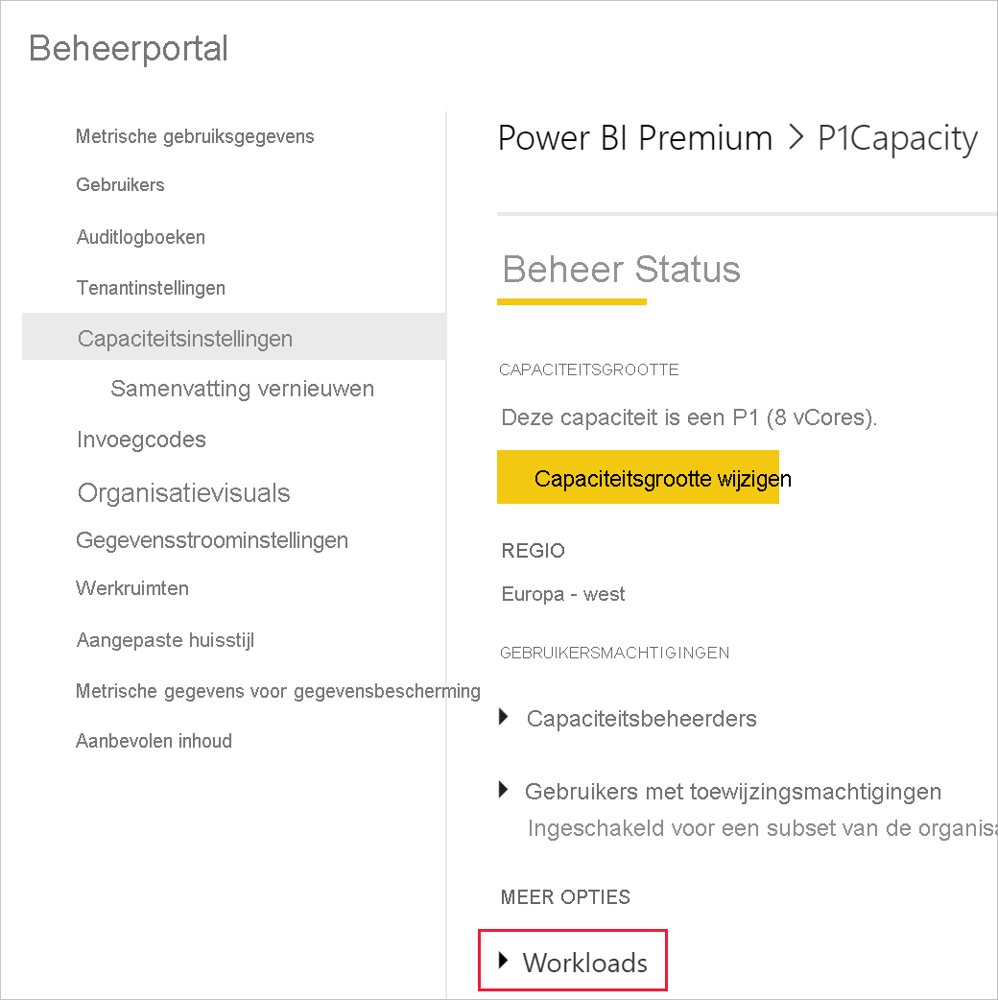

# <a name="tutorial-embed-power-bi-paginated-reports-into-an-application-for-your-organization"></a>Zelfstudie: Gepagineerde Power BI-rapporten insluiten in een toepassing voor uw organisatie

In **Power BI** kunt u gepagineerde rapporten insluiten in een toepassing voor uw organisatie met behulp van het scenario *gebruiker is eigenaar van gegevens*.

Gepagineerde rapporten zijn rapporten die zijn ontworpen voor afdrukken van hoge kwaliteit. Normaal gesproken bevatten deze rapporten een groot aantal gegevens, die op een manier worden weergegeven die past op afgedrukte pagina's.
Zie [Wat zijn gepagineerde rapporten in Power BI Premium?](../../paginated-reports/paginated-reports-report-builder-power-bi.md) voor meer informatie over hoe Power BI gepagineerde rapporten ondersteunt.

Uw toepassing kan met **gegevens waarvan de gebruiker eigenaar is** de Power BI-service uitbreiden voor gebruik met ingesloten analyse. In deze zelfstudie leert u hoe u een gepagineerd rapport in een toepassing integreert.

U gebruikt de Power BI .NET-SDK met de Power BI JavaScript-API om Power BI in te sluiten in een toepassing voor uw organisatie.


In deze zelfstudie leert u de volgende taken:
> [!div class="checklist"]
> * Een toepassing registreren in Azure.
> * Sluit een Power BI- of gepagineerd rapport in een toepassing in met uw Power BI-tenant.

## <a name="prerequisites"></a>Vereisten
U hebt het volgende nodig om aan de slag te gaan:

* Een [Power BI Pro-account](../../admin/service-admin-purchasing-power-bi-pro.md).

* U moet beschikken over een eigen [Azure Active Directory-tenant ](create-an-azure-active-directory-tenant.md).

* Minimaal een P1-capaciteit. Zie [Hoe groot moet de Premium-capaciteit zijn voor gepagineerde rapporten?](../../paginated-reports/paginated-reports-faq.md#what-size-premium-capacity-do-i-need-for-paginated-reports)

Als u zich niet hebt geregistreerd voor **Power BI Pro**, [kunt u zich hier aanmelden voor een gratis proefversie](https://powerbi.microsoft.com/pricing/) voordat u begint.

>[!NOTE]
>[Premium per gebruiker (PPU)](../../admin/service-premium-per-user-faq.md) wordt ondersteund. Als u echter PPU gebruikt, hebben alleen PPU-gebruikers in uw organisatie toegang tot uw oplossing.

## <a name="set-up-your-power-bi-environment"></a>Uw Power BI-omgeving instellen

Volg de instructies in deze sectie om Power BI in te stellen voor het insluiten van uw gepagineerde rapporten.

### <a name="register-a-server-side-web-application-app"></a>Een webtoepassings-app aan de serverzijde registreren

Volg de instructies in [Een Azure AD-toepassing registeren om bij Power BI te gebruiken](register-app.md) om een webtoepassings-app aan de serverzijde te registreren.

>[!NOTE]
>Bij het registreren van de app moet u het volgende doen:
>* Het toepassingsgeheim verkrijgen
>* Pas de machtigingen (bereik) **Report.ReadAll** toe op uw app.

### <a name="create-a-capacity"></a>Een capaciteit maken

Als u een capaciteit maakt, profiteert u van een resource voor de inhoud in uw app-werkruimte. Voor gepagineerde rapporten, moet uw app-werkruimte beschikken over ten minste een P1-capaciteit. U kunt een capaciteit maken met [Power BI Premium](../../admin/service-premium-what-is.md).

De volgende tabel bevat de SKU’s van Power BI Premium die kunnen worden gebruikt voor het maken van een capaciteit voor gepagineerde rapporten in [Microsoft Office 365](../../admin/service-admin-premium-purchase.md):

| Capaciteitsknooppunt | Totaal aantal vCores<br/>(back-end + front-end) | Back-end vCores | Front-end vCores | Limieten voor DirectQuery/liveverbindingen |
| --- | --- | --- | --- | --- | --- |
| P1 |8 vCores |4 vCores, 25 GB RAM |4 vCores |30 per seconde |
| P2 |16 vCores |8 vCores, 50 GB RAM |8 vCores |60 per seconde |
| P3 |32 vCores |16 vCores, 100 GB RAM |16 vCores |120 per seconde |
| P4 |64 vCores |32 vCores, 200 GB RAM |32 vCores |240 per seconde |
| P5 |128 vCores |64 vCores, 400 GB RAM |64 vCores |480 per seconde |
|||||

### <a name="enable-paginated-reports-workload"></a>Workload voor gepagineerde rapporten inschakelen

U moet de workload voor gepagineerde rapporten inschakelen voor uw capaciteit.

1. Meld u aan op [Power BI > Beheerportal > Capaciteitsinstellingen](https://app.powerbi.com/admin-portal/capacities).

2. Selecteer de capaciteit met de werkruimte waar u het gepagineerde rapport wilt uploaden.

    

3. Vouw **Workloads** uit.

    

4. Workload voor gepagineerde rapporten activeren.

    

### <a name="assign-an-app-workspace-to-a-capacity"></a>Een app-werkruimte toewijzen aan een capaciteit

Als u een capaciteit hebt gemaakt, kunt u uw app-werkruimte toewijzen aan die capaciteit. Ga hiervoor als volgt te werk:

1. Vouw binnen Power BI-service werkruimten uit en selecteer **Meer** voor de werkruimte die u gebruikt voor het insluiten van uw inhoud. Selecteer vervolgens **Instellingen voor werkruimte**.

    

2. Selecteer **Premium** en schakel **Capaciteit** in. Selecteer de capaciteit die u hebt gemaakt. Selecteer vervolgens **Opslaan**.

    

3. Nadat u **Opslaan** hebt geselecteerd, ziet u een ruit naast de naam van de app-werkruimte.

    

### <a name="create-and-publish-your-power-bi-paginated-reports"></a>Gepagineerde rapporten van Power BI maken en publiceren

U kunt gepagineerde rapporten maken met behulp van de [Power BI Report Builder](../../paginated-reports/paginated-reports-report-builder-power-bi.md#create-reports-in-power-bi-report-builder). Vervolgens kunt u [uw rapporten uploaden](../../paginated-reports/paginated-reports-quickstart-aw.md#upload-the-report-to-the-service) naar een app-werkruimte die is toegewezen aan ten minste een P1-capaciteit en schakel de [workload voor gepagineerde rapporten](#enable-paginated-reports-workload) in. De eindgebruiker die de rapporten uploadt, moet beschikken over een Power BI Pro-licentie om te kunnen publiceren in een app-werkruimte.
   
## <a name="embed-your-content-by-using-the-sample-application"></a>Uw inhoud met behulp van de voorbeeldtoepassing insluiten

We hebben dit voorbeeld voor demonstratiedoeleinden bewust eenvoudig gehouden.

Volg de onderstaande stappen om inhoud in te sluiten met de voorbeeldtoepassing.

1. Download [Visual Studio](https://www.visualstudio.com/) (versie 2013 of later). Download het meest recente [NuGet-pakket](https://www.nuget.org/profiles/powerbi).

2. Download [PowerBI-Developer-Samples](https://github.com/Microsoft/PowerBI-Developer-Samples) en open .NET Framework > Insluiten voor uw organisatie > Integratie van web-app > **PBIWebApp**.

    

3. Open het bestand **Cloud.config** in de voorbeeldtoepassing en vul de volgende velden in om uw toepassing uit te voeren:
    * [Toepassings-id](#application-id)
    * [Werkruimte-id](#workspace-id)
    * [Rapport-id](#report-id)
    * [AADAuthorityUrl](#aadauthorityurl)

    

### <a name="application-id"></a>Toepassings-id

Vul bij **applicationId** de **Toepassings-id** van **Azure** in. De **applicationId** wordt door de toepassing gebruikt om zich te identificeren bij de gebruikers bij wie u machtigingen aanvraagt.

Ga als volgt te werk om de **applicationId** op te halen:

1. Meld u aan bij [Azure Portal](https://portal.azure.com).

2. Selecteer in het navigatiedeelvenster links **Alle services** en selecteer **App-registraties**.

3. Selecteer de toepassing waarvoor de **applicationID** nodig is.

    

4. U ziet een **toepassings-id** die wordt vermeld als een GUID. Gebruik deze **Toepassings-id** als de **applicationId** voor de toepassing.

    

### <a name="workspace-id"></a>Werkruimte-id

Vul bij **workspaceId** de app-werkruimte (groep)-GUID van Power BI in. U kunt deze informatie verkrijgen via de URL wanneer u bent aangemeld bij de Power BI-service, of via PowerShell.

URL <br>


PowerShell <br>

```powershell
Get-PowerBIworkspace -name "User Owns Embed Test"
```

   

### <a name="report-id"></a>Rapport-id

Vul bij **reportId** informatie over de rapport-GUID uit Power BI in. U kunt deze informatie verkrijgen via de URL wanneer u bent aangemeld bij de Power BI-service, of via PowerShell.


PowerShell <br>

```powershell
Get-PowerBIworkspace -name "User Owns Embed Test" | Get-PowerBIReport -Name "Sales Paginated Report"
```


### <a name="aadauthorityurl"></a>AADAuthorityUrl

Vul bij de **AADAuthorityUrl**-informatie de URL in waarmee u inhoud in de tenant van uw organisatie kunt insluiten of waarmee u inhoud kunt insluiten als gastgebruiker.

Voor het insluiten van inhoud met de tenant van uw organisatie, gebruikt u de URL - *https://login.microsoftonline.com/common/oauth2/authorize* .

Voor het insluiten van inhoud met een gast, gebruikt u de URL ( *`https://login.microsoftonline.com/report-owner-tenant-id`* ), waar u *report-owner-tenant-id* vervangt door de tenant-id van de rapporteigenaar.

### <a name="run-the-application"></a>De toepassing uitvoeren

1. Selecteer **Uitvoeren** in **Visual Studio**.

    

2. Selecteer vervolgens **Rapport insluiten**. Selecteer de optie die overeenkomt met het item dat u wilt testen (rapporten, dasboards of tegels).

    

3. U kunt het rapport nu weergeven in de voorbeeldtoepassing.

    

## <a name="next-steps"></a>Volgende stappen

In deze zelfstudie hebt u geleerd hoe u gepagineerde Power BI-rapporten insluit in een toepassing met uw Power BI-account voor uw organisatie. 

> [!div class="nextstepaction"]
> [Insluiten vanuit apps](embed-from-apps.md)

> [!div class="nextstepaction"]
>[Power BI-inhoud insluiten voor uw klanten](embed-sample-for-customers.md)

> [!div class="nextstepaction"]
>[Gepagineerde Power BI-rapporten insluiten voor uw klanten](embed-paginated-reports-customers.md)

Als u meer vragen hebt, kunt u deze stellen [in de Power BI-community](http://community.powerbi.com/).