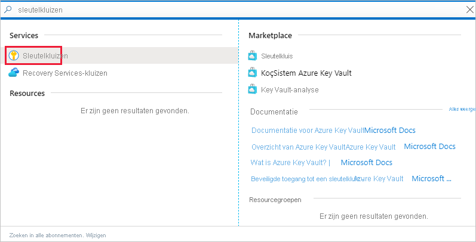
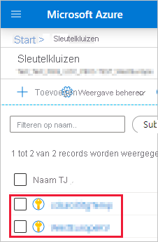
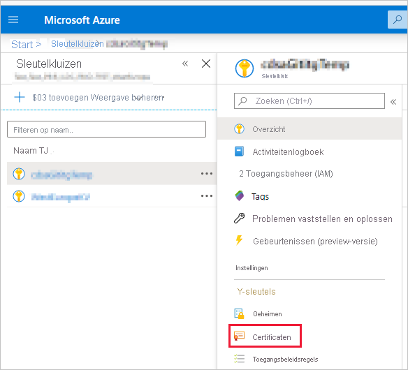
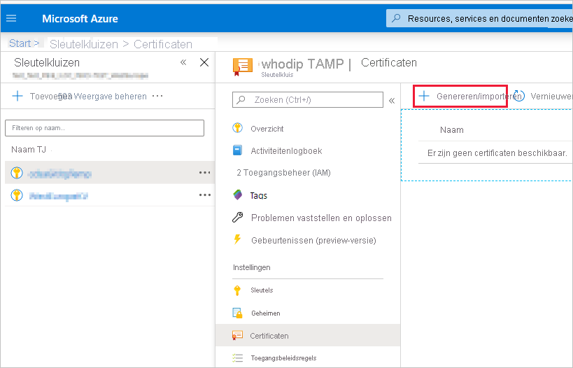
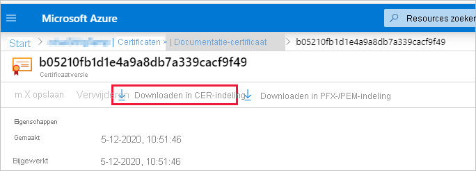
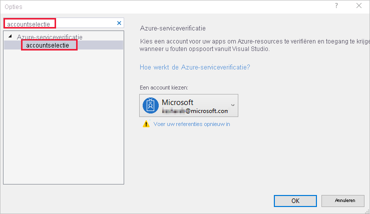

# <a name="embed-power-bi-content-with-service-principal-and-a-certificate"></a>Power BI-inhoud met service-principal en een certificaat insluiten

[!INCLUDE[service principal overview](../../includes/service-principal-overview.md)]

>[!NOTE]
>We raden u aan uw back-endservices te beveiligen met behulp van certificaten, in plaats van geheime sleutels. [Meer informatie over het verkrijgen van toegangstokens van Azure AD met behulp van geheime sleutels of certificaten](/azure/architecture/multitenant-identity/client-assertion).

## <a name="certificate-based-authentication"></a>Verificatie op basis van certificaat

Met verificatie op basis van certificaten kunt u worden geverifieerd door Azure Active Directory (Azure AD) met een clientcertificaat op een Windows-, Android- of iOS-apparaat of in een [Azure Key Vault](/azure/key-vault/basic-concepts).

Met behulp van deze verificatiemethode kunt u certificaten beheren vanaf een centrale plaats, met behulp van de CA, voor rotatie of intrekking.

U meer informatie vinden over certificaten in Azure AD in de [Client-referentiestromen](https://github.com/AzureAD/microsoft-authentication-library-for-dotnet/wiki/Client-credential-flows) GitHub-pagina.

## <a name="method"></a>Methode

Voer de volgende stappen uit om een service-principal en een certificaat met ingesloten analyses te gebruiken:

1. Maak een certificaat.

2. Maak een Azure AD-toepassing.

3. Stel een certificaatverificatie in.

4. Haal het certificaat op van Azure Key Vault.

5. Verifieer met een service-principal en een certificaat.

## <a name="step-1---create-a-certificate"></a>Stap 1: maak een certificaat.

U kunt een certificaat aanschaffen bij een vertrouwde *certificeringsinstantie* of zelf een certificaat genereren.

In deze sectie wordt beschreven hoe u een certificaat maakt met [Azure Key Vault](/azure/key-vault/create-certificate) en het *.cer*-bestand downloadt dat de openbare sleutel bevat.

1. Meld u aan bij [Microsoft Azure](https://ms.portal.azure.com/#allservices).

2. Zoek naar **Key Vaults** en klik op de koppeling **Key Vaults**.

    

3. Klik op de sleutelkluis waaraan u een certificaat wilt toevoegen.

    

4. Klik op **Certificaten**.

    

5. Klik op **Genereren/importeren**.

    

6. Configureer de velden **Een certificaat maken** als volgt:

    * **Methode voor het maken van certificaten**: algemeen

    * **Certificaatnaam**: voer een naam in voor uw certificaat

    * **Type certificeringsinstantie (CA)** : zelfondertekend certificaat

    * **Onderwerp**: een [X.500](https://wikipedia.org/wiki/X.500) DN-naam

    * **DNS-namen**:0 DNS-namen

    * **Geldigheidsperiode (in maanden)** : voer de geldigheidsduur van het certificaat in

    * **Inhoudstype**: PKCS #12

    * **Actietype levensduur**: automatisch verlengen met een bepaalde levensduur

    * **Percentage levensduur**: 80

    * **Configuratie van het geavanceerde beleid**: niet geconfigureerd

7. Klik op **Maken**. Het zojuist gemaakte certificaat is standaard uitgeschakeld. Inschakeling kan tot vijf minuten duren.

8. Selecteer het certificaat dat u hebt gemaakt.

9. Klik op **Downloaden in CER-indeling**. Het gedownloade bestand bevat de openbare sleutel.

    

## <a name="step-2---create-an-azure-ad-application"></a>Stap 2: maak een Azure AD-toepassing

[!INCLUDE[service principal create app](../../includes/service-principal-create-app.md)]

## <a name="step-3---set-up-certificate-authentication"></a>Stap 3: stel een certificaatverificatie in

1. Klik in uw Azure AD-toepassing op het tabblad **Certificaten en geheimen**.

     

2. Klik op **Certificaat uploaden** en upload het bestand *. CER* dat u hebt gemaakt en gedownload in de [eerste stap](#step-1---create-a-certificate) van deze zelfstudie. Het *.cer*-bestand bevat de openbare sleutel.

## <a name="step-4---get-the-certificate-from-azure-key-vault"></a>Stap 4: haal het certificaat op van Azure Key Vault.

Gebruik Managed Service Identity (MSI) om het certificaat van Azure Key Vault op te halen. Dit proces omvat het ophalen van het *.pfx*-certificaat dat zowel de openbare als de persoonlijke sleutel bevat.

Raadpleeg het codevoorbeeld voor het lezen van het certificaat vanuit Azure Key Vault. Als u Visual Studio wilt gebruiken, raadpleegt u [Visual Studio configureren voor het gebruik van MSI](#configure-visual-studio-to-use-msi).

```csharp
private X509Certificate2 ReadCertificateFromVault(string certName)
{
    var serviceTokenProvider = new AzureServiceTokenProvider();
    var keyVaultClient = new KeyVaultClient(new KeyVaultClient.AuthenticationCallback(serviceTokenProvider.KeyVaultTokenCallback));
    CertificateBundle certificate = null;
    SecretBundle secret = null;
    try
    {
        certificate = keyVaultClient.GetCertificateAsync($"https://{KeyVaultName}.vault.azure.net/", certName).Result;
        secret = keyVaultClient.GetSecretAsync(certificate.SecretIdentifier.Identifier).Result;
    }
    catch (Exception)
    {
        return null;
    }

    return new X509Certificate2(Convert.FromBase64String(secret.Value));
}
```

## <a name="step-5---authenticate-using-service-principal-and-a-certificate"></a>Stap 5: verifieer met een service-principal en een certificaat

U kunt uw app verifiëren met behulp van een service-principal en een certificaat dat is opgeslagen in Azure Key Vault, door verbinding te maken met Azure Key Vault.

Raadpleeg de onderstaande code om verbinding te maken en het certificaat van Azure Key Vault te lezen.

>[!NOTE]
>Als u al een certificaat hebt dat is gemaakt door uw organisatie, uploadt u het *.pfx*-bestand naar Azure Key Vault.

```csharp
// Preparing needed variables
var Scope = "https://analysis.windows.net/powerbi/api/.default"
var ApplicationId = "{YourApplicationId}"
var tenantSpecificURL = "https://login.microsoftonline.com/{YourTenantId}/"
X509Certificate2 certificate = ReadCertificateFromVault(CertificateName);

// Authenticating with a SP and a certificate
public async Task<AuthenticationResult> DoAuthentication(){
    IConfidentialClientApplication clientApp = null;
    clientApp = ConfidentialClientApplicationBuilder.Create(ApplicationId)
                                                    .WithCertificate(certificate)
                                                    .WithAuthority(tenantSpecificURL)
                                                    .Build();
    try
    {
        authenticationResult = await clientApp.AcquireTokenForClient(Scope).ExecuteAsync();
    }
    catch (MsalException)
    {
        throw;
    }
    return authenticationResult
}
```

## <a name="configure-visual-studio-to-use-msi"></a>Visual Studio configureren om MSI te gebruiken

Bij het maken van uw ingesloten oplossing kan het handig zijn om Visual Studio te configureren om Managed Service Identity (MSI) te gebruiken. [MSI](/azure/active-directory/managed-identities-azure-resources/overview) is een functie waarmee u uw Azure AD-identiteit kunt beheren. Eenmaal geconfigureerd, kan deze in Visual Studio worden geverifieerd met uw Azure Key Vault.

1. Open uw project in Visual Studio.

2. Klik op **Hulpprogramma’s** > **Opties**.

     

3. Zoek naar **Accountselectie** en klik op **Accountselectie**.

    

4. Voeg het account toe dat toegang heeft tot uw Azure Key Vault.

[!INCLUDE[service principal limitations](../../includes/service-principal-limitations.md)]

## <a name="next-steps"></a>Volgende stappen

>[!div class="nextstepaction"]
>[Een app registreren](register-app.md)

>[!div class="nextstepaction"]
>[Power BI Embedded voor uw klanten](embed-sample-for-customers.md)

>[!div class="nextstepaction"]
>[Toepassings- en service-principal-objecten in Azure Active Directory](/azure/active-directory/develop/app-objects-and-service-principals)

>[!div class="nextstepaction"]
>[Beveiliging op rijniveau met on-premises gegevensgateway met service-principal](embedded-row-level-security.md#on-premises-data-gateway-with-service-principal)

>[!div class="nextstepaction"]
>[Power BI-inhoud insluiten met service-principal en een toepassingsgeheim](embed-service-principal.md)